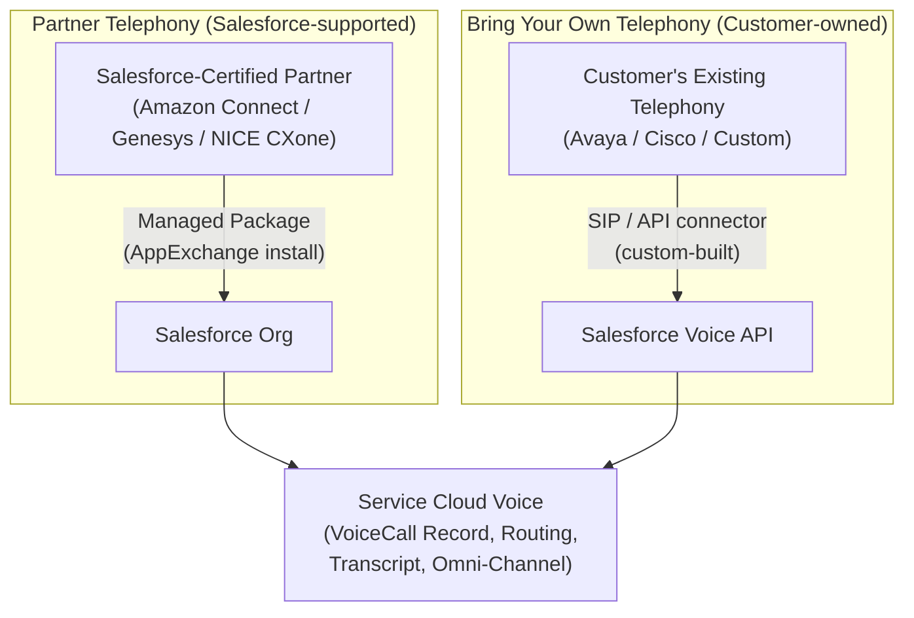
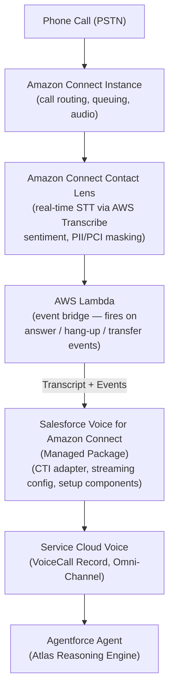
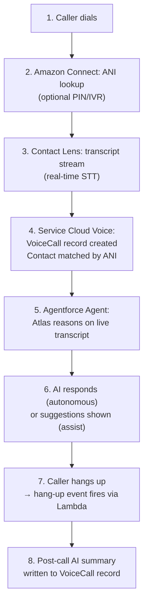
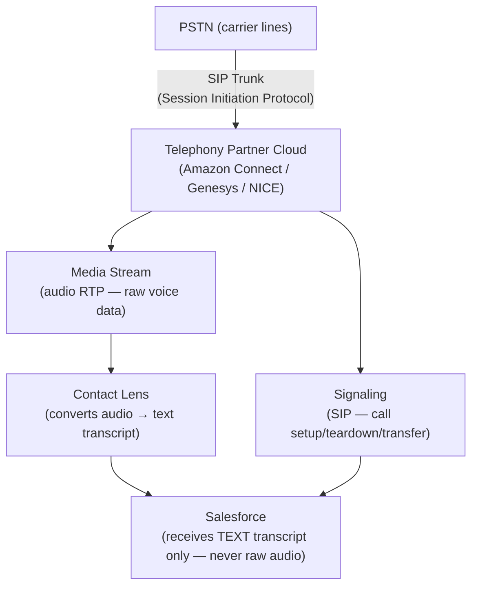

# Telephony Integration

## Exam Domain
Use Cases & Business Value / Setup & Configuration — Agentforce Specialist (CRT-271)

## Core Concepts

### The Telephony Partner Ecosystem

Salesforce does not own phone network infrastructure — all voice infrastructure is provided by certified telephony partners.

| | Amazon Connect | Genesys Cloud CX | NICE CXone |
|---|---|---|---|
| **Type** | AWS-native platform | Enterprise CCaaS | Compliance-first |
| **Integration** | Deepest Salesforce integration; managed package from AppExchange | AppFoundry connector | NICE CXone connector |
| **Best for** | AWS-committed orgs, new deployments | Large enterprise, complex global routing | Regulated industries, compliance-heavy (FinServ, healthcare) |

All three: Partner Telephony — managed package from AppExchange

**Limitations:**
- Amazon Connect is only supported in certain AWS regions — check current region availability before committing for data residency
- Partner telephony (Genesys, NICE) requires third-party licensing from the partner — budget accordingly
- Each partner has its own managed package — a Genesys package ≠ Amazon Connect package; setup steps differ
- No single managed package supports all three partners — customer picks one at a time

### Partner Telephony vs. Bring Your Own Telephony (BYOT)

**Limitations:**
- BYOT requires custom connector development — no AppExchange install available
- BYOT customer owns the integration, including break/fix and upgrades
- BYOT does not include telephony-layer transcription support out of the box — customer must wire their own STT
- Partner Telephony is upgrade-safe; BYOT connectors must be re-tested on Salesforce upgrades

### Amazon Connect Deep Dive Architecture

**Limitations:**
- One Amazon Connect instance per Salesforce org (max 5 instances per org for multi-region)
- Contact Lens must be explicitly enabled on the Amazon Connect instance — it is not on by default
- AWS Lambda adds ~50–200ms latency per event; design Contact Flows to minimize Lambda invocations in the real-time path
- IAM role for the managed package requires Amazon Connect, Transcribe, and Lambda permissions — misconfigured IAM is a common setup failure
- Amazon Connect Contact Lens PII masking applies at the transcript level; audio recording still captures raw audio unless recording pause/resume is configured

### Live Call Data Flow (Sequence)

**Limitations:**
- Step 2 ANI lookup is optional — if skipped, VoiceCall will not have a linked Contact until manual match
- Step 3 transcript stream is near-real-time (~300–800ms lag); agent reasoning at Step 5 begins on partial utterances
- Post-call summary (Step 8) requires summarization to be enabled and the Agentforce agent to be licensed for it

### SIP Trunking — Know the Boundaries

**Limitations:**
- Salesforce admins do NOT configure SIP — that is the telephony partner's responsibility
- Poor audio quality on SIP trunks degrades transcription accuracy — diagnose at the telephony layer, not in Salesforce
- Salesforce never processes raw audio; if audio quality is the issue, the fix is in the SIP/media layer
- SIP trunk capacity must be provisioned to handle peak concurrent call volume — telephony partner SLAs vary

### Provisioning Checklist (Both Sides Must Be Done)

**Telephony Side (Amazon Connect):**
- [ ] AWS account + Connect instance
- [ ] Contact Lens enabled on instance
- [ ] Phone number claimed (DID/toll-free)
- [ ] Contact Flow routes to SF queue
- [ ] IAM role with Connect + Lambda + STT permissions

**Salesforce Side:**
- [ ] Service Cloud Voice license (org)
- [ ] Managed package installed
- [ ] Named Credential configured
- [ ] Voice Call Center created
- [ ] Omni-Channel voice channel + queue
- [ ] SCV (Partner Telephony) perm set (user)

## PTA / SA Relevance

**Telephony partner selection is an architecture decision, not a Salesforce decision.** Customers already locked into Genesys or NICE should not be told to switch to Amazon Connect. Partner Telephony is exactly the right pattern for those cases. Document the integration model in the Solution Design — it affects project timeline significantly (BYOT can add 3–6 months).

**Common partner mistakes:**
- Not getting AWS-side prerequisites confirmed before starting Salesforce configuration — the IAM role, Contact Lens, and phone number must exist before any Salesforce setup is possible
- Misconfiguring the Amazon Connect Instance ARN in the Salesforce Call Center — one wrong character breaks the link silently
- Assuming that because Contact Lens is available, it is enabled — it must be explicitly turned on per instance

**Enterprise-scale considerations:**
- At high call volumes (10,000+ concurrent calls), Contact Lens throughput is a key concern — Amazon Connect scales by instance, but each instance has a default service quota on concurrent call transcription. Request quota increases before go-live.
- Multi-region deployments: some enterprises have Amazon Connect instances in multiple AWS regions. Each maps to a separate Salesforce Voice Call Center. Agents are assigned to one Call Center; cross-region routing is a telephony-side concern.
- Genesys and NICE integrations can also support high call volumes but differ in how they stream transcripts — validate streaming latency with the partner before committing to real-time AI requirements.

**When NOT to use Amazon Connect:** If a customer already has a significant, recently-renewed Genesys or NICE contract with customizations, pushing them to migrate to Amazon Connect creates project risk and cost that likely outweighs the benefit of the native Salesforce integration.

## Customer Advisory Tips

**Before recommending a telephony partner:**
1. What telephony platform does the customer currently use?
2. Is there an existing AWS commitment or enterprise agreement?
3. What compliance requirements apply (PCI, HIPAA, GDPR, regional)?
4. What geographic regions do they need to support? (Check Amazon Connect region availability)
5. What is their call volume? (Validates scaling approach)

**Key technical validations before contract:**
- Confirm Amazon Connect Contact Lens supports the required languages for the customer's caller base
- Validate that IAM permissions can be granted (some enterprises have locked-down AWS accounts)
- Confirm the Named Credential path between Salesforce and AWS is network-reachable

## Key Facts to Memorize
- Three Partner Telephony options: Amazon Connect (AWS-native), Genesys Cloud CX (enterprise), NICE CXone (compliance)
- Partner Telephony = managed package from AppExchange; BYOT = custom development, customer-owned
- Amazon Connect integration: 4 components: Connect instance, Contact Lens (STT + masking), Lambda (event bridge), managed package (CTI adapter)
- Transcript flow: Contact Lens → Lambda → Salesforce streaming API → VoiceCall record → Agentforce agent
- SIP trunking is the telephony partner's responsibility — Salesforce admins don't configure SIP
- Both telephony-side AND Salesforce-side provisioning must be complete before any test call works
- Max 5 Amazon Connect instances per Salesforce org

## Exam Traps
- "BYOT requires a managed package install" → False — BYOT uses the Salesforce Voice API; managed packages are for Partner Telephony only
- "Amazon Connect Contact Lens generates transcription" → True — NOT Salesforce. This distinction appears repeatedly.
- "Lambda is how Salesforce directly queries Amazon Connect" → No — Lambda is an event bridge that fires from Amazon Connect to Salesforce, not the reverse
- "NICE CXone is best for AWS-committed orgs" → False — Amazon Connect is the right answer for AWS-committed orgs; NICE CXone is for compliance-heavy regulated industries
- "Partner Telephony vs BYOT" decision key: existing investment they can't replace → BYOT; new deployment or AWS → Partner Telephony

## Practice Questions

**Q:** A company has an existing Avaya contact center with significant remaining contract time. They want Agentforce Voice capabilities without replacing Avaya. Which integration model?
**A:** Bring Your Own Telephony (BYOT). When a customer cannot replace existing telephony, BYOT connects their system to Service Cloud Voice using the Salesforce Voice API. Managed packages only work for certified Partner Telephony providers.

**Q:** In an Amazon Connect + Agentforce Voice deployment, which component converts spoken audio into the text transcript that appears in the Salesforce VoiceCall record?
**A:** Amazon Connect Contact Lens. Contact Lens handles real-time STT via AWS Transcribe. Lambda is the event bridge. The Atlas Reasoning Engine processes the transcript after it arrives in Salesforce — it does not generate it.

**Q:** An admin has installed the managed package and configured Named Credentials. A test call fails to connect. What is most likely missing?
**A:** Either the Amazon Connect instance does not have a phone number claimed, or Contact Lens is not enabled. Both are telephony-side prerequisites that must exist before any Salesforce configuration takes effect.
