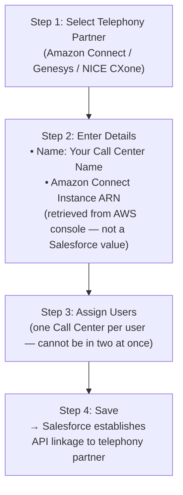
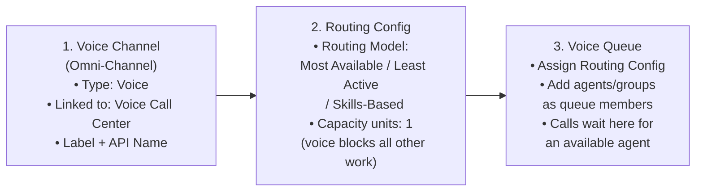
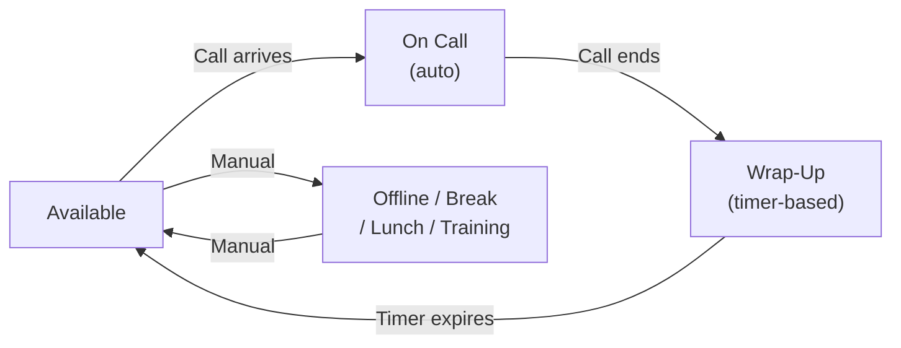

# Voice Channel Setup

## Exam Domain
Setup & Configuration — Agentforce Specialist (CRT-271)

## Core Concepts

### Finding Service Cloud Voice in Setup

Salesforce Setup → Quick Find: "Voice"

- **Voice Settings** — global on/off + license check
- **Voice Call Centers** — START HERE: link org to telephony partner instance
- **Voice Channel** — create Omni-Channel voice channel for routing

**Setup order:** Voice Settings → Voice Call Centers → Voice Channel

**Two license layers required before setup (common exam trap):**
1. **Org-level:** Service Cloud Voice feature license (Setup → Company Information)
2. **Per-user:** "Service Cloud Voice (Partner Telephony)" permission set license (Setup → Users → Manage Licenses)

Missing the per-user permission set is the #1 reason agents can't see the softphone widget.

### Creating a Voice Call Center

**Limitations:**
- Each user can only be assigned to ONE Voice Call Center at a time
- The Amazon Connect Instance ARN must be exactly correct — a typo breaks the integration silently
- Voice Call Center creation requires the Named Credential to be configured first (from Lecture 02)
- One Salesforce org supports up to 5 Amazon Connect instances (5 separate Voice Call Centers)

### Omni-Channel Voice Configuration (3 Objects Required)

**Limitations:**
- Voice calls consume 100% of agent capacity by default (1 unit = no other work while on call)
- Blended voice + chat capacity (e.g., 8 units voice + 2 units chat) is possible but requires careful UX design and pilot testing
- Routing model choice affects agent load balance — Skills-Based gives best first-contact resolution but can create uneven distribution
- Queue overflow actions (hold, callback, redirect) must be configured separately — no overflow by default

### Presence Statuses for Voice

| Status | Channel Availability | Purpose |
|---|---|---|
| Available for Voice | Voice channel — open | Agent ready for calls |
| On Call (auto) | Voice — busy | Set when call is accepted |
| Wrap-Up (timer-based) | None | After-call notes/review |
| Offline | None | Not working / break |

**Limitations:**
- "On Call" is automatically set by the system — agents cannot override it mid-call without ending the call
- Wrap-Up timer must be configured; if not set, agents may not transition to Available automatically
- Custom statuses (Break, Lunch) must be created and assigned to profiles — they don't exist by default

### Call Center Lightning Page Layout

**Voice Call Record Page (Lightning App Builder) — key components:**

1. **Call Information** — Duration, Direction (inbound/outbound), Status, Caller phone number
2. **Real-Time Transcript** — Live scrolling transcript (requires Contact Lens enabled on Amazon Connect instance)
3. **Agentforce Suggestions** — Suggested responses, related Knowledge articles (requires Agentforce license)
4. **Related Records** — Auto-matched Contact, Case, Account (screen pop auto-opens Contact when ANI matches)
5. **Utility Bar** — Softphone Widget, Omni-Channel Widget (must be added via App Manager)

Screen pop triggers automatically when caller's phone number matches a Contact's Phone field. No extra configuration needed beyond having phone number data in the org.

**Limitations:**
- Screen pop depends on phone number format match — ANI comes in E.164 format (+1XXXXXXXXXX); if Contact stores numbers differently, no match occurs
- Einstein Agent Assist component requires Agentforce license — does not appear with Service Cloud Voice license alone
- Real-time Transcript component requires Contact Lens to be enabled on the Amazon Connect instance

### Softphone Widget Configuration

**To add:** App Manager → [App Name] → Utility Items → Add: Voice Softphone

**Softphone Widget (expanded) — key controls:**
- Status selector (Available / Wrap-Up / Offline / custom)
- Active Call: caller name + phone number, duration timer
- Controls: Mute, Hold, Transfer, Dialpad
- Wrap-Up timer countdown after call ends

Widget is provided by the Amazon Connect managed package — not a custom build.

**If softphone widget is missing, check in this order:**
1. Agent not assigned to a Voice Call Center
2. App does not have the Voice Softphone utility item added in App Manager
3. Agent is missing the Service Cloud Voice (Partner Telephony) permission set license

### Test Call Verification Checklist

1. Set agent status to Available in Omni-Channel widget
2. Dial the claimed Amazon Connect phone number from a mobile phone
3. Verify call appears in softphone widget → accept it
4. Verify real-time transcript populates during the call
5. End call → verify VoiceCall record shows: Status = Completed, full transcript populated, AI summary generated, linked Contact matched (if phone number exists in Salesforce)

**Limitations:**
- If transcript does not appear: check Named Credential validity and Contact Lens enabled status
- If screen pop doesn't fire: Contact phone number doesn't match ANI format
- If AI summary doesn't generate: post-call summarization feature may not be configured, or Agentforce license missing

## PTA / SA Relevance

**Voice channel setup is the integration foundation — everything built later depends on getting this right.** A misconfigured Call Center or missing permission set license creates symptoms that look like AI failures but are actually infrastructure failures.

**Common partner implementation errors:**
- Configuring Omni-Channel routing for voice with the same capacity settings as chat. Voice requires 1.0 capacity units (full capacity) — an agent cannot meaningfully multitask on a phone call the way they can on a chat
- Not running a test call before building agent capabilities — the test call baseline validates the entire Tier 1 → Tier 2 integration
- Assigning agents to the wrong Call Center — in multi-Call-Center environments (multi-region), agents must be in the right Call Center to receive calls from the right phone system

**Enterprise setup considerations:**
- In large enterprises with many agents, permission set license assignment is typically done via a Permission Set Group applied to profiles — manual per-user assignment doesn't scale to hundreds of agents
- Multiple Voice Call Centers can exist in one org — this supports multi-region Amazon Connect deployments (US West, EU, APAC) each with its own Call Center
- Presence status configuration should mirror workforce management rules — if your WFM tool defines 15 status codes, Salesforce presence statuses should align exactly

**For a customer going live with 500 agents:** Automate the permission set assignment (use Setup > Permission Sets > Manage Assignments to bulk-assign), and run agent onboarding sessions demonstrating the softphone widget and presence status transition before go-live.

## Key Facts to Memorize
- Setup order: Voice Settings → Voice Call Centers → Voice Channel (in Omni-Channel) → Queue → Routing Config
- Two license layers: org-level Service Cloud Voice feature license + per-user SCV (Partner Telephony) permission set license
- Amazon Connect Instance ARN: retrieved from AWS console, NOT a Salesforce-generated value
- One user → one Call Center only
- Screen pop = phone number match: ANI → Contact.Phone field
- Softphone widget is added as a Utility Item in App Manager (not automatically present)
- Voice capacity units: 1.0 by default (agent cannot receive other work during a call)

## Exam Traps
- "The softphone widget doesn't appear — why?" → Most likely: widget not added as Utility Item in App Manager, OR missing per-user permission set license
- "Agents receive chat while on a voice call" → Fix: increase capacity cost of voice calls to fill agent's total capacity
- "Screen pop not working for new callers" → No Contact exists with that phone number — agent must manually create/associate
- "Amazon Connect Instance ARN is generated by Salesforce" → False — it's an AWS resource identifier from the Connect console
- "Voice Call Center setup is the only step needed before agents can receive calls" → False — also need Voice Channel, Routing Config, Queue, and Presence Statuses

## Practice Questions

**Q:** A Salesforce administrator has set up a Voice Call Center and created a Voice Channel, but agents report the softphone widget is not visible. What is the most likely cause?
**A:** The softphone widget has not been added as a Utility Item in App Manager for the agents' Lightning app. It does not appear automatically after Call Center creation — it must be explicitly added.

**Q:** An agent is Available in Omni-Channel and accepts an inbound voice call. During the call, they also receive a new inbound chat work item. How should the administrator prevent this?
**A:** Increase the capacity cost of voice calls in the Routing Configuration to fill the agent's total capacity. When voice consumes 100% capacity, no other work items can be routed while the call is active.

**Q:** After completing all configuration, an admin runs a test call. The softphone widget shows the inbound call, the agent accepts, but no real-time transcript appears. What is most likely?
**A:** Amazon Connect Contact Lens is not enabled on the Amazon Connect instance. Real-time transcription in an Amazon Connect deployment is generated by Contact Lens — if it's not enabled, no transcript data is sent to Salesforce.
