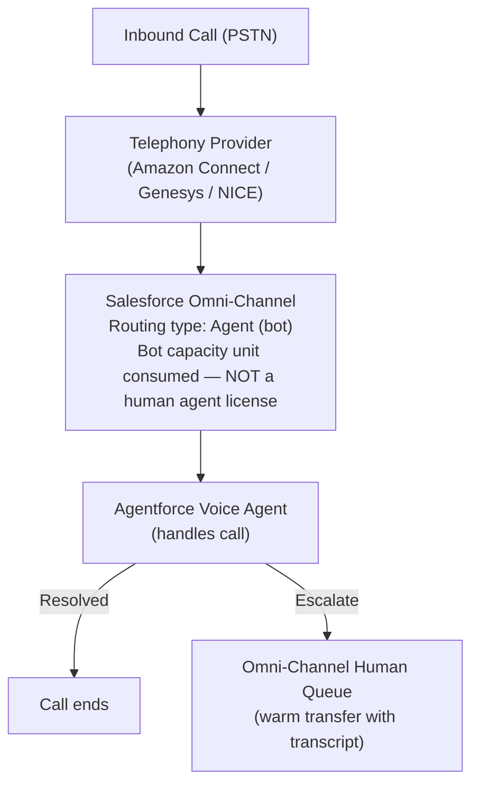
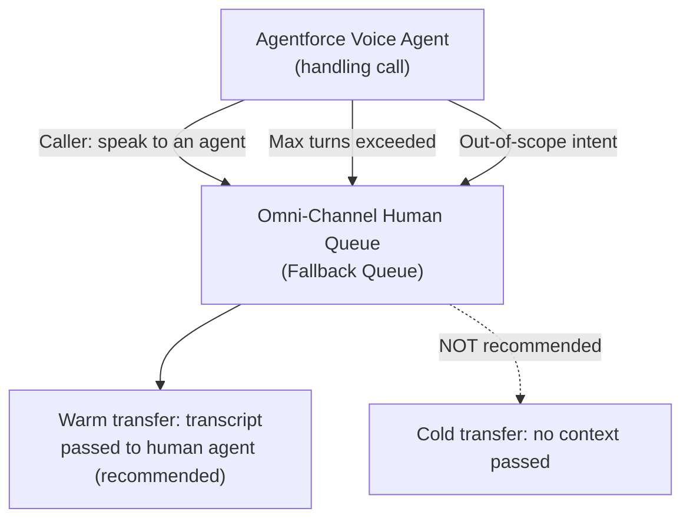

# Agentforce Voice Agent Configuration

## Exam Domain
Agent Configuration / Setup & Configuration — Agentforce Specialist (CRT-271)

## Core Concepts

### What Changes When You Add Voice to an Agent

| Behavior | Chat Agent | Voice Agent |
|---|---|---|
| Input method | Typed text (keyboard) | Transcribed speech (STT) |
| Response length | Long-form OK | Short, conversational only |
| Latency expectation | Seconds acceptable | Near-real-time (<1s ideal) |
| Error recovery | Ask to rephrase via text | Re-prompt or DTMF fallback |
| Markdown/formatting | Supported | NOT supported — all output becomes spoken audio |
| Silence handling | Not applicable | Detects ~3s silence, re-prompts or disconnects |
| Interruption (barge-in) | Not applicable | Barge-in: caller speaks over agent, agent pauses |

The underlying Atlas reasoning engine (LLM + Topics/Actions) does NOT change. Only the input/output modality and behavioral guardrails change.

**Limitations:**
- Voice agents cannot render hyperlinks, images, tables, or formatted lists
- Markdown in agent instructions that produce formatted output will be spoken verbatim (e.g., "asterisk asterisk important asterisk asterisk")
- Barge-in is ON by default — disabling it causes callers to feel unheard

### Adding the Voice Channel in Agentforce Studio

**Path:** Agentforce Studio → [Agent Name] → Channels tab → Add Channel → Voice

**Voice Channel Configuration fields:**
- Connected Telephony: select telephony integration (e.g., Amazon Connect)
- Omni-Channel Flow: select the Omni-Channel flow (e.g., VoiceAgentFlow)
- Enable Agentforce Voice: must be ON for calls to route to this agent

Configuration location: **Agentforce Studio** only — NOT in Service Cloud Voice Setup, NOT in Omni-Channel directly.

**Limitations:**
- Connecting to the telephony integration is a prerequisite — the Service Cloud Voice Call Center must exist first
- One agent can support multiple channels simultaneously (voice + chat + email), but voice-specific settings only appear on the Voice channel card
- The Voice channel must be activated (toggle ON) before calls can route to the agent

### Voice Persona Configuration

**Path:** Voice Channel card → Persona Settings

**Persona Settings fields:**
- **Persona Name** — must match the name used in the agent's LLM system prompt instructions (e.g., "Aria")
- **TTS Provider** — depends on telephony partner (Amazon Connect uses Amazon Polly)
- **TTS Voice** — select voice (e.g., Joanna — US English, Female)
- **Speech Rate** — 0.8x to 1.2x (default: 1.0x)
- **Pitch** — Low to High (default: Normal)

**Critical:** Persona Name in the Voice channel card AND the agent's LLM system prompt must be CONSISTENT. If the card says "Aria" but the system prompt says "I am Max," the LLM will introduce itself as Max while the channel config says Aria — caller confusion.

**Limitations:**
- TTS voice options depend on the connected telephony provider — Amazon Connect uses Amazon Polly; Genesys and NICE use their own TTS engines
- Amazon Polly voices vary by language and region availability
- Persona configuration is per-channel — one agent can have different personas for different voice channels (e.g., different brand voices per product line)

### Omni-Channel Routing for Voice Agents

**Key distinction:** Voice agents consume **bot capacity units**, not human agent slots. A single Salesforce org can handle large numbers of simultaneous autonomous calls without consuming human agent capacity.

**Limitations:**
- Bot capacity units do have limits — consult Salesforce documentation for concurrent bot call limits per org
- Routing rules can be conditional (e.g., business hours → agent, after hours → human queue directly)
- The bot queue and the human queue must both exist and be properly configured

### Configuring Human Agent Fallback

**Voice Channel card → Escalation Settings:**
- Max Conversation Turns: 20 (default)
- Fallback Queue: Voice Human Queue (mandatory — warnings if empty)
- Transfer Type: Warm (recommended)
- Escalation Trigger Phrases: "speak to an agent", "transfer me", "human"

**Limitations:**
- Fallback Queue is a MANDATORY configuration — Salesforce warns if it is empty
- Warm transfer passes transcript, but the human agent only sees context the voice agent wrote to the VoiceCall record before invoking the transfer
- Max turns default is 20 — for complex call types, this may be too low; for simple FAQs, it may be appropriate
- Escalation trigger phrases must include common regional variants ("talk to someone", "real person", "human")

### Agent-Level Voice Settings Reference

| Setting | Where Configured |
|---|---|
| Voice Channel (add channel type) | Agentforce Studio → agent → Channels tab |
| Telephony Integration link | Service Cloud Voice Setup (prerequisite) |
| TTS Persona (name + voice) | Voice Channel card → Persona Settings |
| Omni-Channel Routing | Omni-Channel Setup → Routing Configuration |
| Fallback Queue | Voice Channel card → Escalation section |
| Max Conversation Turns | Voice Channel card → Escalation section |
| Barge-in Enabled | Voice Channel card → Behavioral Settings |
| Silence Timeout (default ~3s) | Voice Channel card → Behavioral Settings |

Note: All voice settings are agent-version-specific. Changes create a new DRAFT version that must be published before taking effect.

## PTA / SA Relevance

**Voice agent configuration is the intersection of Salesforce and telephony design — both must be in sync.** The persona name, TTS voice, silence threshold, and escalation phrases are communication design decisions, not just technical checkboxes. Involve the customer's contact center operations team in these decisions.

**Common partner mistakes:**
- Configuring voice agents with the same response style instructions as chat agents — markdown, bullet points, and long responses sound terrible when spoken aloud
- Not testing barge-in behavior — callers will always interrupt; if barge-in is off (or misconfigured), the agent sounds robotic
- Setting max turns too low (e.g., 5) for complex call types, causing premature escalation to human queues

**Enterprise-scale considerations:**
- At high call volumes, each autonomous voice agent session consumes bot capacity. Validate concurrent session limits with Salesforce before committing to peak call volume SLAs.
- For multi-language deployments: a single agent can have multiple Voice channel configurations (one per language), each with its own TTS voice and persona settings. The routing skill (language) at the telephony layer determines which channel receives the call.
- Version control matters in production: voice agent changes go through Draft → Active lifecycle. A/B testing different persona voices or silence thresholds requires creating separate agent versions.

**For a customer CX leader:** "The persona name and TTS voice are part of your brand — treat them like you treat your visual brand guidelines. Choose a voice that fits the brand, test it with real users, and update it as a brand decision, not just a technical setting."

## Customer Advisory Tips

**When to use autonomous mode vs. agent assist:**
- Autonomous: call type is predictable, can be resolved with SOQL + a few actions, low risk if mishandled
- Agent Assist: call type requires judgment, empathy, or account-specific nuance that the AI cannot safely generalize

**Escalation design is the most important part of voice agent design.** A poorly designed escalation path — cold transfer with no context — creates worse customer experience than no bot at all. Always design warm transfer with VoiceCall record context fields populated before transfer.

**When NOT to use autonomous mode:**
- Medical or clinical decision support
- Legal advice or contract interpretation
- High-value financial transactions requiring human authorization
- Calls where regulatory requirements mandate a human in the loop

## Key Facts to Memorize
- Voice channel is added in Agentforce Studio → agent → Channels tab — NOT in Service Cloud Setup
- Warm transfer (not cold transfer) is best practice — passes conversation transcript to human agent
- Barge-in is ENABLED by default — disabled barge-in causes callers to be unable to interrupt
- TTS voice options depend on connected telephony provider (Amazon Connect → Amazon Polly)
- Changing voice agent settings creates a new DRAFT version — must be published to take effect
- Voice agents consume bot capacity units, not human agent license slots
- Fallback Queue is MANDATORY — Salesforce warns if empty

## Exam Traps
- "Voice channel is configured in Service Cloud Voice Setup" → False — it's in Agentforce Studio → Channels tab
- "Callers can't interrupt the agent mid-sentence" → Fix: enable barge-in (which is on by default — this scenario means someone disabled it)
- "The agent introduces itself with the wrong name" → Fix: ensure Persona Name in Voice channel card matches the agent's LLM system prompt instructions
- "Voice agent uses a human agent license" → False — voice agents consume bot capacity units
- "Changes to voice settings take effect immediately" → False — changes create a draft version that must be published

## Practice Questions

**Q:** A voice agent keeps introducing itself as "Max" even though the Persona Name field shows "Aria." What is the cause?
**A:** The agent's LLM system prompt instructions say "I am Max, your Salesforce assistant." The Persona Name in the Voice channel card and the agent's LLM instructions must be consistent — both must say "Aria."

**Q:** Which Omni-Channel resource does an Agentforce Voice agent consume when handling a call?
**A:** A bot capacity unit, separate from human agent slots. This allows high-volume simultaneous call handling without using human agent licenses.

**Q:** A caller reports that every time they try to speak while the agent is talking, the agent continues and ignores their input. What configuration change resolves this?
**A:** Enable barge-in on the Voice channel settings. Barge-in support allows callers to speak over the TTS output and have the agent immediately process the new input. If callers cannot interrupt, barge-in was disabled.
