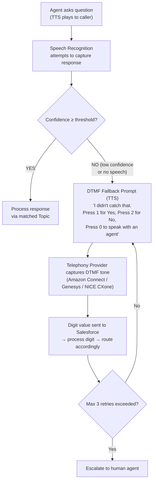
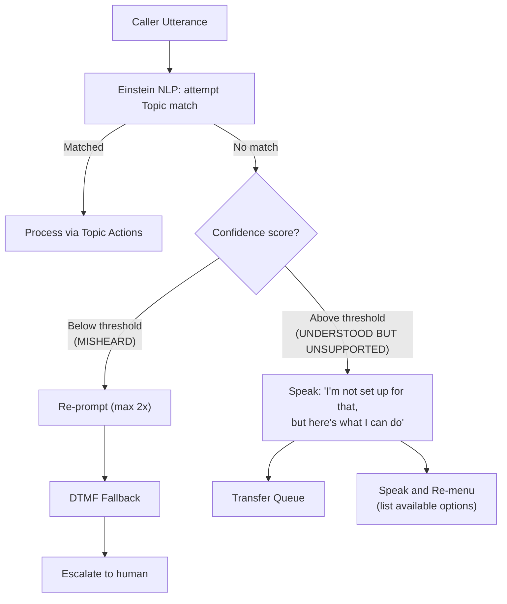

# Voice Topics and Actions Design

## Exam Domain
Agent Configuration / Building Agents — Agentforce Specialist (CRT-271)

## Core Concepts

### Why Topics Must Be Re-Thought for Voice

Topic descriptions are the semantic matching guide the LLM uses. Chat inputs are typed and often formal. Voice inputs are spontaneous and fragmented.

| | Chat Topic Description | Voice Topic Description |
|---|---|---|
| **Example** | "This topic handles customer requests about order status, shipping updates, tracking numbers, and delivery ETAs." | "Customer asks where their order is, when it will arrive, or wants a tracking update. Common phrases: 'where's my order,' 'when does it arrive,' 'track my package.'" |
| **Style** | Formal / noun-heavy | Conversational / first-person phrases |
| **Matches "hey so where's my stuff?"** | Poorly | Well |

**Rule:** Write voice Topic descriptions in the first person, the way a caller would actually say it. Include example spoken phrases. The more your Topic description sounds like a real caller, the more accurately the LLM matches voice utterances.

**Limitations:**
- LLM semantic matching is probabilistic — even well-written topics will occasionally miss edge-case utterances
- Topic descriptions have character/token limits — balance breadth of example phrases against specificity
- Multiple overlapping topics can cause misrouting — keep topics semantically distinct

### Voice-Compatible Action Types

| Works in Voice | Limited / Conditional | Not Compatible |
|---|---|---|
| Flow Action (autolaunched ONLY) | Prompt Template (text-only, no rendered format) | Screen Flow (renders UI — no screen on a phone call) |
| Apex Action (complex logic, returns text for TTS) | External Service Callout (if response is plain text only) | Lightning Component Actions (no browser DOM) |
| Knowledge Article Retrieval (summarize as text — avoid HTML) | | Email Send Actions (output is visual) |
| Data Cloud Query (text results only) | | |

Rule of thumb: if the action produces VISUAL output, it cannot work in voice.

**Key incompatibility to memorize:** Screen Flows are the #1 exam trap. Screen Flows render UI elements — there is no UI surface on a phone call. Replace Screen Flows with autolaunched Flows using voice-specific elements (Speak, Pause, Get Input).

**Limitations:**
- External Service Callouts can work but latency must be controlled — a 5-second external API call creates 5 seconds of dead silence unless a Speak wait message is added
- Knowledge Article retrieval must return plain text; returning raw HTML article content will be spoken with HTML tags

### DTMF Fallback Actions

**DTMF (Dual-Tone Multi-Frequency):** Touch-tone keypad input — the tones generated when pressing phone keys. DTMF is essential for:
- Accessibility (callers with speech impairments or heavy accents)
- Noisy environments where STT fails
- Sensitive input (PINs, account numbers, payment digits — DTMF is more reliable and can pause recording)

**Limitations:**
- DTMF capture for PCI payment data must be configured with recording pause at the telephony layer
- DTMF-only mode eliminates the natural language advantage of Agentforce — use as fallback, not primary input
- Some telephony providers process DTMF tones with slight delay — set digit timeout appropriately

### Voice-Specific Flow Elements

| Element | Purpose | Notes |
|---|---|---|
| **Speak** | Injects specific TTS message at Flow point, bypassing LLM response generation | Use for wait messages like "Let me look that up..." — prevents dead silence during record queries |
| **Pause** | Inserts timed silence — use after asking a question | Gives VAD time to recognize end of speech; also adds natural rhythm |
| **Transfer** | Escalates call to human agent | Warm transfer: transcript passed (recommended); Cold transfer: no context passed (not recommended); Target Queue required |

**Hold music ≠ Wait messages:**
- Hold music: configured in telephony provider's Contact Flow — plays during explicit hold states
- Wait messages: Speak elements in Salesforce autolaunched Flows — bridge processing gaps during active agent responses

This distinction is an exam favorite. If a question asks where to configure hold music for Amazon Connect, the answer is Amazon Connect Contact Flow, NOT Salesforce Flow or Agentforce Studio.

**Limitations:**
- Speak elements are injected mid-conversation — they bypass LLM inference, so they must be accurate and static
- Pause elements add silence; too long a pause causes VAD to think the caller has stopped speaking

### Speech Recognition Confidence Threshold

Confidence score range: 0.0 (no confidence) → 1.0 (certain). Below threshold: re-prompt / DTMF fallback. Above threshold: process input.

| Threshold Setting | Effect on Callers | Effect on Accuracy |
|---|---|---|
| Too HIGH (e.g. 0.90) | Frequent re-prompts; frustrated callers | High — rare misheard inputs processed |
| Default (~0.75) | Balanced experience | Balanced accuracy |
| Too LOW (e.g. 0.50) | Fewer re-prompts; smoother experience | Low — misheard input processed incorrectly |

Best practice: start at 0.75, analyze call recordings, tune in 0.05 increments.

**Limitations:**
- Default threshold varies by implementation — don't cite a precise number on the exam; know the trade-off concept
- Custom vocabulary in Amazon Transcribe (domain-specific terms, product names) should be configured BEFORE tuning the threshold — poor vocabulary coverage creates low confidence scores for legitimate input

### Out-of-Scope Handling

**Critical distinction:**
- **Low confidence** = system didn't understand (acoustic/transcription problem) → DTMF fallback
- **Out-of-scope** = system understood perfectly but topic isn't configured → graceful acknowledgment + transfer

These require completely different handling — mixing them up is a common exam trap.

Monitor out-of-scope utterances via Einstein Conversation Insights — they show you gaps in agent coverage.

**Limitations:**
- Out-of-scope handling must be explicitly configured — don't rely on the LLM to improvise a graceful response
- Saying "I don't understand" for out-of-scope (rather than "I'm not set up for that") creates a worse experience — the agent DID understand, it just can't help

## PTA / SA Relevance

**Topic description quality is the highest-leverage design decision in voice agents.** A well-written Topic with example spoken phrases dramatically reduces misrouting without any infrastructure changes. This is a design skill, not a configuration skill.

**Common partner mistakes:**
- Copy-pasting chat Topic descriptions into voice agents — the semantic distance from formal to spoken language kills intent accuracy
- Not accounting for DTMF fallback in the initial design, discovering the need when callers in noisy environments can't be understood
- Configuring Screen Flow actions without realizing they're incompatible with voice — the symptom is the agent going silent mid-conversation

**Enterprise-scale considerations:**
- For a customer with 50+ voice agent Topics, Topic taxonomy matters: overlapping Topics compete for matches. Conduct topic modeling on historical call transcripts (via Einstein Conversation Mining) before writing Topics — design from actual caller language, not from business process vocabulary.
- DTMF fallback adds latency (the re-prompt + keypress + processing cycle is 5–10 seconds) — at scale, this affects customer experience metrics. Optimize STT accuracy first; use DTMF as a true fallback, not a primary input strategy.
- For multilingual deployments: Topic descriptions should be written in the target language. An English Topic description matching Spanish utterances has degraded accuracy.

**For a customer with complex product vocabulary:** "Before we set the confidence threshold, we need to add your product names and acronyms to Amazon Transcribe's Custom Vocabulary. KloudSync, BCMS, PortalX — these will transcribe incorrectly without custom vocabulary, and no threshold tuning fixes vocabulary gaps."

## Customer Advisory Tips

**Vocabulary validation is a critical pre-launch step that most implementations skip.** Run a set of test utterances containing product names, industry jargon, and acronyms through Amazon Transcribe before configuring agent Topics. The resulting Word Error Rate (WER) for domain-specific terms tells you whether custom vocabulary configuration is needed.

**IVR replacement complexity:** Natural language IVR is compelling but requires more design effort than DTMF menus. Stakeholders often underestimate the number of ways callers phrase the same intent. Budget for a discovery phase using Conversation Mining on historical call recordings (or similar) to identify the actual language callers use.

**When DTMF is still the right answer:** For PIN entry, payment card capture, and account number collection — DTMF is more reliable, more secure (can pause recording), and callers are familiar with it. Don't eliminate DTMF from your design in pursuit of "fully conversational" — hybrid is better.

## Key Facts to Memorize
- Voice Topic descriptions: first-person, conversational, example-phrase-driven
- Screen Flows are incompatible with voice agents — incompatibility is absolute, not conditional
- DTMF fallback = triggered by low confidence (didn't understand); out-of-scope handling = triggered by understood-but-unsupported intent
- Hold music → telephony Contact Flow; wait messages → Salesforce autolaunched Flow Speak elements
- Default confidence threshold ~0.75; too high = re-prompt loops; too low = acts on misheard input
- Speak element bypasses LLM; Pause element adds timed silence; Transfer element escalates with warm/cold option

## Exam Traps
- "Screen Flows can be used if the agent has no UI actions" → False — Screen Flows are categorically incompatible with voice
- "DTMF fallback handles out-of-scope intents" → False — DTMF handles low confidence (misheard); out-of-scope handling is a different configuration
- "Hold music is configured in Salesforce Flow" → False — hold music is configured in the telephony provider's Contact Flow
- "Low confidence threshold causes the agent to act on wrong input" → True (that's why the default is ~0.75 — too low is a problem)
- "Out-of-scope = agent says 'I don't understand'" → False — agent understood but can't help; say "I'm not set up for that" + offer a clear next step

## Practice Questions

**Q:** A voice agent's Flow uses a Screen Flow subflow to collect a caller's account number. Callers report the agent goes silent and disconnects during this step. What is the correct fix?
**A:** Replace the Screen Flow subflow with an autolaunched Flow that uses Speak elements to prompt the caller and captures their spoken response via speech recognition. Screen Flows are incompatible with voice channels.

**Q:** A voice agent frequently processes incorrect information because it mishears callers. Call recordings show confidence scores around 0.55 for these inputs. What is the appropriate fix?
**A:** Raise the confidence threshold to ~0.80 so inputs below that level trigger re-prompts or DTMF fallback. A confidence score of 0.55 indicates unreliable transcription that should not be processed.

**Q:** Where should hold music for an Agentforce Voice agent on Amazon Connect be configured?
**A:** In the Amazon Connect Contact Flow using a "Play Prompt" or media block. Hold music is a telephony provider responsibility, not configurable from within Salesforce Flows or Agentforce Studio.
