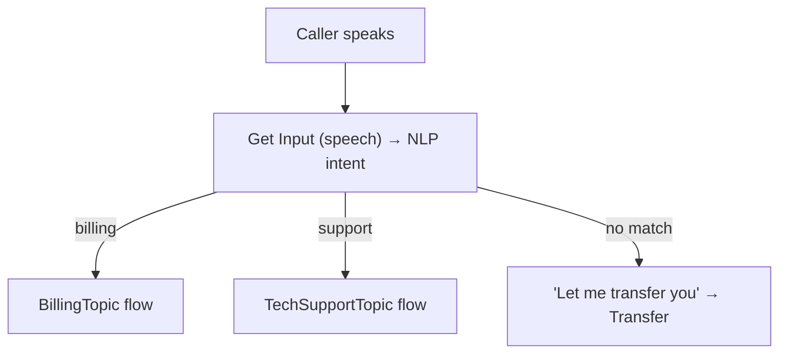
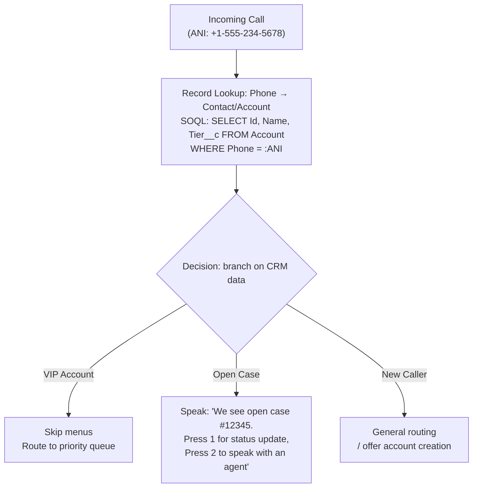
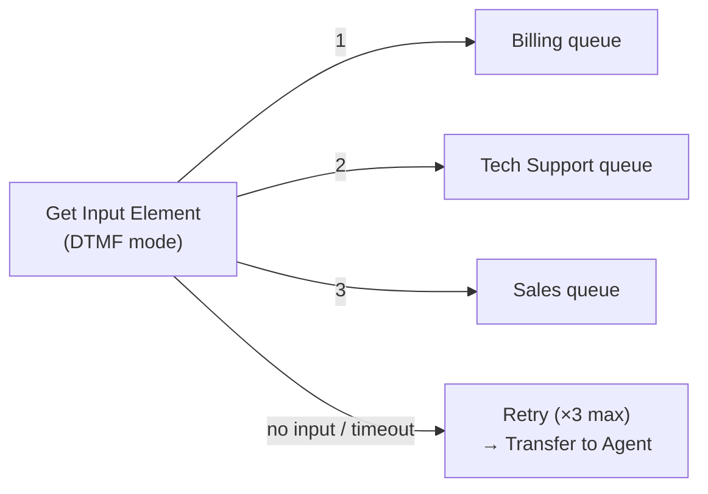
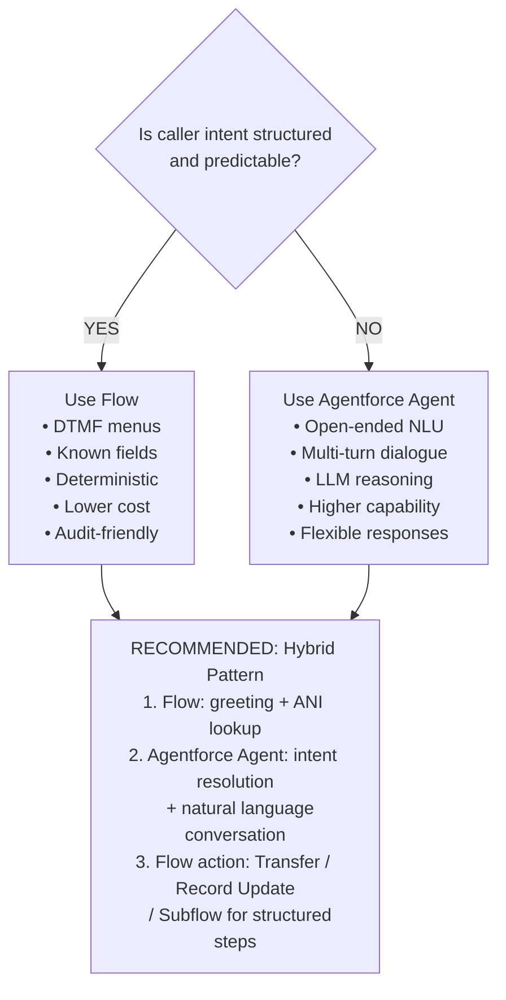
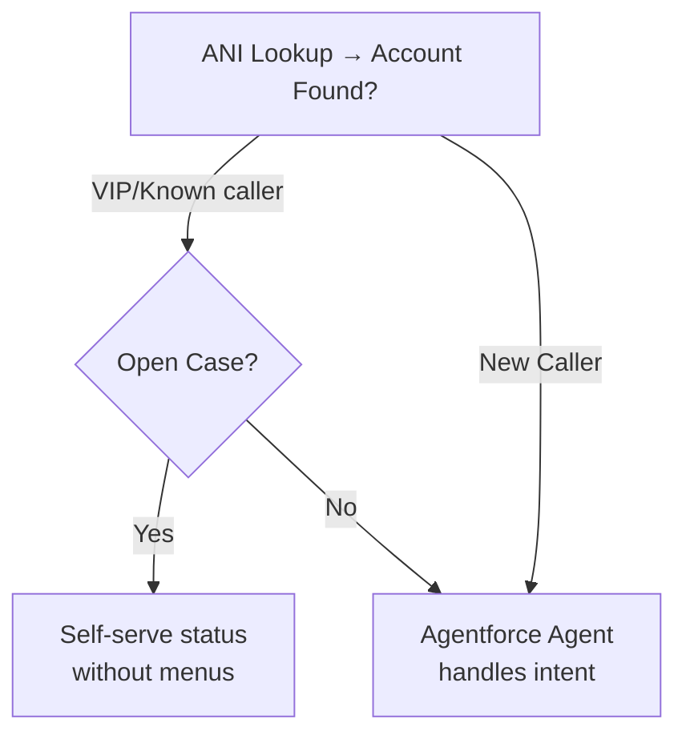

# Voice Flows & IVR Modernization

## Exam Domain
Building for Voice / Advanced Configuration — Agentforce Specialist (CRT-271)

## Core Concepts

### Flow Types — What Works in Voice and What Doesn't

| Flow Type | Voice Context? | Why / Why Not |
|---|---|---|
| Screen Flow | NO | Requires UI surface to render |
| Autolaunched Flow | YES | Headless, no UI dependency |
| Scheduled Flow | NO | Not triggered by real-time events |
| Record-Triggered Flow | LIMITED | Can react to VoiceCall creation, not direct voice |
| Voice Call Flow (subtype) | YES — use this | Purpose-built for voice; has Speak, Get Input, Transfer to Agent elements |

**The exam tests this constantly.** Screen Flows require a UI surface to render. There is no screen on a phone call.

The **Voice Call Flow** is an Autolaunched Flow subtype with voice-specific elements. It is automatically triggered when a call arrives on a configured Voice Channel.

**Limitations:**
- Voice Call Flows are triggered automatically at call arrival — they cannot be manually invoked from a button or record page
- Voice Call Flow subtype must be selected at creation time — cannot convert an existing Autolaunched Flow to Voice Call type without rebuilding
- Complex SOQL queries in a Voice Flow cause silence during processing — always add a Speak wait message before any record lookup

### Voice Call Flow — Core Elements Reference

| Element | Purpose |
|---|---|
| Speak | TTS: play message to caller |
| Get Input | Capture DTMF or speech input |
| Transfer | Route to agent, queue, or number |
| Pause | Wait N seconds (prevents VAD false trigger; adds natural conversation rhythm) |
| Decision | Branch on variable value |
| Get Record | SOQL lookup (ANI → Contact/Account) |
| Update Record | DML on VoiceCall or related object |
| Subflow | Invoke another Flow |

**IVR Replacement Pattern:**

**Limitations:**
- Get Input element has configurable timeout and retry count — if not set, unresponsive callers cause the flow to stall
- Transfer element passes context payload only if explicitly configured; cold transfer (no context) is the default behavior if not changed
- Subflows must also be Autolaunched type — cannot call a Screen Flow subflow from a Voice Flow

### CRM-Driven Branching — The Power of ANI Lookup

ANI available in Flow as: `{!$Record.CallerId}`

**This is the core value proposition of Voice Flows over legacy IVR.** A traditional IVR asks callers to identify themselves because it has no data. With a Voice Flow, you already know who is calling. This eliminates 2–4 IVR menu levels and dramatically reduces average handle time.

**Limitations:**
- ANI lookup requires the phone number to be stored in a consistent format in Salesforce — E.164 format (+1XXXXXXXXXX) mismatch is a common failure
- ANI lookup adds ~200–500ms to call setup — acceptable but visible; always add Speak wait message during lookup
- A caller calling from a different phone (work vs. mobile) may not match — design a fallback for unmatched ANI

### DTMF Input Handling

- Max Digits: configurable
- Timeout between digits: configurable
- Retry count: configurable
- PCI: pause recording in telephony Contact Flow before capturing payment DTMF

**Limitations:**
- DTMF and speech can be offered in the same Get Input element — design for both
- PCI-DSS: configure recording pause in the telephony Contact Flow before capturing payment DTMF — Salesforce cannot pause the telephony-layer recording
- Retry count of 3 is the convention — after 3 failed attempts, transfer to human rather than looping indefinitely

### Flow vs. Agentforce Agent — When to Use Which

**Limitations:**
- Flow alone is appropriate for simple, binary decisions (case status, store hours, appointment confirmation)
- Agentforce agent alone may be overkill for simple structured calls — higher cost per interaction than pure Flow
- Hybrid requires careful handoff design: the Flow must pass context to the agent, and the agent must know when to invoke Flow-based actions

### IVR Modernization Approach

**Before (Legacy IVR — 12 nodes, 4 levels deep):**
- "Press 1 for Sales, 2 for Support, 3 for Billing, 4 for Hours..."
  - Sales: "Press 1 New, 2 Renewal" → enter ID
  - Support: "Press 1 Tech, 2 Existing" → enter ID
  - Billing: "Press 1 Balance, 2 Dispute" → enter ID
- Avg menu depth: 3–4 key presses | Abandonment: HIGH

**After (Voice Flow — 5 nodes, CRM-driven):**

Avg menu depth: 0–1 key press | Containment lift: 20–40%

**Migration approach:**
1. Audit current IVR — map all menu paths and call volumes per path
2. Identify paths eliminable with CRM data (ANI lookup, account tier)
3. Identify containable self-service paths (case status, store hours, appointment confirmation)
4. Build Voice Flows for self-service paths; escalation paths go to Transfer
5. A/B test — run old IVR and new Voice Flow in parallel on a subset of calls
6. Key metric: containment rate improvement (target 20–40% lift is common)

**Limitations:**
- Legacy IVR migration often reveals undocumented call paths — audit thoroughly before building
- "Feature parity" thinking (recreating the old menu tree in Voice Flow) misses the redesign opportunity
- A/B testing requires telephony-layer traffic splitting — Amazon Connect Contact Flows support this natively

## PTA / SA Relevance

**IVR modernization is one of the highest-ROI Agentforce Voice use cases and a common customer entry point.** When a customer says "our IVR is 10 years old and callers hate it," that is the opening to propose Agentforce Voice Flows with CRM-driven branching. The pitch is simple: "Instead of asking callers who they are and what they want, we already know both."

**Common partner mistakes:**
- Rebuilding the legacy IVR menu tree in Flow format — this wastes the CRM context advantage and delivers no improvement in caller experience
- Not accounting for ANI format mismatch in the Salesforce data — a common failure mode that delays delivery
- Recommending a pure Agentforce agent approach for simple self-service calls that would be faster and cheaper as a Voice Flow

**Enterprise-scale considerations:**
- At large contact centers (1M+ calls/year), Voice Flow performance under concurrent load must be tested — complex SOQL queries in Flow get slower under load
- Flow versioning matters in production: Voice Call Flows are versioned like all Flows; a failed activation can take a production voice channel offline
- For regulated industries: Voice Flows produce deterministic, auditable execution logs — this is an advantage over LLM-based agent responses for compliance-sensitive call paths

**For a retail customer replacing a legacy IVR:** "Your order status calls are the perfect first use case — 40% of your call volume, the answer is a single SOQL query, and callers can get the answer without navigating any menu. We can deliver that in 4 weeks and measure containment rate improvement immediately."

**For a healthcare customer:** "DTMF appointment confirmation is the right choice for your scheduling calls — it's deterministic, auditable, and patients are comfortable with keypad input. Natural language can come later once the foundation is working."

## Customer Advisory Tips

**ANI lookup is the key differentiator — but it requires data hygiene.** Before promising CRM-driven branching, audit the phone number data quality in the customer's Salesforce org. In most orgs, a significant percentage of Contact records have missing or incorrectly formatted phone numbers. Fix the data before building the flows.

**IVR replacement ROI calculation:**
- Measure current abandonment rate and average IVR depth (key presses per call)
- After Voice Flow deployment, measure containment rate improvement and repeat contact reduction
- Each 1% improvement in containment on 100K calls/month at $8/call = $8K/month saved

**When to recommend Flow over Agentforce agent:**
- Call outcome is deterministic (binary yes/no, DTMF menu choice)
- Compliance requirements demand fully auditable, reproducible logic
- Call volume is high and cost-per-interaction matters
- Caller population has known speech recognition challenges (elderly, heavy accents)

## Key Facts to Memorize
- Voice Call Flow subtype is the right tool — NOT Screen Flow, NOT Scheduled Flow
- Voice Call Flow automatically triggers when call arrives on a Voice Channel
- ANI available in Flow as: `{!$Record.CallerId}`
- Transfer to Agent element passes context payload to receiving agent's screen pop
- Hybrid = Flow for structured entry + Agentforce agent for open-ended intent + Flow actions for structured steps
- IVR replacement redesign principle: eliminate menu levels using CRM context, don't recreate the old menu tree
- Containment rate improvement target: 20–40% lift from legacy IVR to Voice Flow

## Exam Traps
- "Screen Flows can be used for voice with a UI-free configuration" → False — Screen Flows require a UI surface, period
- "Voice Call Flow is a separate, standalone Flow type" → Partially — it's a subtype of Autolaunched Flow; Autolaunched Flows can also be used for voice but lack the voice-specific elements
- "ANI lookup automatically matches ANI format to Salesforce phone format" → False — format mismatch (E.164 vs. national format) must be handled in the Flow logic
- "Flow is always better than Agentforce agent for voice" → False — use case determines the right tool; hybrid is typically best for complex calls
- "The Transfer to Agent element automatically passes context to the human agent" → Not automatically — you must configure the context payload; cold transfer is default if not configured

## Practice Questions

**Q:** A developer wants to build an interactive voice menu that reads a caller's open case number aloud and offers options. Which Flow type should they use?
**A:** Autolaunched Flow with the Voice Call Flow subtype. Screen Flows require a UI surface and cannot be used for voice. The Voice Call Flow subtype provides Speak and Get Input elements purpose-built for telephony interactions.

**Q:** A caller's spoken response to a Get Input prompt scores below the confidence threshold. What is the recommended configuration to handle this gracefully?
**A:** Configure retry count and a DTMF fallback branch in the Get Input element. The element should retry the speech prompt up to a configured number of times, then fall back to DTMF ("Press 1 for Yes, Press 2 for No") before escalating to a human agent.

**Q:** An architect is designing a voice system for a telecom company where callers may ask billing questions, request plan changes, or report outages — intent is unpredictable. What is the recommended approach?
**A:** Hybrid approach: Voice Flow for entry point (greeting + ANI lookup), then hand off to an Agentforce autonomous agent for open-ended natural language intent resolution. The Agentforce agent handles the unpredictable intents while the Flow handles the structured entry and context setup.
