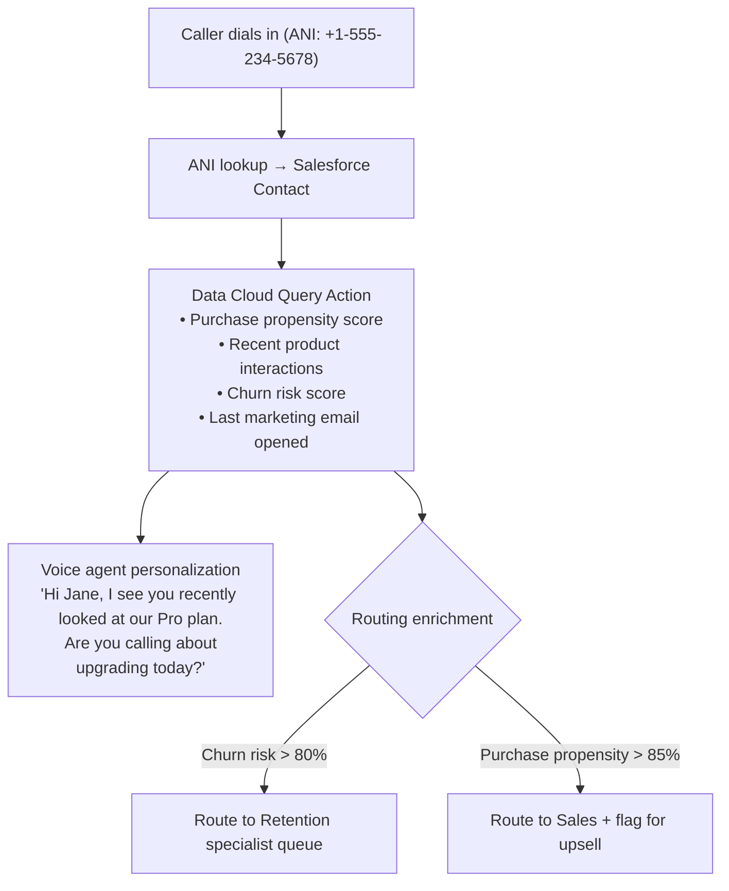
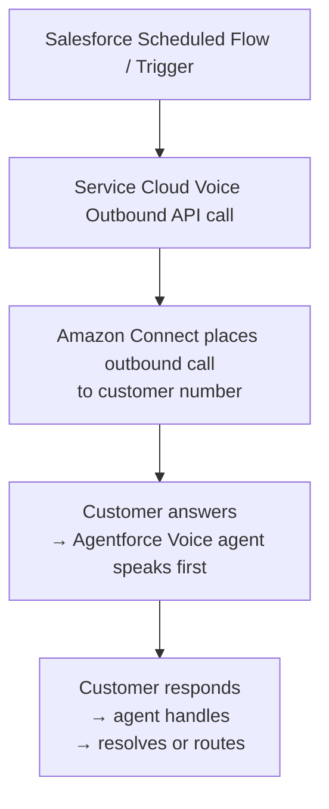
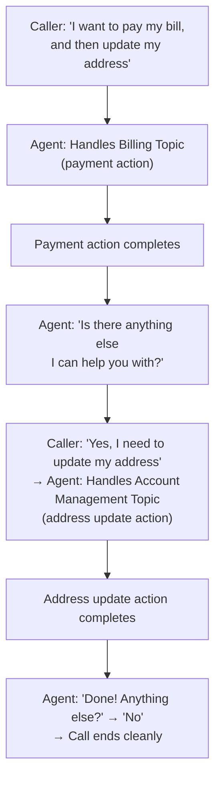
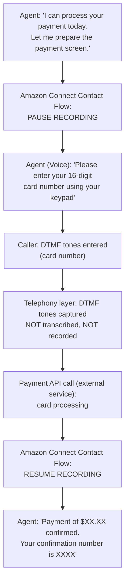
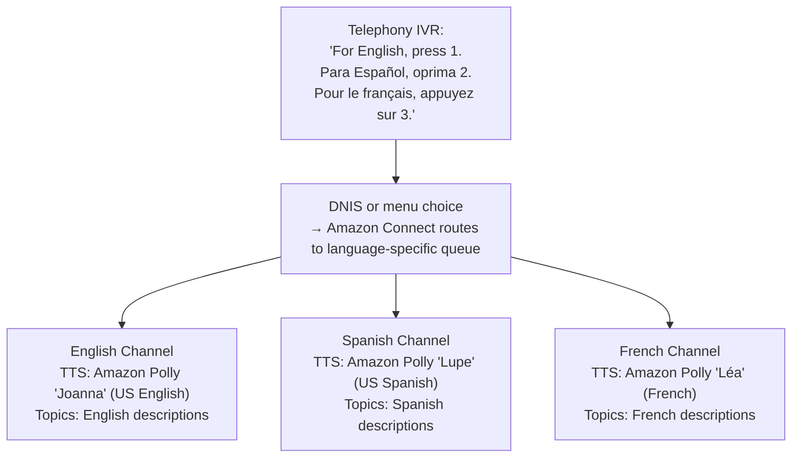
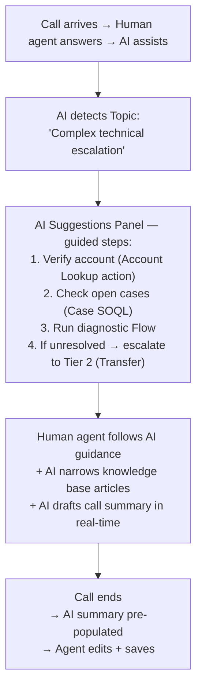
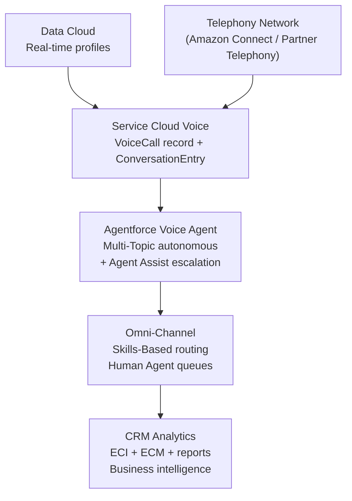

# Advanced Use Cases for Agentforce Voice

## Exam Domain
Use Cases & Business Value / Architecture — Agentforce Specialist (CRT-271)

## Core Concepts

### Use Case Portfolio — From Simple to Advanced

| Simple (Flow-based) | Advanced (Agent + Integration) |
|---|---|
| Case status self-service | Outbound proactive notifications |
| Store hours / location | Data Cloud real-time enrichment |
| Order status lookup | Multi-system authenticated transactions |
| Appointment confirmation (DTMF) | Predictive routing + intent pre-classification |
| Password reset (account verification) | Compliance monitoring (GDPR/PCI) |
| Account balance inquiry | Complex multi-topic single calls |

The architecture for each use case differs significantly. Know which tier of complexity requires which components.

### Use Case 1 — Data Cloud Real-Time Caller Enrichment

**This is the differentiator between Agentforce Voice and a generic voice bot.** The Data Cloud integration brings cross-channel customer context into the voice interaction in real-time.

**Limitations:**
- Data Cloud query adds ~200–500ms to call setup — design Speak wait message during query
- Data Cloud unified profile accuracy depends on data ingestion recency — a batch-updated profile may not reflect events from the last few hours
- Data Cloud license required in addition to Service Cloud Voice and Agentforce licenses

### Use Case 2 — Outbound Proactive Voice Notifications

**Inbound:** Customer calls in → Agentforce Voice handles.
**Outbound:** Salesforce triggers a call → Agent speaks to customer.

**Outbound Voice Use Cases:**
- Appointment reminders (healthcare, field service)
- Payment due / overdue notifications
- Fraud alerts (financial services)
- Delivery notifications (retail)
- Prescription refill reminders (pharmacy)

**Outbound dialing modes:**
- **Progressive:** one call placed per available agent (no abandonment risk)
- **Predictive:** dials ahead of agent availability (higher efficiency, higher abandonment risk)

**Limitations:**
- Outbound calling requires specific telephony configuration (outbound caller ID, compliance setup) separate from inbound
- TCPA (US) and similar regulations require explicit opt-in consent for automated outbound calls — this is a legal requirement, not a Salesforce setting
- Predictive dialing is not supported for AI-handled calls in the same way as human agent predictive dialing — verify specific capability with current Salesforce release notes

### Use Case 3 — Complex Multi-Intent Call Handling

Multi-turn conversation: same session, multiple Topics resolved.

**Design requirements:**
- Each Topic must have a clean completion state
- Agent system prompt must include instructions for handling "anything else" transitions
- Max turns limit must account for multi-topic calls (set higher than single-intent assumption)

**Limitations:**
- Multi-intent calls are longer → higher max turns requirement → configure accordingly
- Agent must handle "nothing else" termination gracefully — without explicit exit handling, agent may loop
- Context from Topic 1 (e.g., account verified) does not automatically carry to Topic 2 unless explicitly stored in the conversation context

### Use Case 4 — PCI-Compliant Payment Processing

**Key PCI design decisions:**
1. Recording pause: Amazon Connect layer (not Salesforce)
2. DTMF for card entry: no STT, no transcript of card number
3. AWS Transcribe PII redaction: backup layer if speech is used
4. Zero data retention: card number never stored in Salesforce

**Limitations:**
- Recording pause must be configured in the telephony Contact Flow — if configured in a Salesforce autolaunched Flow, it only affects the transcript, not the audio recording
- PCI compliance for voice requires formal PCI-DSS audit — configure to the standard, then engage a Qualified Security Assessor (QSA) for formal validation
- DTMF-only mode for payment input requires that the external payment processor accepts DTMF-routed input or has an API integration that receives DTMF values

### Use Case 5 — Multilingual Voice Agent

**Configuration options:**
- One Agentforce agent per language (cleanest design)
- One agent with language-detection branching (complex)

**Limitations:**
- Topic descriptions must be written in the same language as the caller utterances — an English Topic description will not match a Spanish utterance accurately
- Amazon Transcribe language must be explicitly configured per channel — do not rely on auto-detect for production
- Translating Topic descriptions is not a simple word-for-word translation — phrases must reflect how native speakers actually express the intent

### Use Case 6 — Agent Assist with Guided Resolution

**This use case demonstrates Agent Assist value beyond simple suggestions.** The AI acts as a structured guide through complex resolution paths — especially valuable for new agents handling escalations.

**Limitations:**
- Guided resolution suggestions are based on Einstein NLP topic classification — if the Topic is misclassified, the wrong guidance appears
- Human agents can ignore AI suggestions — adoption requires training and UX design showing the time savings from following the guidance

### Use Case 7 — Voice + CRM Integration at Enterprise Scale

**At 10,000+ concurrent calls:**
- Request Amazon Connect stream quota increase (pre-provisioned)
- Validate Salesforce API limits for VoiceCall record creation rate
- Design monitoring alerting at 80% of quota thresholds
- Performance test full stack before launch

**Limitations at enterprise scale:**
- VoiceCall record creation rate is subject to Salesforce API limits — high-volume contact centers must validate API throughput capacity
- ConversationEntry volume at 10K concurrent calls with 5-minute average handle time = massive record volumes — plan storage accordingly
- Amazon Connect concurrent transcription streams have service quotas — request increase 4–6 weeks before planned launch capacity
- Salesforce Streaming API (used for real-time transcript delivery) has per-org limits — verify at design time for high-volume deployments

## PTA / SA Relevance

**Advanced use cases are where the real business value lives, but they require architecture decisions beyond the standard certification content.** As a PTA or SA, you need to understand not just which use case to recommend, but how to size the solution, what the failure modes are, and when the customer's requirements exceed what the current platform can deliver.

**The use case prioritization framework:**
1. First: high-volume, predictable intent, self-service (case status, order tracking) — fastest to build, fastest ROI
2. Second: Agent Assist for complex calls (NPS lift, AHT reduction, new agent ramp time) — higher configuration complexity but measurable ROI
3. Third: advanced integrations (Data Cloud enrichment, outbound, multi-language) — highest value but highest implementation complexity

**Common partner mistakes:**
- Starting with a complex use case (PCI payment) before proving the basic infrastructure works — test simple containment before adding PCI complexity
- Not designing the enterprise-scale data model before go-live — VoiceCall and ConversationEntry record volumes can grow faster than expected, creating storage cost surprises
- Not involving legal/compliance teams for outbound calling (TCPA) and PCI use cases — discovering regulatory requirements during build is expensive

**For a financial services customer exploring voice AI:** "Before we talk about which use cases to build, let's agree on the architecture principles: PCI compliance is non-negotiable for payment calls, Data Cloud enrichment requires your CRM data to be clean, and outbound calling requires explicit consent management. Map those constraints first, then select use cases that fit within them."

## Customer Advisory Tips

**Data Cloud real-time enrichment is a compelling demo, but data quality is the gating factor.** Propensity scores and churn risk models are only as good as the underlying data. Before promising a "personalized voice experience," assess whether the customer's Data Cloud implementation has the unified profiles and ML models that the demo shows.

**Outbound voice requires consent management.** In the US (TCPA), EU (GDPR), and most markets, automated outbound calls require explicit customer consent. Build consent management into the outbound use case design — not as an afterthought.

**PCI use case scoping:** PCI-DSS applies whenever payment card data is in scope. If the voice agent is only routing callers to a payment IVR that the customer's payment processor operates, the Salesforce side may be out of scope. Get the customer's PCI-DSS scoping documentation before designing the payment flow.

**When voice AI is NOT the right recommendation:**
- Very low call volume (<5K calls/month) — ROI doesn't justify implementation cost
- Highly variable call types with no dominant self-service pattern — agent covers too few calls to show containment ROI
- Customer population with known STT accuracy challenges + no appetite to invest in audio quality improvement
- Regulatory environment where a human must be in the loop for all calls (some financial advice, medical, legal)

## Key Facts to Memorize
- Data Cloud enrichment adds real-time cross-channel context to voice calls — requires separate Data Cloud license
- Outbound calling requires explicit consent management (TCPA/GDPR compliance)
- PCI-compliant payment: recording pause + DTMF card capture + AWS Transcribe PII redaction = three layers
- Multi-language: one agent/channel per language is cleanest design; Topics must be written in the target language
- Enterprise scale: request Amazon Connect quota increases and validate Salesforce API limits pre-launch
- Max turns configuration must account for multi-intent calls (set higher)

## Exam Traps
- "Outbound calling can be triggered directly from a Salesforce Flow with no additional configuration" → False — outbound requires telephony configuration (caller ID, compliance setup, API connection) beyond what a Flow provides
- "Data Cloud enrichment happens before the call connects to Salesforce" → False — Data Cloud query is invoked WITHIN the Voice Flow or agent action after the VoiceCall is established
- "PCI recording pause is configured in Salesforce Setup" → False — recording pause is configured in the telephony Contact Flow (Amazon Connect)
- "One Agentforce agent can handle multiple languages with the same Topics" → Partially — one agent can have multiple voice channels, but Topics must be written in the language of the callers for that channel
- "After-hours calls are handled automatically by Agentforce Voice with no routing configuration" → False — after-hours behavior requires business hours configuration in Routing Configuration + configured overflow behavior

## Practice Questions

**Q:** A healthcare organization wants to use Agentforce Voice to send appointment reminders to patients 24 hours before their appointments. Patients should be able to confirm, reschedule, or cancel. Which use case type is this, and what regulatory consideration must be addressed?
**A:** This is an outbound proactive voice notification use case. The key regulatory consideration is TCPA (in the US) or equivalent consent regulations — patients must have given explicit consent to receive automated outbound calls. Additionally, HIPAA compliance applies since appointment data is PHI — the outbound call logic and transcription storage must be in a HIPAA-eligible environment with appropriate BAAs in place.

**Q:** A retail company wants their voice agent to greet returning callers by name and mention their last order. What Salesforce feature enables this personalization beyond standard ANI lookup?
**A:** Data Cloud integration. While ANI lookup retrieves the basic Contact record, Data Cloud provides a unified customer profile including cross-channel interaction history. A Data Cloud Query action in the voice agent or Voice Flow retrieves the last order context, enabling personalized greetings. Standard Salesforce ANI lookup only retrieves the Contact record and any open cases.

**Q:** A financial services voice agent is being designed to handle payment collection calls. What three technical layers are required to ensure the credit card number is never stored in Salesforce?
**A:** (1) Configure recording pause in the Amazon Connect Contact Flow before the card entry step — prevents the audio from being recorded. (2) Use DTMF-only input for card entry — the telephony layer captures keypad tones without transcribing them. (3) Enable AWS Transcribe PII redaction as a backup layer to automatically remove any card numbers that inadvertently appear in transcript text. These three layers combine to ensure the card number never reaches Salesforce.
