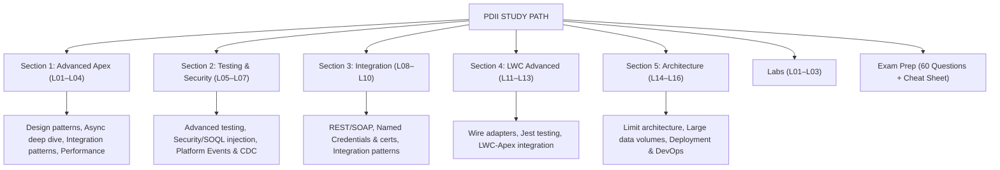
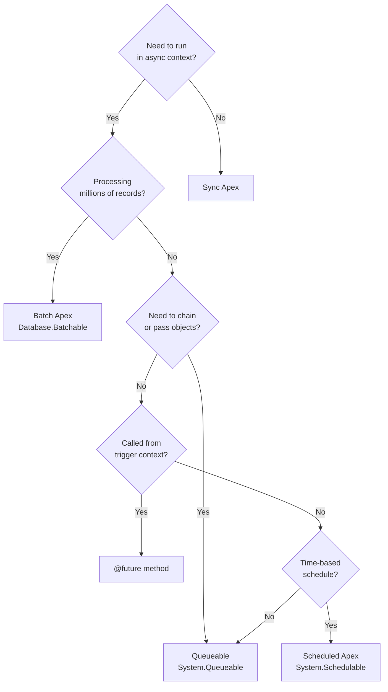
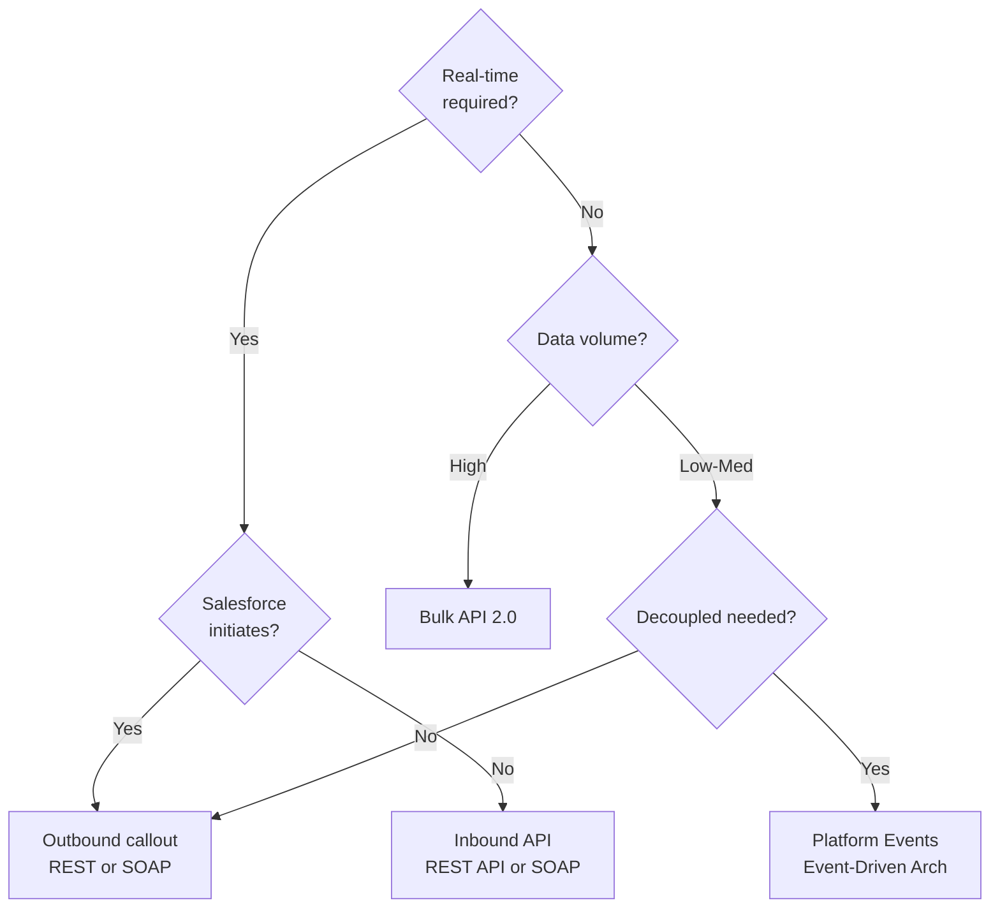
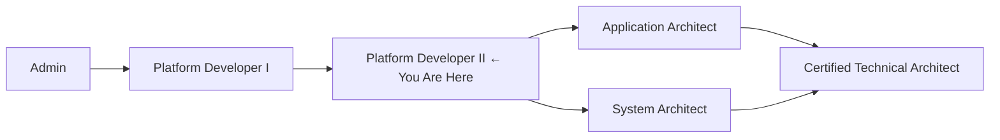

# Platform Developer II (PDII) — Study Guide

## Exam Facts

| Detail | Value |
|--------|-------|
| Exam Code | CRT-450 |
| Questions | 60 multiple choice + multiple select |
| Time | 120 minutes |
| Pass Score | 63% (~38/60) |
| Cost | $200 / Retake $100 |
| Prerequisite | Must hold Platform Developer I (CRT-450) |
| Format | Multiple choice + multi-select |

## Exam Weight Breakdown

| Domain | Weight | ~Questions |
|--------|--------|-----------|
| Apex & Data Management | 27% | ~16 |
| Process Automation & Logic | 21% | ~13 |
| Integration | 21% | ~13 |
| Testing | 16% | ~10 |
| Debug & Deployment | 15% | ~9 |

## PTA / SA Relevance

**Why PDII matters for Partner Technical Architects and Solution Architects:**

PDII is the gateway to the architect track. Holding it signals that you can credibly assess not just whether Apex was written, but whether it was written *well* — correct patterns, governor-limit-safe architecture, testable code, and secure data access. For a PTA advising enterprise customers, this certification unlocks conversations that go beyond "can we build it" to "how should we build it and what breaks at scale."

**Daily advisory applications:**
- **Code review authority**: Walk into a customer architecture review and assess whether the Batch/Queueable design will hold at 5M records. Identify chaining anti-patterns before they cause production incidents.
- **Integration design**: Evaluate whether a customer's integration architecture (point-to-point REST vs ESB vs event-driven) is appropriate for their volume and complexity. Know when Platform Events are a better answer than polling callouts.
- **Technical debt conversation**: Use PDII knowledge to quantify risk in legacy orgs — SOQL injection vulnerabilities, missing CRUD/FLS enforcement, untested callouts. These translate directly into deal risk and Professional Services scope.
- **Build vs. configure decisions**: Know when Apex is NOT the right answer and a Flow or declarative approach is better — and be able to articulate the maintenance cost tradeoff credibly.
- **Architect certification prep**: PDII is a required stepping stone for Application Architect, System Architect, and ultimately CTA. Every concept here reappears in those exams with added complexity.

**How this differs from PDI (what PDII adds):**
PDI tests whether you *know* Apex. PDII tests whether you can *design systems* with it — choosing between async patterns, writing secure integration code, designing for governor limits at enterprise scale, and building a complete testing strategy including mocks.

## Architecture — Course Map

## Governor Limits — The Ones PDII Tests Hardest

| Limit | Sync | Async |
|-------|------|-------|
| SOQL queries | 100 | 200 |
| SOQL rows returned | 50,000 | 50,000 |
| DML operations | 150 | 150 |
| DML rows | 10,000 | 10,000 |
| Heap size | 6 MB | 12 MB |
| CPU time | 10s | 60s |
| Callouts per tx | 100 | 100 |
| Max callout timeout | 120s | 120s |
| @future per tx | 50 | — |
| Queueable chain depth | 5 (test) / unlimited (prod) | — |
| Batch concurrent jobs | 5 active | — |
| Batch max records (QueryLocator) | 50M | — |
| Scheduled jobs in org | 100 | — |
| Platform Event publishes per tx | 150 | — |
| CDC subscriptions per org | 40 | — |

## PDII vs PDI — Depth Comparison

| Topic | PDI Level | PDII Level |
|-------|-----------|-----------|
| Batch Apex | Know the interface | Design for 50M records, stateful patterns, chaining |
| Async | @future basics | Queueable chains, error handling, monitoring |
| Testing | Write tests, hit 75% | Factory patterns, mocks, bulk testing, test design |
| Integration | Basic callout | Named Credentials, certs, composite API, patterns |
| Platform Events | Awareness | Pub/sub architecture, replay, CDC, EDA design |
| LWC | Components, events | Wire service internals, Jest, performance patterns |
| Security | WITH SHARING | CRUD/FLS, WITH SECURITY_ENFORCED, stripInaccessible |
| Deployment | Change sets | Source format, scratch orgs, CI/CD pipelines |

## 6-Week Study Plan

**Week 1 — Advanced Apex Patterns (Section 1, L01–L02)**
- Days 1–2: L01 Advanced Apex Patterns — review design patterns (Trigger Framework, Selector, Service layers). Implement a full trigger framework in your scratch org.
- Days 3–4: L02 Async Apex Deep Dive — Queueable chaining, stateful batch, scheduled apex. Deploy all three async types and monitor with AsyncApexJob queries.
- Days 5–7: Lab 1 — async patterns. Practice coding Queueable chains with callouts.

**Week 2 — Integration (Section 1 cont. + Section 3, L03, L08–L09)**
- Days 1–2: L03 Apex Integration Patterns and L08 REST/SOAP integration. Write a REST callout against a public API.
- Days 3–4: L09 Callouts and Certificates — set up Named Credentials in your org. Test a JWT flow.
- Days 5–7: L10 Integration Patterns — map ESB vs point-to-point vs EDA. Lab 2.

**Week 3 — Testing & Security (Section 2, L04–L07)**
- Days 1–2: L04 Performance Optimization — SOQL optimization, aggregate queries, skinny table awareness.
- Days 3–4: L05 Advanced Testing — factory pattern, HttpCalloutMock, platform event mocks.
- Days 5–7: L06 Security — SOQL injection variants, WITH SECURITY_ENFORCED, stripInaccessible, FLS enforcement.

**Week 4 — Platform Events & CDC (Section 2, L07)**
- Days 1–3: L07 Platform Events and CDC — build a pub/sub flow end to end. Subscribe via Apex trigger and Flow. Understand replay IDs.
- Days 4–7: Review integration + testing sections. Practice multi-select questions.

**Week 5 — LWC Advanced (Section 4, L11–L13)**
- Days 1–2: L11 LWC Advanced Patterns — wire adapters, imperative calls, pub/sub with LMS.
- Days 3–4: L12 LWC Testing with Jest — set up Jest, write component tests, mock wire adapters.
- Days 5–7: L13 LWC-Apex Integration. Lab 3.

**Week 6 — Architecture + Exam Prep (Section 5 + Exam Prep)**
- Days 1–2: L14 Limit Management Architecture and L15 Large Data Volumes.
- Day 3: L16 Deployment Best Practices — source format, scratch orgs, CI/CD.
- Days 4–5: Practice exam (60 questions). Review wrong answers.
- Days 6–7: Cheat sheet review. Final weak-area drilling.

## Key Decision Frameworks — The PDII "Choose the Right Tool" Questions

### Async Pattern Selection

### Integration Pattern Selection

## Certification Path Context

PDII sits at the critical junction where technical depth meets architectural breadth. Every concept in this guide reappears in Application Architect (with more emphasis on declarative + integration patterns) and System Architect (with more emphasis on environment strategy, data architecture, and identity).
