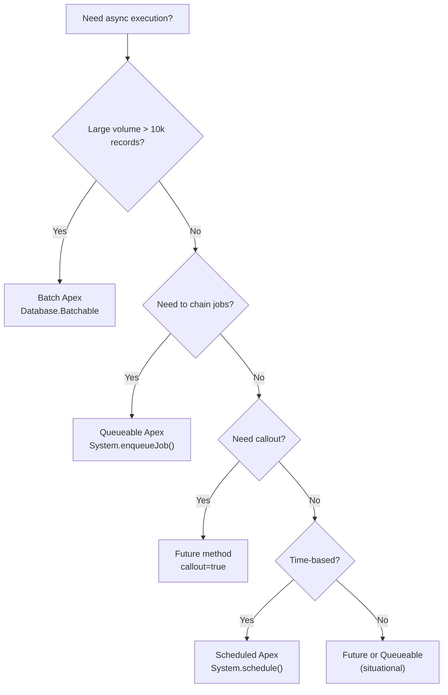
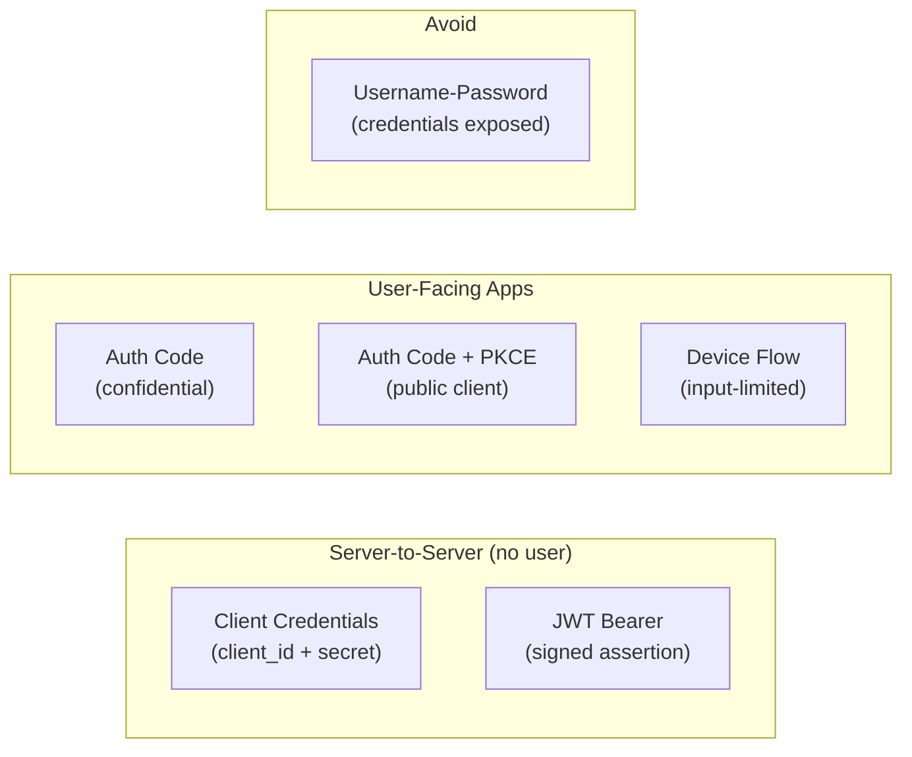
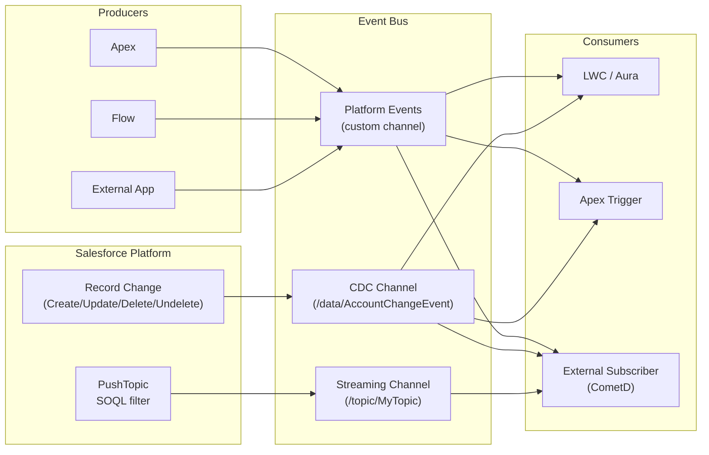
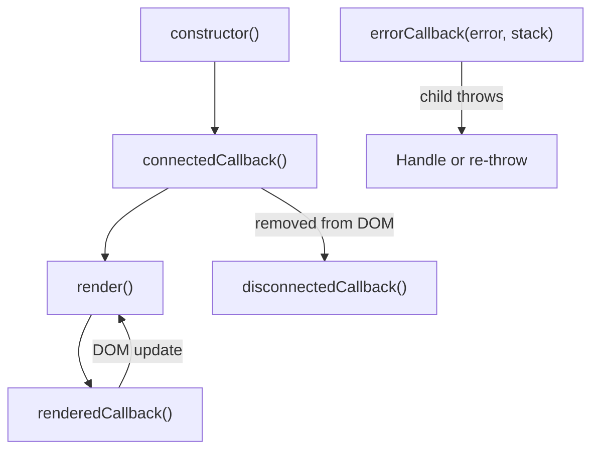
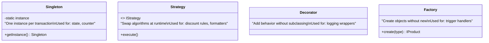
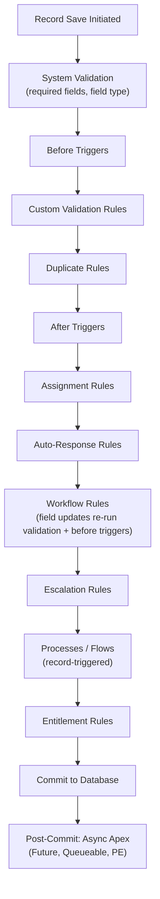
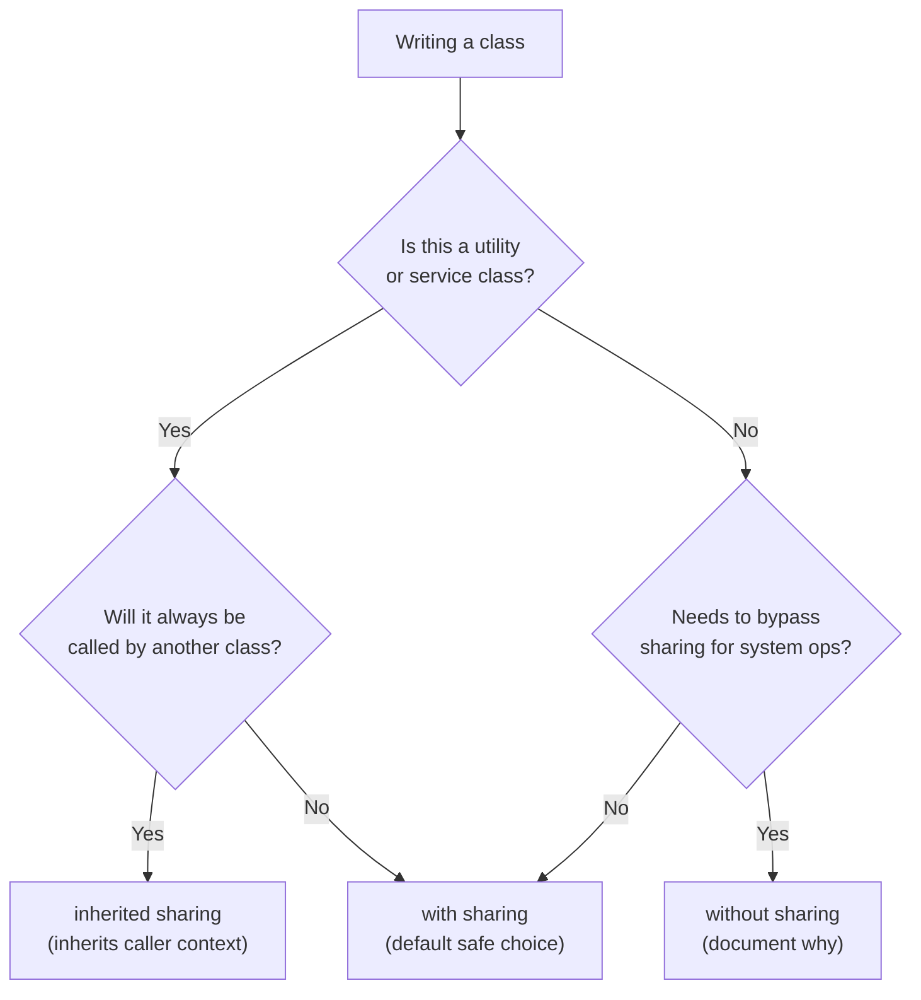
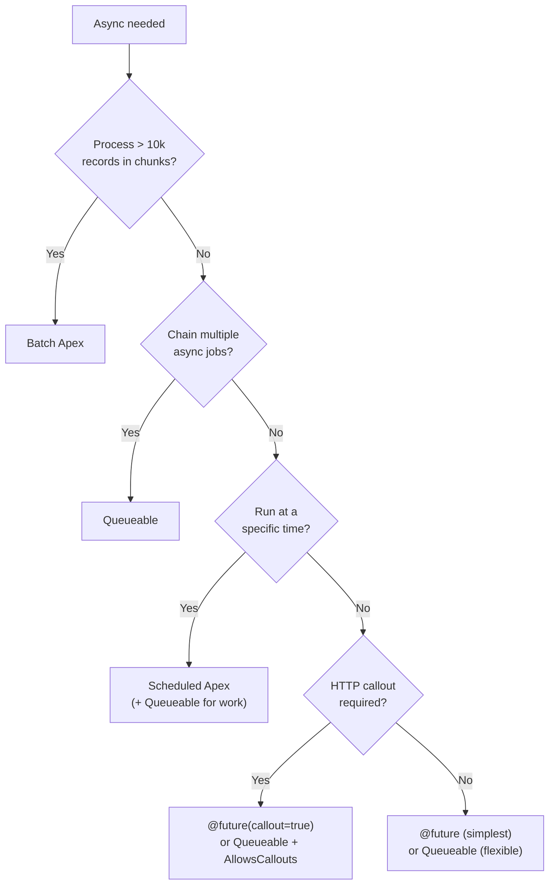

# Platform Developer II Cheat Sheet (CRT-450)

## Exam Quick Stats
- **Code:** CRT-450 | **Questions:** 60 | **Pass Score:** 63% (38/60) | **Time:** 120 min | **Prereq:** PDI (CRT-403)
- Delivered via Webassessor (onsite or remote proctored)
- Retake fee: $100; no waiting period after first attempt

---

## Domain Weights Table

| Domain | Weight | Key Topics |
|---|---|---|
| Apex & .NET Basics | 7% | Design patterns, collections, sObjects, casting |
| Data Modeling & Management | 7% | Relationships, schema describe, SOQL/SOSL optimization |
| Process Automation & Logic | 12% | Triggers, bulkification, trigger frameworks |
| Debug & Deployment | 14% | Debugging tools, change sets, scratch orgs, CLI |
| Integration | 17% | REST/SOAP/Bulk/Streaming, callouts, Named Credentials |
| Testing | 16% | Test classes, coverage, mocks, @TestSetup |
| UI Development (LWC/Aura) | 12% | Component lifecycle, wire, events, security |
| Asynchronous Apex | 15% | Future, Queueable, Batch, Scheduled |

---

## Async Apex Quick Reference



| Type | Limit/Transaction | Daily Limit | Callout? | Chain? | Returns |
|---|---|---|---|---|---|
| Future | 50 enqueue calls | 250,000 | Yes (`callout=true`) | No | void |
| Queueable | 50 enqueue calls | 250,000 | Yes | Yes (1 child) | ID |
| Batch | 5 concurrent | Unlimited | Yes (start/finish only) | Via finish() | ID |
| Scheduled | 100 scheduled jobs | N/A | No directly | Via Queueable | ID |

### Batch Apex Pattern
```apex
global class MyBatch implements Database.Batchable<sObject>, Database.Stateful {
    global Integer totalProcessed = 0;  // Database.Stateful preserves instance vars

    global Database.QueryLocator start(Database.BatchableContext bc) {
        return Database.getQueryLocator('SELECT Id FROM Account WHERE ...');
    }

    global void execute(Database.BatchableContext bc, List<Account> scope) {
        totalProcessed += scope.size();
        // bulk DML here
    }

    global void finish(Database.BatchableContext bc) {
        // email, chain another batch, enqueue Queueable
        System.enqueueJob(new MyQueueable());
    }
}
// Invoke: Database.executeBatch(new MyBatch(), 200);  // 200 = scope size, max 2000
```

### Queueable Pattern
```apex
public class MyQueueable implements Queueable, Database.AllowsCallouts {
    public void execute(QueueableContext ctx) {
        // do work; can enqueue ONE child:
        if (someCondition) System.enqueueJob(new MyQueueable());
    }
}
// Invoke: System.enqueueJob(new MyQueueable());
```

### Scheduled Apex Pattern
```apex
global class MyScheduled implements Schedulable {
    global void execute(SchedulableContext sc) {
        System.enqueueJob(new MyQueueable());  // offload heavy work
    }
}
// Invoke: System.schedule('Job Name', '0 0 2 * * ?', new MyScheduled());
// CRON: Seconds Minutes Hours Day-of-Month Month Day-of-Week [Year]
```

### Future Method Rules
```apex
@future(callout=true)
public static void myFuture(List<Id> ids) {  // params must be primitives or Collections of primitives
    // NO sObject params allowed
}
// Cannot be called from Batch execute() — use Queueable instead
// Cannot call another @future from a @future
```

---

## Governor Limits Quick Reference

| Limit | Sync | Async |
|---|---|---|
| SOQL queries | 100 | 200 |
| SOQL rows returned | 50,000 | 50,000 |
| DML statements | 150 | 150 |
| DML rows | 10,000 | 10,000 |
| CPU time | 10,000 ms | 60,000 ms |
| Heap size | 6 MB | 12 MB |
| Callouts per tx | 100 | 100 |
| Future calls per tx | 50 | 50 |
| Queueable jobs enqueued | 50 | 50 |
| Emails sent | 10 | 10 |
| SOSL queries | 20 | 20 |
| Describe calls | 100 | 100 |
| Max query runtime | 120 sec | 120 sec |

**Key rules:**
- `Test.startTest()` / `Test.stopTest()` resets governor limits (new set of limits for code between them)
- Each Batch execute() call gets its own fresh set of governor limits
- Scheduled Apex finish() gets a fresh set of limits

---

## Integration API Selection

| API | Use Case | Limit | Format | Auth |
|---|---|---|---|---|
| REST API | General CRUD, mobile, modern | 1,000 req/user/day | JSON/XML | OAuth |
| SOAP API | Enterprise, legacy ERP | 1,000 req/user/day | XML | OAuth/Username |
| Bulk API 2.0 | > 10k records, ETL | 10,000 jobs/day | CSV/JSON | OAuth |
| Streaming API (PushTopic) | Real-time push, SOQL filter | 200 subscribers | JSON (Bayeux/CometD) | OAuth |
| Platform Events | Event-driven architecture | 250,000/day (Enterprise) | JSON | OAuth |
| CDC | Track record changes | 25,000/day | JSON | OAuth |
| Composite API | Multiple ops in 1 HTTP call | 25 subrequests | JSON | OAuth |
| Connect API (Chatter) | Social/community features | Standard API limits | JSON | OAuth |
| Metadata API | Retrieve/deploy metadata | N/A | XML | OAuth |
| Tooling API | IDE integrations, code coverage | N/A | JSON/XML | OAuth |

### REST API Endpoint Pattern
```
/services/data/vXX.0/sobjects/{ObjectName}/
/services/data/vXX.0/sobjects/{ObjectName}/{id}
/services/data/vXX.0/query/?q=SELECT+...
/services/data/vXX.0/composite/
/services/data/vXX.0/composite/batch
/services/data/vXX.0/composite/tree/{ObjectName}
```

### HTTP Callout in Apex
```apex
HttpRequest req = new HttpRequest();
req.setEndpoint('callout:MyNamedCredential/api/v1/endpoint');
req.setMethod('POST');
req.setHeader('Content-Type', 'application/json');
req.setBody(JSON.serialize(myObject));
req.setTimeout(120000);  // max 120,000ms

Http http = new Http();
HttpResponse res = http.send(req);

if (res.getStatusCode() == 200) {
    Map<String, Object> result = (Map<String, Object>) JSON.deserializeUntyped(res.getBody());
}
```

### JSON Parsing Patterns
```apex
// Strongly typed (preferred)
MyWrapper obj = (MyWrapper) JSON.deserialize(jsonString, MyWrapper.class);

// Untyped (flexible)
Map<String, Object> m = (Map<String, Object>) JSON.deserializeUntyped(jsonString);
List<Object> items = (List<Object>) m.get('items');

// Serialize
String json = JSON.serialize(myObject);
String prettyJson = JSON.serializePretty(myObject);
```

---

## OAuth Flows Quick Reference

| Flow | When to Use | User Interaction? | Token Lifetime |
|---|---|---|---|
| Authorization Code | Web server apps (confidential clients) | Yes — browser redirect | Access + Refresh |
| Authorization Code + PKCE | Mobile, SPA (public clients) | Yes — browser redirect | Access + Refresh |
| Client Credentials | M2M / server-to-server, no user | No | Access only |
| JWT Bearer | Server-to-server with X.509 cert | No | Access only |
| Device Flow | IoT / CLI / input-limited devices | Minimal (code on another device) | Access + Refresh |
| Username-Password | Legacy only — avoid (insecure) | No | Access only |
| Refresh Token | Extend sessions without re-auth | No | New Access token |
| SAML Assertion | SSO with SAML IdP | No | Access only |



---

## Testing Requirements

### Coverage Rules
- Minimum **75% code coverage** org-wide to deploy to production
- Each class doesn't individually need 75% — org aggregate must meet threshold
- **Anonymous Apex** does NOT count toward coverage
- **@IsTest** classes are excluded from coverage calculation
- Triggers must have at least 1% coverage (effectively: at least one test that fires the trigger)

### Test Class Anatomy
```apex
@IsTest
private class MyClassTest {

    @TestSetup
    static void setupData() {
        // runs ONCE for the class; each test method gets rolled-back copy
        Account acc = new Account(Name = 'Test Account');
        insert acc;
    }

    @IsTest
    static void testPositivePath() {
        Account acc = [SELECT Id FROM Account LIMIT 1];
        Test.startTest();
            // call the method under test
            MyClass.doWork(acc.Id);
        Test.stopTest();
        // assert after stopTest so async is flushed
        Account result = [SELECT Name FROM Account WHERE Id = :acc.Id];
        Assert.areEqual('Updated', result.Name);
    }

    @IsTest
    static void testNegativePath() {
        Test.startTest();
        try {
            MyClass.doWork(null);
            Assert.fail('Should have thrown');
        } catch (IllegalArgumentException e) {
            Assert.isTrue(e.getMessage().contains('Id required'));
        }
        Test.stopTest();
    }
}
```

### Callout Mocks
```apex
// Simple single-callout mock
@IsTest
global class MyCalloutMock implements HttpCalloutMock {
    global HttpResponse respond(HttpRequest req) {
        HttpResponse res = new HttpResponse();
        res.setStatusCode(200);
        res.setBody('{"status":"ok"}');
        res.setHeader('Content-Type', 'application/json');
        return res;
    }
}

// In test:
Test.setMock(HttpCalloutMock.class, new MyCalloutMock());

// Static resource multi-callout mock:
StaticResourceCalloutMock mock = new StaticResourceCalloutMock();
mock.setStaticResource('MyMockResponse');
mock.setStatusCode(200);
Test.setMock(HttpCalloutMock.class, mock);
```

### Platform Event / SOAP Mocks
```apex
// WebServiceMock for SOAP callouts
@IsTest
global class MySoapMock implements WebServiceMock {
    global void doInvoke(Object stub, Object request, Map<String,Object> response,
        String endpoint, String soapAction, String requestName,
        String responseNS, String responseName, String responseType) {
        MyWsdl.Response res = new MyWsdl.Response();
        res.result = 'mocked';
        response.put('response_x', res);
    }
}
// In test: Test.setMock(WebServiceMock.class, new MySoapMock());
```

---

## Security Quick Reference

### Field-Level Security (FLS) Enforcement
```apex
// Option 1: WITH SECURITY_ENFORCED (inline SOQL — throws QueryException if FLS violated)
List<Account> accs = [SELECT Id, Name, AnnualRevenue FROM Account WITH SECURITY_ENFORCED];

// Option 2: stripInaccessible (preferred — removes inaccessible fields silently)
SObjectAccessDecision decision = Security.stripInaccessible(
    AccessType.READABLE,
    [SELECT Id, Name, AnnualRevenue FROM Account]
);
List<Account> accs = (List<Account>) decision.getRecords();

// Option 3: Manual CRUD/FLS check
if (!Schema.sObjectType.Account.isCreateable()) {
    throw new SecurityException('No create access on Account');
}
if (!Schema.sObjectType.Account.fields.AnnualRevenue.isUpdateable()) { /* ... */ }
```

### Sharing Enforcement
```apex
// with sharing — enforces record-level sharing rules (RECOMMENDED default)
public with sharing class MyService {
    public List<Account> getAccounts() {
        return [SELECT Id FROM Account];  // respects sharing
    }
}

// without sharing — bypasses sharing (use deliberately for system-level ops)
public without sharing class ElevatedService {
    public void doSystemWork() { /* ... */ }
}

// inherited sharing — inherits context from calling class (good for utility classes)
public inherited sharing class MyUtil { }
```

### SOQL Injection Prevention
```apex
// VULNERABLE — never do this
String query = 'SELECT Id FROM Account WHERE Name = \'' + userInput + '\'';

// SAFE — escape user input
String safeInput = String.escapeSingleQuotes(userInput);
String query = 'SELECT Id FROM Account WHERE Name = \'' + safeInput + '\'';

// SAFER — use bind variables (no escaping needed)
List<Account> accs = Database.query('SELECT Id FROM Account WHERE Name = :userInput');

// SAFEST — static SOQL with bind variables
List<Account> accs = [SELECT Id FROM Account WHERE Name = :userInput];
```

### Named Credentials
```apex
// In endpoint — no token management in Apex
req.setEndpoint('callout:MyNamedCredential/api/v1/resource');

// Named Credential merge fields (in remote site / external credential settings):
// {!$Credential.OAuthToken}        — OAuth access token
// {!$Credential.UserName}          — username
// {!$Credential.Password}          — password
// {!$Credential.Endpoint}          — endpoint URL
```

---

## SOQL / SOSL Advanced Patterns

### Relationship Queries
```apex
// Child-to-Parent (dot notation)
SELECT Id, Account.Name, Account.Owner.Name FROM Contact

// Parent-to-Child (subquery — use plural child relationship name)
SELECT Id, Name, (SELECT Id, LastName FROM Contacts) FROM Account

// Polymorphic fields (TYPEOF — for Activity, FeedItem, etc.)
SELECT Id, TYPEOF What WHEN Account THEN Name WHEN Opportunity THEN StageName END FROM Task
```

### Aggregate Functions
```apex
SELECT AccountId, COUNT(Id) cnt, SUM(Amount) total, MAX(CloseDate) latest
FROM Opportunity
WHERE StageName = 'Closed Won'
GROUP BY AccountId
HAVING COUNT(Id) > 5
// Access: (Integer) agg.get('cnt')
```

### SOSL (Salesforce Object Search Language)
```apex
// Use when searching across multiple objects or full-text search
List<List<SObject>> results = [FIND 'Acme*' IN ALL FIELDS
    RETURNING Account(Id, Name WHERE Industry = 'Technology'),
              Contact(Id, LastName, Email)
    LIMIT 50];
List<Account> accounts = (List<Account>) results[0];
List<Contact> contacts = (List<Contact>) results[1];
// SOSL: 1 statement = 1 limit (not per object)
```

### Schema Describe
```apex
// Object describe
Schema.DescribeSObjectResult dsr = Schema.sObjectType.Account;
dsr.isCreateable(); dsr.isUpdateable(); dsr.isDeletable();

// Dynamic describe (counts toward describe limit)
Map<String, Schema.SObjectType> globalDesc = Schema.getGlobalDescribe();
Schema.DescribeSObjectResult[] results = Schema.describeSObjects(new List<String>{'Account','Contact'});

// Field describe
Schema.DescribeFieldResult dfr = Schema.sObjectType.Account.fields.Industry;
dfr.getPicklistValues();  // List<Schema.PicklistEntry>
dfr.getType();            // Schema.DisplayType
```

---

## Platform Events vs CDC vs Streaming API

| Feature | Platform Events | CDC (Change Data Capture) | Streaming API (PushTopic) |
|---|---|---|---|
| Who publishes? | Any (Apex, Flow, external) | Salesforce platform | Salesforce platform |
| What triggers it? | EventBus.publish() or Flow | Record CUD operations | SOQL-defined record changes |
| Replay buffer | Yes (72 hours) | Yes (72 hours) | No |
| Filter capability | No (all or nothing) | Object-level only | SOQL WHERE clause |
| Trigger support? | Yes (after insert) | Yes (after insert) | No |
| Apex publish limit | 250,000/day (Enterprise) | N/A (platform-generated) | N/A |
| Subscriber limit | 2,000 | 2,000 | 200 per channel |
| Durable? | Yes | Yes | No |



### Platform Event in Apex
```apex
// Publish
List<Order_Placed__e> events = new List<Order_Placed__e>();
events.add(new Order_Placed__e(Order_Id__c = orderId, Amount__c = 500));
EventBus.publish(events);  // or Database.SaveResult[] results = EventBus.publish(events);

// Subscribe via trigger
trigger OrderPlacedTrigger on Order_Placed__e (after insert) {
    for (Order_Placed__e evt : Trigger.new) {
        // process event
    }
}
// CRITICAL: Platform Event publishes in a trigger are NOT rolled back even if the TX rolls back
```

---

## LWC Key Facts

### Component Lifecycle



### Wire Service
```javascript
import { LightningElement, wire } from 'lwc';
import { getRecord } from 'lightning/uiRecordApi';
import getAccounts from '@salesforce/apex/AccountController.getAccounts';

export default class MyComp extends LightningElement {
    @api recordId;  // reactive property — prefix with $ in wire to make reactive

    // Wire adapter — re-fires when recordId changes
    @wire(getRecord, { recordId: '$recordId', fields: ['Account.Name'] })
    account;  // { data, error }

    // Wire Apex method — reactive
    @wire(getAccounts, { searchKey: '$searchKey' })
    wiredAccounts({ data, error }) {
        if (data) this.accounts = data;
        if (error) this.error = error;
    }
}
```

### Imperative Apex
```javascript
import getAccounts from '@salesforce/apex/AccountController.getAccounts';

async connectedCallback() {
    try {
        this.accounts = await getAccounts({ searchKey: this.searchKey });
    } catch (error) {
        this.error = error.body?.message;
    }
}
```

### Custom Events
```javascript
// Child dispatches
this.dispatchEvent(new CustomEvent('myevent', {
    detail: { value: this.selectedId },
    bubbles: true,    // propagates up DOM
    composed: true    // crosses shadow DOM boundary
}));

// Parent template listens
// <c-child onmyevent={handleMyEvent}></c-child>
handleMyEvent(event) {
    console.log(event.detail.value);
}
```

### LWC Security
- **LockerService** — isolates components; no direct DOM access across namespaces
- No direct `eval()`, no modifying `window.__proto__`
- `@api` properties exposed to parent — validate/sanitize in setter
- `@track` is now implicit for objects/arrays; `@api` makes it public

### LWC Jest Testing
```javascript
import { createElement } from 'lwc';
import MyComp from 'c/myComp';
import getAccounts from '@salesforce/apex/AccountController.getAccounts';

jest.mock('@salesforce/apex/AccountController.getAccounts', () => {
    return { default: jest.fn() };
}, { virtual: true });

describe('c-my-comp', () => {
    afterEach(() => { while (document.body.firstChild) document.body.removeChild(document.body.firstChild); });

    it('renders accounts', async () => {
        getAccounts.mockResolvedValue([{ Id: '001', Name: 'Test' }]);
        const element = createElement('c-my-comp', { is: MyComp });
        document.body.appendChild(element);
        await Promise.resolve();  // flush microtask queue
        const items = element.shadowRoot.querySelectorAll('li');
        expect(items.length).toBe(1);
    });
});
```

---

## Aura Components Key Facts (Legacy — Still Tested)

| Concept | LWC Equivalent | Notes |
|---|---|---|
| `aura:attribute` | `@api` / `@track` property | Aura has type declarations |
| `aura:handler` | Event listener | `name="init"` for init hook |
| Component events | Custom events | Bubble up component tree |
| Application events | Lightning Message Service | Broadcast across app |
| `$A.enqueueAction` | Imperative Apex | Async Apex call |
| `$A.createComponent` | Dynamic component (experimental) | Programmatic creation |
| `force:navigateToURL` | NavigationMixin | URL navigation |

### Aura Event Types
- **Component event** — fires up the component hierarchy (parent chain only)
- **Application event** — fires to ALL registered handlers in the app (use sparingly — performance)
- **System event** — built-in (`init`, `render`, `afterRender`, `destroy`, `locationChange`)

---

## Trigger Framework & Design Patterns

### Trigger Best Practices
```apex
// ONE trigger per object — delegate to handler
trigger AccountTrigger on Account (before insert, before update, after insert, after update) {
    AccountTriggerHandler handler = new AccountTriggerHandler();
    if (Trigger.isBefore) {
        if (Trigger.isInsert) handler.beforeInsert(Trigger.new);
        if (Trigger.isUpdate) handler.beforeUpdate(Trigger.new, Trigger.oldMap);
    }
    if (Trigger.isAfter) {
        if (Trigger.isInsert) handler.afterInsert(Trigger.new);
        if (Trigger.isUpdate) handler.afterUpdate(Trigger.new, Trigger.oldMap);
    }
}
```

### Trigger Context Variables
| Variable | Available In | Notes |
|---|---|---|
| `Trigger.new` | before/after insert, before/after update, after undelete | List of new records |
| `Trigger.old` | before/after update, before/after delete | List of old records |
| `Trigger.newMap` | before update, after insert, after update, after undelete | Map<Id, SObject> |
| `Trigger.oldMap` | before/after update, before/after delete | Map<Id, SObject> |
| `Trigger.isInsert` | All | Boolean |
| `Trigger.isUpdate` | All | Boolean |
| `Trigger.isDelete` | All | Boolean |
| `Trigger.isUndelete` | All | Boolean |
| `Trigger.isBefore` | All | Boolean |
| `Trigger.isAfter` | All | Boolean |
| `Trigger.operationType` | All | TriggerOperation enum |
| `Trigger.size` | All | Integer — number of records |

### Bulkification Pattern
```apex
// BAD — SOQL in loop
for (Account acc : Trigger.new) {
    List<Contact> cons = [SELECT Id FROM Contact WHERE AccountId = :acc.Id]; // 1 SOQL per record!
}

// GOOD — collect IDs, single query, map lookup
Set<Id> accountIds = Trigger.newMap.keySet();
Map<Id, List<Contact>> contactsByAccount = new Map<Id, List<Contact>>();
for (Contact c : [SELECT Id, AccountId FROM Contact WHERE AccountId IN :accountIds]) {
    if (!contactsByAccount.containsKey(c.AccountId))
        contactsByAccount.put(c.AccountId, new List<Contact>());
    contactsByAccount.get(c.AccountId).add(c);
}
for (Account acc : Trigger.new) {
    List<Contact> cons = contactsByAccount.get(acc.Id);
}
```

### Design Patterns Tested on Exam



**Singleton** — prevent re-instantiation per transaction (static instance variable)
**Strategy** — interface + multiple implementations, swap at runtime
**Decorator** — wrap object to add behavior (e.g., logging around service calls)
**Factory** — centralized creation logic; decouple instantiation from usage

---

## Deployment Quick Reference

### Salesforce DX / CLI Commands
```bash
# Authorize an org
sf org login web --alias myOrg
sf org login jwt --client-id ... --jwt-key-file ... --username ... --alias myOrg

# Deploy
sf project deploy start --source-dir force-app --target-org myOrg
sf project deploy start --manifest package.xml --target-org myOrg

# Validate only (no deploy — but can quick deploy within 10 days)
sf project deploy validate --source-dir force-app --target-org myOrg --test-level RunLocalTests

# Quick deploy (deploy a validated deployment ID)
sf project deploy quick --job-id <deployId> --target-org myOrg

# Retrieve
sf project retrieve start --source-dir force-app --target-org myOrg

# Run tests
sf apex run test --target-org myOrg --test-level RunLocalTests --result-format human

# Scratch org
sf org create scratch --definition-file config/project-scratch-def.json --alias myScratch --duration-days 30
sf org delete scratch --target-org myScratch
```

### Test Levels
| Level | Description |
|---|---|
| `NoTestRun` | No tests run — NOT allowed for production |
| `RunSpecifiedTests` | Only listed test classes run |
| `RunLocalTests` | All tests NOT from managed packages |
| `RunAllTestsInOrg` | All tests including managed package tests |

### Change Sets vs Metadata API vs SFDX
| Method | Best For | Limitation |
|---|---|---|
| Change Sets | Small orgs, admin-driven | No version control, no rollback |
| Metadata API (ANT/Workbench) | Automated pipelines (legacy) | Complex package.xml management |
| Salesforce DX (SFDX) | Developer-driven, CI/CD | Requires CLI setup |

### Source Format vs Metadata Format
- **Source format** — one file per component, better for VCS (`force-app/main/default/`)
- **Metadata format** — single XML per component type (used by Change Sets, Metadata API)
- Convert: `sf project convert source` / `sf project convert mdapi`

---

## Apex Design: Advanced Topics

### Database Methods vs DML Statements
```apex
// DML statement — throws exception on first failure
insert accounts;

// Database method — partial success possible; allOrNone = false
Database.SaveResult[] results = Database.insert(accounts, false);
for (Database.SaveResult sr : results) {
    if (!sr.isSuccess()) {
        for (Database.Error err : sr.getErrors()) {
            System.debug(err.getMessage() + ' Fields: ' + err.getFields());
        }
    }
}
```

### Collections & Performance
```apex
// Map for O(1) lookup vs List O(n)
Map<Id, Account> accountMap = new Map<Id, Account>([SELECT Id, Name FROM Account]);

// Set for uniqueness
Set<String> uniqueNames = new Set<String>{'Alice', 'Bob'};

// Lists for ordered iteration
List<Account> toUpdate = new List<Account>();

// Avoid List.contains() in loops — O(n²); use Set.contains() — O(1)
```

### Custom Exceptions
```apex
public class MyAppException extends Exception {}

// Throw with message
throw new MyAppException('Something went wrong: ' + e.getMessage());

// Throw with inner exception
throw new MyAppException('Wrapped error', e);
```

### Interfaces & Virtual Classes
```apex
public interface Discountable {
    Decimal applyDiscount(Decimal price);
}

public virtual class BaseProcessor {
    public virtual void process(List<SObject> records) {
        // default implementation
    }
}

public class PremiumProcessor extends BaseProcessor implements Discountable {
    public override void process(List<SObject> records) { /* ... */ }
    public Decimal applyDiscount(Decimal price) { return price * 0.9; }
}
```

---

## Order of Execution



**Key exam points:**
- Workflow Field Updates re-run the **before triggers** (and after triggers) — can cause recursion
- Record-Triggered Flows fire **after** workflow rules but **before** commit
- `Database.rollback(sp)` — savepoint/rollback; does NOT roll back Platform Event publishes
- After triggers run before commit but cannot modify `Trigger.new` fields (use before triggers for that)

---

## Error Handling Patterns

```apex
// Savepoint & Rollback
Savepoint sp = Database.setSavepoint();
try {
    insert account;
    insert contact;
} catch (DmlException e) {
    Database.rollback(sp);
    // handle error
}

// Adding errors to records (in triggers)
for (Account acc : Trigger.new) {
    if (acc.AnnualRevenue < 0) {
        acc.AnnualRevenue.addError('Revenue cannot be negative');  // field-level error
        // acc.addError('Account error');  // record-level error
    }
}
```

---

## Top 15 Exam Traps

1. **Batch scope size** — `Database.executeBatch(new MyBatch(), 200)`: second param = scope size (default 200, max 2000); NOT number of batches
2. **Queueable chain depth** — max **5 levels** in production (unlimited in async tests after `Test.stopTest()`)
3. **Future from Batch execute()** — CANNOT call `@future` from Batch `execute()` — use `System.enqueueJob()` instead
4. **Platform Events & rollback** — `EventBus.publish()` in a trigger fires the event even if the DML transaction **rolls back**
5. **@TestSetup rollback** — `@TestSetup` data IS rolled back between test methods — each method gets a **fresh copy** (changes in one method don't persist)
6. **WITH SECURITY_ENFORCED** — throws `QueryException` at runtime if FLS violated; use `Security.stripInaccessible()` for non-throwing behavior
7. **Named Credentials** — no need to store tokens in Apex; use `callout:CredentialName` as endpoint; token managed by Salesforce
8. **Composite API** — max **25 subrequests**; supports reference IDs (`@{refId.id}`) to chain results across subrequests
9. **CDC replay window** — only **72 hours**; no historical replay beyond that; `-1` = tip of stream, `-2` = earliest in buffer
10. **Test.stopTest() timing** — `@future` and Queueable jobs run synchronously **after** `Test.stopTest()` — always put assertions after `Test.stopTest()`
11. **Batch finish() limits** — governor limits fully **reset** in `finish()`; can send email, start another batch, enqueue Queueable
12. **SOQL in a loop** — even with `LIMIT 1`, each SOQL in a loop iteration counts toward the **100 SOQL limit**
13. **Schema.describeSObjects()** — counts toward the **100 describe calls per tx** limit; cache results in a map
14. **PushTopic (Streaming API)** — events NOT replayed on reconnect (no durable storage); prefer Platform Events for guaranteed delivery
15. **LWC wire error handling** — always handle BOTH `data` AND `error` states; exam tests that missing error handling causes silent failures

---

## Quick Decision Trees

### Which Sharing Keyword?



### Which Async Pattern?



---

## Miscellaneous Must-Knows

### String Methods
```apex
String s = 'Hello World';
s.toLowerCase();           // 'hello world'
s.toUpperCase();           // 'HELLO WORLD'
s.contains('World');       // true
s.startsWith('Hello');     // true
s.split(' ');              // ['Hello', 'World']
s.replace('World', 'SF');  // 'Hello SF'
s.trim();                  // removes leading/trailing whitespace
s.length();                // 11
String.isBlank(s);         // false (isBlank checks null OR empty OR whitespace-only)
String.isEmpty(s);         // false (isEmpty checks null OR empty only)
String.format('{0} has {1} records', new List<Object>{'Account', 5});
```

### Date / DateTime / Time
```apex
Date d = Date.today();
Date d2 = Date.newInstance(2025, 12, 31);
d.addDays(30);  d.addMonths(1);  d.addYears(1);
d.daysBetween(d2);  // Integer (can be negative)

DateTime dt = DateTime.now();
DateTime dt2 = DateTime.newInstance(d, Time.newInstance(9, 0, 0, 0));
dt.format('yyyy-MM-dd HH:mm:ss');
dt.dateGmt();  dt.date();
```

### Collections Utility Methods
```apex
List<Integer> nums = new List<Integer>{3,1,2};
nums.sort();                     // [1,2,3] — in-place
List<Integer> copy = nums.clone(); // shallow copy

Map<String, Integer> m = new Map<String, Integer>{'a'=>1, 'b'=>2};
m.keySet();   m.values();   m.containsKey('a');
m.putAll(otherMap);
m.remove('a');
```

### Limits Class
```apex
System.debug('SOQL used: ' + Limits.getQueries() + ' / ' + Limits.getLimitQueries());
System.debug('DML used: ' + Limits.getDmlStatements() + ' / ' + Limits.getLimitDmlStatements());
System.debug('CPU used: ' + Limits.getCpuTime() + ' / ' + Limits.getLimitCpuTime());
System.debug('Heap: ' + Limits.getHeapSize() + ' / ' + Limits.getLimitHeapSize());
```

### System.debug Log Levels
`ERROR > WARN > INFO > DEBUG > FINE > FINER > FINEST`
- Default in dev console: DEBUG
- `System.debug(LoggingLevel.WARN, 'message')` — only logs at WARN and above

---

## Certification Checklist

- [ ] Know all 4 async types, their interfaces, limits, and when to use each
- [ ] Understand governor limits (sync vs async; what resets per batch chunk)
- [ ] Practice trigger bulkification patterns; know all Trigger context variables
- [ ] Know all 6 OAuth flows and when each is appropriate
- [ ] Understand REST API endpoint patterns and HTTP callout code
- [ ] Know `WITH SECURITY_ENFORCED` vs `Security.stripInaccessible()` tradeoffs
- [ ] Understand Order of Execution (especially workflow field update re-runs)
- [ ] LWC wire vs imperative, lifecycle hooks, custom events with bubble/compose
- [ ] Understand Platform Events replay, CDC limits, PushTopic limitations
- [ ] Deployment: SFDX commands, test levels, quick deploy conditions
- [ ] Testing: @TestSetup behavior, callout mocks, Test.startTest/stopTest
- [ ] Know all design patterns (Singleton, Strategy, Decorator, Factory)
- [ ] Review all 15 exam traps above — each has appeared on the exam

---

*Last updated: 2025 | Based on CRT-450 exam guide v8.0*
