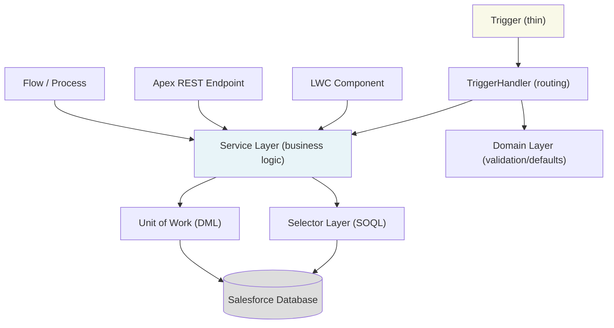

# Advanced Apex Patterns

## Exam Domain
Apex & Data Management — 27% of exam weight

## Foundations

If you passed PDI, you know how to write a trigger. PDII asks: *how do you architect triggers so 50 developers can maintain them, admins can disable them without deployments, and the code doesn't collapse when a data migration runs?* The answer is a layered pattern: thin trigger → handler → service → selector. This section teaches those layers as a system, not as individual files.

You also know `with sharing` is good. PDII asks: *what happens when a `without sharing` class calls a `with sharing` class?* And: *what's the difference between `with sharing`, `without sharing`, and `inherited sharing`?* These distinctions become exam questions and production security bugs.

Assume you understand basic Apex OOP (classes, interfaces, virtual/abstract). This section builds on that to enterprise design patterns.

---

## Core Concepts

### The Trigger Framework Pattern
Raw triggers in Apex objects are an anti-pattern at scale. The canonical enterprise trigger framework separates concerns across three layers: a thin trigger that delegates immediately, a handler class per object, and a dispatcher/router that controls execution context.

```apex
// Trigger — stays thin, always
trigger AccountTrigger on Account (before insert, before update, after insert, after update) {
    AccountTriggerHandler.getInstance().run();
}

// Handler base class — enforced by all handlers
public abstract class TriggerHandler {
    private static Map<String, LoopCount> loopCountMap = new Map<String, LoopCount>();
    private static Set<String> bypassedHandlers = new Set<String>();

    public void run() {
        if (!validateRun()) return;
        addToLoopCount();

        if (Trigger.isBefore) {
            if (Trigger.isInsert) beforeInsert();
            if (Trigger.isUpdate) beforeUpdate();
            if (Trigger.isDelete) beforeDelete();
        } else {
            if (Trigger.isInsert) afterInsert();
            if (Trigger.isUpdate) afterUpdate();
            if (Trigger.isDelete) afterDelete();
            if (Trigger.isUndelete) afterUndelete();
        }
    }

    // Override in subclass — default no-ops prevent abstract method errors
    protected virtual void beforeInsert() {}
    protected virtual void afterInsert() {}
    protected virtual void beforeUpdate() {}
    protected virtual void afterUpdate() {}
    protected virtual void beforeDelete() {}
    protected virtual void afterDelete() {}
    protected virtual void afterUndelete() {}

    // Bypass mechanism — lets admins disable triggers via Custom Metadata
    public static void bypass(String handlerName) { bypassedHandlers.add(handlerName); }
    public static void clearBypass(String handlerName) { bypassedHandlers.remove(handlerName); }

    private Boolean validateRun() {
        if (!Trigger.isExecuting) return false;
        if (bypassedHandlers.contains(getHandlerName())) return false;
        return true;
    }

    private void addToLoopCount() { /* recursion guard */ }
    private String getHandlerName() { return String.valueOf(this).substring(0, String.valueOf(this).indexOf(':')); }
}

// Concrete handler
public class AccountTriggerHandler extends TriggerHandler {
    private List<Account> newList;
    private Map<Id, Account> oldMap;

    public AccountTriggerHandler() {
        this.newList = (List<Account>) Trigger.new;
        this.oldMap  = (Map<Id, Account>) Trigger.oldMap;
    }

    protected override void afterInsert() {
        AccountService.sendWelcomeNotifications(newList);
    }

    protected override void beforeUpdate() {
        AccountService.validateStatusTransitions(newList, oldMap);
    }
}
```

Key design decisions:
- **One trigger per object** — prevents ordering ambiguity
- **Handler as singleton** — `getInstance()` pattern allows test injection
- **Bypass via Custom Metadata** — admin-controllable without code deployment
- **Service layer** — business logic never lives in the handler; handler only routes

### Selector Pattern (Enterprise Query Layer)
Selectors centralise SOQL queries, enforce field-level security, and prevent unbounded queries across a large codebase.

```apex
public with sharing class AccountSelector {

    public static final Set<String> BASE_FIELDS = new Set<String>{
        'Id', 'Name', 'AccountNumber', 'Industry', 'OwnerId', 'CreatedDate'
    };

    public List<Account> selectById(Set<Id> accountIds) {
        return selectById(accountIds, BASE_FIELDS);
    }

    public List<Account> selectById(Set<Id> accountIds, Set<String> fields) {
        String fieldList = String.join(new List<String>(fields), ', ');
        // Dynamic SOQL with bind variable — NOT string concatenation
        String query = 'SELECT ' + fieldList + ' FROM Account WHERE Id IN :accountIds WITH SECURITY_ENFORCED';
        return (List<Account>) Database.query(query);
    }

    public List<Account> selectByIndustry(String industry, Integer lim) {
        return [
            SELECT Id, Name, Industry, AnnualRevenue
            FROM Account
            WHERE Industry = :industry
            WITH SECURITY_ENFORCED
            LIMIT :lim
        ];
    }
}
```

### Service Layer Pattern
The service layer contains business logic, is called from triggers, Apex REST, flows, or LWC. It must be stateless and bulkified.

```apex
public with sharing class AccountService {

    // Always accept collections — never single records
    public static void sendWelcomeNotifications(List<Account> newAccounts) {
        List<Messaging.SingleEmailMessage> emails = new List<Messaging.SingleEmailMessage>();
        for (Account acc : newAccounts) {
            if (acc.PersonEmail != null) {
                Messaging.SingleEmailMessage msg = new Messaging.SingleEmailMessage();
                msg.setToAddresses(new List<String>{ acc.PersonEmail });
                msg.setSubject('Welcome to ' + acc.Name);
                msg.setPlainTextBody('Account created successfully.');
                emails.add(msg);
            }
        }
        if (!emails.isEmpty()) {
            Messaging.sendEmail(emails); // bulk email — one DML-like operation
        }
    }

    public static void validateStatusTransitions(
        List<Account> newList,
        Map<Id, Account> oldMap
    ) {
        for (Account acc : newList) {
            Account oldAcc = oldMap.get(acc.Id);
            if (acc.Rating == 'Cold' && oldAcc.Rating == 'Hot') {
                acc.addError('Cannot downgrade a Hot account to Cold without approval.');
            }
        }
    }
}
```

### Domain Object Pattern (fflib / Apex Enterprise Patterns)
For large orgs using the Apex Enterprise Patterns library (fflib), domain objects wrap collections of sObjects and enforce business rules via polymorphism.

```apex
public class Accounts extends fflib_SObjectDomain {
    public Accounts(List<Account> records) { super(records); }

    // Factory method — required by fflib
    public class Constructor implements fflib_SObjectDomain.IConstructable {
        public fflib_SObjectDomain construct(List<SObject> records) {
            return new Accounts(records);
        }
    }

    public override void onBeforeInsert() {
        setDefaultRating();
        validateIndustry();
    }

    private void setDefaultRating() {
        for (Account acc : (List<Account>) Records) {
            if (acc.Rating == null) acc.Rating = 'Warm';
        }
    }

    private void validateIndustry() {
        Set<String> validIndustries = new Set<String>{ 'Technology', 'Finance', 'Healthcare' };
        for (Account acc : (List<Account>) Records) {
            if (!validIndustries.contains(acc.Industry)) {
                acc.Industry.addError('Industry must be Technology, Finance, or Healthcare.');
            }
        }
    }
}
```

### Unit of Work Pattern
The Unit of Work batches all DML into a single commit, preventing partial saves and minimising DML operations.

```apex
fflib_ISObjectUnitOfWork uow = Application.UnitOfWork.newInstance();

// Register work — no DML yet
uow.registerNew(newOpportunity, Opportunity.AccountId, parentAccount);
uow.registerRelationship(newOpportunityLineItem, OpportunityLineItem.OpportunityId, newOpportunity);
uow.registerDirty(existingAccount);

// Single commit — resolves relationships, fires DML in order
uow.commitWork(); // one savepoint, one DML sequence
```

### Fluent Builder Pattern for Test Data
```apex
public class AccountBuilder {
    private Account acc = new Account();

    public AccountBuilder withName(String name) { acc.Name = name; return this; }
    public AccountBuilder withIndustry(String industry) { acc.Industry = industry; return this; }
    public AccountBuilder withRevenue(Decimal rev) { acc.AnnualRevenue = rev; return this; }
    public Account build() { return acc; }
    public Account buildAndInsert() { insert acc; return acc; }
}

// Usage in test:
Account a = new AccountBuilder()
    .withName('Acme Corp')
    .withIndustry('Technology')
    .withRevenue(5000000)
    .buildAndInsert();
```

---

## PTA / SA Relevance

### When This Comes Up in Engagements
When a customer says "we have trigger problems" or "our org is slow," the root cause is almost always pattern violations: triggers with logic, no bulkification, unbounded queries, or missing service layers. PTAs use this knowledge to assess technical debt during due diligence, org health reviews, or pre-migration assessments.

In deal reviews, when a partner proposes a custom development approach, a PTA can ask: "Are they using a trigger framework? Do they have a service layer? Is test coverage meaningful or just padding for the 75% floor?" These aren't gotcha questions — they're risk quantifiers.

### Common Partner Mistakes
- **Logic in triggers** — the most common mistake. Every change request requires trigger edits, increasing deployment risk.
- **No bypass mechanism** — data migrations require disabling triggers. Without a bypass, customers run migrations in production without trigger guards, causing data integrity issues.
- **Selectors with hardcoded field lists** — when a new field is needed across the codebase, there's no single place to add it.
- **Service methods accepting single records** — ensures the code will break in bulk operations, breaking automated processes and integrations.
- **fflib adoption without training** — partners adopt the pattern library without understanding it, resulting in a half-implemented architecture that's worse than none at all.

### Enterprise Scale Considerations
At enterprise scale (1M+ records, 50+ developers), the trigger framework becomes non-negotiable. Without it:
- Multiple triggers on the same object fire in non-deterministic order
- A single buggy trigger cannot be disabled without a deployment
- Business logic is scattered across 15 trigger files that no one can fully reason about

The Unit of Work pattern becomes critical when complex object graphs need to be created atomically — for example, creating Account + Contacts + Opportunities + OpportunityLineItems in a single transaction without partial saves.

---

## Architecture



**Limitations:**
- fflib adds significant boilerplate; appropriate for teams of 5+ developers maintaining complex orgs, not for simple single-org builds
- Bypass via Custom Metadata requires additional metadata setup; simpler orgs can use a static variable approach
- Unit of Work pattern has a learning curve and requires buy-in across the team — partial adoption is worse than no adoption

---

## Key Facts to Memorize

- One trigger per object per DML event is the enforced best practice
- `Trigger.new` is read-only in after triggers and must not be modified
- `Trigger.old` / `Trigger.oldMap` are not available on insert events
- `Trigger.newMap` is not available on before insert (no IDs yet assigned)
- `addError()` on a field rolls back the entire transaction in triggers
- `with sharing` is the default for service classes — never omit sharing keywords
- `Database.query()` with bind variables is safe from SOQL injection; string concatenation is not
- `WITH SECURITY_ENFORCED` in SOQL enforces FLS; throws exception if a field is inaccessible
- Static methods in service classes allow calling from Flows via Invocable methods
- `@InvocableMethod` annotation is required to expose Apex to Flow — method must be static

---

## Exam Traps

- "Trigger.new can be modified in after insert context" — False. Trigger.new is read-only in all after contexts. Modifications must be done in before triggers.
- "You can have multiple triggers on the same object firing in a specific order" — False. Order of execution across multiple triggers on the same object is non-deterministic.
- "Selectors should use String concatenation to build dynamic queries safely" — False. Use bind variables (`WHERE Id IN :idSet`) not string concatenation. Concatenation opens SOQL injection.
- "A trigger handler bypass mechanism requires a code deployment to re-enable" — False (if implemented correctly). Bypass via Custom Metadata or Hierarchy Custom Setting is toggle-able by admins without deployment.
- "fflib Unit of Work fires a separate DML for each registered record" — False. UoW batches all DML of the same type into a single operation per sObject type.

---

## Practice Questions

**Q:** A developer has a trigger on Account that calls multiple service methods. During a data migration, the migration tool needs to insert 500,000 accounts without triggering the service logic. The fastest way to enable this without a code deployment is:

A) Delete the trigger temporarily  
B) Deploy a new trigger with an environment check  
C) Use a Custom Metadata flag checked in the trigger handler's `validateRun()` method  
D) Use a Static Resource flag

**A:** C. The trigger framework's bypass mechanism, when implemented using Custom Metadata, can be toggled by an admin via the Setup UI without any deployment. This is why the bypass pattern is standard in enterprise frameworks. Option A requires a deployment and re-deployment. Option B requires deployment. Option D (Static Resource) requires a deployment to update.

---

**Q:** A service class `AccountService` uses `with sharing`. When called from a Visualforce controller that uses `without sharing`, which sharing rules apply to the SOQL in `AccountService`?

**A:** `with sharing` is enforced on `AccountService` regardless of the calling context. Sharing rules are evaluated based on the class definition, not the caller. If `AccountService` declares `with sharing`, its SOQL respects the current user's row-level access. A class with `without sharing` calling a `with sharing` class still enforces sharing in the called class.
