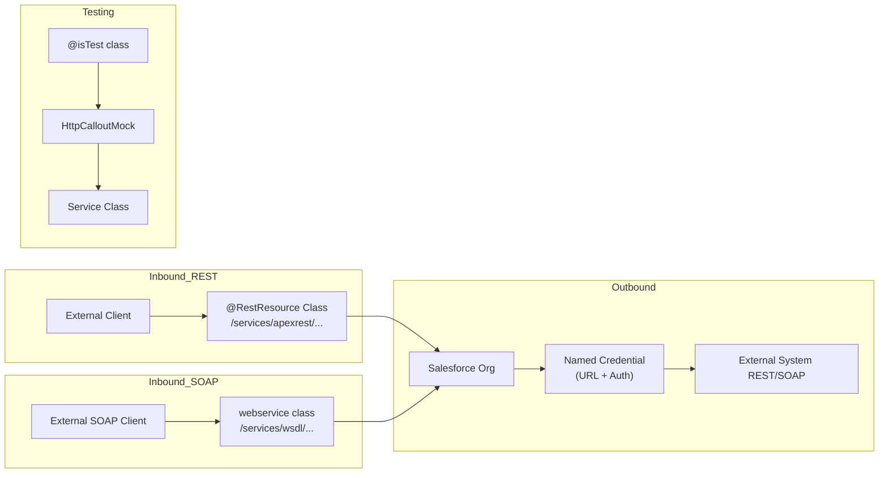

# Apex Integration Patterns

## Exam Domain
Integration — 21% of exam weight

## Foundations

Integration in Salesforce means two things: (1) Salesforce calling out to an external system (outbound), and (2) an external system calling into Salesforce (inbound). PDII covers both at depth — the mechanics of HTTP callouts, the Named Credentials system, certificate authentication, and most importantly, *when to use which pattern*.

If you've written a basic `HttpRequest`/`HttpResponse` in PDI, you're at the starting point. PDII asks: how do you handle authentication securely? How do you mock callouts in tests? How do you design for retry, idempotency, and error handling? How do you choose between REST, SOAP, and Streaming?

Core vocabulary you must be clear on:
- **Outbound callout**: Salesforce initiates. Uses `Http`, `HttpRequest`, `HttpResponse`.
- **Inbound REST**: External system calls Salesforce. Uses `@RestResource` annotation on an Apex class.
- **Inbound SOAP**: External system calls Salesforce SOAP endpoint. Uses `webservice` keyword.
- **Named Credential**: Salesforce-managed secret store for external endpoint URL and auth credentials — the correct way to handle credentials instead of hardcoding.

---

## Core Concepts

### Outbound REST Callouts — Full Pattern

```apex
public class ExternalSystemService {

    // Named Credential endpoint — credentials NOT in code
    private static final String ENDPOINT = 'callout:My_External_API';

    public static Map<String, Object> getAccountData(String externalId) {
        Http http = new Http();
        HttpRequest req = new HttpRequest();
        req.setEndpoint(ENDPOINT + '/accounts/' + EncodingUtil.urlEncode(externalId, 'UTF-8'));
        req.setMethod('GET');
        req.setHeader('Content-Type', 'application/json');
        req.setHeader('Accept', 'application/json');
        req.setTimeout(30000); // 30 seconds; max is 120000ms

        HttpResponse res;
        try {
            res = http.send(req);
        } catch (System.CalloutException e) {
            // Network-level failure (timeout, DNS failure)
            throw new IntegrationException('Callout failed: ' + e.getMessage(), e);
        }

        if (res.getStatusCode() == 200) {
            return (Map<String, Object>) JSON.deserializeUntyped(res.getBody());
        } else if (res.getStatusCode() == 404) {
            return null; // Account not found externally — valid state
        } else {
            throw new IntegrationException(
                'Unexpected response: ' + res.getStatusCode() + ' ' + res.getStatus()
            );
        }
    }

    public static void upsertAccountData(String externalId, Account acc) {
        Http http = new Http();
        HttpRequest req = new HttpRequest();
        req.setEndpoint(ENDPOINT + '/accounts/' + externalId);
        req.setMethod('PUT');
        req.setHeader('Content-Type', 'application/json');
        req.setBody(JSON.serialize(new Map<String, Object>{
            'name'     => acc.Name,
            'industry' => acc.Industry,
            'revenue'  => acc.AnnualRevenue
        }));
        HttpResponse res = http.send(req);
        if (res.getStatusCode() != 200 && res.getStatusCode() != 201) {
            throw new IntegrationException('Upsert failed: ' + res.getStatusCode());
        }
    }

    public class IntegrationException extends Exception {}
}
```

### Inbound REST — Apex REST Resources

```apex
@RestResource(urlMapping='/accounts/*')
global with sharing class AccountRestResource {

    @HttpGet
    global static Account getAccount() {
        RestRequest req = RestContext.request;
        String accountId = req.requestURI.substring(req.requestURI.lastIndexOf('/') + 1);

        try {
            return [
                SELECT Id, Name, Industry, AnnualRevenue
                FROM Account
                WHERE Id = :accountId
                WITH SECURITY_ENFORCED
                LIMIT 1
            ];
        } catch (QueryException e) {
            RestContext.response.statusCode = 404;
            return null;
        }
    }

    @HttpPost
    global static String createAccount(String name, String industry, Decimal revenue) {
        Account acc = new Account(
            Name = name,
            Industry = industry,
            AnnualRevenue = revenue
        );

        // Always check CRUD permissions when accepting external input
        if (!Schema.sObjectType.Account.isCreateable()) {
            RestContext.response.statusCode = 403;
            return 'Insufficient permissions';
        }

        insert acc;
        RestContext.response.statusCode = 201;
        return acc.Id;
    }

    @HttpPatch
    global static void updateAccount(String name, Decimal revenue) {
        RestRequest req = RestContext.request;
        String accountId = req.requestURI.substring(req.requestURI.lastIndexOf('/') + 1);
        Account acc = new Account(Id = accountId, Name = name, AnnualRevenue = revenue);
        update acc;
    }

    @HttpDelete
    global static void deleteAccount() {
        RestRequest req = RestContext.request;
        String accountId = req.requestURI.substring(req.requestURI.lastIndexOf('/') + 1);
        Account acc = [SELECT Id FROM Account WHERE Id = :accountId];
        delete acc;
    }
}
// URL: /services/apexrest/accounts/001xx000000001
```

### Inbound SOAP — Web Services

```apex
global class AccountWebService {

    global class AccountResult {
        webservice String accountId;
        webservice String status;
        webservice String errorMessage;
    }

    webservice static AccountResult createAccount(String name, String industry) {
        AccountResult result = new AccountResult();
        try {
            Account acc = new Account(Name = name, Industry = industry);
            insert acc;
            result.accountId = acc.Id;
            result.status = 'SUCCESS';
        } catch (DmlException e) {
            result.status = 'ERROR';
            result.errorMessage = e.getMessage();
        }
        return result;
    }
}
// WSDL: /services/wsdl/class/AccountWebService
```

### JSON Parsing Patterns

```apex
// Pattern 1: Typed deserialization — when structure is known
public class ExternalAccount {
    public String id;
    public String name;
    public String industry;
    public Double revenue;
    public List<ExternalContact> contacts;
}
public class ExternalContact {
    public String email;
    public String firstName;
    public String lastName;
}

ExternalAccount ext = (ExternalAccount) JSON.deserialize(responseBody, ExternalAccount.class);

// Pattern 2: Untyped — when structure is dynamic or partially unknown
Map<String, Object> parsed = (Map<String, Object>) JSON.deserializeUntyped(responseBody);
String name = (String) parsed.get('name');
List<Object> contacts = (List<Object>) parsed.get('contacts');
for (Object c : contacts) {
    Map<String, Object> contact = (Map<String, Object>) c;
    String email = (String) contact.get('email');
}

// Pattern 3: JSON.Generator for controlled serialization
JSONGenerator gen = JSON.createGenerator(true); // true = pretty print
gen.writeStartObject();
gen.writeStringField('accountId', acc.Id);
gen.writeStringField('name', acc.Name);
gen.writeNumberField('revenue', acc.AnnualRevenue);
gen.writeEndObject();
String json = gen.getAsString();
```

### HttpCalloutMock — Test Mocking

```apex
// Mock implementation
@isTest
global class ExternalSystemMock implements HttpCalloutMock {
    private Integer statusCode;
    private String body;

    global ExternalSystemMock(Integer statusCode, String body) {
        this.statusCode = statusCode;
        this.body = body;
    }

    global HttpResponse respond(HttpRequest req) {
        HttpResponse res = new HttpResponse();
        res.setHeader('Content-Type', 'application/json');
        res.setStatusCode(statusCode);
        res.setBody(body);
        return res;
    }
}

// Multi-callout mock — for tests with multiple callouts in one transaction
@isTest
global class MultiCalloutMock implements HttpCalloutMock {
    private Map<String, HttpResponse> responses = new Map<String, HttpResponse>();

    global void addResponse(String endpoint, Integer code, String body) {
        HttpResponse res = new HttpResponse();
        res.setStatusCode(code);
        res.setBody(body);
        responses.put(endpoint, res);
    }

    global HttpResponse respond(HttpRequest req) {
        String endpoint = req.getEndpoint();
        if (responses.containsKey(endpoint)) return responses.get(endpoint);
        throw new IllegalArgumentException('No mock for endpoint: ' + endpoint);
    }
}

// Test usage
@isTest
static void testGetAccountData() {
    String mockBody = '{"id":"EXT-001","name":"Acme Corp","industry":"Technology","revenue":1000000}';
    Test.setMock(HttpCalloutMock.class, new ExternalSystemMock(200, mockBody));

    Test.startTest();
    Map<String, Object> result = ExternalSystemService.getAccountData('EXT-001');
    Test.stopTest();

    System.assertEquals('Acme Corp', result.get('name'));
    System.assertEquals(1000000.0, result.get('revenue'));
}
```

---

## Advanced Patterns

### Composite REST API — Multiple Records in One Round Trip

The Composite API allows up to 25 subrequests in one HTTP call, reducing callout count for complex operations.

```apex
// Composite request body structure
Map<String, Object> compositeRequest = new Map<String, Object>{
    'allOrNone' => true, // roll back all if any fails
    'compositeRequest' => new List<Object>{
        new Map<String, Object>{
            'method' => 'POST',
            'url' => '/services/data/v58.0/sobjects/Account',
            'referenceId' => 'newAccount',
            'body' => new Map<String, Object>{ 'Name' => 'New Corp', 'Industry' => 'Tech' }
        },
        new Map<String, Object>{
            'method' => 'POST',
            'url' => '/services/data/v58.0/sobjects/Contact',
            'referenceId' => 'newContact',
            'body' => new Map<String, Object>{
                'LastName' => 'Smith',
                'AccountId' => '@{newAccount.id}' // reference previous response
            }
        }
    }
};
```

### Retry with Exponential Backoff (Queueable Pattern)

```apex
public class IntegrationRetryJob implements System.Queueable, Database.AllowsCallouts {
    private String externalId;
    private Integer attempt;
    private static final Integer MAX_ATTEMPTS = 3;

    public IntegrationRetryJob(String externalId, Integer attempt) {
        this.externalId = externalId;
        this.attempt = attempt;
    }

    public void execute(System.QueueableContext ctx) {
        try {
            ExternalSystemService.getAccountData(externalId);
            // Success — update sync status
        } catch (ExternalSystemService.IntegrationException e) {
            if (attempt < MAX_ATTEMPTS) {
                // Chain retry with backoff (implemented via delay in next enqueue)
                System.enqueueJob(new IntegrationRetryJob(externalId, attempt + 1));
            } else {
                // Log permanent failure
                insert new Integration_Error__c(
                    External_Id__c = externalId,
                    Error_Message__c = e.getMessage(),
                    Final_Attempt__c = true
                );
            }
        }
    }
}
```

---

## PTA / SA Relevance

### When This Comes Up in Engagements
Integration is the #1 source of production failures in Salesforce implementations. When advising customers on integration architecture, the key question is not "can we do this?" but "how do we handle failure?" Callout timeouts, 429 rate limits, and downstream system unavailability are guaranteed events in production.

As a PTA reviewing a partner's integration design, you should ask:
- Are credentials in Named Credentials or hardcoded in code / custom settings?
- How are callout failures handled — silent failure, retry, dead-letter queue?
- Are callouts happening synchronously from triggers, or are they properly async?
- Is the integration idempotent — safe to retry without creating duplicates?

### Common Partner Mistakes
- **Hardcoded credentials in Custom Settings or Apex** — a security violation and a rotation nightmare. Named Credentials is the only acceptable production pattern.
- **Synchronous callouts in triggers** — trigger context has a 10-second limit; any external API slower than ~3 seconds will cause timeouts in production.
- **No error handling after `http.send()`** — assuming the callout always returns 200. Any non-200 response silently succeeds, corrupting data.
- **Missing `Test.setMock()`** — tests that call actual endpoints will fail with "callout not allowed in test." Partners add `if (!Test.isRunningTest())` guards instead of proper mocks — a test anti-pattern.
- **Parsing JSON with hardcoded array indices** — `(String) ((List<Object>) parsed.get('items'))[0]` — throws if the response structure changes.

### Enterprise Scale Considerations
At enterprise scale, integration architecture shifts from "callout" to "event-driven":
- Point-to-point callouts don't scale across 10+ integrated systems — each system knows about every other
- Platform Events / MuleSoft / event bus patterns decouple systems
- Composite API reduces callout count when synchronous integration is necessary
- Bulkhead pattern: isolate integration failures from core business transactions using Platform Events or async Queueable chains

---

## Architecture



**Limitations:**
- Max 100 callouts per Apex transaction
- Max callout timeout: 120,000 ms (120 seconds)
- Named Credentials support: Basic Auth, OAuth 2.0, JWT, and Certificate auth
- `@RestResource` URL mappings must be globally unique in the org — no two classes can share a URL path
- Inbound REST requires authentication (OAuth, Session ID) — anonymous access not possible via Apex REST

---

## Key Facts to Memorize

- `callout:Named_Credential_Name` is the endpoint prefix for Named Credential callouts
- `Http`, `HttpRequest`, `HttpResponse` are the three classes for outbound callouts
- `@RestResource(urlMapping='/path/*')` exposes Apex as a REST resource at `/services/apexrest/path/`
- `@HttpGet`, `@HttpPost`, `@HttpPut`, `@HttpPatch`, `@HttpDelete` annotate REST handler methods — must be `global static`
- `webservice static` keyword exposes an Apex method in a WSDL
- `RestContext.request` and `RestContext.response` access inbound request/response in Apex REST
- `Test.setMock(HttpCalloutMock.class, mockInstance)` — must be called before any test that exercises code with callouts
- `JSON.deserialize(body, Type.class)` — typed deserialization; throws if JSON doesn't match
- `JSON.deserializeUntyped(body)` — returns `Object` (Map or List); cast manually
- Max callouts per transaction: 100 (both sync and async contexts)
- `req.setTimeout(milliseconds)` — default is 10,000ms; max is 120,000ms

---

## Exam Traps

- "Named Credentials can be used for both outbound and inbound authentication" — Partly false. Named Credentials handle **outbound** callout authentication. Inbound authentication is handled by Connected Apps + OAuth.
- "A `webservice` method can be `private` or `protected`" — False. `webservice` methods must be `global`.
- "You can make callouts directly in trigger context without @future or Queueable" — False. Callouts are not allowed in trigger context without `@future(callout=true)` or Queueable with `Database.AllowsCallouts`.
- "HttpCalloutMock is called automatically for all tests" — False. You must explicitly call `Test.setMock()` in the test method before the code under test runs.
- "`JSON.deserialize` returns null if a JSON field is missing" — Partially true. Missing fields map to null in Apex, but if the JSON structure is fundamentally different (e.g., array vs object), it throws a `JSONException`.

---

## Practice Questions

**Q:** A Salesforce org needs to call an external REST API that requires OAuth 2.0 client credentials authentication. The client ID and secret must not be visible in Apex code or custom settings. What is the correct approach?

**A:** Use a Named Credential with OAuth 2.0 protocol configured. Named Credentials store the endpoint URL and authentication credentials in Salesforce's encrypted credential store. The Apex code references the Named Credential by name using `callout:Named_Credential_Name` — the actual client ID/secret are never in the code. This satisfies both the security requirement (credentials not in code) and the technical requirement (OAuth 2.0 flow handled automatically).

---

**Q:** An Apex REST resource is exposed at `@RestResource(urlMapping='/customers/*')`. An external system calls `GET /services/apexrest/customers/00300000000ABC`. How does the Apex code retrieve the record ID from the URL?

**A:** Via `RestContext.request.requestURI`, which contains the full path. The ID is extracted with: `String id = RestContext.request.requestURI.substring(RestContext.request.requestURI.lastIndexOf('/') + 1);` This gives `00300000000ABC`. The `*` wildcard in the URL mapping captures everything after `/customers/`.
