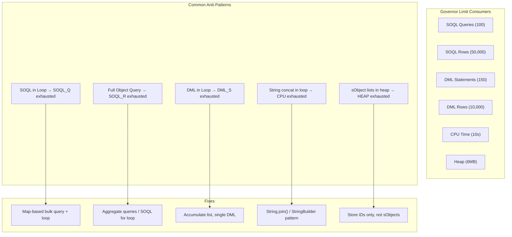

# Apex Performance Optimization

## Exam Domain
Apex & Data Management — 27% of exam weight

## Foundations

Performance in Apex is primarily about governor limit compliance, not raw execution speed. A query that returns 50,001 rows doesn't just run slowly — it throws a hard `LimitException` and rolls back your entire transaction. Understanding performance in this context means understanding which operations consume which limits, and designing your data access patterns to stay well below those limits at the volumes you expect in 3–5 years, not just today.

Key mental model: **every operation in Apex that touches the database costs a limit unit**. SOQL queries cost from the 100-query limit. Rows cost from the 50,000-row limit. DML statements cost from the 150-DML limit. DML rows cost from the 10,000-row limit. CPU costs from the 10-second limit. The art of Apex performance is batching operations to spread these costs correctly.

The most common PDII scenario question type: "A developer runs into LimitException in production with 10,000 records. Which change fixes this?" — and the answer requires recognizing a SOQL-in-loop pattern or an unbulkified DML.

---

## Core Concepts

### SOQL Optimization — Avoiding Common Killers

**SOQL in a loop — the #1 killer:**
```apex
// BAD — one SOQL query per account = hits 100-query limit fast
for (Account acc : accounts) {
    List<Contact> contacts = [SELECT Id FROM Contact WHERE AccountId = :acc.Id]; // QUERY IN LOOP!
    processContacts(contacts);
}

// GOOD — one query, all contacts at once
Map<Id, List<Contact>> contactsByAccount = new Map<Id, List<Contact>>();
for (Contact c : [SELECT Id, AccountId FROM Contact WHERE AccountId IN :accountIds]) {
    if (!contactsByAccount.containsKey(c.AccountId)) {
        contactsByAccount.put(c.AccountId, new List<Contact>());
    }
    contactsByAccount.get(c.AccountId).add(c);
}
for (Account acc : accounts) {
    List<Contact> contacts = contactsByAccount.get(acc.Id) ?? new List<Contact>();
    processContacts(contacts);
}
```

**Aggregate queries instead of row counts:**
```apex
// BAD — fetches all rows just to count them (50k row limit risk)
Integer count = [SELECT Id FROM Opportunity WHERE AccountId = :accId].size();

// GOOD — aggregate query returns only one row
AggregateResult[] results = [
    SELECT COUNT(Id) cnt, SUM(Amount) total
    FROM Opportunity
    WHERE AccountId = :accId
];
Integer count = (Integer) results[0].get('cnt');
Decimal total = (Decimal) results[0].get('total');
```

**Selective queries and indexes:**
A SOQL query is "selective" if its WHERE clause filters on an indexed field and the filter is selective enough (typically < 10% of records) for Salesforce to use the index. Non-selective queries on large objects trigger full table scans and cause timeout errors ("System.QueryException: Timeout").

Automatically indexed fields:
- `Id` (always)
- `Name` (standard)
- `OwnerId`
- External ID fields (if marked "Unique" or "External ID")
- Fields in custom indexes (create via Salesforce Support or "Custom Index" feature)
- `CreatedDate`, `SystemModstamp`
- RecordType, Master-detail relationship fields

```apex
// BAD — filters only on non-indexed fields
[SELECT Id FROM Account WHERE AnnualRevenue > 1000000 AND Industry = 'Tech']

// BETTER — add an indexed filter
[SELECT Id FROM Account WHERE OwnerId = :userId AND Industry = 'Tech']

// BEST for large objects — ensure selective filter is first
[SELECT Id FROM Account WHERE External_Id__c = :extId] // External ID is indexed
```

**SOQL for loops — avoiding heap explosion:**
```apex
// BAD — loads all records into memory at once (heap limit risk at 50k+ records)
List<Account> accounts = [SELECT Id, Name FROM Account WHERE Industry = 'Tech'];

// GOOD — SOQL for loop streams records in chunks (200 at a time), never fully loads into heap
for (List<Account> batch : [SELECT Id, Name FROM Account WHERE Industry = 'Tech']) {
    // each 'batch' is 200 records — heap never holds all records at once
    processBatch(batch);
}

// Also valid — single record iteration (less common but valid)
for (Account acc : [SELECT Id, Name FROM Account WHERE Industry = 'Tech']) {
    processAccount(acc); // one at a time
}
```

### DML Optimization

**DML in a loop — the #2 killer:**
```apex
// BAD — one DML per record = hits 150-DML limit
for (Account acc : accounts) {
    acc.Rating = 'Hot';
    update acc; // DML IN LOOP!
}

// GOOD — accumulate then bulk DML
List<Account> toUpdate = new List<Account>();
for (Account acc : accounts) {
    acc.Rating = 'Hot';
    toUpdate.add(acc);
}
update toUpdate; // one DML, 10,000 rows possible
```

**Database.insert with partial success:**
```apex
// Without allOrNone (default true) — fails entire list if one record fails
insert accounts;

// With Database.insert and allOrNone=false — partial success allowed
Database.SaveResult[] results = Database.insert(accounts, false);
for (Integer i = 0; i < results.size(); i++) {
    if (!results[i].isSuccess()) {
        Database.Error err = results[i].getErrors()[0];
        // Log error, handle specific record failure
        System.debug('Failed: ' + accounts[i].Id + ' - ' + err.getMessage());
    }
}
```

**Upsert with External IDs:**
```apex
// Upsert using external ID — creates if not exists, updates if found
List<Account> extAccounts = new List<Account>();
for (Map<String, Object> data : externalData) {
    extAccounts.add(new Account(
        External_Id__c = (String) data.get('id'),
        Name = (String) data.get('name')
    ));
}
upsert extAccounts Account.External_Id__c; // one DML, handles both insert and update
```

### CPU Time Optimization

CPU time counts all Apex execution — loops, string operations, JSON serialization. At 10 seconds (sync), complex processing of large collections hits this limit.

```apex
// BAD — string concatenation in loop (O(n²) behavior)
String result = '';
for (String s : largeList) {
    result += s + ','; // creates new String object each iteration
}

// GOOD — use List.join() or String.join()
String result = String.join(largeList, ','); // O(n) — single allocation

// BAD — re-query inside a loop for metadata
for (Account acc : accounts) {
    Schema.DescribeFieldResult fieldDesc =
        Schema.SObjectType.Account.fields.getMap().get('Industry').getDescribe(); // expensive per iteration
}

// GOOD — cache describe results outside the loop
Schema.DescribeFieldResult industryDesc =
    Schema.SObjectType.Account.fields.getMap().get('Industry').getDescribe();
for (Account acc : accounts) {
    // use industryDesc — fetched once
}
```

### Heap Size Optimization

```apex
// BAD — storing full sObjects when only IDs needed
Map<Id, Account> largeMap = new Map<Id, Account>(
    [SELECT Id, Name, Industry, /* 50 fields */ FROM Account WHERE ...]
); // entire sObject graph in heap

// GOOD — store only what you need
Set<Id> accountIds = new Map<Id, Account>(
    [SELECT Id FROM Account WHERE Industry = :industry]
).keySet();

// BAD — building result strings in heap
List<String> output = new List<String>();
for (Account acc : accounts) {
    output.add(JSON.serialize(acc)); // full serialized JSON per record in heap
}

// GOOD — process and discard, or use streaming approaches
// Consider batch Apex which gives fresh heap per execute() chunk
```

### Governor Limit Monitoring

```apex
// Query remaining limits — useful in complex transactions
System.debug('SOQL queries: ' + Limits.getQueries() + '/' + Limits.getLimitQueries());
System.debug('DML rows: ' + Limits.getDmlRows() + '/' + Limits.getLimitDmlRows());
System.debug('CPU ms: ' + Limits.getCpuTime() + '/' + Limits.getLimitCpuTime());
System.debug('Heap bytes: ' + Limits.getHeapSize() + '/' + Limits.getLimitHeapSize());

// Use in assertions in test to prevent regression
@isTest
static void testBulkifiedTrigger() {
    List<Account> accounts = new List<Account>();
    for (Integer i = 0; i < 200; i++) {
        accounts.add(new Account(Name = 'Test ' + i));
    }
    Test.startTest();
    insert accounts;
    Test.stopTest();

    // Assert that bulk insert consumed <= 3 SOQL queries (not one per record)
    System.assert(Limits.getQueries() <= 3, 'Too many SOQL queries: ' + Limits.getQueries());
}
```

---

## Advanced Patterns

### Selector Optimization with Field Sets
```apex
// Dynamic field selection — adds fields without selector code change
public List<Account> selectForDisplay(Set<Id> ids) {
    List<Schema.FieldSetMember> fsm =
        SObjectType.Account.FieldSets.Display_Fields.getFields();
    List<String> fields = new List<String>{ 'Id', 'Name' };
    for (Schema.FieldSetMember f : fsm) {
        fields.add(f.getFieldPath());
    }
    String query = 'SELECT ' + String.join(fields, ',') +
                   ' FROM Account WHERE Id IN :ids WITH SECURITY_ENFORCED';
    return (List<Account>) Database.query(query);
}
```

### Large Result Set Processing — SOQL For Loop Pattern
```apex
public void processAllAccounts() {
    Integer processed = 0;
    for (List<Account> batch : [
        SELECT Id, Name, Industry
        FROM Account
        ORDER BY CreatedDate
    ]) {
        // Heap never holds all accounts — only current 200-record batch
        for (Account acc : batch) {
            // process each account
            processed++;
        }
        // DML in batches — accumulate then flush
        if (Math.mod(processed, 200) == 0) {
            // update accumulated records
        }
    }
}
```

---

## PTA / SA Relevance

### When This Comes Up in Engagements
Performance problems are a leading indicator of technical debt and a common trigger for re-implementation projects. When a customer says "our nightly job started failing last month," the cause is almost always a governor limit hit caused by data growth — the code was fine at 100K records, fails at 1M.

As a PTA, you use this knowledge in:
- **Org health assessments**: Ask for Apex exception logs. SOQL-in-loop LimitExceptions appear repeatedly and indicate systemic bulkification debt.
- **Pre-migration reviews**: Before moving from Salesforce Classic to Lightning or from one org to another, performance anti-patterns in triggers are blockers.
- **Capacity planning conversations**: "Your current Batch job takes 2 hours for 1M records. At your projected growth of 20% per year, you'll hit the 5-concurrent-job limit wall in 18 months without re-architecture."

### Common Partner Mistakes
- **Not testing with bulk data** — tests use single records, code passes 75% coverage, but fails in production when a Flow kicks off an update on 1,000 records.
- **SOQL in triggers without Maps** — extremely common, immediately visible in any code review.
- **Not using `Database.insert(list, false)` for integration data loads** — a single bad record fails the entire batch instead of being logged and skipped.
- **Using `.size()` on a SOQL query for count operations** — wastes 50k row limit quota.

### Enterprise Scale Considerations
At 10M+ records on key objects (Account, Contact, Case):
- Any filter that isn't on an indexed field causes a full-table scan — request custom indexes through Salesforce Support for high-cardinality filter fields
- `OFFSET` in SOQL queries doesn't work at scale — max OFFSET is 2,000. Use Date or Id-based pagination instead.
- Skinny tables (Salesforce platform feature): a copy of a subset of columns on a large object, stored separately for fast reads. Salesforce Support creates these. Dramatically speeds up reports and queries on a specific set of columns.
- External IDs enable upsert from external systems without pre-querying for existing IDs — critical for bulk data integration

---

## Architecture



**Limitations:**
- Custom indexes must be requested through Salesforce Support — they are not self-service
- Skinny tables are only created by Salesforce Support and are not available in all editions
- `OFFSET` limit of 2,000 means OFFSET-based pagination is not viable for large datasets
- SOQL for loops still count each record against the 50,000-row limit — they only help with heap, not row count

---

## Key Facts to Memorize

- SOQL queries per transaction: 100 (sync), 200 (async)
- SOQL rows returned per transaction: 50,000 (both sync and async)
- DML statements per transaction: 150 (both)
- DML rows per transaction: 10,000 (both)
- CPU time: 10s (sync), 60s (async)
- Heap size: 6 MB (sync), 12 MB (async)
- `Limits.getQueries()` returns current SOQL count; `Limits.getLimitQueries()` returns max
- SOQL for loop iterates in chunks of **200 records** by default
- `Database.insert(list, false)` allows partial success — returns `SaveResult[]`
- `upsert list ExternalId__c` performs upsert in a single DML using external ID field
- Aggregate query columns accessed via `result.get('alias')` — alias is required for non-standard aggregates
- `COUNT_DISTINCT(field)` is valid in SOQL aggregate queries
- `OFFSET` maximum value: 2,000 rows
- Custom indexes on formula fields are NOT supported
- Selective query threshold: approximately 10% of total records (varies by object size)

---

## Exam Traps

- "SOQL for loops eliminate all governor limit concerns" — False. They help with heap memory but rows still count against the 50,000-row limit.
- "Database.insert(list, true) is the same as insert list" — True. `allOrNone=true` is the default behavior of `insert`.
- "You can use OFFSET for pagination across all result sizes" — False. OFFSET is limited to 2,000. Use WHERE Id > :lastId or date-based pagination for large sets.
- "Aggregate queries count as multiple rows consumed against the 50,000-row limit" — False. An aggregate query returns one row (the aggregate result), regardless of how many records were aggregated.
- "Adding WITH SECURITY_ENFORCED improves query performance" — False. It adds FLS checking overhead; it does not improve performance. It improves security.
- "String.join() is equivalent in performance to string concatenation in a loop" — False. `String.join()` is O(n); concatenation in a loop is O(n²) due to intermediate String object creation.

---

## Practice Questions

**Q:** A developer writes a trigger on Opportunity that runs a SOQL query per record to find related line items. In development with 10 records it works fine. In production during a bulk import of 500 opportunities it fails. What is the error and fix?

**A:** Error: `System.LimitException: Too many SOQL queries: 101`. Fix: move the SOQL outside the loop. Build a Set of Opportunity IDs from `Trigger.new`, query all related OpportunityLineItems in one query (`WHERE OpportunityId IN :oppIds`), and build a Map<Id, List<OpportunityLineItem>> for lookup inside the loop. This reduces SOQL queries from N (one per record) to 1 (one for all records).

---

**Q:** Which SOQL query correctly counts the total number of closed-won opportunities without consuming row quota unnecessarily?

A) `[SELECT Id FROM Opportunity WHERE StageName = 'Closed Won'].size()`  
B) `[SELECT COUNT() FROM Opportunity WHERE StageName = 'Closed Won']`  
C) `[SELECT COUNT(Id) cnt FROM Opportunity WHERE StageName = 'Closed Won'][0].get('cnt')`  
D) Both B and C are correct

**A:** D — Both B and C are correct aggregate approaches. `COUNT()` (with no field) returns an Integer directly via `getNumRecords()` on the query result. `COUNT(Id) cnt` returns an `AggregateResult[]` with the count accessible via `.get('cnt')`. Both consume only 1 row of the 50,000-row limit. Option A consumes 1 row per matching opportunity.
