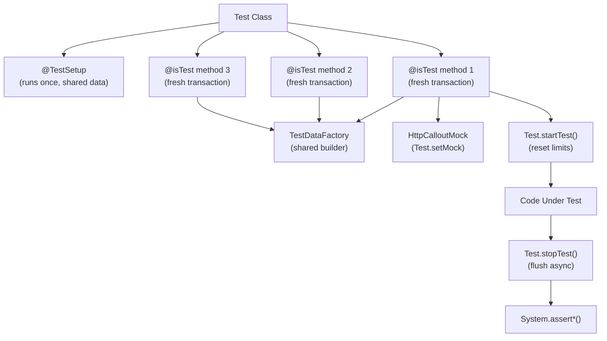

# Advanced Testing Patterns

## Exam Domain
Testing — 16% of exam weight

## Foundations

PDI testing is about hitting 75% code coverage. PDII testing is about building a test suite that actually catches bugs — a suite where green tests mean the code works correctly, not just that 75% of lines were touched.

The PDII exam tests whether you know: how to write tests that are fast, isolated, and reliable; how to mock callouts and platform events; how to use `@TestSetup` correctly; and how to design a test data factory that multiple test classes share without creating coupling.

Key distinction: **code coverage is a floor, not a goal**. A test with `System.assert(true)` gives coverage but catches nothing. PDII-level tests assert specific outcomes, test boundary conditions, and test failure paths — not just happy paths.

Required concepts for the exam:
- `@TestSetup` — what it does and when it rolls back
- `Test.startTest()` / `Test.stopTest()` — purpose and timing of governor limit resets
- `HttpCalloutMock` — the only correct way to test code that makes callouts
- `Test.setMock()` — registration and scope
- Test isolation — why seeAllData=true is banned in professional code
- Bulk testing — why every test must run at 200 records, not 1

---

## Core Concepts

### @TestSetup — Shared Test Data

`@TestSetup` creates test data once per test class, then each test method gets a fresh copy (rolled back between methods). This is dramatically faster than creating data in each test method.

```apex
@isTest
private class AccountServiceTest {

    @TestSetup
    static void setup() {
        // Runs ONCE per test class — data rolled back between test methods
        // but the original insert is fast because it only runs once
        List<Account> accounts = new List<Account>();
        for (Integer i = 0; i < 200; i++) {
            accounts.add(new Account(
                Name = 'Test Account ' + i,
                Industry = Math.mod(i, 2) == 0 ? 'Technology' : 'Finance',
                AnnualRevenue = 1000000 * (i + 1)
            ));
        }
        insert accounts;

        List<Contact> contacts = new List<Contact>();
        for (Account acc : accounts) {
            contacts.add(new Contact(
                LastName = 'Test Contact',
                AccountId = acc.Id,
                Email = 'test@' + acc.Name.replace(' ', '') + '.com'
            ));
        }
        insert contacts;
    }

    @isTest
    static void testUpdateAllTech() {
        // Each test method gets its own transaction — @TestSetup data is fresh (rolled back from previous test)
        List<Account> techAccounts = [
            SELECT Id, Industry FROM Account WHERE Industry = 'Technology'
        ];
        // Assert we got the expected 100 tech accounts from setup
        System.assertEquals(100, techAccounts.size(), 'Should have 100 tech accounts');

        Test.startTest();
        AccountService.markTechAccountsAsHot(new Map<Id, Account>(techAccounts).keySet());
        Test.stopTest();

        List<Account> updated = [SELECT Id, Rating FROM Account WHERE Industry = 'Technology'];
        for (Account acc : updated) {
            System.assertEquals('Hot', acc.Rating, 'Tech accounts should be Hot');
        }
    }

    @isTest
    static void testUpdateAllFinance() {
        // This test gets the SAME @TestSetup data — but changes from testUpdateAllTech are rolled back
        List<Account> finAccounts = [SELECT Id FROM Account WHERE Industry = 'Finance'];
        System.assertEquals(100, finAccounts.size());
        // testUpdateAllTech's Rating changes are NOT visible here — isolation works
    }
}
```

**Critical @TestSetup rules:**
- Cannot use `@TestSetup` methods with `seeAllData=true` — mutually exclusive
- Changes made during `@TestSetup` are visible to all `@isTest` methods in the class
- Each `@isTest` method starts with a fresh transaction — changes made in one test do not persist to the next
- `@TestSetup` cannot be called from a test method — it is invoked automatically
- If `@TestSetup` throws an exception, all tests in the class fail

### Test Data Factory Pattern

A separate class that builds test records, used across multiple test classes to avoid duplication and ensure consistent test data.

```apex
@isTest
public class TestDataFactory {

    public static Account createAccount(Boolean doInsert) {
        return createAccount('Test Account', 'Technology', 1000000, doInsert);
    }

    public static Account createAccount(
        String name,
        String industry,
        Decimal revenue,
        Boolean doInsert
    ) {
        Account acc = new Account(
            Name = name,
            Industry = industry,
            AnnualRevenue = revenue,
            Rating = 'Warm'
        );
        if (doInsert) insert acc;
        return acc;
    }

    public static List<Account> createAccounts(Integer count, Boolean doInsert) {
        List<Account> accounts = new List<Account>();
        for (Integer i = 0; i < count; i++) {
            accounts.add(new Account(
                Name = 'Test Account ' + i,
                Industry = 'Technology'
            ));
        }
        if (doInsert) insert accounts;
        return accounts;
    }

    public static Contact createContact(Id accountId, Boolean doInsert) {
        Contact c = new Contact(
            LastName = 'TestContact',
            AccountId = accountId,
            Email = 'test' + System.currentTimeMillis() + '@test.com'
        );
        if (doInsert) insert c;
        return c;
    }

    public static Opportunity createOpportunity(Id accountId, String stage, Decimal amount, Boolean doInsert) {
        Opportunity opp = new Opportunity(
            Name = 'Test Opportunity',
            AccountId = accountId,
            StageName = stage,
            Amount = amount,
            CloseDate = Date.today().addDays(30)
        );
        if (doInsert) insert opp;
        return opp;
    }
}

// Usage in tests:
@isTest
static void testAccountCreation() {
    Account acc = TestDataFactory.createAccount(true);
    // Test code here
}
```

### Mocking Callouts — HttpCalloutMock

```apex
// Flexible mock that validates the request and returns controlled responses
@isTest
global class AccountSyncMock implements HttpCalloutMock {

    private Map<String, MockResponse> routes = new Map<String, MockResponse>();

    public AccountSyncMock() {
        // Default: success response
        routes.put('GET /accounts', new MockResponse(200, '[]'));
    }

    public AccountSyncMock withRoute(String method, String path, Integer code, String body) {
        routes.put(method + ' ' + path, new MockResponse(code, body));
        return this;
    }

    global HttpResponse respond(HttpRequest req) {
        String method = req.getMethod();
        String path = req.getEndpoint().substringAfter('callout:My_API'); // strip Named Cred prefix
        String key = method + ' ' + path;

        MockResponse mock = routes.containsKey(key) ? routes.get(key) : new MockResponse(404, '{}');
        HttpResponse res = new HttpResponse();
        res.setStatusCode(mock.code);
        res.setBody(mock.body);
        res.setHeader('Content-Type', 'application/json');
        return res;
    }

    private class MockResponse {
        Integer code; String body;
        MockResponse(Integer c, String b) { code = c; body = b; }
    }
}

// Usage
@isTest
static void testSyncSuccess() {
    AccountSyncMock mock = new AccountSyncMock()
        .withRoute('GET', '/accounts/EXT-001', 200, '{"name":"Acme","industry":"Tech"}');
    Test.setMock(HttpCalloutMock.class, mock);

    Test.startTest();
    Map<String, Object> result = ExternalSystemService.getAccountData('EXT-001');
    Test.stopTest();

    System.assertEquals('Acme', result.get('name'));
}

@isTest
static void testSyncFailure() {
    Test.setMock(HttpCalloutMock.class, new AccountSyncMock()
        .withRoute('GET', '/accounts/EXT-BAD', 500, '{"error":"Internal Server Error"}'));

    Test.startTest();
    try {
        ExternalSystemService.getAccountData('EXT-BAD');
        System.assert(false, 'Should have thrown exception');
    } catch (ExternalSystemService.IntegrationException e) {
        System.assert(e.getMessage().contains('500'));
    }
    Test.stopTest();
}
```

### Testing Triggers with Bulk Data

Every trigger test MUST include a bulk scenario (200 records) to catch SOQL-in-loop violations.

```apex
@isTest
static void testTriggerBulk200() {
    // Setup: Create 200 accounts
    List<Account> accounts = TestDataFactory.createAccounts(200, true);
    List<Id> accountIds = new List<Id>(new Map<Id, Account>(accounts).keySet());

    // Capture limit state before
    Integer queriesBefore = Limits.getQueries();

    Test.startTest();
    // Trigger update on all 200 accounts — fires trigger
    List<Account> toUpdate = [SELECT Id FROM Account WHERE Id IN :accountIds];
    for (Account acc : toUpdate) {
        acc.Rating = 'Hot';
    }
    update toUpdate;
    Test.stopTest();

    // Assert business logic — all 200 accounts updated
    List<Account> updated = [SELECT Id, Rating FROM Account WHERE Id IN :accountIds];
    System.assertEquals(200, updated.size(), 'All 200 accounts should be returned');
    for (Account acc : updated) {
        System.assertEquals('Hot', acc.Rating, 'All should have Hot rating');
    }
}
```

### Testing Async Apex

```apex
@isTest
static void testBatchApex() {
    // Create test data before startTest
    List<Opportunity> opps = new List<Opportunity>();
    Account acc = TestDataFactory.createAccount(true);
    for (Integer i = 0; i < 50; i++) {
        opps.add(TestDataFactory.createOpportunity(acc.Id, 'Closed Won', 10000, false));
    }
    insert opps;

    Test.startTest();
    // Execute batch — Test.stopTest() will run it synchronously
    Database.executeBatch(new RevenueRollupBatch(), 200);
    Test.stopTest();

    // Assert after stopTest (batch has completed)
    Account updated = [SELECT Annual_Closed_Revenue__c FROM Account WHERE Id = :acc.Id];
    System.assertEquals(500000, updated.Annual_Closed_Revenue__c);
}

@isTest
static void testQueueableWithCallout() {
    Test.setMock(HttpCalloutMock.class, new AccountSyncMock()
        .withRoute('POST', '/contacts', 201, '{"id":"C-001"}'));

    List<Id> contactIds = new List<Id>{ TestDataFactory.createContact(null, true).Id };

    Test.startTest();
    System.enqueueJob(new ContactSyncJob(contactIds, 1));
    Test.stopTest();

    // Assert results after stopTest
}
```

### Testing Platform Events

```apex
@isTest
static void testPlatformEventPublish() {
    Test.startTest();
    // Action that publishes a platform event
    insert new Account(Name = 'New Account'); // trigger publishes Account_Created__e

    // Deliver events — required to fire platform event triggers in test context
    Test.getEventBus().deliver();
    Test.stopTest();

    // Assert that the event subscriber (e.g., an Apex trigger on the event) ran
    List<Integration_Log__c> logs = [SELECT Id FROM Integration_Log__c];
    System.assertEquals(1, logs.size(), 'Event should have created one log');
}

// Testing with explicit event publish
@isTest
static void testEventSubscriberDirectly() {
    Account_Created__e event = new Account_Created__e(
        Account_Id__c = '001xx000000000A',
        Account_Name__c = 'Test Account'
    );
    Test.startTest();
    EventBus.publish(event);
    Test.getEventBus().deliver();
    Test.stopTest();
    // Assert subscriber effects
}
```

---

## Advanced Patterns

### Stub API for Unit Testing

`System.StubProvider` allows mocking Apex class dependencies without actual implementations.

```apex
// The class under test depends on an interface
public interface IExternalSystemService {
    Map<String, Object> getAccountData(String id);
}

// Stub provider — replaces implementation in tests
@isTest
public class ExternalServiceStub implements System.StubProvider {
    public Object handleMethodCall(
        Object stubbedObject,
        String stubbedMethodName,
        Type returnType,
        List<Type> listOfParamTypes,
        List<String> listOfParamNames,
        List<Object> listOfArgs
    ) {
        if (stubbedMethodName == 'getAccountData') {
            String id = (String) listOfArgs[0];
            if (id == 'EXT-001') {
                return new Map<String, Object>{ 'name' => 'Acme', 'industry' => 'Tech' };
            }
            return null;
        }
        return null;
    }
}

@isTest
static void testWithStub() {
    IExternalSystemService stub = (IExternalSystemService)
        Test.createStub(IExternalSystemService.class, new ExternalServiceStub());

    // Inject stub into class under test
    AccountProcessor processor = new AccountProcessor(stub);
    Test.startTest();
    processor.processAccount('EXT-001');
    Test.stopTest();
}
```

---

## PTA / SA Relevance

### When This Comes Up in Engagements
Test quality is a proxy for code quality. When assessing a partner delivery, ask for the test classes. Signs of poor quality:
- Test methods with no assertions (`System.assert(true)` or none at all)
- `seeAllData=true` on @isTest class — tests depend on org data, fail in scratch orgs, and hide bugs
- All tests use `new Account(Name='Test')` instead of a factory — unmaintainable at scale
- No negative/failure path tests — only happy path
- `System.debug()` as the "assertion" — `System.debug('Result: ' + acc.Rating)`

These patterns mean the org has 75%+ coverage but zero confidence that the code is correct. This is a deal risk and should be surfaced in technical due diligence.

### Common Partner Mistakes
- **Missing `Test.stopTest()`** — async code never runs, tests pass vacuously
- **`Test.setMock()` not called** — tests that skip actual callout paths with `if (!Test.isRunningTest())` checks
- **Creating data in each test method instead of @TestSetup** — slow test suites (30+ minutes for CI)
- **Asserting only success paths** — not testing what happens when the callout returns 500 or the DML throws

### Enterprise Scale Considerations
In large orgs with 1000+ test classes, test suite runtime matters for CI/CD. @TestSetup reduces DB operations. Test isolation (no seeAllData) makes tests runnable in scratch orgs and against fresh sandboxes. Factories enable rapid test data variations without copy-paste.

---

## Architecture



**Limitations:**
- `@TestSetup` cannot be used with `seeAllData=true`
- `Test.getEventBus().deliver()` must be called inside `Test.startTest()` / `Test.stopTest()` block for platform events
- Stub API (`System.StubProvider`) only works with interface-based dependencies — cannot stub concrete classes
- `Test.createStub()` requires the class to be mocked as an interface

---

## Key Facts to Memorize

- `@TestSetup` runs once per test class; data is rolled back between `@isTest` methods
- `Test.startTest()` resets governor limit counters to fresh state
- `Test.stopTest()` synchronously executes all queued async jobs (Batch, Queueable, @future, Platform Events)
- `Test.setMock(HttpCalloutMock.class, mock)` — must be called before any code that makes a callout
- `seeAllData=true` on `@isTest` annotation — never use in production code
- Code coverage minimum: 75% overall, but each class must be tested meaningfully
- `System.assertNotEquals(expected, actual, message)` — message is the 3rd parameter
- `Test.getEventBus().deliver()` — delivers pending platform events in test context
- Mock callout responds are provided by implementing `global HttpResponse respond(HttpRequest req)`
- `Database.insert(list, false)` + assert on `SaveResult[]` is the pattern for testing partial DML failures

---

## Exam Traps

- "Test.startTest() increases governor limits" — Partially true. It creates a new governor limit context — effectively double limits are available across the outer context and the test context, but the test context itself has standard limits.
- "@TestSetup data persists across all test methods in the class" — Partially true. The data is created once, but each test method gets a rolled-back copy. Changes in one test are NOT visible in another.
- "You must call Test.stopTest() for async tests to run" — True. Without stopTest(), enqueued jobs never execute in test context.
- "seeAllData=true tests run faster because they don't need to create data" — False. They run unpredictably and fail in different org environments. They're an anti-pattern, not an optimization.
- "HttpCalloutMock can only return one response per test" — False. Multi-callout mocks using the request URL or method can return different responses for different endpoints.

---

## Practice Questions

**Q:** A developer has a test class with `@TestSetup` that creates 50 Account records. Two test methods both query accounts. The first test method updates all 50 accounts. The second test method then queries accounts. How many accounts does the second test method see, and what is their `Rating` value?

**A:** The second test method sees 50 accounts, and the `Rating` values are the original values set in `@TestSetup` (not the values updated by the first test method). Each `@isTest` method runs in its own transaction, and changes made during one test method are rolled back before the next test method begins. The `@TestSetup` data is the baseline — a clean snapshot restored before each method.

---

**Q:** A Queueable job makes an HTTP callout. In a test, the job is enqueued but no mock is set. What happens?

**A:** The test fails with `System.CalloutException: You cannot make a callout from a test without registering a mock`. The fix: call `Test.setMock(HttpCalloutMock.class, myMock)` before the code that enqueues the job. The mock must be registered before `Test.startTest()` if the callout happens inside the queued job that `Test.stopTest()` will execute synchronously.
