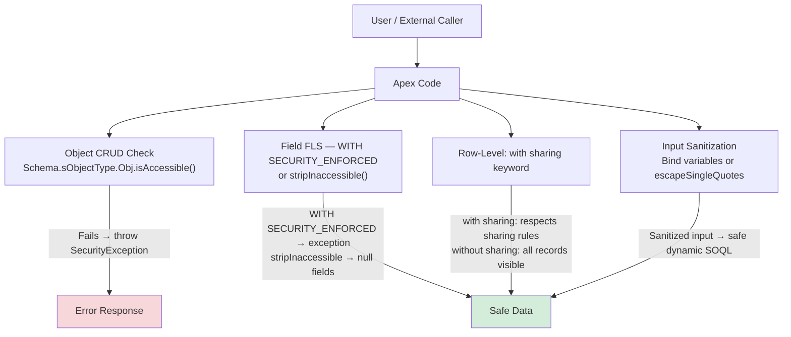

# Apex Security and SOQL Injection

## Exam Domain
Apex & Data Management — 27% of exam weight

## Foundations

Security in Apex operates at three levels: **object-level** (can the user access this object at all?), **field-level** (can the user see/edit this specific field?), and **row-level** (can the user access this specific record?). Each requires a different enforcement mechanism.

PDI taught you `with sharing` for row-level (sharing rules). PDII goes deeper:
- What does `with sharing` actually enforce, and what doesn't it catch?
- How do you enforce field-level security (FLS) in Apex?
- What is SOQL injection and how do you prevent it?
- What's the difference between `WITH SECURITY_ENFORCED` and `stripInaccessible()`?

The exam tests these distinctions with scenarios like: "A user without edit access to a field calls an Apex method that updates that field. What happens?" The answer depends entirely on which security mechanism the developer used — or didn't use.

Security bugs are among the most consequential issues in Salesforce orgs. A SOQL injection vulnerability can expose all data in the org. Missing FLS enforcement means sensitive fields can be read or written by users who shouldn't have access.

---

## Core Concepts

### Sharing Model — `with sharing`, `without sharing`, `inherited sharing`

```apex
// with sharing: enforces current user's sharing rules (org-wide defaults, sharing rules, manual shares)
// Does NOT enforce CRUD or FLS — only row-level access
public with sharing class AccountService {
    public List<Account> getMyAccounts() {
        // Returns only accounts the current user can see per sharing rules
        return [SELECT Id, Name FROM Account];
    }
}

// without sharing: bypasses sharing rules entirely — system-level access
// Use only when a legitimate business reason requires it (batch jobs, integrations)
public without sharing class AdminService {
    public List<Account> getAllAccounts() {
        return [SELECT Id, Name FROM Account]; // Returns ALL accounts regardless of sharing
    }
}

// inherited sharing: uses the sharing model of the calling context
// Best practice for service classes that are called from both sharing contexts
public inherited sharing class SharedService {
    public List<Account> getAccounts() {
        // Sharing is enforced based on who called this class
        return [SELECT Id, Name FROM Account];
    }
}
```

**The sharing keyword gap**: `with sharing` does NOT enforce CRUD or FLS. A user without read access to the Account object can still have Apex run in `with sharing` context and query accounts if the class doesn't also check CRUD/FLS.

### CRUD Enforcement

```apex
public class AccountCrudService {

    public Account createAccount(String name, String industry) {
        // Check create permission before attempting DML
        if (!Schema.sObjectType.Account.isCreateable()) {
            throw new SecurityException('Insufficient privileges to create Account.');
        }
        Account acc = new Account(Name = name, Industry = industry);
        insert acc;
        return acc;
    }

    public void updateAccount(Account acc) {
        if (!Schema.sObjectType.Account.isUpdateable()) {
            throw new SecurityException('Insufficient privileges to update Account.');
        }
        update acc;
    }

    public void deleteAccount(Id accId) {
        if (!Schema.sObjectType.Account.isDeletable()) {
            throw new SecurityException('Insufficient privileges to delete Account.');
        }
        delete new Account(Id = accId);
    }

    public List<Account> getAccounts() {
        if (!Schema.sObjectType.Account.isAccessible()) {
            throw new SecurityException('Insufficient privileges to read Account.');
        }
        return [SELECT Id, Name FROM Account WITH SECURITY_ENFORCED];
    }
}
```

### FLS Enforcement — Three Approaches

**Approach 1: WITH SECURITY_ENFORCED (declarative, exceptions)**
```apex
// Throws QueryException if current user lacks access to ANY field in SELECT
List<Account> accounts = [
    SELECT Id, Name, AnnualRevenue, Rating
    FROM Account
    WITH SECURITY_ENFORCED
];
// If user lacks FLS on AnnualRevenue: System.QueryException: Insufficient permissions
// Limitation: throws exception — user sees error instead of just hidden field
```

**Approach 2: stripInaccessible (graceful, removes inaccessible fields)**
```apex
// Strips fields the user cannot access — no exception, just removes the data
SObjectAccessDecision decision = Security.stripInaccessible(
    AccessType.READABLE,
    [SELECT Id, Name, AnnualRevenue, Rating FROM Account]
);
List<Account> safeAccounts = (List<Account>) decision.getRecords();
// AnnualRevenue is simply null if user lacks FLS — no exception

// For DML:
SObjectAccessDecision writeable = Security.stripInaccessible(
    AccessType.UPSERTABLE,
    accountsToUpdate
);
update (List<Account>) writeable.getRecords(); // Only updates fields the user can edit

// AccessType values: READABLE, CREATABLE, UPDATABLE, UPSERTABLE
```

**Approach 3: Manual field-level check**
```apex
// Fine-grained: check specific fields
Schema.DescribeFieldResult annualRevDesc =
    Schema.SObjectType.Account.fields.AnnualRevenue.getDescribe();

if (annualRevDesc.isAccessible()) {
    // Safe to read AnnualRevenue
    Decimal rev = acc.AnnualRevenue;
}
if (annualRevDesc.isUpdateable()) {
    // Safe to write AnnualRevenue
    acc.AnnualRevenue = newRevenue;
}
```

**Choosing between approaches:**

| Approach | Behavior on Violation | Best For |
|----------|----------------------|----------|
| `WITH SECURITY_ENFORCED` | Throws exception | When you want to fail loudly; LWC queries |
| `stripInaccessible` | Removes field silently | When graceful degradation is preferred |
| Manual check | Custom error/logic | When you need field-specific error messages |

### SOQL Injection — Recognition and Prevention

SOQL injection occurs when user input is concatenated into a dynamic SOQL string without sanitization.

```apex
// VULNERABLE — user controls query logic
public List<Account> searchAccounts(String searchTerm) {
    String query = 'SELECT Id, Name FROM Account WHERE Name LIKE \'%' + searchTerm + '%\'';
    return Database.query(query);
}
// Attack: searchTerm = "' OR Industry != '"
// Becomes: WHERE Name LIKE '%' OR Industry != '%'
// Returns ALL accounts — exposes all data

// ALSO VULNERABLE — user can inject ORDER BY / LIMIT manipulation
String sortField = ApexPages.currentPage().getParameters().get('sortField');
String query = 'SELECT Id, Name FROM Account ORDER BY ' + sortField;
// Attack: sortField = "Name LIMIT 1--"
// Completely changes query behavior
```

**Prevention Method 1: Bind variables (best — prevents injection entirely)**
```apex
// Safe — bind variable cannot change query structure
public List<Account> searchAccounts(String searchTerm) {
    String search = '%' + searchTerm + '%';
    return [SELECT Id, Name FROM Account WHERE Name LIKE :search];
    // User cannot inject SOQL keywords via a bind variable
}
// Note: bind variables cannot be used for field names, operators, ORDER BY, etc.
```

**Prevention Method 2: `String.escapeSingleQuotes()` (for cases where bind variables can't be used)**
```apex
public List<Account> searchAccountsDynamic(String searchTerm, String orderField) {
    // Escape user input in string value positions
    String safeTerm = String.escapeSingleQuotes(searchTerm);
    String query = 'SELECT Id, Name FROM Account WHERE Name LIKE \'%' + safeTerm + '%\'';

    // For dynamic field names: use an allowlist — NEVER accept raw field names from input
    Set<String> allowedFields = new Set<String>{ 'Name', 'AnnualRevenue', 'CreatedDate' };
    if (!allowedFields.contains(orderField)) {
        orderField = 'Name'; // Default safe value
    }
    query += ' ORDER BY ' + orderField;
    return Database.query(query);
}
// escapeSingleQuotes prevents injection in VALUE positions only
// It does NOT protect field names, operators, or other structural elements
```

**`escapeSingleQuotes()` limitations:**
- Only works for user input in string value positions
- Does NOT prevent injecting SOQL keywords like `LIMIT`, `OFFSET`, `ORDER BY`, `UNION`
- Does NOT protect field names, object names, or operators in dynamic queries
- For structural elements (field names, ORDER BY), always use an allowlist validation

### Object and Field Describe — Runtime Schema Inspection

```apex
// Validate that a field name is valid before using in dynamic SOQL
public List<SObject> safeQuery(String objectName, List<String> fieldNames) {
    // Validate object exists
    Schema.SObjectType objType = Schema.getGlobalDescribe().get(objectName);
    if (objType == null) throw new IllegalArgumentException('Invalid object: ' + objectName);

    // Validate each field exists and is accessible
    Map<String, Schema.SObjectField> fieldsMap = objType.getDescribe().fields.getMap();
    List<String> safeFields = new List<String>{ 'Id' };
    for (String fieldName : fieldNames) {
        String lowerField = fieldName.toLowerCase();
        if (fieldsMap.containsKey(lowerField)) {
            Schema.DescribeFieldResult desc = fieldsMap.get(lowerField).getDescribe();
            if (desc.isAccessible()) {
                safeFields.add(fieldName);
            }
        }
    }

    String query = 'SELECT ' + String.join(safeFields, ',') +
                   ' FROM ' + String.escapeSingleQuotes(objectName) +
                   ' WITH SECURITY_ENFORCED LIMIT 100';
    return Database.query(query);
}
```

### Encryption and Data Security

```apex
// Encrypting sensitive data with Apex Crypto class
Blob key = Crypto.generateAesKey(256); // Generate 256-bit AES key
Blob data = Blob.valueOf('Sensitive PII data');
Blob encryptedData = Crypto.encryptWithManagedIV('AES256', key, data);
Blob decryptedData = Crypto.decryptWithManagedIV('AES256', key, encryptedData);
String decryptedStr = decryptedData.toString();

// Hashing (one-way — for password storage, not encryption)
Blob hash = Crypto.generateDigest('SHA-256', Blob.valueOf('password'));
String hashHex = EncodingUtil.convertToHex(hash);

// HMAC for API signature validation
Blob hmacKey = Blob.valueOf('shared-secret-key');
Blob payload = Blob.valueOf('request-body');
Blob hmac = Crypto.generateMac('HmacSHA256', payload, hmacKey);
String signature = EncodingUtil.base64Encode(hmac);
```

---

## Advanced Patterns

### Security in Visualforce vs LWC vs Apex REST

Each entry point has different security defaults:

| Entry Point | Default CRUD | Default FLS | Default Sharing |
|-------------|-------------|-------------|-----------------|
| Apex class (standard) | Not enforced | Not enforced | Inherited |
| Visualforce standard controller | Enforced by platform | Enforced by platform | Enforced |
| LWC with Wire (`@wire`) | Not enforced automatically | Not enforced | Depends on Apex class |
| Apex REST (`@RestResource`) | Not enforced | Not enforced | Depends on class declaration |
| Apex (with sharing) | Not enforced | Not enforced | Enforced (row-level only) |

This means: code called from LWC does NOT automatically enforce CRUD or FLS — the developer must explicitly check.

---

## PTA / SA Relevance

### When This Comes Up in Engagements
SOQL injection is a Tier-1 security finding in any Salesforce security review. In a PTA engagement reviewing a partner's implementation:
- Ask: "How are dynamic SOQL queries built? Are user inputs sanitized?"
- Ask: "Is FLS enforced in Apex REST endpoints? Those are the most common attack surface."
- Ask: "Are any classes using `without sharing` where it's not justified?"

In customer advisory for regulated industries (healthcare, financial services), CRUD/FLS enforcement in custom Apex is a compliance requirement, not a best practice. A HIPAA audit will flag custom Apex that reads PHI fields without FLS enforcement.

### Common Partner Mistakes
- **String concatenation in dynamic SOQL** — the most common SOQL injection vector
- **`WITH SECURITY_ENFORCED` in all queries** — correct intent but wrong UX: users see exceptions instead of just missing fields. `stripInaccessible()` is often better.
- **`without sharing` overuse** — added to "fix" a sharing issue without understanding the root cause. Exposes all records to all users through that code path.
- **Missing CRUD checks in Apex REST endpoints** — REST endpoints are called by external systems with potentially different user contexts (integration users with admin-level profiles). Missing CRUD checks become exploitable when called with a lower-privilege token.

### Enterprise Scale Considerations
In large orgs with many integration users, Connected Apps, and external API access, SOQL injection in an exposed Apex REST endpoint is a data exfiltration vector — not just a coding error. Enterprise security programs should include code scanning (Salesforce Code Analyzer / PMD) as part of CI/CD to catch injection vulnerabilities automatically.

---

## Architecture



**Limitations:**
- `WITH SECURITY_ENFORCED` does not work with relationship queries using field traversal across objects
- `stripInaccessible()` with `UPDATABLE` does not prevent the DML from running — it just strips inaccessible fields from the records being updated
- `with sharing` does not enforce sharing rules on queries that use `FOR VIEW` or `FOR REFERENCE` in all contexts
- `escapeSingleQuotes()` does not protect against all injection types — only string-value injection

---

## Key Facts to Memorize

- `with sharing` enforces row-level sharing rules only — NOT CRUD, NOT FLS
- `without sharing` bypasses all sharing rule enforcement
- `inherited sharing` uses the caller's sharing context — best for library/service classes
- `Schema.sObjectType.Account.isCreateable()` — checks if current user can create Account records
- `WITH SECURITY_ENFORCED` in SOQL — enforces FLS; throws `QueryException` if any field is inaccessible
- `Security.stripInaccessible(AccessType, records)` — removes inaccessible fields silently; returns `SObjectAccessDecision`
- `String.escapeSingleQuotes(input)` — escapes single quotes in string values for dynamic SOQL
- Bind variables (`:varName`) cannot be injected — they are parameter-bound, not string-concatenated
- SOQL injection attack pattern: input containing `' OR '1'='1` or `' LIMIT 1--`
- `Crypto.generateAesKey(256)` creates an AES-256 key
- `Crypto.generateDigest('SHA-256', data)` — one-way hash
- `Crypto.generateMac('HmacSHA256', data, key)` — keyed hash for signature verification

---

## Exam Traps

- "WITH SECURITY_ENFORCED enforces both CRUD and FLS" — Partially true. It enforces FLS (field-level) but does NOT enforce CRUD (object-level). CRUD must be checked separately.
- "A class with `with sharing` automatically enforces FLS" — False. `with sharing` only enforces row-level access (sharing rules). FLS must be explicitly enforced.
- "`String.escapeSingleQuotes()` makes all dynamic SOQL safe" — False. It only protects string value positions. Dynamic field names, ORDER BY clauses, and other structural elements require allowlist validation.
- "Bind variables can be used for field names in dynamic SOQL" — False. Bind variables work only for values (WHERE conditions), not for field names, object names, operators, or ORDER BY clauses.
- "`Security.stripInaccessible()` with AccessType.UPDATABLE prevents the DML from running if fields are inaccessible" — False. It removes the inaccessible fields from the records and returns the modified records. The DML still runs — on the stripped records.

---

## Practice Questions

**Q:** A developer uses this SOQL: `String query = 'SELECT Id, Name, SSN__c FROM Contact WHERE Email = \'' + userInput + '\'';` A user enters `test@test.com' OR '1'='1` as input. What does the resulting query return?

**A:** The injected query becomes `WHERE Email = 'test@test.com' OR '1'='1'`. Since `'1'='1'` is always true, the WHERE clause evaluates to `TRUE` for every record — the query returns ALL Contacts in the org (up to the 50,000-row limit), bypassing the intended filter. This is a classic SOQL injection that exposes sensitive field `SSN__c` to the attacker. Fix: use a bind variable — `WHERE Email = :userInput` — which prevents any injection regardless of input content.

---

**Q:** An Apex class declared `public with sharing` queries Accounts and returns them to an LWC. A user with a profile that lacks FLS access to `AnnualRevenue` calls this method. The SOQL includes `AnnualRevenue` in the SELECT clause. What happens?

**A:** If the SOQL uses `WITH SECURITY_ENFORCED`, a `QueryException` is thrown and the user receives an error. If `stripInaccessible(READABLE, results)` is used, the `AnnualRevenue` field is silently null on all returned records. If neither is used, `AnnualRevenue` is returned despite FLS — a security violation. `with sharing` alone does NOT enforce FLS; it only enforces row-level access.
