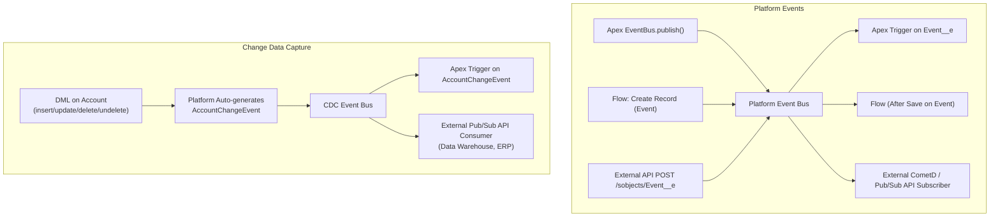

# Platform Events and Change Data Capture

## Exam Domain
Process Automation & Logic — 21% of exam weight

## Foundations

Platform Events and Change Data Capture (CDC) are both built on the Salesforce event bus — but they serve different purposes and have very different data structures.

**Platform Events**: Custom events you define and publish explicitly. Used for application-to-application messaging, trigger decoupling, and integration notifications. You control exactly what data is in the event and when it fires.

**Change Data Capture**: System-generated events that fire automatically when Salesforce records are created, updated, deleted, or undeleted. Used for external system sync, audit logging, and real-time data replication. You don't publish CDC events — Salesforce does.

Both are built on CometD (streaming protocol) and the event bus. Both support **replay** — subscribers can request past events using a Replay ID. Both decouple producers from consumers.

Key mental model: Platform Events = custom application events (you define the schema). CDC = system-generated record change notifications (schema defined by Salesforce).

Why this matters for architecture: Event-Driven Architecture (EDA) on Salesforce is built on these two primitives. Understanding pub/sub, replay IDs, at-least-once delivery, and subscriber limits is essential for any integration or automation design involving real-time data flow.

---

## Core Concepts

### Platform Events — Schema and Publication

Platform Events are defined as custom metadata types ending in `__e`. They have:
- **Publish Immediately** (default): Published when `EventBus.publish()` is called, even if the surrounding transaction rolls back
- **Publish After Commit**: Published only if the surrounding transaction commits successfully

```apex
// Platform Event: Stock_Alert__e with fields: Symbol__c (Text), Price__c (Number), Alert_Type__c (Text)

// Publishing a Platform Event from Apex (synchronous)
Stock_Alert__e alert = new Stock_Alert__e(
    Symbol__c = 'SFDC',
    Price__c = 215.50,
    Alert_Type__c = 'ABOVE_THRESHOLD'
);
Database.SaveResult result = EventBus.publish(alert);
if (!result.isSuccess()) {
    System.debug('Publish failed: ' + result.getErrors()[0].getMessage());
}

// Bulk publishing — efficient
List<Stock_Alert__e> alerts = new List<Stock_Alert__e>();
for (Quote q : quotesAboveThreshold) {
    alerts.add(new Stock_Alert__e(
        Symbol__c = q.Symbol__c,
        Price__c = q.Price__c,
        Alert_Type__c = 'THRESHOLD_EXCEEDED'
    ));
}
List<Database.SaveResult> results = EventBus.publish(alerts);
// Check each result for errors
for (Database.SaveResult sr : results) {
    if (!sr.isSuccess()) {
        // Log error — event was NOT published
    }
}
```

**Platform Event publication limits:**
- Max 150 `EventBus.publish()` calls per transaction
- Max event message size: 1 MB
- Event delivery is **at-least-once** — subscribers may receive duplicate events (must be idempotent)

### Platform Event — Apex Subscriber (Trigger)

```apex
// Trigger on a Platform Event — fires after the event is published
trigger StockAlertTrigger on Stock_Alert__e (after insert) {
    List<Case> casesToCreate = new List<Case>();

    for (Stock_Alert__e event : Trigger.new) {
        // EventUuid provides idempotency key — use to deduplicate
        Case c = new Case(
            Subject = 'Stock Alert: ' + event.Symbol__c + ' at ' + event.Price__c,
            Description = 'Alert Type: ' + event.Alert_Type__c,
            Origin = 'Platform Event',
            Status = 'New'
        );
        casesToCreate.add(c);
    }

    if (!casesToCreate.isEmpty()) insert casesToCreate;
}
```

**Platform Event trigger rules:**
- Only `after insert` — there's no before insert for events
- Runs asynchronously — fresh governor limits
- `Trigger.new` contains the events, `Trigger.old` is not available
- Each event has `ReplayId` (String) and `EventUuid` (String) for idempotency

### Replay IDs — Durable Subscribing

Replay IDs allow subscribers to request events that were published in the past (up to 3 days retention).

```apex
// In a CometD/EMP API subscription, a subscriber can set:
// -1 = subscribe from now (new events only)
// -2 = subscribe from the earliest retained event (replay all)
// <specific ID> = replay from a specific event (for catch-up after outage)

// In Apex trigger context: access current replay position
trigger StockAlertTrigger on Stock_Alert__e (after insert) {
    // Get the last replay ID this trigger processed
    // Use EventBus.TriggerContext to set the resume checkpoint
    Integer batchSize = 500; // custom logic

    for (Stock_Alert__e event : Trigger.new) {
        // EventBus.TriggerContext.currentContext().getReplayId() gives last processed replay ID
        // Store this to resume after failures
    }
    // Commit replay ID only if processing succeeds
    EventBus.TriggerContext.currentContext().setResumeCheckpoint(
        Trigger.new[Trigger.new.size()-1].ReplayId
    );
}
```

**Retention**: Platform Events are retained for 3 days (High Volume) or 1 day (Standard Volume).

### Change Data Capture (CDC)

CDC events are automatically generated by Salesforce when standard or custom objects are created, updated, deleted, or undeleted. They are enabled per-object in Setup → Change Data Capture.

```apex
// CDC event trigger for Account changes
trigger AccountChangeTrigger on AccountChangeEvent (after insert) {

    for (AccountChangeEvent event : Trigger.new) {
        // Change event header contains metadata about the change
        EventBus.ChangeEventHeader header = event.ChangeEventHeader;

        // What type of change?
        String changeType = header.changeType; // CREATE, UPDATE, DELETE, UNDELETE, GAP_CREATE, GAP_UPDATE...
        List<String> changedFields = header.changedFields; // Only populated for UPDATE
        List<String> recordIds = header.recordIds; // IDs of changed records

        if (changeType == 'UPDATE') {
            System.debug('Changed fields: ' + changedFields);
            // changedFields contains only the fields that CHANGED — sparse payload
            // If Name changed: changedFields = ['Name']
            // Other fields are null in the event — check changedFields before reading
        }

        if (changeType == 'CREATE') {
            // Full record snapshot — all fields populated
            System.debug('New account name: ' + event.Name);
        }

        if (changeType == 'DELETE') {
            // Only header fields populated — the record is gone
            System.debug('Deleted record IDs: ' + recordIds);
        }
    }
}
```

**CDC key characteristics:**
- Event schema is automatically generated by Salesforce — you don't define fields
- **Sparse payload**: UPDATE events only include changed fields — unchanged fields are null
- `ChangeEventHeader.changedFields` — list of field API names that changed
- `ChangeEventHeader.changeType` — `CREATE`, `UPDATE`, `DELETE`, `UNDELETE`, or gap variants
- `ChangeEventHeader.recordIds` — list of record IDs affected
- `ChangeEventHeader.entityName` — API name of the object (e.g., `Account`)

### Platform Events vs Change Data Capture — Comparison

| Feature | Platform Events | Change Data Capture |
|---------|----------------|---------------------|
| Schema | Custom-defined | Auto-generated by platform |
| Who publishes | Developers (Apex, Flow, API) | Salesforce platform (automatic) |
| Trigger | After insert only | After insert only |
| Fields | Full payload (what you put in) | Sparse payload (only changed fields) |
| Use case | Application messaging, decoupling | Record sync, audit, replication |
| Retention | 3 days (High Volume) | 3 days |
| Replay | Yes (Replay ID) | Yes (Replay ID) |
| Max per transaction | 150 publishes | Automatic (no limit to set) |
| External subscribers | EMP API, CometD | EMP API, CometD, Pub/Sub API |

### High-Volume vs Standard Platform Events

| Feature | High-Volume | Standard |
|---------|-------------|---------|
| Throughput | Up to 100,000/hour (org limit) | Lower |
| Retention | 3 days | 1 day |
| Workflow/Process support | No | Yes |
| Apex trigger support | Yes | Yes |
| Flow support | After-Save Flows | After-Save Flows |

Most production implementations should use High-Volume Platform Events for any significant volume.

### Event-Driven Architecture Pattern (Trigger Decoupling)

```apex
// Pattern: Decouple trigger processing using Platform Events
// PROBLEM: Account trigger needs to make an HTTP callout and do heavy processing
// SOLUTION: Publish event from trigger, process in async subscriber

// Step 1: Lean trigger publishes event
trigger AccountTrigger on Account (after insert, after update) {
    List<Account_Changed__e> events = new List<Account_Changed__e>();
    for (Account acc : Trigger.new) {
        Account_Changed__e evt = new Account_Changed__e();
        evt.Account_Id__c = acc.Id;
        evt.Change_Type__c = Trigger.isInsert ? 'INSERT' : 'UPDATE';
        evt.Timestamp__c = DateTime.now();
        events.add(evt);
    }
    EventBus.publish(events);
    // Trigger returns immediately — no blocking on downstream processing
}

// Step 2: Event trigger handles heavy lifting — runs async with fresh limits
trigger AccountChangedEventTrigger on Account_Changed__e (after insert) {
    Set<Id> accountIds = new Set<Id>();
    Map<Id, String> changeTypes = new Map<Id, String>();

    for (Account_Changed__e event : Trigger.new) {
        accountIds.add(event.Account_Id__c);
        changeTypes.put(event.Account_Id__c, event.Change_Type__c);
    }

    // Now safe to: make callouts, do heavy processing, etc.
    AccountIntegrationService.syncToExternalSystem(accountIds, changeTypes);
}
```

---

## Advanced Patterns

### Idempotency with EventUuid

Since Platform Events have at-least-once delivery, subscribers must handle duplicate events:

```apex
trigger StockAlertTrigger on Stock_Alert__e (after insert) {
    Set<String> eventUuids = new Set<String>();
    for (Stock_Alert__e event : Trigger.new) {
        eventUuids.add(event.EventUuid);
    }

    // Check for already-processed events
    Set<String> processed = new Set<String>();
    for (Processed_Event__c pe : [
        SELECT Event_UUID__c FROM Processed_Event__c
        WHERE Event_UUID__c IN :eventUuids
    ]) {
        processed.add(pe.Event_UUID__c);
    }

    List<Processed_Event__c> toInsert = new List<Processed_Event__c>();
    List<Case> casesToCreate = new List<Case>();

    for (Stock_Alert__e event : Trigger.new) {
        if (!processed.contains(event.EventUuid)) {
            // Not yet processed — handle and mark as processed
            casesToCreate.add(new Case(Subject = 'Alert: ' + event.Symbol__c));
            toInsert.add(new Processed_Event__c(Event_UUID__c = event.EventUuid));
        }
    }

    if (!casesToCreate.isEmpty()) insert casesToCreate;
    if (!toInsert.isEmpty()) insert toInsert;
}
```

---

## PTA / SA Relevance

### When This Comes Up in Engagements
Platform Events are the foundation of modern Salesforce integration architecture. When advising customers on system integration, Platform Events vs direct callout is a core architectural decision:
- **Platform Events**: decoupled, retryable, scalable, supports fan-out (multiple subscribers)
- **Direct callout**: simpler, synchronous, but brittle (downstream system must be available)

For enterprise customers integrating with external systems (ERP, SAP, legacy databases), CDC is often the right answer for outbound data sync — instead of custom code that queries for changes, CDC provides a native change stream that external systems can consume via the Pub/Sub API.

As a PTA, you should know:
- What's the difference between CDC and a custom polling integration? (CDC is lower latency, lower cost, simpler to maintain)
- When does event volume become a concern? (100,000 events/hour org limit on Platform Events)
- What are the replay and retry guarantees? (At-least-once, 3-day retention, no guaranteed ordering)

### Common Partner Mistakes
- **Publishing events inside loops without accumulating** — `EventBus.publish()` in a for loop hits the 150-per-transaction limit
- **Not handling the sparse payload in CDC** — reading fields that are null because they didn't change, treating null as "deleted value"
- **Not implementing idempotency** — re-processing duplicate events creates duplicate records or sends duplicate notifications
- **Using Standard Platform Events for high-volume use cases** — lower throughput and retention

### Enterprise Scale Considerations
At enterprise scale:
- Platform Events replace polling-based integrations — far more efficient
- CDC enables real-time data warehousing without Salesforce outbound messaging overhead
- Fan-out: one Platform Event can have multiple subscribers (multiple Apex triggers, multiple Flows, external consumers via Pub/Sub API)
- Pub/Sub API (gRPC-based) replaces the older CometD/EMP API for external subscribers — important for partners building integrations

---

## Architecture



**Limitations:**
- Platform Event triggers only support `after insert` — no before events, no update/delete events
- Platform Events do not support `Trigger.old` or `Trigger.oldMap`
- Event delivery is at-least-once — not exactly-once. Subscribers must be idempotent.
- Max 40 CDC channel subscriptions per org
- Platform Events published in a rolled-back transaction: **Publish Immediately** events ARE published even if the transaction rolls back. **Publish After Commit** events are NOT published if the transaction rolls back.
- Event bus does not guarantee ordering — events may arrive out of sequence

---

## Key Facts to Memorize

- Platform Events end in `__e` (e.g., `Order_Confirmed__e`)
- CDC events end in `ChangeEvent` (e.g., `AccountChangeEvent`)
- Both trigger types: `after insert` only
- `EventBus.publish(event)` returns `Database.SaveResult` — check `isSuccess()`
- Max 150 `EventBus.publish()` calls per transaction
- Platform Event retention: 3 days (High Volume), 1 day (Standard)
- Replay ID `-1` = new events only; `-2` = replay from beginning of retention window
- `ChangeEventHeader.changedFields` — contains ONLY changed fields in UPDATE events (sparse payload)
- `ChangeEventHeader.changeType` values: `CREATE`, `UPDATE`, `DELETE`, `UNDELETE`, `GAP_CREATE`, `GAP_UPDATE`, `GAP_DELETE`, `GAP_UNDELETE`
- `GAP_*` changeTypes indicate events were missed during a gap in delivery — subscriber must re-query
- Max CDC subscriptions per org: 40
- Platform Event subscribers: triggers, Flows, external (CometD/Pub/Sub API)
- `EventBus.TriggerContext.currentContext().setResumeCheckpoint(replayId)` — sets where trigger resumes after failure
- `Publish Immediately` vs `Publish After Commit` — behavior difference on transaction rollback

---

## Exam Traps

- "Platform Event triggers can fire before insert to validate events" — False. Platform Event triggers are `after insert` only. There is no before insert for events.
- "Change Data Capture UPDATE events contain all record fields" — False. CDC UPDATE events have a sparse payload — only the changed fields are populated. Other fields are null. Use `ChangeEventHeader.changedFields` to determine what changed.
- "Platform Events published in a failed transaction are never delivered" — False for Publish Immediately events. They ARE delivered even if the transaction rolled back. Only Publish After Commit events are suppressed on rollback.
- "Replay ID -1 replays all events from the beginning" — False. -2 replays from the earliest retained event. -1 subscribes to new events only (no replay).
- "An org can have unlimited CDC subscriptions" — False. Maximum 40 CDC channel subscriptions per org.
- "Platform Events guarantee exactly-once delivery" — False. Delivery is at-least-once — subscribers may receive duplicate events. Idempotency handling is required.

---

## Practice Questions

**Q:** A company uses Platform Events to sync Account changes to an external system. The external system goes down for 4 days. When it comes back online, the team wants to replay missed events. Can they do this, and if so, how?

**A:** They can replay events up to **3 days** old (High Volume events). Since the outage was 4 days, the first day of events is no longer available in the retention window — those changes are permanently lost from the event stream. To replay available events, the subscriber sets the Replay ID to `-2` (earliest retained) or to the last successfully processed Replay ID before the outage. For the gap where events cannot be replayed, the external system must do a full re-sync via SOQL or Bulk API query to reconcile the data state.

---

**Q:** A CDC trigger on AccountChangeEvent fires for an UPDATE. The trigger reads `event.AnnualRevenue`. The update only changed the `Name` field. What value does `event.AnnualRevenue` contain?

**A:** `null`. CDC UPDATE events have a sparse payload — only the fields that actually changed are populated. Since `AnnualRevenue` was not modified in this update, it is `null` in the event. The developer must check `event.ChangeEventHeader.changedFields` to determine which fields changed before accessing field values. Reading a null field as "the field was cleared to null" would be a bug.
