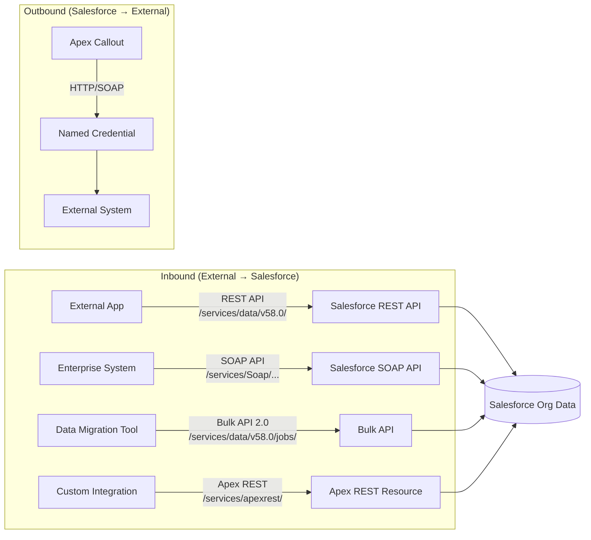

# REST and SOAP Integration

## Exam Domain
Integration — 21% of exam weight

## Foundations

Salesforce exposes multiple APIs for inbound integration (external → Salesforce) and supports outbound callouts for outbound integration (Salesforce → external). PDII tests both directions at depth.

**Inbound APIs** (external systems calling Salesforce):
- **REST API**: JSON/XML over HTTPS. The standard API for most integrations. Endpoints at `/services/data/vXX.0/`.
- **SOAP API**: XML web services. Legacy protocol, still widely used in enterprise integrations.
- **Bulk API 2.0**: CSV-based, for large data volumes (100,000+ records). Asynchronous jobs.
- **Streaming API / Platform Events**: CometD-based pub/sub for real-time data push.
- **Apex REST / SOAP**: Custom endpoints built with `@RestResource` / `webservice` keywords.

**Outbound** (Salesforce calling external systems):
- HTTP callouts via `HttpRequest`/`HttpResponse`
- SOAP callouts via generated WSDL classes (WSDL2Apex)
- Named Credentials handle authentication for both

If you have a PDI baseline on callouts, PDII goes deeper on authentication (OAuth, JWT, certificates), SOAP specifics (WSDL generation, envelope structure), and the Composite API for multi-step operations.

---

## Core Concepts

### Salesforce REST API — Key Endpoints

The REST API base URL is `/services/data/vXX.0/` where XX is the API version (e.g., v58.0).

```bash
# Authentication header required on all calls:
# Authorization: Bearer <access_token>

# Query records
GET /services/data/v58.0/query?q=SELECT+Id,Name+FROM+Account+LIMIT+10

# Get single record
GET /services/data/v58.0/sobjects/Account/001xx000000001

# Create record
POST /services/data/v58.0/sobjects/Account
Body: {"Name": "Acme Corp", "Industry": "Technology"}

# Update record (PATCH — partial update)
PATCH /services/data/v58.0/sobjects/Account/001xx000000001
Body: {"Industry": "Finance"}

# Upsert by External ID
PATCH /services/data/v58.0/sobjects/Account/ExternalId__c/EXT-001
Body: {"Name": "Acme Corp", "Industry": "Technology"}

# Delete record
DELETE /services/data/v58.0/sobjects/Account/001xx000000001

# Describe object
GET /services/data/v58.0/sobjects/Account/describe
```

### Composite API — Batch Multiple Operations

The Composite API allows up to 25 subrequests in one HTTP call. Critical for reducing round-trips in complex integrations.

```bash
POST /services/data/v58.0/composite
Content-Type: application/json

{
  "allOrNone": true,
  "compositeRequest": [
    {
      "method": "POST",
      "url": "/services/data/v58.0/sobjects/Account",
      "referenceId": "newAccount",
      "body": {
        "Name": "Acme Corp",
        "Industry": "Technology"
      }
    },
    {
      "method": "POST",
      "url": "/services/data/v58.0/sobjects/Contact",
      "referenceId": "newContact",
      "body": {
        "LastName": "Smith",
        "AccountId": "@{newAccount.id}"
      }
    },
    {
      "method": "GET",
      "url": "/services/data/v58.0/sobjects/Account/@{newAccount.id}",
      "referenceId": "accountDetails"
    }
  ]
}
```

`@{referenceId.fieldName}` syntax allows using values from previous subrequest responses. `allOrNone: true` rolls back all subrequests if any one fails.

**Composite vs SObject Collections vs Batch:**

| API | Max Records | Ordering | Use Case |
|-----|------------|----------|---------|
| Composite | 25 subrequests | Sequential, can reference prior | Multi-step with dependencies |
| SObject Collections | 200 records | Parallel | Bulk CRUD on same object |
| Batch Request | 25 subrequests | Independent | Multiple unrelated operations |
| Bulk API 2.0 | Millions | Async jobs | Large data loads |

### SOAP API — When and How

SOAP is XML-based. The Salesforce SOAP API uses WSDL (Web Services Description Language) to describe its schema.

```xml
<!-- Example SOAP envelope for upsert -->
<soapenv:Envelope xmlns:soapenv="http://schemas.xmlsoap.org/soap/envelope/"
                  xmlns:urn="urn:enterprise.soap.sforce.com">
  <soapenv:Header>
    <urn:CallOptions>
      <urn:client>MyIntegration</urn:client>
    </urn:CallOptions>
    <urn:SessionHeader>
      <urn:sessionId>ACCESS_TOKEN_HERE</urn:sessionId>
    </urn:SessionHeader>
  </soapenv:Header>
  <soapenv:Body>
    <urn:upsert>
      <urn:externalIDFieldName>External_Id__c</urn:externalIDFieldName>
      <urn:sObjects xsi:type="urn1:Account">
        <urn1:Name>Acme Corp</urn1:Name>
        <urn1:External_Id__c>EXT-001</urn1:External_Id__c>
      </urn:sObjects>
    </urn:upsert>
  </soapenv:Body>
</soapenv:Envelope>
```

**Two SOAP WSDLs:**
- **Enterprise WSDL**: Strongly typed, org-specific (includes custom fields/objects). One WSDL per org. Changes when metadata changes.
- **Partner WSDL**: Weakly typed, generic (works across any org). Preferred for ISV apps and tools.

### WSDL2Apex — Calling SOAP Services from Apex

When Salesforce calls an external SOAP service, you generate Apex stubs from the external WSDL.

```apex
// After WSDL2Apex generates the stub class (e.g., WeatherService):
WeatherService.WeatherPort stub = new WeatherService.WeatherPort();
stub.endpoint_x = 'callout:Weather_API'; // Named Credential
WeatherService.GetTemperatureResult result = stub.getTemperature('94105');
System.debug('Temperature: ' + result.temperature + 'F');

// The generated stub handles XML serialization/deserialization automatically
```

### Authentication Flows for Inbound Integration

External systems must authenticate to call Salesforce APIs. Common flows:

**OAuth 2.0 Username-Password Flow (Server-to-Server)**:
```bash
POST https://login.salesforce.com/services/oauth2/token
grant_type=password&client_id=CLIENT_ID&client_secret=CLIENT_SECRET
&username=USER&password=PASSWORD+SECURITY_TOKEN
# Returns: {"access_token": "...", "instance_url": "https://org.salesforce.com"}
```

**OAuth 2.0 JWT Bearer Flow (Server-to-Server, no password)**:
```bash
# 1. Generate a JWT signed with private key
# 2. POST to token endpoint
POST https://login.salesforce.com/services/oauth2/token
grant_type=urn:ietf:params:oauth:grant-type:jwt-bearer&assertion=SIGNED_JWT
# Returns access_token without password
```

**Connected App + Client Credentials Flow** (recommended for server-to-server):
```bash
POST https://login.salesforce.com/services/oauth2/token
grant_type=client_credentials&client_id=CLIENT_ID&client_secret=CLIENT_SECRET
```

### Bulk API 2.0

For large data loads (100k+ records), REST API with JSON/CSV is replaced by Bulk API 2.0:

```bash
# Step 1: Create a job
POST /services/data/v58.0/jobs/ingest
{"object": "Account", "operation": "upsert", "externalIdFieldName": "External_Id__c", "contentType": "CSV"}
# Returns: {"id": "7502p000001ABCD", "state": "Open"}

# Step 2: Upload CSV data
PUT /services/data/v58.0/jobs/ingest/7502p000001ABCD/batches
Content-Type: text/csv
"External_Id__c","Name","Industry"
"EXT-001","Acme Corp","Technology"

# Step 3: Close job (triggers processing)
PATCH /services/data/v58.0/jobs/ingest/7502p000001ABCD
{"state": "UploadComplete"}

# Step 4: Poll for status
GET /services/data/v58.0/jobs/ingest/7502p000001ABCD

# Step 5: Retrieve results (successes and failures)
GET /services/data/v58.0/jobs/ingest/7502p000001ABCD/successfulResults
GET /services/data/v58.0/jobs/ingest/7502p000001ABCD/failedResults
```

---

## PTA / SA Relevance

### When This Comes Up in Engagements
API selection is a core architectural decision in every enterprise integration. The most common advisory question: "Should we use REST API, Bulk API, or Platform Events for our integration?" The answer depends on volume, latency requirements, and direction:
- < 10,000 records, real-time: REST API
- > 100,000 records, batch: Bulk API 2.0
- Real-time event-driven: Platform Events / Streaming API
- Legacy system requiring SOAP: Salesforce SOAP API + WSDL

When reviewing a partner's integration approach, ask: "What API are they using and why? Are they using Composite API to reduce round-trips?" Point-to-point REST with 1 record per call at high volume is a common performance anti-pattern.

### Common Partner Mistakes
- **Using REST API for bulk loads** — REST API processes records individually or in batches of 200. For 1M records, this is 5,000 API calls. Bulk API handles this in one job.
- **Not using Composite API** — making 5 separate REST calls where one Composite call would work. Increases round-trip latency and API call consumption.
- **Enterprise WSDL in ISV apps** — ISV apps should use Partner WSDL (generic). Enterprise WSDL is org-specific and breaks when customer metadata changes.
- **Using username/password OAuth flow** — requires embedding credentials. JWT flow with certificate is more secure and doesn't require password rotation.

### Enterprise Scale Considerations
At enterprise scale, API governance matters:
- Daily API call limits: Performance Edition = 1M calls/day; Enterprise = 100k + 2k per license
- Bulk API 2.0 daily limit: 10,000 batches/day; each job can have unlimited data
- Monitor API usage via Setup → Company Information → API Requests, Last 24 Hours

---

## Architecture



**Limitations:**
- Composite API: max 25 subrequests, and each counted against API limits
- Bulk API 2.0: max file upload size per batch: 150 MB
- REST API query results: max 2,000 records per page (use `nextRecordsUrl` for pagination)
- SOAP API: enterprise WSDL changes when org metadata changes — requires regeneration
- External IDs used for upsert must be marked as "External ID" on the field definition

---

## Key Facts to Memorize

- REST API base URL: `/services/data/vXX.0/`
- Apex REST URL: `/services/apexrest/<urlMapping>`
- SOAP API URL: `/services/Soap/u/XX.0/<orgId>` (Enterprise) or `/services/Soap/c/XX.0/` (Partner)
- Composite API: max 25 subrequests, supports `@{referenceId.field}` cross-references
- SObject Collections: max 200 records per call
- Bulk API 2.0 job states: `Open`, `UploadComplete`, `InProgress`, `Aborted`, `JobComplete`, `Failed`
- Enterprise WSDL: org-specific, strongly typed. Partner WSDL: generic, weakly typed.
- `WSDL2Apex`: generates Apex stub classes from an external WSDL for outbound SOAP callouts
- JWT Bearer flow: server-to-server OAuth without password — uses certificate + private key signing
- REST API pagination: use `nextRecordsUrl` from response to get subsequent pages
- `allOrNone` in Composite API: if true, any failure rolls back all subrequests

---

## Exam Traps

- "PATCH and PUT are equivalent in Salesforce REST API" — False. Salesforce REST API uses PATCH for updates (partial update), not PUT. PUT is used for upsert by external ID.
- "Bulk API 2.0 is synchronous like REST API" — False. Bulk API 2.0 is asynchronous — you create a job, upload data, and poll for completion.
- "Enterprise WSDL can be shared across all Salesforce orgs in a multi-org ISV solution" — False. Enterprise WSDL is org-specific and changes with metadata. Use Partner WSDL for cross-org/ISV scenarios.
- "Composite API can include up to 200 subrequests" — False. Maximum is 25 subrequests.
- "The REST API GET /query endpoint returns all records at once" — False. Results are paged at 2,000 records. Use `nextRecordsUrl` from the response to retrieve additional pages.

---

## Practice Questions

**Q:** An external system needs to create 500,000 Account records in Salesforce nightly. What is the most appropriate API and approach?

**A:** Bulk API 2.0. The Bulk API is designed for high-volume data operations. The external system creates an ingest job specifying the object and operation, uploads the data as CSV (up to 150 MB per upload), and closes the job to trigger processing. Results (successes and failures) are retrieved asynchronously. Using the REST API for 500k records would require ~2,500 API calls of 200 records each and would approach the daily API call limit, making Bulk API the correct choice.

---

**Q:** A developer needs to create an Account, immediately create a Contact linked to that Account, and then query the Account — all in a single HTTP round trip. Which API and approach supports this?

**A:** The Composite API. The developer sends one POST to `/services/data/v58.0/composite` with three subrequests: (1) POST Account, (2) POST Contact with `AccountId: "@{newAccount.id}"` referencing the first subrequest's result, and (3) GET Account using `@{newAccount.id}`. Setting `allOrNone: true` ensures that if any step fails, all are rolled back. This eliminates 2 additional round-trips compared to sequential REST API calls.
