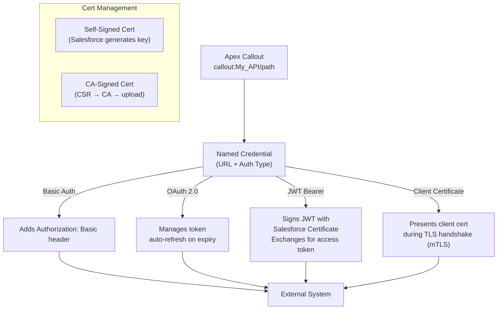

# Callouts, Named Credentials, and Certificate Authentication

## Exam Domain
Integration — 21% of exam weight

## Foundations

Named Credentials are Salesforce's answer to the question: "Where do you store API credentials so they're not in code, not in Custom Settings that developers can read, and not a rotation nightmare?" The answer: in a Salesforce-managed encrypted store that handles authentication transparently.

Before Named Credentials, developers put endpoints and credentials in Custom Settings, Custom Metadata, or—worst of all—hardcoded in Apex. Named Credentials eliminate all of that. The `callout:Named_Credential_Name` endpoint syntax tells Salesforce to look up the stored URL and add the appropriate auth headers automatically.

PDII goes beyond "what is a Named Credential" to: how do you configure different auth types (Basic, OAuth 2.0, JWT, Certificate), what are Legacy vs Per-User vs Org-Wide credentials, and how do you test code that uses them?

Certificates add another layer: when the external system requires mutual TLS (mTLS) or client certificate authentication, Salesforce needs to hold a private key and present a certificate during the TLS handshake. This is distinct from a server certificate (the external server's certificate, which you may need to trust via a Remote Site Setting).

---

## Core Concepts

### Named Credentials — Configuration and Usage

**Setup path:** Setup → Security → Named Credentials

```apex
// Using Named Credential in callout — simplest form
HttpRequest req = new HttpRequest();
req.setEndpoint('callout:My_External_API/accounts/123');
req.setMethod('GET');
req.setHeader('Content-Type', 'application/json');

// Salesforce automatically:
// 1. Substitutes the Named Credential's stored URL
// 2. Adds the stored authentication header (Basic, OAuth token, etc.)
// 3. Handles token refresh if OAuth expires

HttpResponse res = new Http().send(req);
```

**Named Credential anatomy:**
- **Label**: Human-readable name in Setup
- **Name (API Name)**: Used in `callout:NameHere` — must match exactly
- **URL**: Base endpoint URL (e.g., `https://api.example.com/v2`)
- **Identity Type**: determines auth behavior
  - `Named Principal` (Org credential): all users share the same credentials — for server-to-server
  - `Per User` (User credential): each Salesforce user can have their own credentials — for user-context APIs
  - `Anonymous`: no authentication header added
- **Authentication Protocol**: None, Password, OAuth 2.0, JWT Token, AWS Signature
- **Generate Authorization Header**: if checked, Salesforce auto-adds the auth header

### Legacy vs New Named Credentials

Salesforce introduced "new" Named Credentials in Winter '22 that separate the credential (External Credential) from the endpoint (Named Credential). The legacy format combines both in one object.

```
New format (recommended):
  External Credential: stores auth (OAuth client ID/secret, etc.)
  Named Credential: stores URL, references the External Credential
  Permission Set: grants users access to Per User credentials

Legacy format (still valid for exam):
  Named Credential: stores both URL and auth in one object
```

### OAuth 2.0 Named Credential Configuration

For OAuth 2.0 Client Credentials (server-to-server):
```
Named Credential setup:
  URL: https://api.example.com
  Identity Type: Named Principal
  Authentication Protocol: OAuth 2.0
  Authentication Provider: [Link to Auth Provider configured separately]
  Scope: api read write
  Start Authentication Flow on Save: checked (to complete OAuth handshake)
```

Auth Provider setup (Setup → Auth Providers):
```
  Provider Type: Salesforce | Google | Facebook | Microsoft | Custom
  Consumer Key: CLIENT_ID
  Consumer Secret: CLIENT_SECRET
  Default Scopes: api
  Token Endpoint URL: https://auth.example.com/oauth/token
```

### JWT Bearer Token Authentication

JWT (JSON Web Token) authentication allows Salesforce to authenticate to external services without sharing a password. Salesforce signs a JWT with a private key; the external service validates with the corresponding public key.

```apex
// JWT generation in Apex (manual approach when Named Credential doesn't cover it)
public static String generateJWT(String clientId, String subject, String audience) {
    // Header
    String header = EncodingUtil.base64Encode(Blob.valueOf(
        JSON.serialize(new Map<String, String>{ 'alg' => 'RS256', 'typ' => 'JWT' })
    )).replace('=', '').replace('+', '-').replace('/', '_');

    // Payload
    Long now = DateTime.now().getTime() / 1000;
    String payload = EncodingUtil.base64Encode(Blob.valueOf(
        JSON.serialize(new Map<String, Object>{
            'iss' => clientId,
            'sub' => subject,
            'aud' => audience,
            'iat' => now,
            'exp' => now + 300 // 5-minute expiry
        })
    )).replace('=', '').replace('+', '-').replace('/', '_');

    // Sign with private key (stored in Salesforce Certificate)
    String signingInput = header + '.' + payload;
    // Use Crypto.sign() with the private key
    // (In practice, use a Connected App + Named Credential with JWT for cleaner implementation)

    return signingInput + '.' + signature;
}
```

**Simpler: Use a Connected App with JWT on Named Credential**
Configure the Named Credential with JWT Token auth protocol:
- **Certificate**: select the Salesforce Certificate containing the private key
- **Issuer**: the `iss` claim (usually the connected app's client ID)
- **Subject**: the `sub` claim (Salesforce username or external system user ID)
- **Token Endpoint URL**: where to exchange the JWT for an access token

### Salesforce Certificates — Two Types

**Type 1: Self-Signed Certificate** (Salesforce generates the key pair)
- Salesforce holds the private key securely (never exportable)
- Use: signing JWTs, mTLS client authentication where you control the external server
- Create: Setup → Certificate and Key Management → Create Self-Signed Certificate

**Type 2: Certificate Signed by CA** (you generate the private key externally)
- Used when the external server requires a certificate from a specific CA
- Process: Salesforce generates a CSR (Certificate Signing Request) → CA signs it → you upload the signed certificate
- Create: Setup → Certificate and Key Management → Create CA-Signed Certificate

```apex
// Using a certificate in Apex callout (mutual TLS)
HttpRequest req = new HttpRequest();
req.setEndpoint('https://secure-api.example.com/data');
req.setMethod('GET');
req.setClientCertificateName('My_Client_Certificate'); // API name of the certificate
HttpResponse res = new Http().send(req);

// Or via Named Credential — specify the certificate in Named Credential config
// (preferred — keeps certificate references out of code)
```

### Remote Site Settings — Trusting External Servers

Before making any callout to an external URL, that URL's domain must be whitelisted in Remote Site Settings. Named Credentials **bypass** the need for Remote Site Settings for their configured URL.

```
Remote Site Settings path: Setup → Security → Remote Site Settings
- Name: My_External_API
- Remote Site URL: https://api.example.com (no path — domain only)
- Active: checked
- Disable Protocol Security: leave unchecked (would disable SSL validation — security risk)
```

**Key rule:** If using Named Credentials, NO Remote Site Setting needed for that endpoint. If using a hardcoded endpoint in `req.setEndpoint('https://...')`, a Remote Site Setting is required.

### Testing Callouts with Named Credentials

In test context, `callout:Named_Credential_Name` still requires a mock. The Named Credential endpoint prefix is just a string substitution — the mock intercepts it the same way.

```apex
@isTest
static void testNamedCredentialCallout() {
    // Mock intercepts callout:My_External_API/* endpoints
    Test.setMock(HttpCalloutMock.class, new ExternalSystemMock(200, '{"status":"ok"}'));

    Test.startTest();
    ExternalSystemService.getAccountData('EXT-001');
    Test.stopTest();

    // Assert results
}
```

---

## Advanced Patterns

### Per-User Named Credentials with User Credentials

For integrations where each Salesforce user authenticates with their own credentials to the external system:

```
Named Credential:
  Identity Type: Per User
  Authentication Protocol: OAuth 2.0

Users must connect their credentials:
  User's setup → My Personal Information → Authentication Settings for External Systems
  OR: trigger OAuth flow via Apex (redirect to auth URL)
```

```apex
// Initiate per-user OAuth flow from Apex
public class OAuthController {
    public PageReference initiateAuth() {
        // Get Named Credential auth URL for this user
        String namedCredential = 'My_Per_User_API';
        PageReference authPage = new PageReference(
            '/apex/oauthLogin?nc=' + namedCredential + '&retUrl=' + EncodingUtil.urlEncode(ApexPages.currentPage().getUrl(), 'UTF-8')
        );
        return authPage;
    }
}
```

### Certificate Pinning (Security Pattern)

For highly sensitive integrations, validate that the response comes from the expected server by checking the certificate fingerprint:

```apex
// Note: Salesforce does not currently expose certificate fingerprint validation in Apex callouts directly.
// The recommended approach: use client certificate authentication (mTLS) which validates both sides.
// For server certificate validation, rely on Salesforce's built-in SSL/TLS validation.
```

---

## PTA / SA Relevance

### When This Comes Up in Engagements
Named Credentials are the first thing a PTA/security architect looks for in a callout audit. Credentials in code or Custom Settings is a P1 security finding — a developer who left after a project means those credentials can never be rotated without code access.

In a pre-go-live security review checklist:
- Are all outbound integration endpoints configured as Named Credentials?
- Are Client IDs and Secrets in Named Credentials / Auth Providers, not in Custom Metadata?
- Are production certificates different from sandbox certificates?
- Are sandbox Named Credentials pointed at sandbox/staging endpoints, not production external systems?

### Common Partner Mistakes
- **Hardcoded endpoints in Apex** — `req.setEndpoint('https://api.prod.example.com/v2/...')` — breaks sandbox/production parity and hides credentials
- **Remote Site Settings as the only security control** — Remote Site Settings only whitelist the domain; they don't provide authentication
- **Certificates not rotated** — self-signed certificates have expiry dates; production outages when they expire are completely avoidable
- **Per-User Named Credentials without provisioning flow** — deploying per-user credentials without a UI flow for users to connect their credentials results in silent failures

### Enterprise Scale Considerations
In large orgs with dozens of integrations:
- Each Named Credential represents one external system endpoint. Document all Named Credentials as part of the integration architecture.
- Certificate management process: who owns renewal, what's the alert on expiry?
- Per-environment Named Credentials: configure in each sandbox pointing to that environment's external system (not the production external system)
- Connected Apps for inbound: each integration partner should have their own Connected App — enables per-partner revocation without affecting others

---

## Architecture



**Limitations:**
- Named Credentials don't support all authentication flows natively — complex auth may require custom Apex token management
- Self-signed certificate private keys cannot be exported from Salesforce — if you need the private key externally, use CA-signed workflow
- Remote Site Settings required for any non-Named-Credential outbound endpoint
- Certificate expiry causes silent callout failures — monitor certificate expiry dates

---

## Key Facts to Memorize

- Named Credential endpoint syntax: `callout:Named_Credential_API_Name/path`
- Named Credentials bypass the need for Remote Site Settings for their URL
- Identity Types: Named Principal (shared org credential), Per User (user's own credential), Anonymous
- Auth protocols: None, Password (Basic), OAuth 2.0, JWT Token, AWS Signature
- Remote Site Settings path: Setup → Security → Remote Site Settings
- Certificates: Setup → Certificate and Key Management
- Self-signed: Salesforce generates the key pair; private key never exportable
- CA-signed: generate CSR in Salesforce, get signed by CA, upload signed cert
- `req.setClientCertificateName('Cert_API_Name')` — attaches a certificate for mTLS callouts
- JWT structure: `header.payload.signature` (Base64URL encoded, dot-separated)
- `Crypto.sign('RSA-SHA256', payload, privateKey)` — signs data for JWT
- Named Credentials support token auto-refresh for OAuth 2.0 — no manual token management needed

---

## Exam Traps

- "Remote Site Settings are required for Named Credential callouts" — False. Named Credentials bypass Remote Site Settings for their configured URL.
- "A self-signed certificate's private key can be exported from Salesforce" — False. Self-signed certificate private keys are managed entirely within Salesforce and cannot be exported.
- "Named Credentials only support Basic authentication" — False. They support Password (Basic), OAuth 2.0, JWT Token, AWS Signature V4, and None.
- "Per-User Named Credentials automatically connect all users" — False. Each user must complete the OAuth flow (or have credentials set) to use a Per-User Named Credential. Unconfigured users get a runtime error.
- "You need a Remote Site Setting even if you use a Named Credential" — False. The Named Credential's URL is automatically trusted; no additional Remote Site Setting is needed.

---

## Practice Questions

**Q:** A company's external ERP system requires OAuth 2.0 client credentials authentication. The Salesforce team wants to ensure credentials are never visible to developers and that token refresh is automatic. What is the correct setup?

**A:** Create an Auth Provider in Setup with the ERP's Client ID and Client Secret, then create a Named Credential pointing to the ERP endpoint with OAuth 2.0 auth protocol linked to the Auth Provider. Set Identity Type to Named Principal (org-wide credential, not per-user). The Apex callout uses `callout:ERP_API/path` — credentials are never in code, and Salesforce handles token refresh automatically when the token expires.

---

**Q:** A developer deploys Apex code that calls `req.setEndpoint('https://api.thirdparty.com/data')` without a Named Credential. The code deploys successfully to a sandbox but fails at runtime. What is the most likely error?

**A:** `System.CalloutException: Unauthorized endpoint, please check Setup>Security>Remote Site Settings`. The domain `https://api.thirdparty.com` is not in the sandbox's Remote Site Settings. Fix: either add a Remote Site Setting for the domain, or better, refactor to use a Named Credential, which eliminates the Remote Site Settings requirement and improves credential security.
