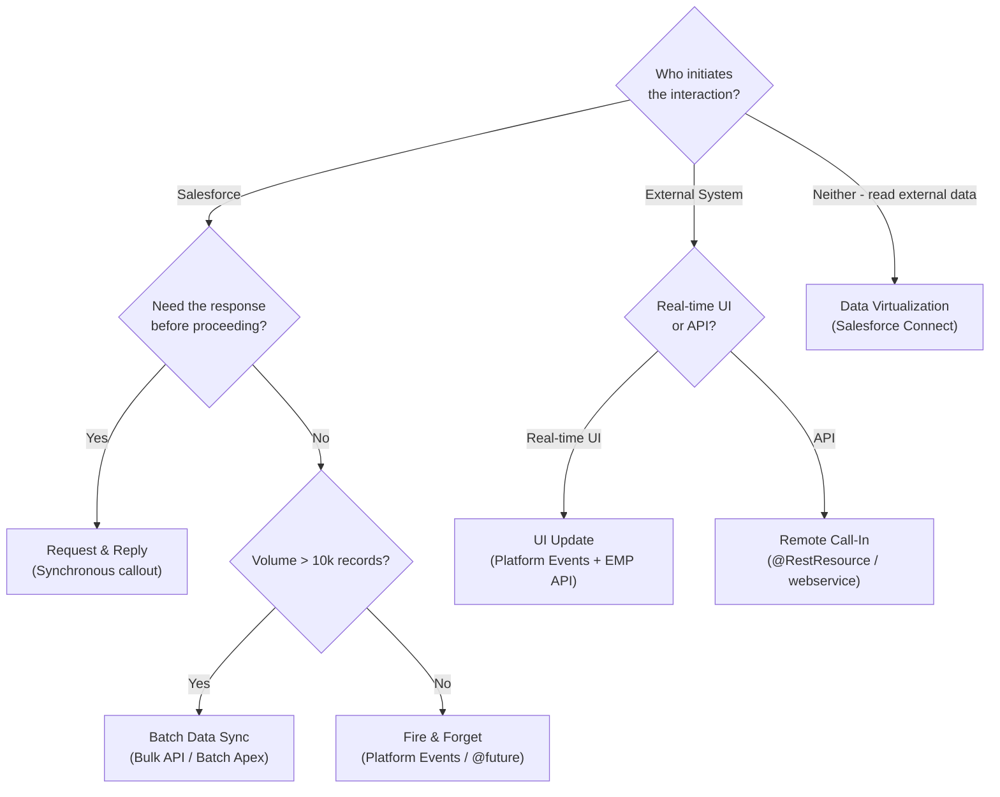
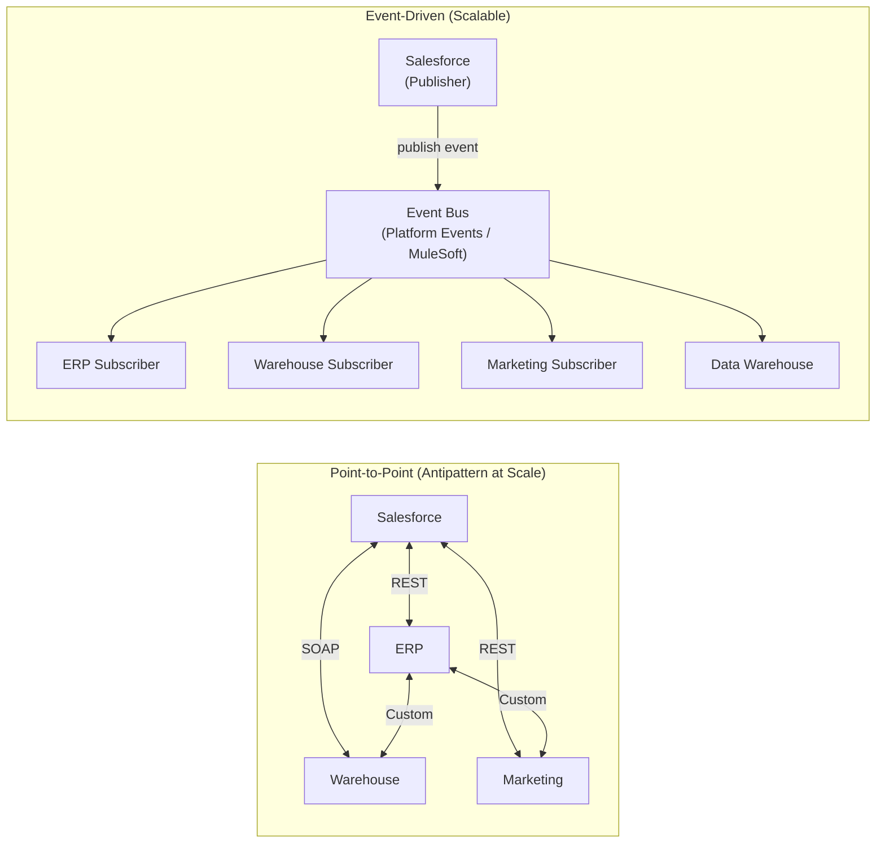

# Integration Patterns

## Exam Domain
Integration — 21% of exam weight

## Foundations

Integration patterns describe *how* systems communicate — not just what protocol they use, but the architecture of message flow, error handling, retries, and data consistency. A senior developer or architect doesn't just know how to write a callout; they know which of the six major integration patterns fits a given business requirement.

The PDII exam tests pattern recognition: given a scenario ("a legacy ERP must be notified when an Opportunity closes"), identify the correct pattern and explain the trade-offs.

The six patterns from the Salesforce Integration Patterns guide (Architect's Digest):
1. **Request and Reply** — synchronous, Salesforce initiates
2. **Fire and Forget** — asynchronous, Salesforce initiates, doesn't wait for response
3. **Batch Data Synchronization** — bulk, scheduled, bidirectional
4. **Remote Call-In** — external initiates call to Salesforce
5. **UI Update Based on Data Change** — streaming/real-time UI refresh
6. **Data Virtualization** — real-time data from external systems without storing in Salesforce

Understanding when each applies, what the retry/error behavior is, and what the governor limit implications are is the core PDII integration knowledge.

---

## Core Concepts

### Pattern 1: Request and Reply (Synchronous)

Salesforce calls an external system and waits for the response before continuing.

```apex
// Classic synchronous callout pattern
public class ProductPricingService {
    public Decimal getRealtimePrice(String productCode) {
        HttpRequest req = new HttpRequest();
        req.setEndpoint('callout:Pricing_API/prices/' + productCode);
        req.setMethod('GET');
        req.setTimeout(10000); // 10 seconds max

        HttpResponse res = new Http().send(req);
        if (res.getStatusCode() == 200) {
            Map<String, Object> data = (Map<String, Object>) JSON.deserializeUntyped(res.getBody());
            return (Decimal) data.get('price');
        }
        throw new IntegrationException('Pricing API error: ' + res.getStatusCode());
    }
}
```

**When to use**: Real-time data retrieval needed before completing a transaction (credit check, inventory check, price calculation).

**Limitations**:
- Blocked until external system responds (up to 120 seconds)
- Cannot use in trigger context without @future or Queueable
- If external system is slow, entire Salesforce transaction is slow
- No automatic retry on failure

**Governor limit impact**: Consumes 1 callout from the 100-callout-per-transaction limit.

### Pattern 2: Fire and Forget (Asynchronous)

Salesforce initiates an action but doesn't wait for the response — processing continues immediately.

```apex
// Using @future for fire-and-forget notification
@future(callout=true)
public static void notifyERPAsync(String opportunityId, String status) {
    HttpRequest req = new HttpRequest();
    req.setEndpoint('callout:ERP_API/opportunities');
    req.setMethod('POST');
    req.setBody(JSON.serialize(new Map<String, String>{
        'sfId' => opportunityId,
        'status' => status,
        'timestamp' => String.valueOf(DateTime.now())
    }));
    HttpResponse res = new Http().send(req);
    // No response processing — fire and forget
    if (res.getStatusCode() != 202) {
        // Log failure but don't throw — transaction already committed
        insert new Integration_Error__c(
            Opportunity_Id__c = opportunityId,
            Error_Code__c = String.valueOf(res.getStatusCode())
        );
    }
}

// Better: Platform Events for fire-and-forget (decoupled, retryable)
trigger OpportunityTrigger on Opportunity (after update) {
    List<Opp_Won__e> events = new List<Opp_Won__e>();
    for (Opportunity opp : Trigger.new) {
        if (opp.StageName == 'Closed Won' && Trigger.oldMap.get(opp.Id).StageName != 'Closed Won') {
            events.add(new Opp_Won__e(
                Opportunity_Id__c = opp.Id,
                Amount__c = opp.Amount,
                Close_Date__c = opp.CloseDate
            ));
        }
    }
    if (!events.isEmpty()) EventBus.publish(events);
}
```

**When to use**: Notification of downstream systems, audit logging, triggering workflows where the response doesn't affect the current transaction.

**Trade-offs**:
- @future: no retry mechanism, primitive params only
- Platform Events: at-least-once delivery with replay capability — preferred
- Queueable: supports retry logic, object parameters, better error handling

### Pattern 3: Batch Data Synchronization

Bulk data movement between systems, typically on a schedule.

```apex
// Salesforce → External: scheduled batch
public class AccountSyncBatch implements Database.Batchable<sObject>, Database.Stateful, Database.AllowsCallouts {
    private DateTime lastSync;
    private List<Map<String, Object>> batch = new List<Map<String, Object>>();
    private Integer batchNum = 0;

    public AccountSyncBatch(DateTime lastSync) { this.lastSync = lastSync; }

    public Database.QueryLocator start(Database.BatchableContext bc) {
        return Database.getQueryLocator([
            SELECT Id, Name, Industry, AnnualRevenue, LastModifiedDate
            FROM Account
            WHERE LastModifiedDate >= :lastSync
        ]);
    }

    public void execute(Database.BatchableContext bc, List<Account> scope) {
        for (Account acc : scope) {
            batch.add(new Map<String, Object>{
                'sfId' => acc.Id,
                'name' => acc.Name,
                'industry' => acc.Industry,
                'revenue' => acc.AnnualRevenue
            });
        }

        // Send batch of 200 records to external system
        HttpRequest req = new HttpRequest();
        req.setEndpoint('callout:ERP_API/accounts/batch');
        req.setMethod('PUT');
        req.setBody(JSON.serialize(batch));
        HttpResponse res = new Http().send(req);
        batch.clear(); // Prepare for next chunk
        batchNum++;
    }

    public void finish(Database.BatchableContext bc) {
        // Update sync timestamp
        Sync_Config__mdt.lastSyncTime = String.valueOf(DateTime.now()); // pseudocode
    }
}
```

**When to use**: Nightly data replication, data migration, ERP/CRM synchronization where real-time isn't required.

**Key design decisions**:
- Delta sync (only changed records) vs full sync (all records) — delta is far more efficient but requires `LastModifiedDate` or event-based change tracking
- How to handle failures: retry failed records, dead-letter queue, alert and manual re-run

### Pattern 4: Remote Call-In (External Initiates)

External system calls into Salesforce to read or write data.

```apex
@RestResource(urlMapping='/orders/*')
global with sharing class OrdersAPI {

    @HttpPost
    global static OrderResponse createOrder(
        String externalOrderId,
        String accountExternalId,
        Decimal amount,
        String status
    ) {
        OrderResponse response = new OrderResponse();

        // Idempotency: check if order already exists
        List<Order__c> existing = [
            SELECT Id FROM Order__c
            WHERE External_Order_Id__c = :externalOrderId
            LIMIT 1
        ];
        if (!existing.isEmpty()) {
            response.status = 'DUPLICATE';
            response.salesforceId = existing[0].Id;
            RestContext.response.statusCode = 200;
            return response;
        }

        // Find account by external ID
        List<Account> accounts = [
            SELECT Id FROM Account
            WHERE External_Id__c = :accountExternalId
            WITH SECURITY_ENFORCED
            LIMIT 1
        ];
        if (accounts.isEmpty()) {
            response.status = 'ACCOUNT_NOT_FOUND';
            RestContext.response.statusCode = 404;
            return response;
        }

        Order__c order = new Order__c(
            External_Order_Id__c = externalOrderId,
            AccountId__c = accounts[0].Id,
            Amount__c = amount,
            Status__c = status
        );
        insert order;

        response.status = 'CREATED';
        response.salesforceId = order.Id;
        RestContext.response.statusCode = 201;
        return response;
    }

    global class OrderResponse {
        webservice String status;
        webservice String salesforceId;
    }
}
```

**Authentication for Remote Call-In**:
- Connected App + OAuth: external system gets access token via OAuth flow
- Connected App + JWT: certificate-based server-to-server authentication
- Session ID (not recommended for production — tied to user session)

### Pattern 5: UI Update Based on Data Change (Streaming)

Real-time push of data changes to the Salesforce UI without page refresh.

```apex
// Component subscribes to Platform Events using LMS or EMP API
// Salesforce publishes updates as they happen — no polling required

// Apex publishes status updates
public class OrderProcessingService {
    public static void updateOrderStatus(Id orderId, String status, String message) {
        Order_Status_Update__e event = new Order_Status_Update__e(
            Order_Id__c = orderId,
            New_Status__c = status,
            Message__c = message,
            Timestamp__c = DateTime.now()
        );
        EventBus.publish(event);
    }
}
```

```javascript
// LWC subscribes to the Platform Event
import { subscribe, unsubscribe, onError } from 'lightning/empApi';

const channel = '/event/Order_Status_Update__e';
const subscription = await subscribe(channel, -1, (event) => {
    const data = event.data.payload;
    if (data.Order_Id__c === this.recordId) {
        this.statusMessage = data.Message__c;
    }
});
```

**When to use**: Long-running process tracking (order processing, batch job status), live dashboards, collaborative editing notifications.

### Pattern 6: Data Virtualization (External Objects)

Access external data as if it were in Salesforce — without storing it. Uses **Salesforce Connect** and **External Objects** (`__x` suffix).

```
Architecture:
External System → OData 4.0 or Custom Adapter → Salesforce Connect → External Object (Account__x)
```

```apex
// External Objects are queryable just like standard sObjects
List<Product__x> externalProducts = [
    SELECT ExternalId, Name, Price, Category
    FROM Product__x
    WHERE Category = 'Software'
    LIMIT 100
];
// Real-time query to external system — not stored in Salesforce
```

**When to use**: Large external datasets that shouldn't be replicated into Salesforce (compliance, data sovereignty), real-time pricing/inventory from ERP.

**Limitations of External Objects**:
- Cannot be used in most Apex DML (read-only via SOQL)
- Cannot be joined with standard/custom objects in same SOQL query (except via Lookup relationships)
- Counts against SOQL query limits
- Response time dependent on external system performance

---

## Pattern Selection Guide



---

## PTA / SA Relevance

### When This Comes Up in Engagements
Integration pattern selection is one of the most impactful architectural decisions in an enterprise Salesforce implementation. The wrong pattern leads to:
- Performance bottlenecks (synchronous callouts blocking transactions)
- Data consistency issues (fire-and-forget with no error handling)
- Scalability failures (REST API used for bulk loads)
- Maintenance nightmares (point-to-point integrations that multiply as the org grows)

As a PTA, you use this framework to evaluate a customer's integration architecture during discovery and in design review meetings. The question isn't "does it work?" but "does it work at the volume and failure rate you'll see in 2 years?"

**The ESB / iPaaS vs point-to-point conversation**: Enterprise customers with 10+ integrated systems should use an iPaaS (MuleSoft, Dell Boomi, Informatica) to manage integration complexity. Direct Salesforce-to-ERP integrations multiply connectivity requirements exponentially as systems are added. This is a common $1M+ MuleSoft expansion conversation.

### Common Partner Mistakes
- **Synchronous callouts in trigger context** — violates governor limits and creates user-facing failures when external system is slow
- **No dead-letter queue** — fire-and-forget with no error logging. Failed events are silently lost.
- **Point-to-point multiplication** — building 10 direct integrations when an event bus would serve all 10 systems from one publisher
- **Full sync instead of delta sync** — syncing all 500,000 Account records nightly when only 1,000 changed

### Enterprise Scale Considerations
- For 10+ integrated systems: event-driven architecture (Platform Events as bus) reduces integration complexity from O(n²) point-to-point to O(n) hub-and-spoke
- MuleSoft Anypoint Platform is the Salesforce-native iPaaS — know when to recommend it vs native Salesforce integration
- For real-time UI at scale: Streaming API has a concurrent connection limit per org — plan capacity

---

## Architecture — Point-to-Point vs Event-Driven



**Limitations:**
- Platform Events do not guarantee message ordering
- External Objects (Data Virtualization) require Salesforce Connect license (additional cost)
- Batch synchronization introduces data latency — not suitable for real-time requirements
- Streaming API has concurrent connection limits per edition

---

## Key Facts to Memorize

- 6 integration patterns: Request-Reply, Fire-and-Forget, Batch Sync, Remote Call-In, UI Update, Data Virtualization
- Synchronous callout: max 120 seconds, cannot run from trigger context directly
- Fire-and-forget with Platform Events: at-least-once, 3-day replay, async processing
- Batch sync: use Bulk API 2.0 for > 100k records, delta sync via `LastModifiedDate`
- Remote Call-In: `@RestResource` (REST) or `webservice` keyword (SOAP), requires Connected App + OAuth
- Data Virtualization: External Objects (`__x`), Salesforce Connect, OData or custom adapter
- External Objects: queryable via SOQL, cannot be used in DML, real-time query to external system
- Point-to-point multiplies as O(n²) — event-driven scales as O(n)
- iPaaS recommendation threshold: 5+ integrated systems, complex transformation needs, need for central monitoring

---

## Exam Traps

- "Fire and Forget guarantees the message is delivered to the external system" — False. Fire-and-forget means Salesforce doesn't wait for confirmation. If the external system is down, the message may be lost (unless using Platform Events with replay).
- "External Objects can be updated using DML in Apex" — False. External Objects are read-only via SOQL. Writes go through the Salesforce Connect adapter separately.
- "Batch synchronization is always better than real-time for ERP integration" — False. The correct pattern depends on business requirements. Batch introduces latency; real-time increases system coupling and callout dependency.
- "Remote Call-In via Apex REST requires the caller to be a Salesforce user" — False. Any system with a valid OAuth access token (from a Connected App) can call Apex REST endpoints.

---

## Practice Questions

**Q:** A warehouse management system needs to see real-time inventory data from an external system. The data should appear in Salesforce as if it were native records, but should NOT be stored in Salesforce due to data volume and compliance requirements. Which integration pattern applies?

**A:** Data Virtualization using Salesforce Connect and External Objects. The warehouse system exposes an OData endpoint, Salesforce Connect is configured to connect to it, and an External Object (`Inventory__x`) is created. Salesforce users see inventory data in Salesforce without it being stored there. Queries against the External Object make real-time calls to the warehouse system.

---

**Q:** When should a developer choose Platform Events over `@future` for a Fire-and-Forget integration pattern?

**A:** Platform Events are preferred when: (1) retry/replay capability is needed — `@future` has no retry mechanism, Platform Events support replay up to 3 days; (2) multiple subscribers need the event — Platform Events fan out to multiple Apex triggers, Flows, and external consumers; `@future` sends to only one method; (3) decoupling is needed — Platform Events decouple the publisher from the subscriber, allowing independent evolution; (4) the caller is in trigger context — Platform Events are safer from triggers as they don't contribute to callout limits. Use `@future` only for simple one-off async callouts where replay and fan-out are not needed.
