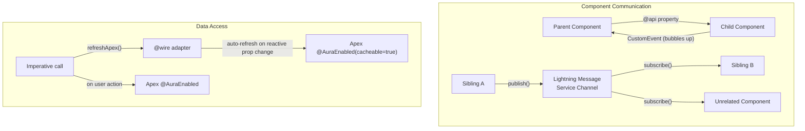

# LWC Advanced Patterns

## Exam Domain
Process Automation & Logic — 21% of exam weight

## Foundations

PDI LWC introduced components, properties, events, and the wire service. PDII goes deeper into: how the wire service actually works (reactive properties, wire adapters), how to call Apex imperatively (not just with wire), how components communicate across the component hierarchy (parent-child events vs Lightning Message Service), and performance patterns.

The key mental shift from PDI to PDII LWC: PDI asks "can you write a component that shows data." PDII asks "how do you design a component architecture that's maintainable, performant, and correctly handles loading/error states."

Critical PDII LWC concepts:
- `@wire` with reactive properties (`$propertyName` prefix makes a wire property reactive)
- Imperative Apex calls (calling Apex directly with `.then()`/`async-await`, not through wire)
- Custom wire adapters
- Lightning Message Service (LMS) for cross-DOM communication
- Performance: `@track` vs plain properties, `connectedCallback` vs `renderedCallback`
- Error handling patterns in async LWC operations

---

## Core Concepts

### Wire Service — Reactive Properties and Adapters

```javascript
// component.js
import { LightningElement, wire, track } from 'lwc';
import { getRecord, getFieldValue } from 'lightning/uiRecordApi';
import { getPicklistValues, getObjectInfo } from 'lightning/uiObjectInfoApi';
import getAccountsByIndustry from '@salesforce/apex/AccountController.getAccountsByIndustry';
import ACCOUNT_OBJECT from '@salesforce/schema/Account';
import INDUSTRY_FIELD from '@salesforce/schema/Account.Industry';
import NAME_FIELD from '@salesforce/schema/Account.Name';

export default class AccountViewer extends LightningElement {

    // Wire with static parameter — re-runs when recordId changes via @api
    @api recordId;

    // getRecord wire — fetches specific fields using schema imports
    @wire(getRecord, { recordId: '$recordId', fields: [NAME_FIELD, INDUSTRY_FIELD] })
    account; // wire property: { data: ..., error: ... }

    get accountName() {
        return this.account.data ? getFieldValue(this.account.data, NAME_FIELD) : '';
    }

    // Wire with reactive property — '$' prefix makes it reactive
    // Changing this.selectedIndustry triggers the wire to re-execute
    selectedIndustry = 'Technology'; // reactive because wire uses '$selectedIndustry'

    @wire(getAccountsByIndustry, { industry: '$selectedIndustry' })
    wiredAccounts; // { data: List<Account>, error: String }

    get accounts() {
        return this.wiredAccounts.data;
    }
    get error() {
        return this.wiredAccounts.error;
    }
    get isLoading() {
        return !this.wiredAccounts.data && !this.wiredAccounts.error;
    }

    // Picklist values via wire — requires recordTypeId
    @wire(getObjectInfo, { objectApiName: ACCOUNT_OBJECT })
    objectInfo;

    @wire(getPicklistValues, {
        recordTypeId: '$objectInfo.data.defaultRecordTypeId',
        fieldApiName: INDUSTRY_FIELD
    })
    industryPicklistValues;

    handleIndustryChange(event) {
        this.selectedIndustry = event.detail.value;
        // Changing selectedIndustry auto-triggers the wired getAccountsByIndustry
    }
}
```

### Imperative Apex Calls

Use imperative calls when: you need to call Apex conditionally, on user action, or need fine-grained control over loading/error states.

```javascript
import { LightningElement, track } from 'lwc';
import syncAccountToERP from '@salesforce/apex/AccountController.syncAccountToERP';
import getAccountDetails from '@salesforce/apex/AccountController.getAccountDetails';

export default class AccountSync extends LightningElement {
    @api recordId;

    @track accountData;
    @track isLoading = false;
    @track errorMessage;
    @track successMessage;

    // Fetch on demand (not on component load via wire)
    async loadAccountDetails() {
        this.isLoading = true;
        this.errorMessage = null;
        try {
            this.accountData = await getAccountDetails({ accountId: this.recordId });
        } catch (error) {
            this.errorMessage = error.body?.message || error.message || 'Unknown error';
        } finally {
            this.isLoading = false;
        }
    }

    // User-triggered action — cannot be done with @wire (wire is automatic)
    async handleSyncClick() {
        this.isLoading = true;
        this.successMessage = null;
        this.errorMessage = null;
        try {
            const result = await syncAccountToERP({ accountId: this.recordId });
            this.successMessage = 'Sync complete: ' + result;
            this.dispatchEvent(new CustomEvent('synccomplete', { detail: { accountId: this.recordId } }));
        } catch (error) {
            this.errorMessage = error.body?.message || 'Sync failed';
        } finally {
            this.isLoading = false;
        }
    }

    connectedCallback() {
        this.loadAccountDetails();
    }
}
```

```html
<!-- component.html -->
<template>
    <template if:true={isLoading}>
        <lightning-spinner alternative-text="Loading..."></lightning-spinner>
    </template>
    <template if:true={errorMessage}>
        <p class="slds-text-color_error">{errorMessage}</p>
    </template>
    <template if:true={accountData}>
        <p>Name: {accountData.Name}</p>
        <lightning-button label="Sync to ERP" onclick={handleSyncClick}></lightning-button>
    </template>
</template>
```

### Wire vs Imperative — When to Use Each

| Scenario | Wire | Imperative |
|----------|------|-----------|
| Fetch data on component load, refresh automatically | ✅ | ✗ |
| Fetch data conditionally (based on user action) | ✗ | ✅ |
| Mutate data / perform DML | ✗ | ✅ |
| Get UI API data (records, picklists, object info) | ✅ | ✅ |
| Needs explicit loading/error state management | ✗ (wire has .data/.error) | ✅ |
| Call same method with different parameters on user input | ✅ (reactive) | ✅ |

### Component Communication Patterns

**Parent to Child**: `@api` property or method
```javascript
// Parent passes data down
// child.html: <c-child-component record-id={selectedId}></c-child-component>

// child.js:
import { LightningElement, api } from 'lwc';
export default class ChildComponent extends LightningElement {
    @api recordId; // exposed as attribute on the component tag

    @api
    refresh() { // @api method — callable by parent via template refs
        this.loadData();
    }
}
```

**Child to Parent**: Custom events with `bubbles` and `composed`
```javascript
// In child — dispatches event up the DOM
handleButtonClick() {
    this.dispatchEvent(new CustomEvent('itemselected', {
        detail: { id: this.item.Id, name: this.item.Name },
        bubbles: true,   // event propagates up through DOM
        composed: false  // false = stays within shadow DOM boundary; true = crosses shadow boundary
    }));
}

// In parent HTML: <c-child-component onitemselected={handleItemSelected}></c-child-component>
// In parent JS:
handleItemSelected(event) {
    this.selectedId = event.detail.id;
}
```

**Sibling/Unrelated Components**: Lightning Message Service (LMS)

```javascript
// messageChannel.messageChannel-meta.xml (create in force-app/main/default/messageChannels/)
// API Name: Account_Selected__c

// Publisher component
import { LightningElement } from 'lwc';
import { publish, MessageContext } from 'lightning/messageService';
import ACCOUNT_SELECTED_CHANNEL from '@salesforce/messageChannel/Account_Selected__c';

export default class AccountList extends LightningElement {
    @wire(MessageContext) messageContext;

    handleAccountClick(event) {
        const accountId = event.currentTarget.dataset.id;
        publish(this.messageContext, ACCOUNT_SELECTED_CHANNEL, {
            accountId: accountId
        });
    }
}

// Subscriber component
import { LightningElement, wire } from 'lwc';
import { subscribe, unsubscribe, MessageContext } from 'lightning/messageService';
import ACCOUNT_SELECTED_CHANNEL from '@salesforce/messageChannel/Account_Selected__c';

export default class AccountDetail extends LightningElement {
    @wire(MessageContext) messageContext;
    subscription = null;
    selectedAccountId;

    connectedCallback() {
        this.subscription = subscribe(
            this.messageContext,
            ACCOUNT_SELECTED_CHANNEL,
            (message) => {
                this.selectedAccountId = message.accountId;
            }
        );
    }

    disconnectedCallback() {
        unsubscribe(this.subscription);
        this.subscription = null;
    }
}
```

### Lifecycle Hooks — Order and Purpose

```javascript
export default class MyComponent extends LightningElement {

    constructor() {
        super(); // MUST call super() first
        // Runs first, before rendering
        // Cannot access DOM, template, or child components
        // Use: initialize properties, set up event listeners on the component itself
    }

    connectedCallback() {
        // Runs when component is inserted into the DOM
        // Can access template with this.template.querySelector()... but template not rendered yet
        // Use: initial data fetch, subscribe to message channels, set up external listeners
    }

    renderedCallback() {
        // Runs EVERY TIME the component re-renders (including after property changes)
        // WARNING: if you change state here, it triggers another render → infinite loop risk
        // Use sparingly — only for DOM manipulation that requires rendered HTML
        // Guard with a flag to run only once if needed
        if (this.hasRendered) return;
        this.hasRendered = true;
        // One-time DOM setup
    }

    disconnectedCallback() {
        // Runs when component is removed from the DOM
        // Use: unsubscribe from message channels, clean up event listeners
    }

    errorCallback(error, stack) {
        // Catches errors in child components (not the current component)
        // Similar to React's error boundary
        console.error('Child component error:', error);
        this.childError = error.message;
    }
}
```

### `@track` vs Plain Properties

In modern LWC (API version 41+):
- **Plain properties**: primitives (String, Number, Boolean) are automatically reactive — changing them re-renders the component
- **`@track`**: required only for **nested object mutation** — changing a property of an object (not the object reference itself)

```javascript
// Works without @track — primitive
message = 'Hello'; // change to 'World' → re-renders
handleClick() { this.message = 'World'; } // ✅ re-renders

// Requires @track — nested property mutation
@track account = { name: 'Acme', industry: 'Tech' };
handleIndustryChange() {
    this.account.industry = 'Finance'; // @track required — property of object changed
}

// Also works WITHOUT @track — object reference replacement
account = { name: 'Acme', industry: 'Tech' };
handleChange() {
    this.account = { ...this.account, industry: 'Finance' }; // creates new object → reactive
}
```

---

## Advanced Patterns

### Refreshing Wired Data After Imperative DML

```javascript
import { refreshApex } from '@salesforce/apex';

export default class AccountList extends LightningElement {
    @wire(getAccountsByIndustry, { industry: 'Technology' })
    wiredAccounts;

    async handleCreateAccount() {
        try {
            await createAccount({ name: 'New Account', industry: 'Technology' });
            // Refresh the wired data to reflect the new record
            await refreshApex(this.wiredAccounts);
        } catch (error) {
            this.error = error.body.message;
        }
    }
}
```

### getRecordNotifyChange — Invalidate Record Cache

```javascript
import { getRecordNotifyChange } from 'lightning/uiRecordApi';

// After an imperative DML that modifies a record:
handleSave() {
    updateAccount({ accountId: this.recordId, name: this.newName })
        .then(() => {
            getRecordNotifyChange([{ recordId: this.recordId }]);
            // All wire adapters subscribed to this record ID will refresh
        });
}
```

---

## PTA / SA Relevance

### When This Comes Up in Engagements
LWC architecture choices affect component reusability and performance. As a PTA reviewing an LWC-heavy implementation:
- Are components too large (doing too much)? Should be broken into container + presentation layers.
- Are LMS subscriptions cleaned up in `disconnectedCallback`? Memory leaks in Salesforce pages are invisible until performance degrades.
- Is `renderedCallback` being used correctly? A common source of infinite rendering loops in production.
- Are imperative calls properly handling loading/error states? Missing error handling is the #1 UX complaint in custom LWC implementations.

### Common Partner Mistakes
- **Calling Apex in `renderedCallback` without a guard** — triggers infinite re-render loop
- **Not unsubscribing from LMS in `disconnectedCallback`** — memory leak when component is removed from page
- **Using `bubbles: true, composed: true` unnecessarily** — events leak out of shadow DOM, causing unintended side effects in parent page components
- **`@track` on every property** — unnecessary in modern LWC; only needed for nested object mutations

### Enterprise Scale Considerations
- Large LWC components with many wired properties can make many parallel API calls on load — design for network efficiency
- LMS is scoped to the current page tab — for App Builder pages with many components, LMS can become a source of unexpected coupling
- Lightning Web Security (LWS) replaced Lightning Locker in API 60+ — affects `document.querySelector`, global variables, and some third-party libraries

---

## Architecture



**Limitations:**
- `@wire` only works with `@AuraEnabled(cacheable=true)` Apex methods — cannot wire to methods that do DML
- `refreshApex` only refreshes wired properties from `@AuraEnabled(cacheable=true)` methods
- LMS is page-scoped — does not communicate across browser tabs or between experience sites
- `renderedCallback` can create infinite loops if it mutates reactive properties without guards

---

## Key Facts to Memorize

- `@wire` requires `@AuraEnabled(cacheable=true)` on Apex method
- `$propertyName` prefix in wire parameters makes the wire reactive to property changes
- `@api` exposes a property/method to parent components
- `@track` required only for nested object property mutations (in API 41+)
- Lifecycle order: `constructor` → `connectedCallback` → `render` → `renderedCallback`
- `disconnectedCallback` must unsubscribe from LMS to prevent memory leaks
- `errorCallback(error, stack)` catches errors from child components, not the component itself
- `refreshApex(wiredProperty)` invalidates and refreshes wired data
- `getRecordNotifyChange([{recordId}])` invalidates record cache for all wire adapters on that record
- Custom events: `bubbles: true` propagates up DOM; `composed: true` crosses shadow DOM boundary
- Lightning Message Service: `publish()`, `subscribe()`, `unsubscribe()` from `lightning/messageService`
- `MessageContext` is obtained via `@wire(MessageContext)` — required for LMS operations

---

## Exam Traps

- "@wire can call an Apex method that performs DML" — False. Wire requires `@AuraEnabled(cacheable=true)` which prohibits DML. Use imperative calls for DML operations.
- "renderedCallback runs only once after the first render" — False. It runs after EVERY render cycle. Guard with a `hasRendered` flag if single-execution is intended.
- "@track is required for all reactive properties in modern LWC" — False. Since API version 41+, plain JavaScript properties are reactive. `@track` is only needed for detecting mutations within nested objects.
- "Custom events with bubbles: false cannot be heard by parent components" — True. With `bubbles: false`, the event only fires on the dispatching component and is not propagated. The parent's `on<eventname>` handler on the child element tag in HTML still works — but only if the event is explicitly handled at the parent's template level, not via event propagation.
- "Lightning Message Service works across different browser tabs" — False. LMS is scoped to the current page in the current browser tab.

---

## Practice Questions

**Q:** A component uses `@wire(getAccountById, { recordId: '$recordId' })` wired accounts. After an imperative Apex call that creates a new related record, the developer wants the wired data to update. What should they call?

**A:** `refreshApex(this.wiredAccounts)` — this invalidates the cached wire result and triggers a fresh call to `getAccountById`. The `wiredAccounts` variable must be the wired property decorated with `@wire`, stored as an instance variable (not just in `get` accessor). Without `refreshApex`, the wire cache will not update automatically after an imperative mutation.

---

**Q:** Two LWC components on the same record page need to communicate — a list component and a detail component. They are not in a parent-child relationship. What is the correct communication mechanism?

**A:** Lightning Message Service (LMS). Define a Message Channel metadata file, use `publish()` in the list component and `subscribe()` in the detail component, both wired to `MessageContext`. LMS works across different component trees on the same page, making it the correct pattern for sibling communication where there's no shared parent. Event bubbling cannot solve this case since there's no common ancestor to catch the event.
