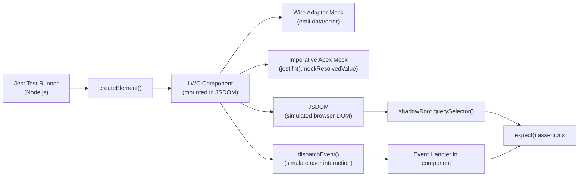

# LWC Testing with Jest

## Exam Domain
Testing — 16% of exam weight

## Foundations

LWC components are JavaScript — not Apex — so they're tested with Jest (the JavaScript testing framework), not with `@isTest` Apex classes. PDII tests whether you know how to set up Jest for LWC, write component tests, mock wire service calls, mock Apex, and mock Lightning message channels.

Jest runs entirely in Node.js — it doesn't talk to Salesforce. All Salesforce-specific features (wire adapters, Apex, @salesforce imports, lightning components) must be mocked. The `@salesforce/lwc-jest` package provides all the mocking infrastructure.

Core concepts PDII tests:
- Test file location and naming convention
- How to create a component instance in Jest
- How to query the component's rendered output (template queries)
- How to mock `@wire` calls with `@salesforce/wire-service-jest-util`
- How to mock imperative Apex calls (`jest.fn()`)
- How to simulate user interactions (`click`, `change` events)
- Async handling in Jest (`waitFor`, `Promise.resolve()`, `flushPromises`)

---

## Core Concepts

### Project Setup for LWC Jest

```bash
# Install Jest for LWC in a Salesforce project
npm install @salesforce/lwc-jest --save-dev

# jest.config.js — automatically created by sfdx-lwc-jest setup
module.exports = {
    testEnvironment: 'jsdom',
    moduleNameMapper: {
        '^@salesforce/apex$': '<rootDir>/force-app/test/jest-mocks/apex.js',
        '^@salesforce/schema/(.+)$': ['<rootDir>/force-app/test/jest-mocks/schema.js'],
        '^lightning/(.+)$': '<rootDir>/force-app/test/jest-mocks/lightning/$1.js',
        '^@salesforce/messageChannel/(.+)$': '<rootDir>/force-app/test/jest-mocks/messageChannel.js'
    },
    testMatch: ['**/__tests__/**/*.test.js']
};
```

File structure:
```
force-app/main/default/lwc/
  accountCard/
    accountCard.js
    accountCard.html
    accountCard.css
    __tests__/           ← test files go here
      accountCard.test.js
```

### Basic Component Test Structure

```javascript
// accountCard/__tests__/accountCard.test.js
import { createElement } from 'lwc';
import AccountCard from 'c/accountCard';

describe('c-account-card', () => {

    // Clean up after each test — prevents DOM bleed between tests
    afterEach(() => {
        while (document.body.firstChild) {
            document.body.removeChild(document.body.firstChild);
        }
    });

    it('renders account name', () => {
        // ARRANGE: Create element and set properties
        const element = createElement('c-account-card', { is: AccountCard });
        element.accountName = 'Acme Corp';
        element.industry = 'Technology';
        document.body.appendChild(element); // triggers connectedCallback

        // ACT: Query the rendered template
        const nameEl = element.shadowRoot.querySelector('.account-name');

        // ASSERT: Verify expected output
        expect(nameEl).not.toBeNull();
        expect(nameEl.textContent).toBe('Acme Corp');
    });

    it('does not render when accountName is null', () => {
        const element = createElement('c-account-card', { is: AccountCard });
        // accountName not set — null by default
        document.body.appendChild(element);

        const nameEl = element.shadowRoot.querySelector('.account-name');
        expect(nameEl).toBeNull();
    });
});
```

### Mocking @wire Adapters

```javascript
// accountList/__tests__/accountList.test.js
import { createElement } from 'lwc';
import AccountList from 'c/accountList';
import { registerApexTestWireAdapter } from '@salesforce/sfdx-lwc-jest';
// OR for newer packages:
import { registerLdsTestWireAdapter, registerApexTestWireAdapter } from '@salesforce/wire-service-jest-util';

// Import the wire-backed Apex method
import getAccountsByIndustry from '@salesforce/apex/AccountController.getAccountsByIndustry';

// Register the wire adapter mock
const getAccountsWireAdapter = registerApexTestWireAdapter(getAccountsByIndustry);

const mockAccounts = [
    { Id: '001', Name: 'Acme Corp', Industry: 'Technology' },
    { Id: '002', Name: 'Initech', Industry: 'Technology' }
];

describe('c-account-list', () => {
    afterEach(() => {
        while (document.body.firstChild) {
            document.body.removeChild(document.body.firstChild);
        }
        jest.clearAllMocks(); // reset all mocks between tests
    });

    it('renders list of accounts from wire', async () => {
        // ARRANGE
        const element = createElement('c-account-list', { is: AccountList });
        document.body.appendChild(element);

        // ACT: Emit mock data from wire adapter
        getAccountsWireAdapter.emit({ data: mockAccounts, error: undefined });

        // Wait for DOM to update (async re-render after wire emits)
        await Promise.resolve();

        // ASSERT: Check rendered list items
        const accountItems = element.shadowRoot.querySelectorAll('.account-item');
        expect(accountItems.length).toBe(2);
        expect(accountItems[0].textContent).toContain('Acme Corp');
    });

    it('displays error message when wire returns error', async () => {
        const element = createElement('c-account-list', { is: AccountList });
        document.body.appendChild(element);

        // Emit error from wire adapter
        getAccountsWireAdapter.emit({ data: undefined, error: 'Server error' });
        await Promise.resolve();

        const errorEl = element.shadowRoot.querySelector('.error-message');
        expect(errorEl).not.toBeNull();
        expect(errorEl.textContent).toContain('Server error');
    });

    it('shows loading state before wire resolves', () => {
        const element = createElement('c-account-list', { is: AccountList });
        document.body.appendChild(element);
        // Wire hasn't emitted yet — loading state should show
        const spinner = element.shadowRoot.querySelector('lightning-spinner');
        expect(spinner).not.toBeNull();
    });
});
```

### Mocking Imperative Apex Calls

```javascript
// accountSync/__tests__/accountSync.test.js
import { createElement } from 'lwc';
import AccountSync from 'c/accountSync';
import syncAccountToERP from '@salesforce/apex/AccountController.syncAccountToERP';

// Mock the entire Apex module
jest.mock(
    '@salesforce/apex/AccountController.syncAccountToERP',
    () => {
        return { default: jest.fn() }; // jest.fn() creates a mock function
    },
    { virtual: true }
);

describe('c-account-sync', () => {
    afterEach(() => {
        while (document.body.firstChild) document.body.removeChild(document.body.firstChild);
        jest.clearAllMocks();
    });

    it('calls syncAccountToERP on button click and shows success', async () => {
        // Configure mock to return a resolved promise
        syncAccountToERP.mockResolvedValue('Sync complete');

        const element = createElement('c-account-sync', { is: AccountSync });
        element.recordId = '001xx000000001';
        document.body.appendChild(element);

        // Simulate button click
        const button = element.shadowRoot.querySelector('lightning-button');
        button.dispatchEvent(new CustomEvent('click'));

        // Wait for the async Apex call and re-render
        await Promise.resolve(); // let the Promise chain start
        await Promise.resolve(); // let the then() handler run

        const successMsg = element.shadowRoot.querySelector('.success-message');
        expect(successMsg).not.toBeNull();
        expect(syncAccountToERP).toHaveBeenCalledWith({ accountId: '001xx000000001' });
    });

    it('shows error when syncAccountToERP throws', async () => {
        syncAccountToERP.mockRejectedValue({ body: { message: 'ERP unavailable' } });

        const element = createElement('c-account-sync', { is: AccountSync });
        element.recordId = '001xx000000001';
        document.body.appendChild(element);

        const button = element.shadowRoot.querySelector('lightning-button');
        button.dispatchEvent(new CustomEvent('click'));

        await Promise.resolve();
        await Promise.resolve();

        const errorEl = element.shadowRoot.querySelector('.error-message');
        expect(errorEl.textContent).toContain('ERP unavailable');
    });
});
```

### Testing User Interactions

```javascript
it('filters accounts when industry selector changes', async () => {
    // Wire adapter pre-set
    getAccountsWireAdapter.emit({ data: mockAccounts, error: undefined });
    const element = createElement('c-account-list', { is: AccountList });
    document.body.appendChild(element);
    await Promise.resolve();

    // Simulate change event on lightning-combobox
    const combobox = element.shadowRoot.querySelector('lightning-combobox');
    combobox.dispatchEvent(new CustomEvent('change', {
        detail: { value: 'Finance' }
    }));

    // Wire will be called again with new parameter — emit new data
    getAccountsWireAdapter.emit({
        data: [{ Id: '003', Name: 'Big Bank', Industry: 'Finance' }],
        error: undefined
    });
    await Promise.resolve();

    const items = element.shadowRoot.querySelectorAll('.account-item');
    expect(items.length).toBe(1);
    expect(items[0].textContent).toContain('Big Bank');
});
```

### Testing Lightning Message Service

```javascript
import { createMessageContext, releaseMessageContext, subscribe, MessageContext } from 'lightning/messageService';
import ACCOUNT_SELECTED_CHANNEL from '@salesforce/messageChannel/Account_Selected__c';

it('updates display when account selected message received', async () => {
    const element = createElement('c-account-detail', { is: AccountDetail });
    document.body.appendChild(element);

    const messageContext = createMessageContext();

    // Publish a message to the channel — component should update
    publish(messageContext, ACCOUNT_SELECTED_CHANNEL, { accountId: '001xx000000001' });
    await Promise.resolve();

    expect(element.selectedAccountId).toBe('001xx000000001');

    releaseMessageContext(messageContext);
});
```

### Common Jest Matchers for LWC

```javascript
// Existence checks
expect(element.shadowRoot.querySelector('.class')).not.toBeNull();
expect(element.shadowRoot.querySelector('.class')).toBeNull();

// Text content
expect(element.shadowRoot.querySelector('p').textContent).toBe('Expected text');
expect(element.shadowRoot.querySelector('p').textContent).toContain('partial match');

// CSS classes
expect(element.shadowRoot.querySelector('div').classList).toContain('active');

// Attribute
expect(element.shadowRoot.querySelector('button').disabled).toBe(true);

// Function calls
expect(mockFn).toHaveBeenCalled();
expect(mockFn).toHaveBeenCalledWith({ accountId: '001' });
expect(mockFn).toHaveBeenCalledTimes(1);

// Events dispatched by component
const handler = jest.fn();
element.addEventListener('synccomplete', handler);
button.click();
await Promise.resolve();
expect(handler).toHaveBeenCalled();
expect(handler.mock.calls[0][0].detail.accountId).toBe('001');
```

---

## PTA / SA Relevance

### When This Comes Up in Engagements
In any engagement that includes custom LWC development, asking "is there a Jest test suite?" is a quality gate. Partners who write Jest tests:
- Catch regressions in component behavior during refactors
- Can run tests in CI/CD pipelines without a Salesforce org
- Demonstrate professional JavaScript development practices

The absence of LWC tests is a risk indicator: if the LWC codebase has no tests, the team is manually testing UI behavior for every change — slow and error-prone at scale.

### Common Partner Mistakes
- **Not cleaning up DOM after each test** — previous test's component persists in the DOM, causing false positives/negatives
- **Not using `async/await` or `Promise.resolve()` after wire emissions** — asserting before the DOM re-renders, resulting in false "element is null" failures
- **Testing implementation details** — testing `this.accounts.length` instead of the rendered DOM items. Tests should verify what the user sees, not internal state.
- **Missing negative tests** — only testing the happy path (data returns successfully). Not testing what happens when wire emits an error.

### Enterprise Scale Considerations
Jest tests run without a Salesforce org connection — this makes them ideal for CI/CD pipelines. A properly set-up CI/CD pipeline runs Jest tests on every pull request before any Apex tests, catching UI bugs faster and cheaper. The full test strategy is: Jest (fast, no org) → Apex unit tests (mid, scratch org) → Apex integration tests (slow, full sandbox).

---

## Architecture



**Limitations:**
- Jest does not run in a real browser — JSDOM simulates DOM but does not support all browser APIs
- Lightning base components (e.g., `lightning-datatable`) are mocked as empty stubs — their internal behavior is not tested
- Wire service mocks require explicit `emit()` calls — the mock does not auto-fetch from Salesforce
- Third-party libraries that use `window` or `document` directly may behave differently in JSDOM vs real browser

---

## Key Facts to Memorize

- Test files location: `<componentName>/__tests__/<componentName>.test.js`
- `createElement('c-component-name', { is: ComponentClass })` creates the component
- `document.body.appendChild(element)` triggers `connectedCallback`
- `element.shadowRoot.querySelector(selector)` queries within shadow DOM
- `afterEach()` + DOM cleanup prevents test bleed
- `registerApexTestWireAdapter(apexFunction)` creates a mock wire adapter
- `wireAdapter.emit({ data: ..., error: ... })` simulates wire returning data or error
- `jest.mock('@salesforce/apex/ClassName.methodName', ...)` mocks imperative Apex
- `mockFn.mockResolvedValue(result)` — Apex mock returns resolved Promise
- `mockFn.mockRejectedValue(error)` — Apex mock returns rejected Promise
- `await Promise.resolve()` — advances the microtask queue so DOM re-renders
- `jest.clearAllMocks()` in `afterEach` — resets mock call counts and return values
- Run tests: `npm run test:unit` or `npx jest`

---

## Exam Traps

- "Jest tests run against a Salesforce scratch org to verify real behavior" — False. Jest runs in Node.js with a JSDOM simulated browser and mocked Salesforce APIs. No org connection.
- "Wire adapter mocks automatically fetch data from Apex when the component mounts" — False. The developer must explicitly call `wireAdapter.emit({ data: ..., error: ... })` to provide test data.
- "element.querySelector() searches the shadow DOM" — Partially false. `element.querySelector()` on the element itself does NOT search the shadow DOM. Use `element.shadowRoot.querySelector()` to search within the component's shadow DOM.
- "You don't need to clean up the DOM after Jest tests — each test gets a fresh environment" — False. Jest (with jsdom environment) reuses the same DOM context within a test file. Appended children persist across tests unless explicitly removed.
- "jest.fn() with no configuration will throw an error when called" — False. `jest.fn()` with no configuration returns `undefined` when called. Use `.mockResolvedValue()` or `.mockRejectedValue()` to simulate Apex return values.

---

## Practice Questions

**Q:** A developer writes a Jest test for a component that calls an imperative Apex method on `connectedCallback`. After appending the element, the test immediately queries the DOM for expected results but the assertions fail. What is the likely issue?

**A:** The imperative Apex call is asynchronous — it returns a Promise. After `document.body.appendChild(element)`, the component's `connectedCallback` fires and initiates the Apex call, but the Promise hasn't resolved yet. The DOM hasn't re-rendered with the data. Fix: `await Promise.resolve()` (one or more times, depending on the Promise chain depth) after appending the element, or use a helper like `flushPromises()`. All DOM assertions after async operations must be preceded by awaiting the microtask queue.

---

**Q:** A wire adapter is registered with `registerApexTestWireAdapter(getAccounts)`. In the test, `getAccountsAdapter.emit({ data: mockData, error: undefined })` is called, but `element.shadowRoot.querySelectorAll('.row')` returns empty. What should the developer add?

**A:** `await Promise.resolve()` (or `await flushPromises()`) between `emit()` and the DOM query. The `emit()` triggers the wire callback which updates the component's reactive property, which schedules a re-render. The re-render is asynchronous — it happens in the next microtask queue flush. Without awaiting, the DOM assertion runs before the re-render completes, seeing the old empty DOM.
