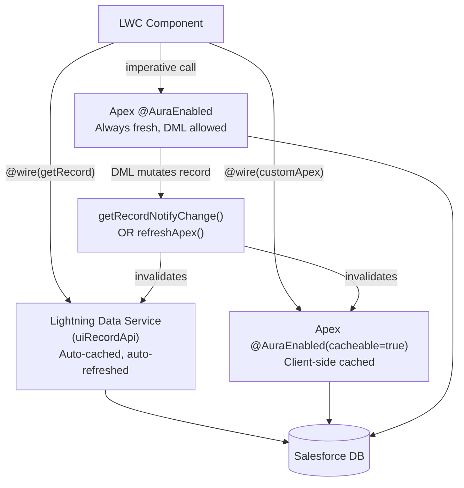

# LWC–Apex Integration

## Exam Domain
Process Automation & Logic — 21% of exam weight

## Foundations

LWC communicates with Apex through two mechanisms: the `@wire` service (declarative, cached, reactive) and imperative calls (programmatic, always fresh, supports DML). This lecture covers the complete pattern for each — including the Apex side requirements — and the patterns that combine them (wire for initial load, imperative for user-triggered mutations).

You also need to understand the Lightning Data Service (LDS) layer — the wire adapters like `getRecord`, `updateRecord`, `createRecord` from `lightning/uiRecordApi` that bypass custom Apex entirely for standard CRUD operations. LDS provides automatic caching, offline support, and record change notifications across components.

For PDII, the key exam scenarios are:
- What annotation is required on Apex for `@wire` to work?
- When does the wire adapter re-execute?
- What is the difference between returning a plain List and a wrapper class from Apex?
- How do you handle errors in both wire and imperative patterns?
- When should you use LDS (uiRecordApi) instead of custom Apex?

---

## Core Concepts

### Apex Side Requirements

```apex
public with sharing class AccountController {

    // @AuraEnabled(cacheable=true) — REQUIRED for @wire
    // cacheable=true: result is cached in client-side cache
    // Cannot perform DML in cacheable methods
    @AuraEnabled(cacheable=true)
    public static List<Account> getAccountsByIndustry(String industry) {
        return [
            SELECT Id, Name, Industry, AnnualRevenue, Rating
            FROM Account
            WHERE Industry = :industry
            WITH SECURITY_ENFORCED
            ORDER BY Name
        ];
    }

    // @AuraEnabled without cacheable=true — for DML or uncached reads
    // Can be called imperatively only (not with @wire)
    @AuraEnabled
    public static String syncAccountToERP(Id accountId) {
        // Call external system, update records — DML allowed
        Account acc = [SELECT Id, Name FROM Account WHERE Id = :accountId];
        // ... callout logic
        acc.ERP_Sync_Status__c = 'Synced';
        update acc;
        return 'SUCCESS';
    }

    // Returning wrapper class — useful when you need combined data
    @AuraEnabled(cacheable=true)
    public static AccountSummary getAccountSummary(Id accountId) {
        Account acc = [
            SELECT Id, Name, Industry, AnnualRevenue,
                   (SELECT Id, LastName, Email FROM Contacts LIMIT 5),
                   (SELECT Id, Name, StageName FROM Opportunities WHERE IsClosed = false LIMIT 5)
            FROM Account
            WHERE Id = :accountId
            WITH SECURITY_ENFORCED
        ];

        AccountSummary summary = new AccountSummary();
        summary.account = acc;
        summary.contactCount = acc.Contacts.size();
        summary.openOppCount = acc.Opportunities.size();
        summary.totalOpenRevenue = 0;
        for (Opportunity opp : acc.Opportunities) {
            if (opp.Amount != null) summary.totalOpenRevenue += opp.Amount;
        }
        return summary;
    }

    // Inner class — must be public and have @AuraEnabled fields
    public class AccountSummary {
        @AuraEnabled public Account account;
        @AuraEnabled public Integer contactCount;
        @AuraEnabled public Integer openOppCount;
        @AuraEnabled public Decimal totalOpenRevenue;
    }
}
```

**`@AuraEnabled` rules:**
- Method must be `public` or `global` and `static`
- `cacheable=true`: required for `@wire`; cannot contain DML, sends to client cache
- `cacheable=false` (default): used for imperative calls; can contain DML
- Inner class fields used by LWC must have `@AuraEnabled` annotation

### Wire + Imperative Combined Pattern

```javascript
// Best practice: wire for initial load, imperative for mutations
import { LightningElement, api, wire } from 'lwc';
import { refreshApex } from '@salesforce/apex';
import getAccountSummary from '@salesforce/apex/AccountController.getAccountSummary';
import updateAccountName from '@salesforce/apex/AccountController.updateAccountName';

export default class AccountSummaryCard extends LightningElement {
    @api recordId;

    // Wire for initial load and automatic refresh
    @wire(getAccountSummary, { accountId: '$recordId' })
    wiredSummary;

    get summary() { return this.wiredSummary.data; }
    get error() { return this.wiredSummary.error; }
    get isLoading() { return !this.wiredSummary.data && !this.wiredSummary.error; }

    isEditing = false;
    editName = '';
    isSaving = false;
    saveError = null;

    handleEditClick() {
        this.isEditing = true;
        this.editName = this.summary.account.Name;
    }

    handleNameChange(event) {
        this.editName = event.detail.value;
    }

    async handleSave() {
        this.isSaving = true;
        this.saveError = null;
        try {
            await updateAccountName({
                accountId: this.recordId,
                name: this.editName
            });
            this.isEditing = false;
            // Refresh the wired data to show updated name
            await refreshApex(this.wiredSummary);
        } catch (error) {
            this.saveError = error.body?.message || 'Save failed';
        } finally {
            this.isSaving = false;
        }
    }
}
```

### Lightning Data Service (LDS) — Standard Record Operations

For standard sObject CRUD without custom logic, use LDS wire adapters:

```javascript
import { LightningElement, api, wire } from 'lwc';
import { getRecord, updateRecord, createRecord, deleteRecord } from 'lightning/uiRecordApi';
import { getFieldValue } from 'lightning/uiRecordApi';
import { ShowToastEvent } from 'lightning/platformShowToastEvent';
import ACCOUNT_NAME_FIELD from '@salesforce/schema/Account.Name';
import ACCOUNT_INDUSTRY_FIELD from '@salesforce/schema/Account.Industry';

export default class AccountLDS extends LightningElement {
    @api recordId;

    @wire(getRecord, { recordId: '$recordId', fields: [ACCOUNT_NAME_FIELD, ACCOUNT_INDUSTRY_FIELD] })
    account;

    get name() { return getFieldValue(this.account.data, ACCOUNT_NAME_FIELD); }
    get industry() { return getFieldValue(this.account.data, ACCOUNT_INDUSTRY_FIELD); }

    async handleUpdate() {
        const fields = {};
        fields['Id'] = this.recordId;
        fields[ACCOUNT_NAME_FIELD.fieldApiName] = 'Updated Name';

        const recordInput = { fields };
        try {
            await updateRecord(recordInput);
            this.dispatchEvent(new ShowToastEvent({
                title: 'Success',
                message: 'Account updated',
                variant: 'success'
            }));
            // No need to refreshApex — LDS auto-refreshes all components watching this record
        } catch (error) {
            this.dispatchEvent(new ShowToastEvent({
                title: 'Error',
                message: error.body.message,
                variant: 'error'
            }));
        }
    }

    async handleCreate() {
        const fields = {
            Name: 'New Account',
            Industry: 'Technology'
        };
        const recordInput = { apiName: 'Account', fields };
        const result = await createRecord(recordInput);
        console.log('Created: ' + result.id);
    }

    async handleDelete() {
        await deleteRecord(this.recordId);
    }
}
```

**LDS vs Custom Apex — When to Use Each:**

| Scenario | Use LDS | Use Custom Apex |
|----------|---------|----------------|
| Standard CRUD on a single record | ✅ | ✗ |
| Reading multiple records with filters | ✗ | ✅ |
| Complex business logic on save | ✗ | ✅ |
| Aggregate queries / reports | ✗ | ✅ |
| Auto-refresh when record changes anywhere | ✅ | ✅ (with getRecordNotifyChange) |
| Field Security enforcement | ✅ (automatic) | ✅ (must use WITH SECURITY_ENFORCED) |

### Error Handling — Complete Pattern

```javascript
// Apex error structure returned by Salesforce:
// error.body.message — main error message
// error.body.output.errors[] — field-level errors from DML
// error.body.output.fieldErrors.FieldName[] — per-field DML errors

async handleSave() {
    try {
        await updateAccountName({ accountId: this.recordId, name: this.name });
    } catch (error) {
        if (error.body) {
            // Apex exception or DML error
            if (error.body.output && error.body.output.errors) {
                this.errorMessage = error.body.output.errors
                    .map(e => e.message)
                    .join(', ');
            } else {
                this.errorMessage = error.body.message;
            }
        } else if (error.message) {
            // JavaScript error (network, etc.)
            this.errorMessage = error.message;
        } else {
            this.errorMessage = JSON.stringify(error);
        }
    }
}
```

### ShowToastEvent — User Feedback

```javascript
import { ShowToastEvent } from 'lightning/platformShowToastEvent';

// Success toast
this.dispatchEvent(new ShowToastEvent({
    title: 'Success',
    message: 'Record saved successfully.',
    variant: 'success', // 'success', 'error', 'warning', 'info'
    mode: 'dismissable' // 'dismissable' (default), 'pester' (sticky), 'sticky'
}));

// Error toast with detail
this.dispatchEvent(new ShowToastEvent({
    title: 'Save Failed',
    message: '{0}',
    messageData: [error.body.message],
    variant: 'error',
    mode: 'sticky'
}));
```

---

## PTA / SA Relevance

### When This Comes Up in Engagements
The LWC–Apex integration design determines the performance profile of a Lightning page. Poorly designed integrations lead to:
- Multiple sequential Apex calls on page load (each wire adapter calls independently)
- Missing `cacheable=true` causing unnecessary server round-trips on every re-render
- Not using LDS for simple record reads — missing automatic cache invalidation across components

The question to ask in design reviews: "Which of these Apex calls can use LDS? Which need custom logic?" LDS operations are free from an API limit standpoint and benefit from automatic caching. Custom Apex calls contribute to the Apex execution time and SOQL limit budget.

### Common Partner Mistakes
- **DML in `@AuraEnabled(cacheable=true)` methods** — runtime error: "Callout or DML not allowed in cacheable Apex"
- **Not using `@AuraEnabled` on inner class fields** — wire returns null for those fields with no error
- **Not refreshing wired data after imperative DML** — component shows stale data after save
- **Apex method not `static`** — runtime error when called from wire/imperative

### Enterprise Scale Considerations
In high-traffic orgs, LDS caching reduces Apex execution significantly. A record page with 5 components all reading the same Account fields — using LDS, this is 1 server call, cached, shared. Using custom `@AuraEnabled(cacheable=true)`, each component may make its own call. Design for LDS where possible.

---

## Architecture



**Limitations:**
- `@AuraEnabled(cacheable=true)` cannot perform DML, callouts, or other write operations
- Wire adapters cannot be called conditionally — they always run when the component mounts
- LDS `getRecord` only returns fields explicitly requested — no relationship traversal like SOQL
- `refreshApex()` only works with the exact wired property variable, not a copy of it

---

## Key Facts to Memorize

- `@AuraEnabled(cacheable=true)` — required for `@wire`, no DML allowed
- `@AuraEnabled` (no cacheable) — for imperative calls, DML allowed
- Apex method for LWC must be `public static`
- Inner wrapper class fields must also have `@AuraEnabled`
- `refreshApex(wiredProperty)` — refreshes cached wired data after mutation
- `getRecordNotifyChange([{recordId}])` — invalidates LDS cache for a record across all components
- `getFieldValue(record, FIELD)` — safely extracts field value from LDS record (null-safe)
- `updateRecord({ fields: { Id: ..., FieldName: ... } })` — LDS update
- `createRecord({ apiName: 'Object', fields: {...} })` — LDS create
- `ShowToastEvent` from `lightning/platformShowToastEvent` — variants: success, error, warning, info
- `error.body.message` — standard Apex error message path in LWC catch blocks
- Wire does NOT re-run when reactive property unchanged — only runs when the `$property` value changes

---

## Exam Traps

- "A `@wire` adapter will call Apex automatically when the component renders, even if the parameter is null" — Partially true. Wire calls Apex on render but if a `$property` parameter is null/undefined, the wire may not execute (depends on the adapter). Check adapter documentation.
- "You can use DML in a cacheable Apex method" — False. `@AuraEnabled(cacheable=true)` prohibits DML. Throws: "System.SObjectException: DML is not allowed in this context."
- "refreshApex() works on any copy of the wired data" — False. `refreshApex()` must receive the exact wire property decorated with `@wire`, not a copy or a result extracted from it.
- "LDS automatically enforces FLS on getRecord" — True. LDS respects field-level security — inaccessible fields are not returned, no explicit enforcement code needed.
- "A static Apex method without @AuraEnabled can be called from LWC" — False. The `@AuraEnabled` annotation is required to expose an Apex method to LWC (or Aura components).

---

## Practice Questions

**Q:** A developer marks an Apex method with `@AuraEnabled(cacheable=true)` and uses it with `@wire` in LWC. After the component performs a DML update via an imperative Apex call, the wired data still shows the old values. What should the developer do?

**A:** Call `refreshApex(this.wiredProperty)` — where `wiredProperty` is the `@wire`-decorated instance variable. This invalidates the client-side cache for that wire call and triggers a fresh Apex execution. Alternatively, use `getRecordNotifyChange([{recordId}])` if using LDS wire adapters, which broadcasts a cache invalidation to all components watching that record.

---

**Q:** A developer needs to call an Apex method from LWC to create a new Account record (DML required). Can they use `@wire` for this call?

**A:** No. `@wire` requires `@AuraEnabled(cacheable=true)`, and `cacheable=true` prohibits DML operations. The developer must use an imperative Apex call: `import createAccount from '@salesforce/apex/AccountController.createAccount'` with `@AuraEnabled` (no cacheable), then call it as a function in an event handler: `const result = await createAccount({ name: this.name, industry: this.industry })`.
