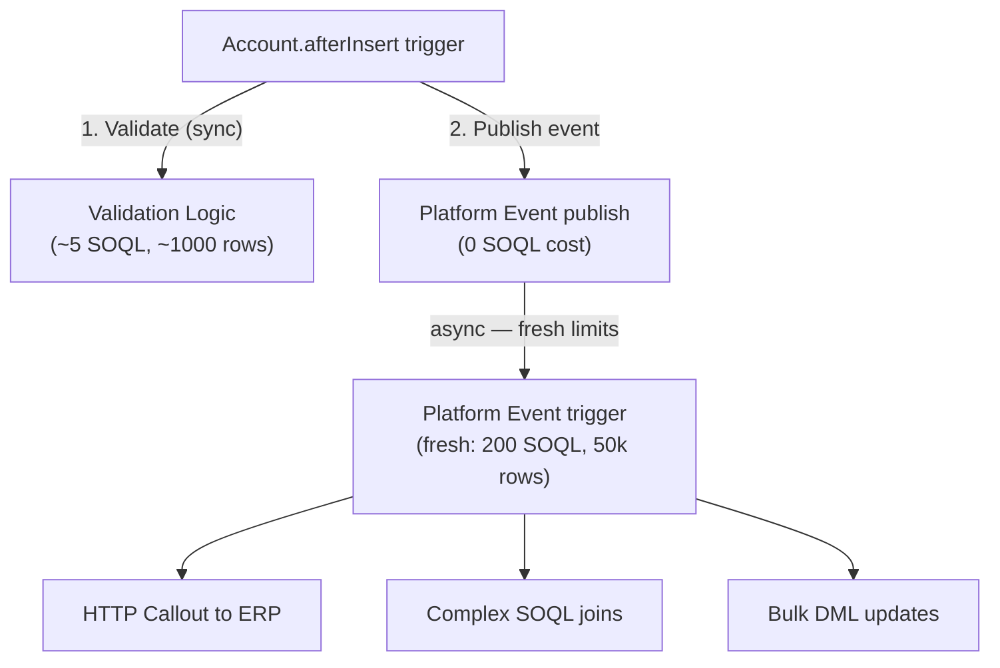
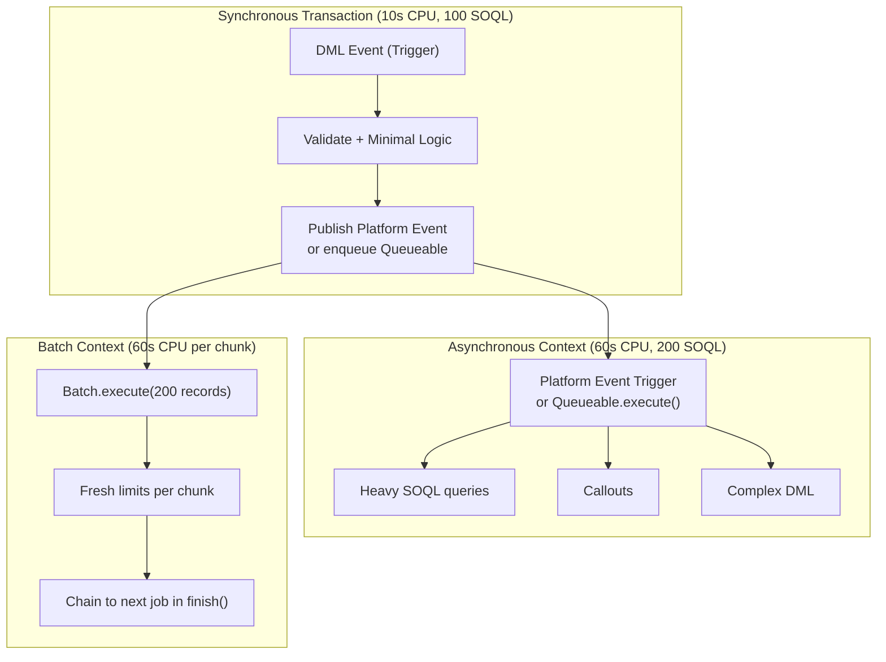

# Limit Management Architecture

## Exam Domain
Apex & Data Management — 27% of exam weight

## Foundations

Governor limits are the architectural constraints that define what's possible on the Salesforce platform. PDI teaches you the limits exist and what the numbers are. PDII asks: how do you *design systems* that respect limits at enterprise scale — and what happens when you don't?

Every architectural decision in a large Salesforce implementation is a governor limit decision:
- Should this run synchronously or asynchronously? → CPU and callout limits
- Should we use Batch Apex or Queueable? → concurrent job limits and heap limits
- Should we use triggers or Flow? → mixed limit consumption
- How many related records should a trigger query? → SOQL and row limits

The PDII exam tests limit architecture through scenario questions: "An org has 500k Accounts. A trigger on Opportunity queries all related Contacts. When 1,000 Opportunities are updated simultaneously, what breaks?" — the answer requires knowing that 1,000 × N contacts per opportunity can easily exceed 50,000 rows, and the fix is aggregate queries or a different data access pattern.

---

## Core Concepts

### The Complete Governor Limit Reference

**Per-Transaction Limits (Synchronous):**

| Limit | Value | Most Common Violation |
|-------|-------|----------------------|
| SOQL queries | 100 | SOQL in loop (trigger pattern) |
| SOQL rows | 50,000 | Queries without LIMIT on large objects |
| DML statements | 150 | DML in loop |
| DML rows | 10,000 | Batch update without chunking |
| CPU time | 10 seconds | String concat in loops, complex logic on large datasets |
| Heap size | 6 MB | Loading full sObject lists when only IDs needed |
| Callouts | 100 | Multiple callouts per transaction without batching |
| Max callout timeout | 120,000 ms | External system slow response |
| @future invocations | 50 | @future called in a loop |
| Queueable enqueues | 1 (in test) | Chain depth exceeded in tests |
| Push notifications | 10 | Mass trigger on mobile push |
| Email invocations | 10 | Messaging.sendEmail per transaction |

**Per-Transaction Limits (Asynchronous — same unless noted):**

| Limit | Async Value | Notes |
|-------|------------|-------|
| SOQL queries | 200 | Double the sync limit |
| CPU time | 60 seconds | 6× the sync limit |
| Heap size | 12 MB | Double the sync limit |

**Org-Wide Limits:**

| Limit | Value |
|-------|-------|
| Concurrent batch jobs | 5 active (Queued + Processing) |
| Scheduled jobs | 100 |
| Daily async Apex executions | 250,000 or 200× licenses |
| Daily Bulk API batches | 10,000 |
| Daily email | 5,000 to external recipients per user (Salesforce.com addresses unlimited) |
| Storage | Varies by edition |

### Limit Monitoring in Code

```apex
// Always check limits in complex transactions
public static void checkLimits(String checkpoint) {
    System.debug(checkpoint + ' — SOQL: ' + Limits.getQueries() + '/' + Limits.getLimitQueries()
        + ' | DML: ' + Limits.getDmlStatements() + '/' + Limits.getLimitDmlStatements()
        + ' | CPU: ' + Limits.getCpuTime() + '/' + Limits.getLimitCpuTime()
        + ' | Heap: ' + Limits.getHeapSize() + '/' + Limits.getLimitHeapSize()
    );
}

// Defensive guard — abort gracefully rather than fail with exception
public static Boolean isSafeToQuery(Integer needed) {
    return (Limits.getLimitQueries() - Limits.getQueries()) >= needed;
}

// Use in complex service classes with multiple SOQL paths
public List<Account> processAccounts(Set<Id> accountIds) {
    if (!isSafeToQuery(3)) {
        throw new LimitException('Insufficient SOQL quota for AccountService.processAccounts()');
    }
    // Safe to proceed with up to 3 queries
    List<Account> accounts = [SELECT Id, Name FROM Account WHERE Id IN :accountIds];
    // ...
}
```

### Recursive Trigger Prevention

Triggers firing each other is a common source of limit exhaustion:

```apex
// Pattern 1: Static boolean guard (simple, effective)
public class TriggerGuard {
    private static Map<String, Boolean> recursionMap = new Map<String, Boolean>();

    public static Boolean isFirstRun(String triggerContext) {
        if (recursionMap.containsKey(triggerContext)) {
            return false; // already ran this trigger in this transaction
        }
        recursionMap.put(triggerContext, true);
        return true;
    }
}

// In trigger:
trigger AccountTrigger on Account (after insert, after update) {
    if (TriggerGuard.isFirstRun('AccountTrigger.afterInsert') && Trigger.isInsert) {
        AccountTriggerHandler.afterInsert(Trigger.new);
    }
}
```

**Why recursion happens**: Trigger A updates Object B → Trigger B updates Object A → Trigger A runs again. Each cycle consumes DML and SOQL limits. Without a guard, this continues until a LimitException kills the transaction.

### Apex CPU Time Architecture

CPU time is consumed by:
- All Apex code execution
- SOQL query execution (yes, SOQL counts toward CPU time)
- DML execution (yes, DML counts too)
- JSON serialization/deserialization
- String operations (especially concatenation)

**CPU-intensive operations to avoid:**

```apex
// BAD — String concatenation in loop (O(n²))
String csv = '';
for (Account acc : accounts) {
    csv += acc.Name + ',' + acc.Industry + '\n'; // new String object each iteration
}

// GOOD — List.join() O(n)
List<String> rows = new List<String>();
for (Account acc : accounts) {
    rows.add(acc.Name + ',' + acc.Industry);
}
String csv = String.join(rows, '\n');

// BAD — JSON serialize/deserialize in a loop
for (Account acc : accounts) {
    String json = JSON.serialize(acc); // expensive per iteration
    Map<String, Object> map = (Map<String, Object>) JSON.deserializeUntyped(json);
}

// GOOD — operate on sObjects directly; serialize once at end if needed
```

### Heap Architecture

Heap is consumed by every object in memory — sObjects, Strings, Lists, Maps. The 6 MB limit sounds large until you're storing 10,000 Accounts in a Map.

```apex
// Estimating heap usage:
// A blank Account sObject ≈ 500 bytes (varies with fields)
// 10,000 Accounts × 500 bytes = ~5 MB → approaches 6 MB limit

// Pattern: Store minimal data in-memory, re-query when needed
// BAD — storing full sObjects
Map<Id, Account> accountMap = new Map<Id, Account>(
    [SELECT Id, Name, Industry, AnnualRevenue, Rating, /* 30 more fields */ FROM Account]
);

// GOOD — store only what you process
Map<Id, Decimal> revenueByAccount = new Map<Id, Decimal>();
for (Account acc : [SELECT Id, AnnualRevenue FROM Account WHERE ...]) {
    revenueByAccount.put(acc.Id, acc.AnnualRevenue);
}
// Map<Id, Decimal> ≈ 16 bytes per entry — 1000× more memory-efficient than full sObjects

// For very large datasets — use Batch Apex where each execute() chunk has fresh heap
```

### Transaction Finalization — Savepoints and Rollbacks

```apex
// Use savepoints when you need atomic operations within a transaction
Savepoint sp = Database.setSavepoint();
try {
    insert parentRecord;
    // If this fails, we want to undo the parent insert too
    insert childRecords;
} catch (DmlException e) {
    Database.rollback(sp); // undo both inserts
    throw new CustomException('Transaction failed: ' + e.getMessage(), e);
}
// Note: Savepoints consume from the DML statement limit (150)
// Rollback releases the DML rows but the savepoint still counts
```

### Async as Limit Escape Strategy

The architectural solution to synchronous limit pressure is always the same: identify which parts of the transaction can run asynchronously, and move them there.



This pattern (synchronous trigger does minimal work, fires event, async trigger does the heavy lifting) is the standard architectural pattern for limit-safe enterprise trigger design.

---

## Advanced Patterns

### Chunking Strategies for Limit Management

When a single transaction cannot process all records, chunk the work:

```apex
// Strategy 1: Batch Apex (most common — best for data processing)
Database.executeBatch(new ProcessAccountsBatch(), 200);

// Strategy 2: Queueable chain (for sequential processing with dependencies)
public class ChunkedProcessingJob implements System.Queueable {
    private List<Id> remainingIds;
    private static final Integer CHUNK_SIZE = 50;

    public ChunkedProcessingJob(List<Id> ids) { this.remainingIds = ids; }

    public void execute(System.QueueableContext ctx) {
        List<Id> chunk = new List<Id>();
        for (Integer i = 0; i < CHUNK_SIZE && !remainingIds.isEmpty(); i++) {
            chunk.add(remainingIds.remove(0));
        }
        // Process this chunk
        processChunk(chunk);

        if (!remainingIds.isEmpty()) {
            System.enqueueJob(new ChunkedProcessingJob(remainingIds)); // chain next chunk
        }
    }
}
```

---

## PTA / SA Relevance

### When This Comes Up in Engagements
Every customer's "org is slow" conversation is a limit conversation. The diagnosis process:
1. Pull Apex exception logs — any LimitExceptions? What type?
2. Review trigger architecture — SOQL in loops? DML in loops?
3. Check async job queue — batch jobs backed up (5-job limit hit)?
4. Review CPU time on complex transactions — anything > 5 seconds (50% of sync limit)?

As a PTA, you don't need to fix the code — but you need to diagnose the root cause and prescribe the right architectural change (async pattern, chunking strategy, index request).

### Common Partner Mistakes
- **"We'll just increase batch size to 2000 to go faster"** — batch size of 2000 means 2000 DML rows in one execute() call. If there's a SOQL-in-loop bug in execute(), 2000 queries fire at once. SOQL limit: 200 async. Fail.
- **No async strategy for trigger-heavy workflows** — all integration logic in synchronous trigger context. First data import blows up.
- **Not monitoring Daily Async Apex limit** — org hits 250,000 daily async executions due to batch job fragmentation. New jobs queue as "Holding" indefinitely.

### Enterprise Scale Considerations
At 10M+ records:
- Batch Apex with batch size 200 = 50,000 execute() calls for 10M records. Each execute has 200 SOQL limit. Even 1 query per execute = 50,000 SOQL calls total. This is fine — each execute is a separate transaction. But the async limit (250,000/day) caps total jobs across the org.
- A very active org (multiple batch jobs, triggers publishing events, scheduled jobs) approaches daily async limits. Architecture review should include async consumption projections.

---

## Architecture



**Limitations:**
- Savepoints count toward DML statement limit (150)
- Platform Events published with "Publish Immediately" still count against publish limit (150/tx) even if transaction rolls back
- Daily Async Apex execution limit includes ALL async types: @future, Batch executes, Queueable executes
- Queueable chain depth is unlimited in production but max 1 level deep in test context

---

## Key Facts to Memorize

- `Limits.getQueries()` — current SOQL count; `Limits.getLimitQueries()` — max (100 sync / 200 async)
- CPU time counts: Apex code + SOQL execution + DML execution + JSON ops
- Heap 6 MB sync / 12 MB async — full sObjects cost ~500 bytes each
- Savepoints count against DML statement limit (150)
- Batch concurrent limit: 5 active jobs (status = Queued or Processing)
- Daily async Apex executions: 250,000 or 200× licenses (whichever is greater)
- Static boolean guard prevents recursive triggers within the same transaction
- `Database.setSavepoint()` / `Database.rollback(sp)` for transaction atomicity
- SOQL for loop iterates in chunks of 200 — reduces heap but not row limit consumption
- Async context gets: 2× SOQL queries, 2× heap, 6× CPU vs synchronous

---

## Exam Traps

- "Async Apex has no governor limits" — False. Async has governor limits, but some are higher (200 SOQL, 12 MB heap, 60s CPU) than sync context.
- "Using savepoints eliminates DML from limit counting" — False. Savepoints themselves count as DML operations. Rollback undoes the data changes but the DML statement count is not restored.
- "Batch Apex with Database.Stateful has no heap limit" — False. Heap limit still applies — it's 12 MB (async). Stateful batch accumulates state in instance variables which consume heap.
- "Recursive triggers will run indefinitely until explicitly stopped" — False. Each recursive execution consumes limit units. The recursion stops naturally when a LimitException is thrown (e.g., 101st SOQL query). Without a guard, the exception propagates and rolls back the entire original transaction.
- "The 5-concurrent-batch-job limit applies per user, not per org" — False. It is an org-wide limit regardless of which user or process started the jobs.

---

## Practice Questions

**Q:** An org has a trigger on Contact that queries the Contact's parent Account and all related Opportunities. In production, a workflow tool updates 500 Contacts simultaneously. The trigger fails with `LimitException: Too many SOQL queries: 101`. What is the architectural fix?

**A:** The trigger is performing SOQL inside a loop (one Account query + one Opportunity query per Contact = 1000+ queries for 500 Contacts). Fix: move SOQL outside the loop. (1) Extract all AccountIds from `Trigger.new`, (2) query all Accounts in one query (`WHERE Id IN :accountIds`), (3) query all Opportunities for those accounts in one query (`WHERE AccountId IN :accountIds`), (4) build a Map<Id, Account> and Map<Id, List<Opportunity>> for lookup inside the loop. Total: 2 SOQL queries regardless of Contact volume.

---

**Q:** A Batch Apex job is started with `Database.executeBatch(new MyBatch(), 200)`. Each `execute()` method performs 3 SOQL queries. For a batch processing 10,000 records, how many total SOQL queries are executed and do they violate any limit?

**A:** 10,000 records ÷ 200 per batch = 50 `execute()` calls. Each execute() is a separate transaction with its own limit context. 3 SOQL queries per execute() = 3 total per transaction, well within the 200-query async limit. Total SOQL across all executions = 150, but this is not a single-transaction count — each execute() is independent. No limit violation.
