# Large Data Volumes

## Exam Domain
Apex & Data Management — 27% of exam weight

## Foundations

Large Data Volumes (LDV) is the Salesforce term for orgs with millions of records on key objects. The challenges that emerge at LDV don't exist at small scale — they appear suddenly when an org grows past a threshold (typically ~1M records on Account, Contact, or Case).

Three main problems at LDV:
1. **Query performance**: Non-selective queries on large objects cause full table scans, manifesting as "System.QueryException: Timeout" errors in Apex or reports that take minutes.
2. **Lock contention**: Many transactions updating the same records (parent rollup updates, master-detail re-parenting) create row-level lock waits and timeouts.
3. **Batch job runtime**: Processing 10M records means 50,000 Batch execute() calls at default batch size — long runtimes that overlap with business hours.

PDII tests LDV architecture patterns: skinny tables, external IDs, archiving strategies, SOQL optimization for large objects, and when to escalate to Salesforce Support for infrastructure help.

---

## Core Concepts

### SOQL Selectivity and Indexes

**Selective vs non-selective queries:**
A SOQL query is "selective" if its WHERE clause filters on an indexed field and the result set is less than approximately 10% of the object's total records. Salesforce processes selective queries using index lookups — fast regardless of object size. Non-selective queries require full table scans.

Indexed fields (automatic):
- `Id` (always indexed)
- `Name`, `OwnerId`, `CreatedDate`, `SystemModstamp`
- External ID fields (when "Unique" or "External ID" checked)
- RecordTypeId
- Master-detail and lookup relationship fields

```apex
// NON-SELECTIVE — no indexed field in WHERE, full table scan on 5M records → TIMEOUT
[SELECT Id, Name FROM Account WHERE Industry = 'Technology' AND Rating = 'Hot']
// Industry and Rating are not indexed — full scan required

// SELECTIVE — OwnerId is indexed, result is < 10% of records → FAST
[SELECT Id, Name FROM Account WHERE OwnerId = :userId AND Industry = 'Technology']

// ALSO SELECTIVE — external ID is indexed
[SELECT Id, Name FROM Account WHERE External_Id__c = :extId]
```

**Requesting custom indexes (via Salesforce Support):**
For non-standard fields that are frequently filtered on large objects, request custom indexes through Salesforce Support. Custom indexes:
- Are created at no additional cost for eligible fields
- Dramatically speed up queries filtering on that field
- Not supported on: formula fields, text areas (long), multi-select picklists, compound fields (Address, Geolocation)

**Two-column indexes:**
For queries filtering on two non-indexed fields together, a two-column (composite) index can be created. E.g., `Industry` + `Rating` as a combined index serves `WHERE Industry = 'Tech' AND Rating = 'Hot'`.

### SOQL Optimization Patterns for LDV

```apex
// Pattern 1: Add selectivity with indexed fields
// BAD — non-selective on 5M Opportunities
[SELECT Id, Amount FROM Opportunity WHERE StageName = 'Closed Won' AND Amount > 100000]

// GOOD — add indexed field to filter set
[SELECT Id, Amount FROM Opportunity
 WHERE StageName = 'Closed Won'
 AND Amount > 100000
 AND OwnerId = :userId] // OwnerId is indexed — makes query selective

// Pattern 2: Date-based filtering (CreatedDate / LastModifiedDate are indexed)
[SELECT Id, Name FROM Account WHERE LastModifiedDate >= :thirtyDaysAgo]

// Pattern 3: Use External ID for upsert (avoids pre-query for existing records)
upsert accounts Account.External_Id__c;

// Pattern 4: SOQL for loop to avoid heap pressure
for (List<Account> batch : [SELECT Id, Name FROM Account WHERE Industry = 'Technology']) {
    // Each chunk is 200 records — heap never holds all 1M records at once
    processBatch(batch);
}

// Pattern 5: Aggregate to count/sum instead of returning rows
[SELECT COUNT(Id) cnt, SUM(Amount) total FROM Opportunity
 WHERE AccountId = :accId AND StageName = 'Closed Won']
// Returns 1 row regardless of how many Opps match
```

### Skinny Tables

Skinny tables are an internal Salesforce performance optimization. When requested through Salesforce Support, Salesforce creates a separate, narrow copy of an object's most-queried columns. Queries against those columns hit the skinny table instead of the full wide object table.

- Skinny tables are maintained automatically by the platform as records change
- Only available for standard and custom objects
- Typically used for large reporting objects where 5–10 specific fields are queried constantly
- Not user-configurable — must be requested from Salesforce Support with the specific fields
- Dramatically speeds up reports and list views on those fields

**When to recommend skinny tables:**
- Object has > 1M records
- Specific field combinations are used in high-frequency reports, list views, or SOQL
- Query timeouts occur even with indexed fields due to I/O volume

### External IDs — Integration and Data Architecture

External IDs are custom fields marked as "External ID" (and optionally "Unique"). They serve multiple purposes:

```apex
// 1. Upsert without pre-query — single DML instead of SOQL + DML
List<Account> externalAccounts = getFromExternalSystem();
upsert externalAccounts Account.External_Identifier__c;
// Creates if External_Identifier__c doesn't exist; updates if it does
// No SOQL needed to find existing records

// 2. Parent relationship in data loads (Salesforce ID not known)
Contact c = new Contact(
    LastName = 'Smith',
    Account = new Account(External_Identifier__c = 'EXT-001')
    // Instead of AccountId = '001xx...' — references parent by external ID
);
insert c;

// 3. Integration deduplication — always query by external ID to check before insert
List<Account> existing = [
    SELECT Id FROM Account WHERE External_Identifier__c = :extId LIMIT 1
];
if (existing.isEmpty()) {
    insert new Account(Name = 'New Account', External_Identifier__c = extId);
}
```

### Data Archiving Patterns

For objects with rapid data growth (Cases, Logs, Events), archiving old records maintains query performance:

```apex
// Big Objects — native Salesforce archiving solution
// Big Object: custom metadata type ending in __b
// Use for cold data that needs to be retained but rarely queried

// Archive pattern: query old data, insert to Big Object, delete from standard object
public class CaseArchiveBatch implements Database.Batchable<sObject> {
    private Date cutoffDate = Date.today().addYears(-3);

    public Database.QueryLocator start(Database.BatchableContext bc) {
        return Database.getQueryLocator([
            SELECT Id, CaseNumber, Subject, CreatedDate, Status, AccountId
            FROM Case
            WHERE CreatedDate < :cutoffDate
            AND Status = 'Closed'
        ]);
    }

    public void execute(Database.BatchableContext bc, List<Case> cases) {
        List<Case_Archive__b> archives = new List<Case_Archive__b>();
        for (Case c : cases) {
            archives.add(new Case_Archive__b(
                Case_Number__c = c.CaseNumber,
                Subject__c = c.Subject,
                Created_Date__c = c.CreatedDate,
                Account_Id__c = c.AccountId
            ));
        }
        Database.insertImmediate(archives); // Big Object uses insertImmediate, not insert
        delete cases; // Remove from standard Case object
    }

    public void finish(Database.BatchableContext bc) {}
}
```

**Big Objects characteristics:**
- `Database.insertImmediate()` instead of `insert` for DML
- Cannot be queried with `SOQL WHERE` on non-indexed fields
- Queried with SOQL but must filter on indexed fields (defined in Big Object metadata)
- Max 1 query per transaction for Big Objects
- Cannot be related to standard/custom objects via lookup (no relationship fields)

### Pagination for Large Result Sets

```apex
// BAD — OFFSET pagination (fails for large sets, max OFFSET = 2000)
[SELECT Id, Name FROM Account ORDER BY Name OFFSET 5000 LIMIT 100]
// Throws if OFFSET > 2000

// GOOD — keyset pagination using last-seen ID or sorted field value
String lastId = '001xx000000ABC';
[SELECT Id, Name FROM Account WHERE Id > :lastId ORDER BY Id ASC LIMIT 200]
// Works for any number of pages

// GOOD — date-based pagination for chronological data
DateTime lastSeen = DateTime.now().addDays(-30);
[SELECT Id, Name FROM Account WHERE CreatedDate > :lastSeen ORDER BY CreatedDate ASC LIMIT 200]

// SOQL cursor approach (Batch Apex QueryLocator handles this automatically)
// For manual processing: use the Batch Apex pattern instead of manual OFFSET
```

### Data Skew and Lock Contention

**Account data skew**: When a single Account has 10,000+ child records (Contacts, Opportunities), any operation on those children causes parent record lock contention. DML on any child locks the parent — 10,000 simultaneous updates to Contacts under one Account cause timeouts.

```apex
// Solution for high-skew scenarios:
// 1. Avoid parent-locking DML in triggers (move to async)
// 2. Use Platform Events for decoupling
// 3. Request data repartitioning with Salesforce Support

// Detection in SOQL:
// Orgs with data skew: one Account with 50k+ child records
AggregateResult[] skewAccounts = [
    SELECT AccountId, COUNT(Id) cnt
    FROM Contact
    GROUP BY AccountId
    HAVING COUNT(Id) > 10000
    ORDER BY COUNT(Id) DESC
    LIMIT 10
];
```

**OWD lock contention**: When `OwnerId` is concentrated on a few users (service accounts, integration users), many transactions compete for the same records, causing lock timeouts.

---

## PTA / SA Relevance

### When This Comes Up in Engagements
LDV architecture is a consulting engagement trigger: a customer with 5M+ records on Account or Case who is experiencing slow reports, query timeouts, or batch job failures. The engagement path:
1. Assess current data volumes and growth rate
2. Identify non-selective queries (request query explain plans or Salesforce Support logs)
3. Recommend: custom indexes, skinny tables, archiving strategy, SOQL refactoring
4. Estimate timeline: custom indexes take days via Support; skinny tables take weeks

For a PTA advising a customer pre-implementation, the conversation is proactive: "Based on your expected data volumes, here's what you'll need to architect today to avoid performance problems at year 3."

### Common Partner Mistakes
- **OFFSET pagination** — built for development convenience, fails silently at > 2000 offset
- **Full sync data loads without external IDs** — each sync pre-queries for existing records; at 500k records, this is 500k SOQL rows consumed before the actual sync begins
- **Triggers without SOQL selectivity awareness** — works fine with 10,000 records in development, fails at 1M in production
- **Big Objects as a general archiving strategy** — Big Objects lack query flexibility; if the archived data is ever queried by non-indexed fields, there's no solution

### Enterprise Scale Considerations
- Custom index requests must be planned months ahead of go-live if the object will start with millions of records (migration project scenario)
- Skinny table design requires knowing which fields will be queried together — a data modeling conversation, not just a performance optimization
- Archiving strategy should be documented in the data retention policy — regulatory requirements (GDPR, HIPAA) may dictate when records must be archived or deleted

---

## Architecture

```mermaid
flowchart TD
    QUERY["SOQL Query on Large Object\n(1M+ records)"] --> SEL{"Selective?<br/>(indexed field,<br/><10% result)"}
    SEL -->|"Yes"| FAST["Index lookup → fast"]
    SEL -->|"No"| SLOW["Full table scan → possible timeout"]
    SLOW --> FIX1["Add indexed field to WHERE\n(OwnerId, CreatedDate, ExternalId)"]
    SLOW --> FIX2["Request custom index\n(Salesforce Support)"]
    SLOW --> FIX3["Request skinny table\n(Salesforce Support)"]

    subgraph "Data Growth Architecture"
        HOT["Hot Data (active)\nStandard/Custom Object\nFull SOQL capability"]
        WARM["Warm Data (recent)\nStandard Object\nWith archiving triggers"]
        COLD["Cold Data (archived)\nBig Object __b\nlimitied SOQL"]
        HOT --> WARM
        WARM --> COLD
    end
```



**Limitations:**
- Custom index requests: 5-10 business day SLA from Salesforce Support; cannot create yourself
- Skinny table creation: requires careful field selection; must be planned before deployment
- Big Objects: `insertImmediate` — not transactional (cannot rollback)
- Big Object queries: must filter on indexed columns (defined in metadata); `COUNT()`, `LIMIT` supported; `ORDER BY` only on indexed columns
- External ID fields used as upsert keys must be marked both "External ID" AND "Unique" for guaranteed deduplication

---

## Key Facts to Memorize

- Selective query threshold: approximately 10% of object's records; result must also be < 1M rows
- Automatically indexed fields: Id, Name, OwnerId, CreatedDate, SystemModstamp, RecordTypeId, External ID fields, lookup/master-detail fields
- Custom indexes: requested via Salesforce Support; not supported on formula fields, long text areas, multi-select picklists
- Skinny table: subset of columns stored separately for fast reads; requested via Salesforce Support
- `OFFSET` max value in SOQL: 2,000 — keyset pagination for larger datasets
- Big Object DML: `Database.insertImmediate(records)` — NOT `insert`
- Big Object SOQL: must filter on indexed columns; limited query flexibility
- External ID fields: require "External ID" checkbox (and optionally "Unique") for deduplication
- `upsert list Object.External_Id__c` — single DML that creates or updates by external ID
- Data skew: single parent with > 10,000 child records → parent lock contention on child DML
- LDV thresholds (general): > 1M records on standard objects; > 100k records on custom objects

---

## Exam Traps

- "SOQL OFFSET can be used for pagination on any size result set" — False. OFFSET is limited to 2,000. For larger datasets, use keyset pagination (Id-based or date-based).
- "An external ID field is automatically indexed" — True, but only if it's marked "External ID" (checkbox in field definition). A text field with external ID data but without the checkbox is NOT indexed.
- "Big Objects support the same SOQL queries as standard objects" — False. Big Objects require filtering on indexed columns and have limited query flexibility (no WHERE on non-indexed fields, no JOINs, no relationship queries).
- "Skinny tables are created automatically by Salesforce when an object grows large" — False. Skinny tables must be requested explicitly through Salesforce Support with the specific fields to include.
- "Data skew only affects query performance, not DML performance" — False. Data skew (many child records under one parent) causes lock contention on the parent record during child DML, leading to DML timeouts.

---

## Practice Questions

**Q:** An org has 3 million Account records. A report filters on `Industry = 'Technology' AND Rating = 'Hot'`. The report times out. Neither `Industry` nor `Rating` is indexed. What is the recommended fix, and what is NOT a fix?

**A:** Recommended fixes: (1) Request a custom index on `Industry` from Salesforce Support — this makes industry-filtered queries selective; (2) Request a two-column composite index on `Industry` + `Rating` for queries using both fields together; (3) Add a selectivity-improving indexed field to the filter (like OwnerId or CreatedDate), though this changes the report scope. NOT a fix: adding SOQL LIMIT (doesn't help reports), adding `WITH SECURITY_ENFORCED` (unrelated), or changing the batch size (this isn't Batch Apex). Formula fields and multi-select picklists cannot have custom indexes.

---

**Q:** An integration tool needs to upsert 100,000 Account records daily. Each Account has an `External_System_Id__c` field. What is the most efficient approach for the upsert operation?

**A:** Use `upsert accountList Account.External_System_Id__c` with `External_System_Id__c` marked as both an "External ID" and "Unique" field. This performs a single DML operation: for each record, if `External_System_Id__c` matches an existing Account, it updates that record; if not, it inserts a new one. This eliminates the need to pre-query for existing records (which would consume 50,000 SOQL rows), and the external ID index makes the lookup fast. For 100,000 records, use Bulk API 2.0 to stay within REST API call limits.
