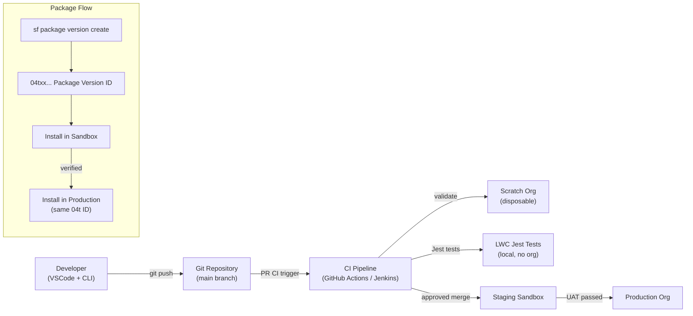

# Deployment Best Practices

## Exam Domain
Debug & Deployment — 15% of exam weight

## Foundations

Deployment in Salesforce has three eras:
1. **Change Sets** (legacy): point-and-click, org-dependent, no version control, no scripting
2. **Metadata API / Salesforce CLI** (modern): file-based, version-controlled, scriptable
3. **Unlocked Packages / 2GP** (advanced): modular, versioned, dependency-tracked

PDII tests the modern approach: source format, Salesforce CLI commands, scratch orgs, unlocked packages, and what CI/CD looks like for Salesforce.

For a PDI developer who only knows change sets, the key mental shift is: **everything is a file**. Metadata lives in `force-app/main/default/` as XML and JSON files. Deployments are `sf deploy metadata`. Environments are scratch orgs created from a definition file. Version control (Git) is the source of truth, not any org.

---

## Core Concepts

### Salesforce DX Project Structure

```
myproject/
├── sfdx-project.json          ← Project config: package directories, API version, namespace
├── .forceignore               ← Like .gitignore — what to exclude from deploys/retrieves
├── config/
│   └── project-scratch-def.json  ← Scratch org shape definition
├── force-app/
│   └── main/
│       └── default/
│           ├── classes/       ← Apex classes (.cls + .cls-meta.xml)
│           ├── triggers/      ← Apex triggers (.trigger + .trigger-meta.xml)
│           ├── lwc/           ← LWC components (folder per component)
│           ├── aura/          ← Aura components
│           ├── objects/       ← Custom objects + fields
│           │   └── Account/
│           │       ├── Account.object-meta.xml
│           │       └── fields/
│           │           └── Custom_Field__c.field-meta.xml
│           ├── permissionsets/
│           ├── flows/
│           ├── layouts/
│           └── staticresources/
└── scripts/
    └── apex/
        └── setup.apex         ← Anonymous Apex for org setup
```

```json
// sfdx-project.json
{
  "packageDirectories": [
    {
      "path": "force-app",
      "default": true,
      "package": "MyApp",
      "versionName": "Summer 24",
      "versionNumber": "1.2.0.NEXT"
    }
  ],
  "name": "MyApp",
  "namespace": "",
  "sourceApiVersion": "61.0"
}
```

### Salesforce CLI — Core Commands

```bash
# Authentication
sf org login web --alias MySandbox --instance-url https://test.salesforce.com
sf org login web --alias MyDevOrg
sf org list
sf org logout --target-org MySandbox

# Scratch Org Management
sf org create scratch --definition-file config/project-scratch-def.json --alias MyScratch --duration-days 30
sf org open --target-org MyScratch
sf org delete scratch --target-org MyScratch --no-prompt

# Source Push/Pull (scratch orgs only — bidirectional sync)
sf project deploy start --target-org MyScratch    # push local → org
sf project retrieve start --target-org MyScratch  # pull org → local

# Deploy to sandbox/production (one-way)
sf project deploy start --target-org MySandbox
sf project deploy start --target-org MySandbox --dry-run  # validate without deploy
sf project deploy start --source-dir force-app/main/default/classes --target-org MySandbox  # specific path

# Retrieve specific metadata
sf project retrieve start --metadata ApexClass:AccountService --target-org MySandbox
sf project retrieve start --metadata "CustomObject:Account,ApexClass" --target-org MySandbox

# Run tests
sf apex run test --target-org MySandbox --test-level RunAllTestsInOrg --result-format human
sf apex run test --target-org MySandbox --test-level RunSpecifiedTests --tests AccountServiceTest
sf apex run test --target-org MySandbox --test-level RunLocalTests  # excludes managed package tests

# Deploy with test run
sf project deploy start --target-org MySandbox --test-level RunLocalTests

# Execute anonymous Apex
sf apex run --target-org MySandbox --file scripts/apex/setup.apex

# Package creation and installation (unlocked packages)
sf package create --name "My Unlocked Package" --type Unlocked --path force-app
sf package version create --package "My Unlocked Package" --installation-key ""
sf package install --package 04txx000000001AAA --target-org MySandbox
```

### Scratch Orgs — Definition File

```json
// config/project-scratch-def.json
{
  "orgName": "My Dev Org",
  "edition": "Developer",
  "features": [
    "EnableSetPasswordInApi",
    "Communities",
    "Walkthroughs"
  ],
  "settings": {
    "lightningExperienceSettings": {
      "enableS1DesktopEnabled": true
    },
    "securitySettings": {
      "sessionSettings": {
        "forceRelogin": false
      }
    },
    "mobileSettings": {
      "enableS1EncryptedStoragePref2": false
    }
  },
  "hasSampleData": false
}
```

Scratch org duration: max 30 days for trial/partner orgs; 7 days default; specify with `--duration-days`.

### CI/CD Pipeline Architecture

A production-grade Salesforce CI/CD pipeline:

```yaml
# .github/workflows/validate-pr.yml (GitHub Actions example)
name: Validate Pull Request

on:
  pull_request:
    branches: [ main ]

jobs:
  validate:
    runs-on: ubuntu-latest
    steps:
      - uses: actions/checkout@v3

      - name: Install Salesforce CLI
        run: npm install @salesforce/cli --global

      - name: Authenticate to Org
        run: sf org login sfdx-url --sfdx-url-file .sfdx-auth-url --alias TargetOrg

      - name: Run LWC Jest Tests
        run: npm run test:unit

      - name: Validate Deploy (No Apex Tests)
        run: |
          sf project deploy start \
            --target-org TargetOrg \
            --dry-run \
            --test-level NoTestRun

      - name: Validate Deploy with Local Tests
        run: |
          sf project deploy start \
            --target-org TargetOrg \
            --dry-run \
            --test-level RunLocalTests
```

### Deployment Strategies

**Strategy 1: Source-Based Deploy to Sandbox → Production**
```bash
# 1. Developer works in scratch org — push/pull
# 2. PR merged to main branch
# 3. CI validates against sandbox
# 4. Deploy to staging sandbox for UAT
# 5. Deploy to production after UAT sign-off
sf project deploy start --target-org Production --test-level RunLocalTests
```

**Strategy 2: Unlocked Package Versioning**
```bash
# 1. Create package version
sf package version create --package "My Package" --installation-key "" --wait 20

# 2. Install in sandbox for testing
sf package install --package 04txx000000001AAA --target-org Sandbox

# 3. After testing, install same package version in production — deterministic
sf package install --package 04txx000000001AAA --target-org Production
# Same package version = same metadata — no drift between environments
```

**Unlocked Packages advantages:**
- Version-controlled deployments — install the same `04t` ID in any org
- Dependency management — packages can declare dependencies on other packages
- Modular — separate packages for different functional areas
- Deterministic — what you test in sandbox is exactly what goes to production

### Org-Dependent Packages vs Unlocked Packages vs 2GP

| Type | Namespace Required | Dependencies | Use Case |
|------|------------------|-------------|---------|
| Unlocked Package | No | Explicit | Enterprise internal deployment |
| 2nd Gen Managed Package (2GP) | Yes | Explicit | ISV/AppExchange distribution |
| Org-Dependent Package | No | Implicit (org-aware) | Legacy migration from change sets |

### Metadata Coverage — What Goes in Source Control

Always in source control:
- All Apex classes, triggers, test classes
- All LWC and Aura components
- All custom objects, fields, page layouts, record types
- Permission sets (NOT profiles — too org-specific)
- Flows
- Custom Metadata Types (and their records)
- Named Credentials (without secrets)
- Custom Labels

Never in source control:
- Org-specific settings (company information, business hours)
- User records, role hierarchy
- Connected App consumer secrets
- Custom Setting data (use Custom Metadata instead)
- Dashboards with org-specific report folders (usually)

### Apex Test Level Options for Deployment

| Test Level | What Runs | Use Case |
|-----------|-----------|---------|
| `NoTestRun` | Nothing | Metadata-only changes (no Apex) |
| `RunSpecifiedTests` | Named classes only | Quick iteration in sandbox |
| `RunLocalTests` | All tests NOT from managed packages | Standard CI/CD |
| `RunAllTestsInOrg` | Everything including managed | Full org validation (pre-production) |

Production deployments always require at least `RunLocalTests` (or `RunAllTestsInOrg`) — you cannot deploy to production with `NoTestRun` unless deploying metadata with no Apex.

---

## PTA / SA Relevance

### When This Comes Up in Engagements
DevOps maturity is a key differentiator between teams that deliver reliably and those that accumulate technical debt through uncontrolled change sets. As a PTA:
- In discovery, assess DevOps maturity: "How do you deploy to production? Do you have a CI pipeline? Source control?"
- Change sets = high risk — manual, error-prone, no history, no rollback
- Salesforce CLI + GitHub = standard — automated validation, version history, team collaboration
- Unlocked packages = advanced — appropriate for large teams, ISVs, or multi-org architectures

When a customer has production incidents from failed deployments, it's almost always a change-set-based process. The recommendation to move to source-driven development is both a technical and a business case — it reduces deployment time, improves quality, and enables parallel development.

### Common Partner Mistakes
- **Change sets between sandboxes** — slow, manual, creates org drift. Use Salesforce CLI + source control for all environment management.
- **Profiles in source control** — profiles are massive XML files that capture all permission assignments. They change with every metadata addition. Use permission sets instead.
- **No scratch org in development** — developers sharing sandboxes collide. Scratch orgs give each developer their own isolated environment.
- **Deploying to production without CI validation** — testing only in sandbox, then hoping production deploys cleanly. CI validates on every PR.
- **Not separating Custom Metadata from Custom Settings** — Custom Setting data cannot be deployed; Custom Metadata records can. Use Custom Metadata for configuration that needs to flow between environments.

### Enterprise Scale Considerations
Large enterprise implementations often have:
- 5+ sandboxes (Dev, QA, Staging, UAT, Performance)
- 3+ development teams working in parallel
- Monthly release cycles

Unlocked packages enable parallel development by giving each team their own package. Packages have explicit version dependencies — "Package A v1.3 requires Package B v2.1+" — preventing integration surprises at deployment time.

---

## Architecture



**Limitations:**
- Scratch orgs have a 200-per-day creation limit per Dev Hub
- Package installs in production require all Apex tests to pass
- Unlocked packages cannot contain some metadata types (profiles, certain report types)
- Production deployments require 75% code coverage across ALL Apex (not just deployed classes)
- Rollback in Salesforce is limited — `sf project deploy cancel` can abort in-flight deploys, but there's no "undo last deployment" for completed deploys

---

## Key Facts to Memorize

- Source format directory: `force-app/main/default/` with subfolders per metadata type
- `sf project deploy start` — deploy to a non-scratch org
- `sf project retrieve start` — pull metadata from org to local
- `sf project deploy start` + `sf project retrieve start` work for sandboxes/production
- `sf project deploy start` / `sf project retrieve start` — directional (push/pull) only for scratch orgs
- `--dry-run` on deploy — validates without actually deploying (runs tests, checks coverage)
- Test levels: `NoTestRun`, `RunSpecifiedTests`, `RunLocalTests`, `RunAllTestsInOrg`
- Production deployments require `RunLocalTests` minimum (unless no Apex)
- Scratch org max duration: 30 days; created from `project-scratch-def.json`
- Unlocked package install key: `04t...` format version ID
- `sf package version create` creates a new version; `sf package install` installs
- `.forceignore` — excludes metadata from push/pull (like .gitignore)
- Custom Metadata records are deployable; Custom Setting data is NOT
- Use Permission Sets in source control, not Profiles

---

## Exam Traps

- "Change sets are the recommended deployment approach for Salesforce DX projects" — False. Salesforce DX is designed around source control and CLI-based deployment.
- "Running `sf project deploy start` to a scratch org is directional (one-way)" — False. The recommended approach for scratch orgs uses `sf project deploy start` / `sf project retrieve start` which are directional (not bidirectional). Use `sf project deploy start` for pushing changes to the scratch org or other environments.
- "A production deployment with 74% code coverage will succeed" — False. 75% is the minimum. A deployment with 74.9% fails.
- "Profiles should be stored in source control because they capture all permissions" — False (as a recommendation). Profiles are too org-specific and volatile for reliable source control management. Permission Sets are the recommended approach.
- "`NoTestRun` can be used for production deployments that include Apex" — False. `NoTestRun` can only be used for metadata-only deployments (no Apex classes/triggers). Any deployment that includes Apex requires tests to run.
- "Unlocked Packages require a namespace" — False. Unlocked Packages do not require a namespace (unlike Managed Packages which require one for AppExchange distribution).

---

## Practice Questions

**Q:** A developer wants to validate that a deployment will succeed in a sandbox (including running all local Apex tests) without actually making any changes to the org. Which command accomplishes this?

**A:** `sf project deploy start --target-org MySandbox --dry-run --test-level RunLocalTests`. The `--dry-run` flag validates the deployment (checking metadata validity, running Apex tests, checking code coverage) without committing any changes to the org. If the validation passes, the developer can then run the same command without `--dry-run` to deploy for real. This is also called a "check-only deploy."

---

**Q:** A developer is building a CI/CD pipeline for a team of 8 Salesforce developers. Each developer works in their own environment. Deployments to the staging sandbox must run all local Apex tests and achieve 75% coverage. What environment strategy supports this?

**A:** Scratch Orgs for individual developers (each developer creates their own scratch org from the project definition file — isolated, disposable, no sandbox collisions), a shared staging sandbox for integration testing, and a CI pipeline (e.g., GitHub Actions) that: (1) runs LWC Jest tests locally, (2) validates the deploy to staging with `--dry-run --test-level RunLocalTests` on every PR, and (3) deploys to staging on merge to main. This gives isolated development environments, automated validation, and a clean promotion path to production.
