# Advanced Administrator Cheat Sheet (CRT-211)

> Reference-quality, exam-night condensed guide. Every section maps to a weighted exam domain.

---

## Exam Quick Stats

| Item | Detail |
|------|--------|
| Exam Code | CRT-211 |
| Questions | 60 scored + 5 unscored pilot |
| Pass Score | 65% (39/60) |
| Time | 105 minutes |
| Format | Multiple choice, multiple select |
| Prerequisite | Active Salesforce Administrator (ADM-201 / SCA) certification |
| Delivery | Webassessor / Trailhead; proctored online or in-person |
| Retake Policy | 1 free retake; subsequent retakes require fee |

---

## Domain Weights Table

| Domain | Weight |
|--------|--------|
| Security & Access | 20% |
| Extending Custom Objects & Applications | 8% |
| Auditing & Monitoring | 6% |
| Sales Cloud | 10% |
| Service Cloud | 11% |
| Data Management | 10% |
| Process Automation | 21% |
| Reporting & Dashboards | 14% |
| **Total** | **100%** |

> Process Automation (21%) + Security & Access (20%) = 41% of the exam. Master these first.

---

## Security & Access Quick Reference

### Object-Level Security (Profiles & Permission Sets)
- **Profile**: baseline permissions; every user has exactly one
- **Permission Set**: additive permissions on top of profile; a user can have many
- **Permission Set Group**: bundle of permission sets; can mute specific permissions with a Muting Permission Set

### Field-Level Security
- Profile FLS or Permission Set FLS (neither is "better"; both enforce simultaneously, most permissive wins — BUT a muting perm set can restrict)
- Read vs Edit. No "Delete" at field level.

### OWD Options by Object Type

| OWD Setting | Applies To | Effect |
|---|---|---|
| Private | Any object | Only record owner + role hierarchy above them |
| Public Read Only | Any object | Everyone can read; only owner + hierarchy can edit |
| Public Read/Write | Any object | Everyone can read and edit |
| Public Read/Write/Transfer | Lead, Case only | Everyone can read, edit, and change owner |
| Controlled by Parent | Detail objects (child) | Access is inherited from master record |
| Full Access | Campaign Members only | Can view, edit, delete, and transfer |

**Key rules:**
- OWD can ONLY open access — it sets the baseline floor
- Sharing rules, manual sharing, teams can only ADD access above OWD
- You cannot use sharing rules to restrict access below OWD

### Role Hierarchy

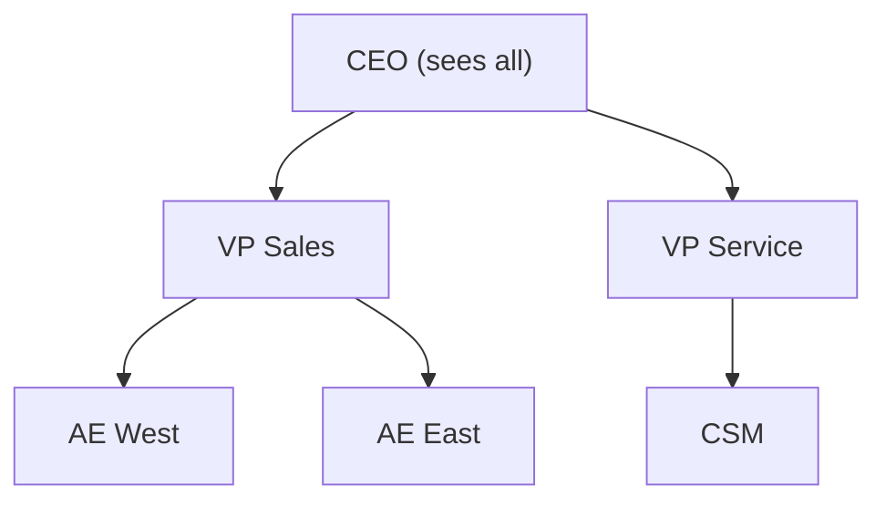

- Access flows **UP** the hierarchy — a manager sees subordinates' records
- **Grant Access Using Hierarchies** checkbox: present on **custom objects only** (standard objects always use hierarchy)
- Disabling this on a custom object = role hierarchy is ignored for that object's OWD-based access
- Checked = ON by default for new custom objects

### Sharing Rules

| Type | Based On | Example Use |
|---|---|---|
| Ownership-Based | Record Owner | "Share all records owned by 'East Region' role with 'West Region' role" |
| Criteria-Based | Field Values | "Share all Opportunities where Stage = 'Closed Won' with Finance team" |

- Max **300 sharing rules per object** (hard limit)
- Sharing rules extend access to **Public Groups, Roles, Roles & Subordinates, Territories**
- Cannot share to an individual user (use manual sharing or teams for that)
- Criteria-based rules re-evaluated when field values change; ownership-based re-evaluate on owner change

### Ownership Skew
- When one user owns more than **10,000 records** on an object with Private OWD
- Causes **severe performance degradation** on sharing recalculation
- Resolution: redistribute records, use Public OWD, or use sharing rules instead of hierarchy

### External OWD (Experience Cloud)
- Separate OWD settings for **internal** vs **external** users (portal/community)
- External OWD can be equal to or **more restrictive** than internal OWD — never more permissive
- Available for: Account, Contact, Case, Opportunity, Lead, Contract, custom objects

### Manual Sharing
- Record owner, anyone above in hierarchy, or admin can manually share
- Removed when record changes owner (ownership-based rules)
- Apex Managed Sharing: persists across owner changes; requires `__Share` object

### Account Teams & Opportunity Teams
- **Account Team**: team members with individual access levels to Account + related Contacts, Opps, Cases
- **Opportunity Team**: team with access to specific Opportunity
- Default teams set on user record; can be auto-added via trigger/flow

---

## Territory Management 2.0

### Model Architecture

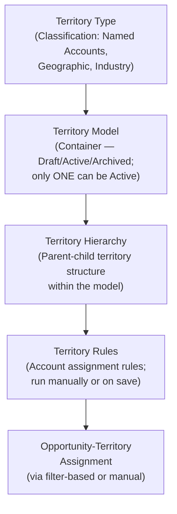

### Key Concepts

| Concept | Detail |
|---|---|
| Territory Type | Label/priority for categorizing territories (e.g., "Named Account", "Geographic") |
| Territory Model | The container; can be in Draft, Active, or Archived state; only ONE active model at a time |
| Territory | A node in the hierarchy; can have account assignment rules |
| Territory User | Sales rep assigned to a territory; accesses all accounts in that territory |
| Account Assignment Rules | Boolean filter criteria; run when rule is saved, on demand, or on account change |
| Forecast Territory | Tied to Collaborative Forecasting; territory forecasts possible with TM2.0 |

### Access Model: Additive
- Territory Management **adds** record access on top of existing sharing
- Does NOT replace OWD, role hierarchy, or sharing rules
- A user gets the MOST permissive access from ANY applicable sharing mechanism

### Territory vs Role Hierarchy

| Dimension | Role Hierarchy | Territory Hierarchy |
|---|---|---|
| Purpose | User org chart / management access | Account/opportunity segmentation |
| Can a user be in multiple? | One role only | Multiple territories |
| Parent-child access | Manager sees subordinate records | Territory user accesses territory accounts |
| Based on | User record | Account field values (rules) |
| Required for Forecasting | Yes (user-based forecasts) | Optional (territory forecasts) |

### When NOT to Use TM2.0
- Simple sales structure — one rep per region, no overlap
- No geographic or segmentation complexity
- Org already works cleanly with role hierarchy alone
- Limited admin bandwidth (TM2.0 is complex to maintain)

---

## Process Automation Decision Matrix

| Scenario | Best Tool |
|---|---|
| User fills out a wizard / guided data entry | Screen Flow |
| Auto-update field on record save (same object) | Record-Triggered Flow — Before Save |
| Create/update related records after save | Record-Triggered Flow — After Save |
| Send email or call external system after save | Record-Triggered Flow — After Save (async) |
| Run logic on a schedule (e.g., 30 days after close) | Scheduled Flow or Scheduled Path on RTF |
| Multi-step human approval with delegation | Approval Process |
| Complex approval with conditional routing | Approval Process + Entry Criteria |
| Launch from button/Quick Action | Screen Flow or Autolaunched Flow |
| Complex cross-object logic with loops | Record-Triggered Flow After Save |
| Replace old Workflow Rule | Record-Triggered Flow Before Save |
| Replace old Process Builder | Record-Triggered Flow After Save |

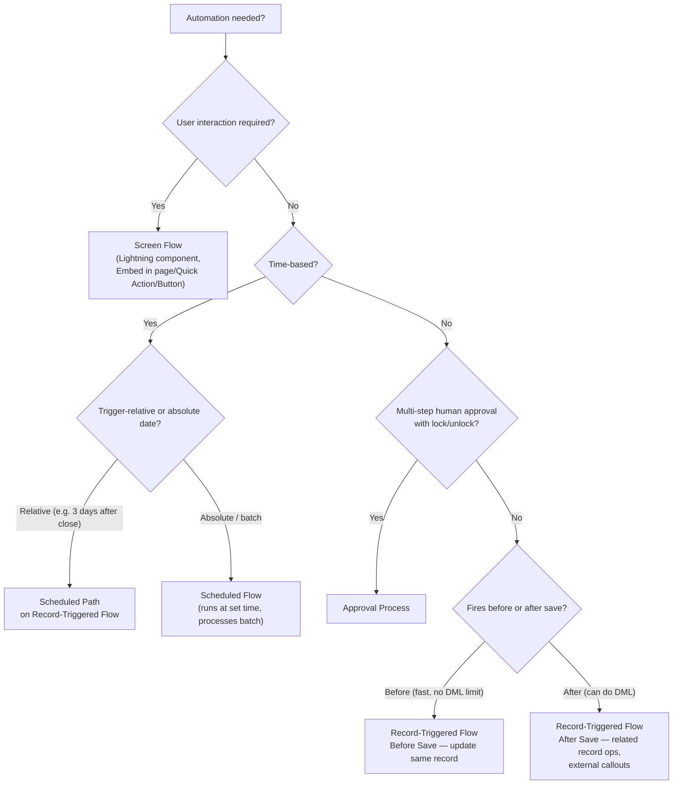

### Flow Types Summary

| Flow Type | Runs When | Can DML same record? | User Interaction |
|---|---|---|---|
| Screen Flow | User launches | Yes (via DML element) | Yes |
| Record-Triggered (Before Save) | Record save | Formula assignment only | No |
| Record-Triggered (After Save) | After record committed | Yes (via DML) | No |
| Scheduled Flow | Set schedule | Yes | No |
| Autolaunched Flow | Called by Apex/process/API | Yes | No |
| Platform Event-Triggered | Platform event published | Yes | No |

### Flow Limits to Know
- Max **250,000 executed Flow interviews** per 24 hours (org limit)
- Max **2,000 elements** per Flow version
- Flow governor limits inherit Apex limits: 100 SOQL queries, 150 DML per transaction
- Bulkification: flows auto-bulkify DML and SOQL across records in batch
- **Before-save flows** run before Apex triggers in the order of operations

### Approval Process Rules

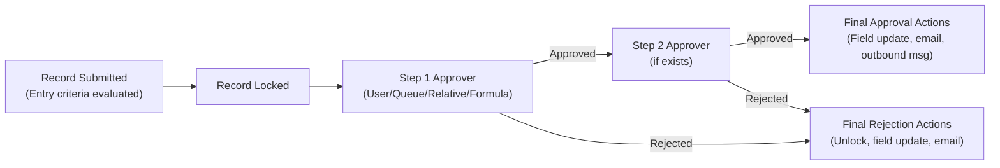

- Max **30 steps** per approval process
- Multiple active approval processes per object: **YES** — each evaluates entry criteria
- Delegation: users can delegate approval authority to another user for specified time
- Recall: submitter can recall if still in first step
- Actions available: Field Update, Email Alert, Outbound Message, Create/Update Record (via Flow)
- **Outbound Messages**: SOAP-based, asynchronous; being superseded by Flow callouts

---

## Key Limits Reference

| Feature | Limit |
|---|---|
| Sharing rules per object | 300 |
| Approval steps per process | 30 |
| Flow elements per version | 2,000 |
| Active flows per object (RTF) | 50 per event type (before/after save) |
| Custom metadata rows (free) | 200 (more with additional licenses) |
| Custom settings data | 10 MB per type; 10 MB for hierarchy type |
| Field History Tracking | 20 fields per object |
| Field History retention | 18 months (native); longer with Field Audit Trail license |
| Field Audit Trail retention | Up to 10 years |
| Debug log retention | 24 hours |
| Debug log size | 20 MB |
| Sandbox refresh: Developer | 1 day |
| Sandbox refresh: Developer Pro | 1 day |
| Sandbox refresh: Partial Copy | 5 days |
| Sandbox refresh: Full | 29 days |
| Data Import Wizard max records | 50,000 |
| Data Loader max records | 5,000,000 |
| Workflow rules | Deprecated — migrate to Flow |
| Process Builder | Deprecated — migrate to Flow |
| Reports per folder | No limit |
| Dashboard components | 20 per dashboard |
| Joined report blocks | 5 |
| Report types for joined report | 4 |
| Custom report types | 400 per org |
| Formula fields per object | 10 cross-object formula fields |
| Roll-up summary fields per object | 25 |
| Picklist values per field | 1,000 |

---

## Auditing & Monitoring

### Setup Audit Trail
- Tracks **last 180 days** of setup changes
- Records: who changed what, when, from which IP
- Download as CSV
- Only setup changes (not data changes)

### Field History Tracking
- Max **20 fields per object** (standard + custom)
- Tracks: old value, new value, who changed, when
- **18-month** native retention; Field Audit Trail extends to 10 years
- Enable per field on object settings
- Stored in `ObjectName__History` related list / object

### Login History
- Retained for **6 months**
- Downloadable CSV
- Shows: user, time, source IP, browser, status (Success/Failed)

### Event Monitoring (add-on)
- Tracks granular events: API calls, Apex execution, report exports, logins, etc.
- Data stored in **EventLogFile** object; accessible via API/Splunk/etc.
- 1-day or 24-hour log files depending on event type

### Debug Logs
- Max **20 debug logs** per user at a time
- Retained for **24 hours**
- Levels: NONE, ERROR, WARN, INFO, DEBUG, FINE, FINER, FINEST
- Size limit: 20 MB per log (truncated if exceeded)

---

## Sales Cloud Quick Reference

### Lead Management

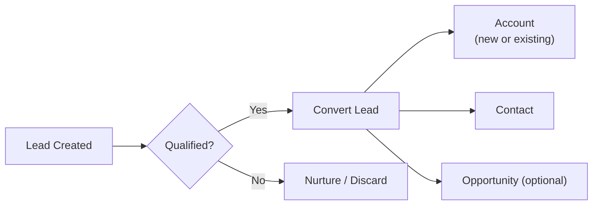

- Lead conversion maps fields: Lead → Contact/Account/Opportunity
- Custom lead fields must be mapped to convert data
- Converted leads: not deleted, set IsConverted=true; still visible in reports with filter
- Duplicate rules and matching rules apply to leads

### Forecasting

| Type | Description |
|---|---|
| Collaborative Forecasting | Native Salesforce; quota + pipeline; adjustments at each level |
| Forecast Categories | Omitted, Pipeline, Best Case, Commit, Closed |
| Forecast Types | Opportunity Revenue, Quantity, Product Family, Territory |
| Cumulative Rollup | Show all pipeline amounts rolled into Commit/Best Case |

- Forecasts require Role Hierarchy or Territory Hierarchy
- Managers can override subordinate forecasts with an adjustment
- Quota can be set per user per period

### Opportunity Management
- Opportunity stages map to Probability (default)
- Path: visual guide with key fields + coaching text per stage
- Opportunity Teams: per-opportunity access + roles
- Splits: Credit Splits (revenue allocation across team members)
- Similar Opportunities: Einstein feature

### Campaigns
- Campaign Influence: links campaigns to opportunities
- Campaign Hierarchy: parent-child, up to 5 levels; child stats roll up
- ROI formula: `((Value Won Opps - Actual Cost) / Actual Cost) * 100`
- Member statuses: Sent, Responded, etc. — configurable per campaign

---

## Service Cloud Quick Reference

### Case Management

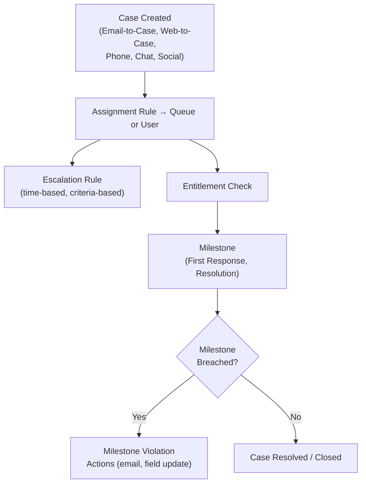

### Entitlements

| Term | Definition |
|---|---|
| Entitlement | Service agreement defining what support a customer gets (e.g., 24/7 phone support) |
| Entitlement Process | Template with milestones and time targets; applied to case |
| Milestone | A required step/target within the process (e.g., First Response within 4h) |
| Milestone Actions | Success actions (on achievement) and violation actions (on breach) |
| Service Contract | Agreement tied to account; contains entitlements |

- Entitlement Process can have **up to 10 milestones**
- Milestones are time-based; use business hours for realistic targets
- **Warning actions** fire BEFORE milestone breach; **violation actions** fire AFTER

### Knowledge

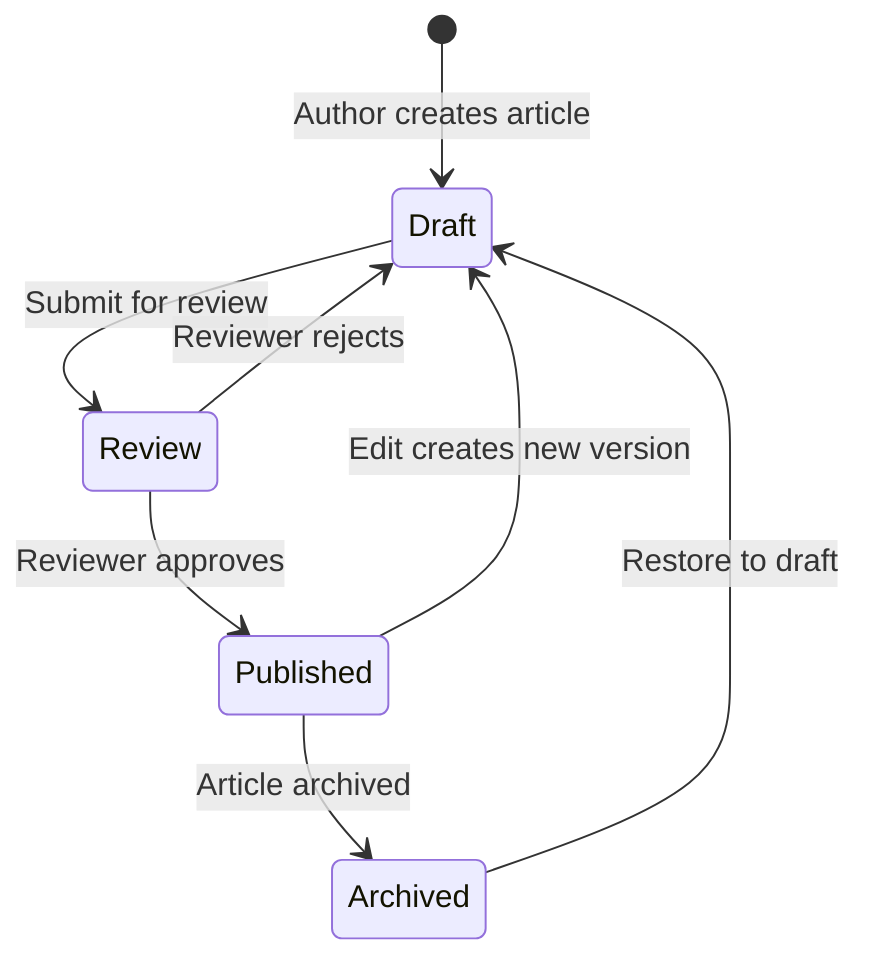

- Data categories control visibility (who sees which articles)
- Data category groups: up to 5 groups; 5 levels per group
- Article types replaced by Record Types in Lightning Knowledge
- Lightning Knowledge: one object (`Knowledge__kav`), differentiated by record type
- Channels: Internal App, Customer Portal, Partner Portal, Public Knowledge Base

### Case Escalation Rules
- Time-based: escalate if case open > N hours
- Criteria-based: escalate if field value matches
- Uses business hours (if configured)
- Can reassign owner, send email, notify user

### Omni-Channel Routing
- Routes work items (cases, chats, leads) to available agents
- Routing models: Queue-Based, Skills-Based, External (Einstein)
- Presence statuses: available capacity; each work item has a size
- Supervisor console: real-time visibility into queues and agent status

---

## Data Management

### Import Tools Comparison

| Tool | Max Records | Objects | Upsert? | Dedup? |
|---|---|---|---|---|
| Data Import Wizard | 50,000 | Accounts, Contacts, Leads, Campaigns, Custom | Yes | Yes (matching rules) |
| Data Loader | 5,000,000 | All objects including system | Yes | External ID matching |
| Dataloader.io / third-party | Varies | All | Yes | Varies |

### Duplicate Management

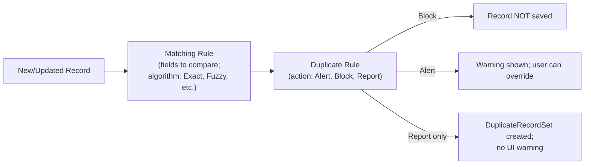

- **Matching Rules**: define which fields to compare and how (exact, fuzzy, phone, email)
- **Duplicate Rules**: define what happens when a match is found; can be object-specific
- Standard rules: Standard Contact/Lead/Account Duplicate Rules (activate before use)
- DuplicateRecordSet: junction object linking duplicate records for review

### Data Quality Tools
- **Validation Rules**: formula-based; fire on save; can reference related fields
- **Lookup Filters**: restrict which records appear in lookup field; active/optional
- **Dependent Picklists**: controlling vs dependent field; values filtered by controlling value
- **Field Completeness**: Reports, Einstein Data Quality

### Big Objects
- Store massive volumes of data (billions of rows)
- Custom Big Objects: defined by admin, deployed via metadata
- Query via SOQL with index fields only
- No standard UI; access via Apex or Flow
- Cannot be imported via Data Loader standard; use Bulk API 2.0

### Archiving & Data Retention
- Standard record recycle bin: 15 days, up to 25x storage limit records
- Bulk purge from recycle bin: admin can empty all
- Data archiving strategies: Big Objects, external storage, third-party archiving tools

---

## Custom Objects & Applications

### Object Relationships

| Type | Parent Delete | Child Required? | Sharing Inherited? | Roll-Up Summary |
|---|---|---|---|---|
| Master-Detail | Deletes children (cascade) | Required on child | Yes (Controlled by Parent OWD) | Yes |
| Lookup | No cascade (nullify or restrict) | Optional | No | No |
| Many-to-Many (Junction) | Two master-details on junction | N/A | Both parents | No |
| Hierarchical | N/A (User object only) | N/A | N/A | No |
| External Lookup | N/A | Optional | No | No |
| Indirect Lookup | N/A | Optional | No | No |

- Max **2 master-detail relationships** per object
- Max **25 child relationships** for lookup per object
- Converting Lookup to Master-Detail requires all existing records to have a value in lookup field

### Schema Design

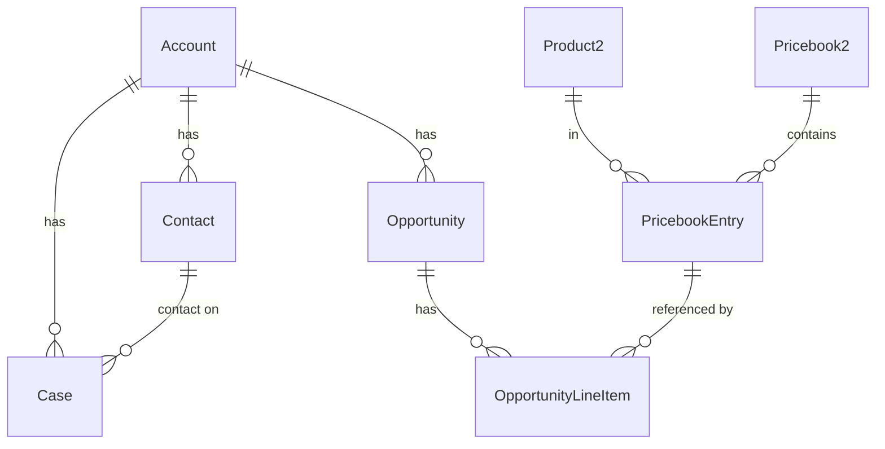

### Custom Metadata Types vs Custom Settings

| Feature | Custom Settings | Custom Metadata Types |
|---|---|---|
| Deploy with code changes | No (data layer) | Yes (metadata layer) |
| Available in Formula fields | Yes (Hierarchy only) | Yes |
| Available in Validation Rules | Yes (Hierarchy only) | Yes |
| Can be packaged | Unmanaged only | Managed + Unmanaged |
| Accessible in Apex | `CustomSetting__c.getInstance()` | `CustomMetadata__mdt.getAll()` |
| Type of data | Runtime config values | App configuration |
| Setup menu | Yes | Yes |
| Deployed via Change Sets | No (need data deploy) | Yes |
| Subscriber override in managed pkg | No | Yes |
| Use cases | Org-wide or user/profile specific config | Feature flags, mappings, thresholds |

### Custom Settings Types
- **Hierarchy**: values at Org, Profile, User levels; most specific wins (User > Profile > Org)
- **List**: simple key-value pairs; no hierarchy; accessed by name
- Max **10 MB** per custom setting type

### Schema Builder
- Visual ER diagram in Setup
- Can create/modify fields and relationships
- Cannot create new objects (use Object Manager instead)

---

## Reporting & Dashboards

### Report Types

| Type | When to Use |
|---|---|
| Tabular | Flat list; no grouping; can use as dashboard source with row limit |
| Summary | Group rows; subtotals; most common |
| Matrix | Group rows AND columns; good for comparisons |
| Joined | Up to 5 blocks from different report types; side-by-side |

### Report Features

- **Bucket Fields**: group values without creating a formula field (up to 20 buckets, 5 bucket fields per report)
- **Cross Filters**: filter by related object presence (e.g., Accounts WITH Opportunities, Accounts WITHOUT Cases)
- **Row-Level Formula**: formula calculated per row (not in groupings)
- **Summary Formula**: formula applied at group/summary level
- **Historical Trending**: track field value changes over time; up to 3 months of history; 8 fields max

### Dashboard Rules

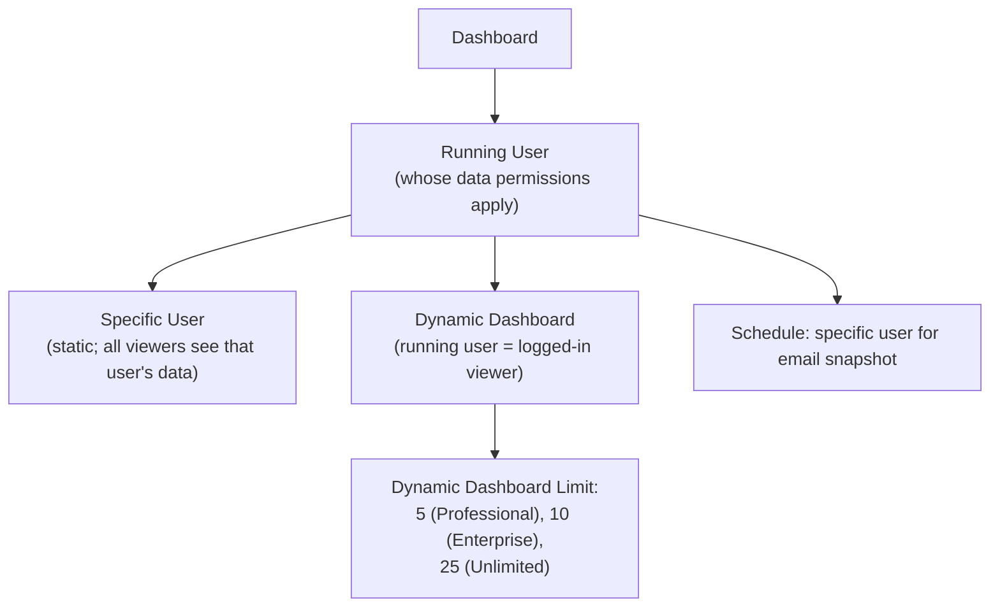

- **Dynamic dashboards**: viewer sees their own data; limited by edition
- Max **20 components** per dashboard
- Dashboard components: Chart, Gauge, Metric, Table, Visualforce
- **Joined Reports** cannot be used directly as dashboard source
- Dashboards can be added to app home pages, record pages (via component)
- **Snapshot/Scheduled Refresh**: dashboard can be emailed on schedule; data captured at run time

### Report Limits
- Max rows returned: **2,000 in UI**, 200,000 via API export
- Joined reports: max 5 blocks; max 4 standard report types
- Custom Report Types: max **400 per org**
- Historical trending: max **8 fields** tracked; max **3 months** data retention by default (up to 24 months configurable)
- Bucket fields per report: **5**

---

## Change Management & Deployment

### Sandbox Types

| Type | Storage | Data | Refresh Interval | Use Case |
|---|---|---|---|---|
| Developer | 200 MB data, 200 MB files | Config only | 1 day | Dev/unit test |
| Developer Pro | 1 GB data, 1 GB files | Config only | 1 day | Larger dev projects |
| Partial Copy | 5 GB | Config + sample data (template) | 5 days | QA/integration |
| Full | Same as prod | All production data | 29 days | UAT/load test/full staging |

### Deployment Tools

| Tool | Metadata API | Rollback | Use Case |
|---|---|---|---|
| Change Sets | Yes (under the hood) | Manual only | Simple orgs; point-and-click |
| Salesforce CLI (sf/sfdx) | Yes | Yes (package version control) | DevOps, CI/CD, Git-based |
| Ant Migration Tool | Yes | Yes | Legacy; being deprecated |
| Managed Packages | Yes | Via uninstall | ISV distribution |
| Unlocked Packages | Yes | Yes (version rollback) | Modular deployment; modern DevOps |

### Change Sets
- Outbound: create in source org; upload to target
- Inbound: receive in target org; validate then deploy
- Cannot delete metadata via change sets (use destructive changes in CLI)
- Validation deploys: test against target without deploying (identifies errors)

### Metadata Coverage
- Not all metadata types are change-set compatible
- Complex objects (territories, forecasting) often require Salesforce CLI
- Custom metadata type **records** deploy via change sets (unlike custom settings data)

---

## Top 15 Exam Traps

1. **OWD can ONLY open access** — sharing rules and sharing mechanisms can only ADD access above OWD, never restrict below it. To restrict access, you must tighten OWD.

2. **Territory Management is ADDITIVE** — territories grant access on top of existing sharing. They do not replace or override role hierarchy, OWD, or sharing rules. Users get the most permissive access from any applicable mechanism.

3. **"Grant Access Using Hierarchies" checkbox: only configurable on custom objects** — standard objects (Account, Opportunity, etc.) always use role hierarchy for OWD-based access. You cannot disable hierarchy-based access on standard objects.

4. **Custom metadata deploys with code changes; custom settings data does NOT** — a change set or package will include custom metadata records but NOT custom settings data. Custom settings data must be manually re-entered or loaded separately in the target org.

5. **Field History Tracking: max 20 fields per object, 18-month native retention** — Field Audit Trail (paid add-on) extends to 10 years. Do not confuse the two; exam often tests the default limits.

6. **Dynamic dashboards show data as the running user** — each viewer sees their own data. But the NUMBER of dynamic dashboards is edition-limited (Enterprise = 10, Unlimited = 25). A trick question: "the CEO wants to see everyone's data on one dashboard" → use a specific (non-dynamic) running user, not a dynamic dashboard.

7. **Joined reports cannot be used directly as a dashboard source** — you can add other report types to dashboards, but not joined reports. This is a hard platform limitation.

8. **Multiple active approval processes per object: YES** — the myth is only one can be active. Multiple can be active simultaneously; each has entry criteria, and the first one whose criteria is met activates. If no entry criteria, first one always fires.

9. **Criteria-based sharing rules evaluate on field changes; ownership-based on owner changes** — if you need sharing to adjust when a field value changes, use criteria-based sharing rules, not ownership-based.

10. **Before-save Flow runs before Apex triggers** — order of execution: Validation Rules → Before-Save Flows → Before-Apex Triggers → System Validation → Committed → After-Apex Triggers → After-Save Flows → Commit (rollup, etc.)

11. **Scheduled Paths vs Scheduled Flows** — Scheduled Path is a time-based branch on a Record-Triggered Flow; Scheduled Flow is a standalone flow that runs on a schedule. They're not the same. A Scheduled Path fires relative to the record's trigger; a Scheduled Flow processes records in batches at a set time.

12. **Data Import Wizard does NOT support all objects** — it supports Accounts, Contacts, Leads, Solutions, Campaigns, and custom objects only. For other objects (Orders, Cases, Products), use Data Loader.

13. **Lookup filter "active" vs "required"** — Active lookup filters restrict results (user sees warning if value doesn't match). Required lookup filters block save if value doesn't match. An inactive filter exists but does nothing.

14. **Ownership Skew threshold is 10,000 records per user** per object with Private OWD — this causes sharing recalculation performance issues. The fix is not just redistribution; consider also changing OWD or restructuring sharing architecture.

15. **External OWD can only be equal to or MORE restrictive than internal OWD** — you cannot set external OWD to Public Read/Write if internal OWD is Private. External must be equal or more restrictive (never more permissive) than internal OWD.

---

## Bonus: Order of Execution (Record Save)

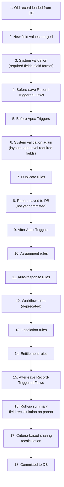

---

## Quick-Recall Flash Cards

| Q | A |
|---|---|
| Max sharing rules per object? | 300 |
| Max approval steps? | 30 |
| Where does role hierarchy NOT apply? | Custom object with "Grant Access Using Hierarchies" unchecked |
| Can criteria-based sharing restrict access? | No — can only extend |
| Which sandbox has full production data? | Full Sandbox only |
| Can you deploy custom settings data via change set? | No — use Data Loader or manual entry |
| Can you deploy custom metadata records via change set? | Yes |
| Max dynamic dashboards in Enterprise? | 10 |
| Max dashboard components? | 20 |
| Joined reports max blocks? | 5 |
| Field history retention (native)? | 18 months |
| Login history retention? | 6 months |
| Setup Audit Trail retention? | 180 days |
| Debug log retention? | 24 hours |
| Ownership skew threshold? | >10,000 records per user on Private OWD object |
| Can external OWD be more permissive than internal OWD? | No — only equal or more restrictive |
| Before-save flow vs Apex trigger order? | Before-save flows run BEFORE before-Apex triggers |
| Can multiple approval processes be active on one object? | Yes — entry criteria determines which fires |
| Data Import Wizard supports Cases? | No — use Data Loader |
| Max fields in Field History Tracking? | 20 per object |
