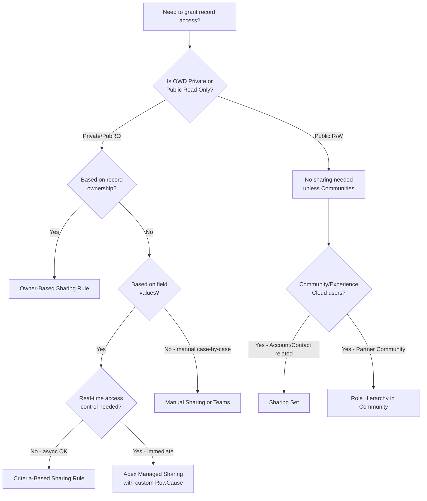
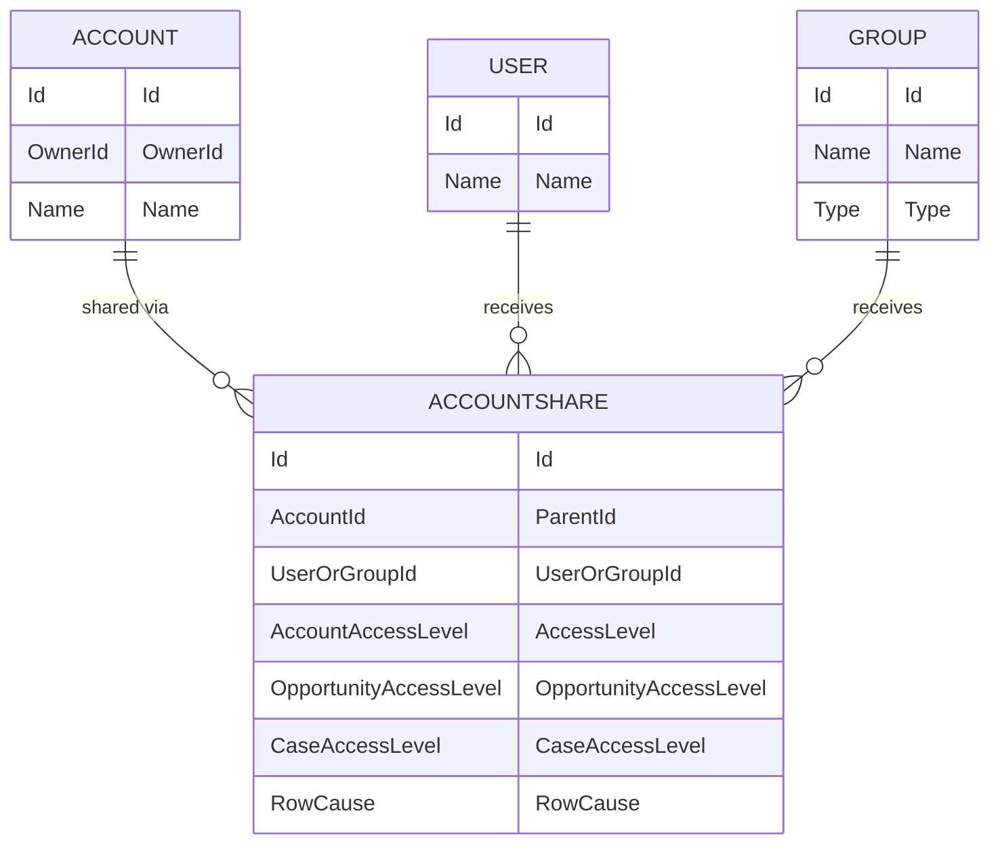

# Advanced Sharing Rules & Record Access

## Exam Domain
Security & Access — 20% of exam weight

## Core Concepts

### The Sharing Model Stack (Review + Deeper)

Salesforce evaluates record access through a layered model. The final access granted is always the **most permissive** combination across all active layers — except OWD, which is the floor.

```
Layer 1: OWD (floor — most restrictive setting)
Layer 2: Role Hierarchy (automatic upward visibility)
Layer 3: Sharing Rules (automated grants — owner-based OR criteria-based)
Layer 4: Manual Sharing (user-initiated, on individual records)
Layer 5: Apex Managed Sharing (programmatic, survives role changes)
Layer 6: Teams (Account Teams, Opportunity Teams, Case Teams)
Layer 7: Territory Management (parallel to role hierarchy for Sales)
```

### Owner-Based vs Criteria-Based Sharing Rules

| Feature | Owner-Based | Criteria-Based |
|---|---|---|
| Trigger | Record owner belongs to group/role | Field values on the record match criteria |
| Use case | "Sales Managers see all reps' records" | "All records with Region = EMEA shared to EMEA Support" |
| Dynamic? | Re-evaluated on ownership change | Re-evaluated on field change (async, via sharing recalculation) |
| Performance | Faster | Slower at high volume |
| Complexity | Simple | Can produce complex, overlapping grants |

**Criteria-Based Sharing Rule — Deep Details:**
- Up to 50 criteria-based sharing rules per object
- Criteria can use AND/OR logic (up to 25 criteria)
- Supported field types: text, picklist, lookup, checkbox, number, date — but NOT formula fields, long text, or encrypted fields
- When a field value changes and a record no longer matches criteria, the share is **asynchronously revoked** — there is a window where access is stale

### Sharing Recalculation

When you change an OWD or sharing rule, Salesforce queues a **sharing recalculation** job. This is important for the exam and for production:

- Large orgs (millions of records) can take hours to complete recalculation
- Users may see stale access during recalculation
- You can monitor via Setup > Sharing Settings > Recalculation Status
- Recalculation is also triggered by role hierarchy changes at scale

### Apex Managed Sharing (Programmatic)

Apex sharing uses the `[ObjectName]Share` object (e.g., `AccountShare`, `OpportunityShare`).

Key fields:
- `ParentId` — the record being shared
- `UserOrGroupId` — who receives access
- `AccessLevel` — `Read`, `Edit`, `All`
- `RowCause` — must be a custom share reason (or `Manual`) — custom reasons survive user/role changes; `Manual` shares are deleted if the share-from user changes role

**Critical exam point:** To create Apex managed shares that persist through ownership changes, you **must** create a custom `RowCause` via Setup. Without this, shares with `RowCause = Manual` are deleted when OWD changes.

### Sharing Sets (for Experience Cloud / Communities)

Sharing sets are a special mechanism for granting Community/Experience Cloud users access to records related to their account or contact — without using sharing rules.

- Configured in Setup > Digital Experiences > Settings > Sharing Sets
- Grant access to records where a lookup field on the record matches the community user's Contact or Account
- Supports Read Only or Read/Write
- Only applies to **Customer Community** and **Customer Community Plus** license users (not Partner Community users — those use role hierarchy)

**Exam trap:** Sharing sets do NOT appear in the standard sharing model UI — they're configured separately. Partner Community users use the standard role hierarchy.

### Share Groups

When a High-Volume Community User (HVCU) needs to share records with internal users, you use a **Share Group**:
- Created automatically when you create a sharing set
- Add internal users/roles to the share group
- Records the HVCU owns become visible to members of the share group

### Manual Sharing at Scale

Manual sharing is granted via the Sharing button on a record. Limits and behaviors:
- Can be Read Only or Read/Write
- Only the record owner, someone above them in role hierarchy, or an admin can manually share
- Manual shares are deleted when ownership changes (unless the new owner is in the same role)
- **Not available for objects with OWD = Public Read/Write** (there's nothing to share beyond what everyone already has)

### OWD Settings — Nuances

| Setting | Visibility | Sharing Rules Can Expand? |
|---|---|---|
| Private | Only owner + role hierarchy above | Yes |
| Public Read Only | All users can read | Yes (to grant edit) |
| Public Read/Write | All users can read+edit | Only via sharing sets (Communities) |
| Controlled by Parent | Follows parent record's access | N/A (on child objects) |

**Controlled by Parent:** Used on detail objects in Master-Detail. Access follows the master record. Cannot be overridden with sharing rules on the detail side.

### External OWD

Objects can have separate internal and external OWD settings. This is critical for Experience Cloud orgs:
- External OWD applies to Community/Experience Cloud users
- Can be set independently of internal OWD
- Allows "Private" for external users while "Public Read Only" for internal

---

## PTA / SA Relevance

### When This Comes Up in Engagements

**Discovery questions that reveal sharing complexity:**
- "Do different regional teams need to see different subsets of accounts?" → Criteria-based sharing
- "Does your Community need users to see cases related to their account but not all cases?" → Sharing Sets
- "Do you have a field-level requirement where records should be visible only when Status = Active?" → Criteria-based sharing, but warn about async recalculation
- "Your org has 5M account records and you're changing OWD" → Block out a maintenance window; recalculation can take hours

**The sharing audit pattern:** When a customer says "User X can see a record they shouldn't be able to" or "User X can't see a record they should," the diagnosis path is:
1. Check OWD on the object
2. Check role hierarchy — does X report up to the owner?
3. Check sharing rules — is there a criteria-based or owner-based rule granting access?
4. Check manual shares (Sharing button)
5. Check Apex shares (query `[Object]Share` directly)
6. Check teams (Account/Opportunity/Case Teams)
7. Check Territory Management if enabled

The **"Why do I have access?"** report in Setup shows this automatically for any user/record combination — use this in customer conversations.

### Common Partner Mistakes

1. **Recommending criteria-based sharing without understanding the async recalculation lag** — in real-time access control scenarios (e.g., "remove access the moment contract is terminated"), criteria-based sharing has a delay. Apex sharing is the correct answer.

2. **Confusing Sharing Sets with Sharing Rules** — Sharing Sets are only for high-volume community users. Recommending sharing rules for community users who need account-related record access leads to implementation complexity and OWD conflicts.

3. **Ignoring External OWD** — Setting up a community without separate External OWD configured means internal settings govern external visibility, often exposing more than intended.

4. **Custom RowCause on Apex sharing** — New Salesforce developers (and some admins) create Apex shares with `Manual` RowCause. These shares are deleted on OWD changes. Always use custom RowCause for programmatic sharing.

### Enterprise Scale Considerations

- **Sharing recalculation on large orgs:** Changing OWD on an object with millions of records can lock sharing tables for hours. Always schedule these changes in off-peak windows. Use Setup > Defer Sharing Calculations when making multiple OWD/sharing changes simultaneously.
- **Criteria-based sharing at >100k records:** Each field update triggers a sharing recalculation check. High-volume update operations (bulk API, data migration) can flood the sharing queue. Monitor async jobs during data loads.
- **50 sharing rule limit per object:** Enterprise orgs with complex regional/segment matrices hit this limit. The solution is usually nested role hierarchies or Apex sharing, not adding more sharing rules.
- **Sharing rule order does not matter** — all matching rules grant access; there's no "first match wins." This differs from security policies in other systems.

---

## Architecture

### Standard Sharing Model Decision Tree



### Apex Sharing Object Relationship



**Limitations:**
- Max 50 sharing rules per object (owner-based + criteria-based combined)
- Max 25 criteria per criteria-based sharing rule
- Criteria-based sharing does NOT support formula fields as criteria
- Apex sharing requires a custom RowCause for persistence through ownership changes
- Sharing recalculation is synchronous for small orgs, async for large orgs
- Manual shares are deleted when OWD changes from Private to a more permissive setting
- Sharing Sets only available for Customer Community / Customer Community Plus licenses

---

## Key Facts to Memorize

1. Criteria-based sharing rules do NOT support formula fields as criteria — this is a common exam trap
2. Manual shares are deleted when record ownership changes
3. Apex managed shares use a custom `RowCause` to survive OWD changes
4. Sharing Sets are for high-volume Community users accessing records related to their Account/Contact
5. External OWD is set separately from internal OWD — critical for Experience Cloud orgs
6. "Controlled by Parent" OWD cannot be overridden with sharing rules on the child object
7. The "Why do I have access?" report is the diagnostic tool for unexpected access issues
8. Sharing recalculation is async — there is a window where access may be stale after field changes
9. Partner Community users use role hierarchy, NOT sharing sets
10. Share Groups allow internal users to see records owned by High-Volume Community Users

---

## Exam Traps

- **Trap 1:** "Which field types can be used in criteria-based sharing rules?" — Formula fields CANNOT. Encrypted fields CANNOT. Long text CANNOT.
- **Trap 2:** "A user's access was removed when the record owner changed roles" — This points to Manual sharing (Manual shares are NOT preserved through role changes for Apex shares without custom RowCause).
- **Trap 3:** "Community user needs to see cases related to their account" — Answer is Sharing Set, NOT sharing rule. Sharing rules don't work the same way for external users.
- **Trap 4:** "An admin changes OWD from Private to Public Read Only on Accounts — what happens to existing sharing rules?" — They become redundant but are NOT automatically deleted. They stay but have no effective impact.
- **Trap 5:** "Controlled by Parent on a custom object with a Lookup relationship" — Controlled by Parent is ONLY available with Master-Detail, not Lookup relationships.

---

## Practice Questions

**Q1.** A company needs all accounts with `Industry = Healthcare` to be visible to members of the "Healthcare Support" public group. The access must update immediately when the field changes. Which solution meets this requirement?
- A. Criteria-based sharing rule on Accounts
- B. Owner-based sharing rule on Accounts
- C. Apex managed sharing with custom RowCause
- D. Manual sharing

**Answer: C** — Criteria-based sharing is async (delay after field change). Immediate = Apex managed sharing.

---

**Q2.** A High-Volume Community User owns Service Request records. Internal support agents need to see these records. What should the administrator configure?
- A. Sharing rule on the Service Request object
- B. Share Group on the sharing set
- C. Manual sharing from the community user's profile
- D. Territory management rule

**Answer: B** — Share Groups expose HVCU-owned records to internal users.

---

**Q3.** Which of the following field types CANNOT be used as criteria in a criteria-based sharing rule? (Select 2)
- A. Picklist
- B. Formula field
- C. Date
- D. Encrypted field
- E. Checkbox

**Answer: B, D** — Formula fields and encrypted fields are not supported.

---

**Q4.** An Apex developer creates shares on the Opportunity object using `RowCause = 'Manual'`. The OWD for Opportunities is changed from Private to Public Read Only. What happens to the Apex-created shares?
- A. They are preserved because they were created via Apex
- B. They become redundant but remain in the database
- C. They are deleted because Manual shares are removed on OWD changes
- D. They are converted to criteria-based sharing rules

**Answer: C** — Manual RowCause shares (even Apex-created) are deleted when OWD becomes more permissive. Use custom RowCause to prevent this.
