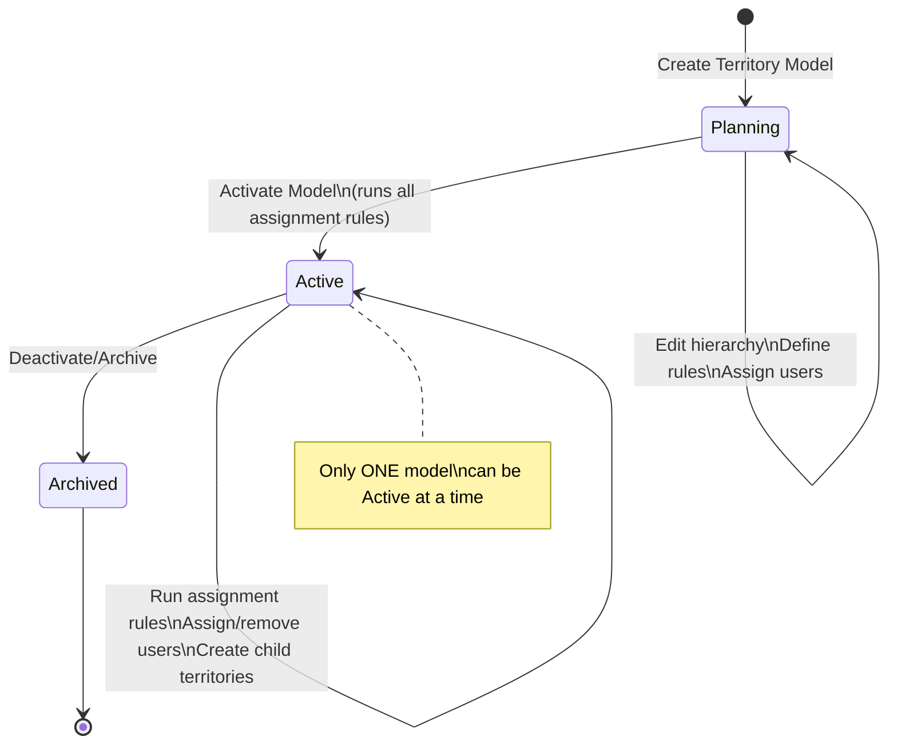
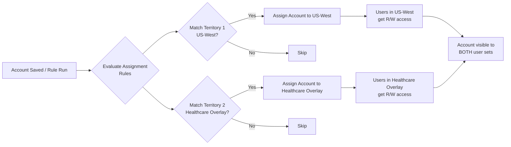
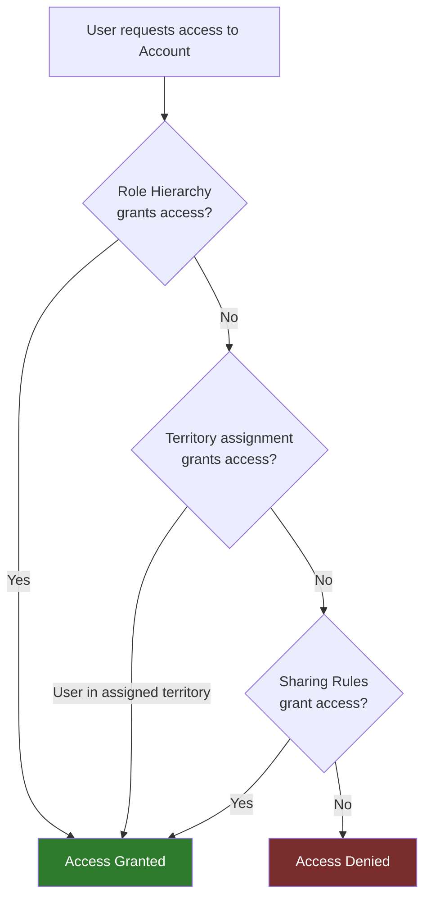

# Territory Management 2.0

## Exam Domain
Security & Access — 20% of exam weight

## Core Concepts

### What Is Territory Management 2.0?

Territory Management 2.0 (TM2) is a separate sales territory model that runs **in parallel** with the standard role hierarchy. It assigns accounts (and their related opportunities/contacts) to territories based on rules, giving sales orgs a way to manage geographic, industry, product-based, or other sales coverage models independently from the org's reporting structure.

**Key distinction from the Admin cert:** You learned *that* territory management exists. The Advanced Admin exam tests *how* it actually works — hierarchy design, assignment rules, opportunity splits, and when it should NOT be used.

### Territory Management vs Role Hierarchy

| Dimension | Role Hierarchy | Territory Management 2.0 |
|---|---|---|
| Purpose | Reporting structure / record access | Sales coverage model |
| Structure | Tree (one parent per node) | DAG (account can be in multiple territories) |
| Based on | User job position | Geographic/segment/product rules |
| Affects | All objects' visibility | Primarily Accounts + related Opps/Contacts |
| Required for | Standard sharing | Optional Sales Cloud feature |
| Complexity | Low–Medium | High |
| Enables | OWD + role-based access | Territory-based access alongside roles |

### Territory Hierarchy

TM2 organizes territories in a tree:

```
Territory Model
  └── Root Territory
        ├── US
        │     ├── US-West
        │     │     ├── CA
        │     │     └── NV
        │     └── US-East
        │           ├── NY
        │           └── MA
        └── EMEA
              ├── UK
              └── Germany
```

**Territory Model States:**
- **Planning** — being built; no access granted yet
- **Active** — live; assignment rules run; users have access
- **Archived** — deactivated; access revoked; history preserved

Only **one Territory Model** can be Active at a time per org.

### Account Assignment Rules

Rules automatically assign accounts to territories based on field values. Rules can evaluate:
- Standard and custom fields on the Account object
- Boolean (AND/OR) logic
- Lookup relationships (e.g., account's State = territory's state list)

**Assignment rule evaluation:**
- Run when an account is saved (real-time for manual saves)
- Can be manually run from Territory > Run Rules
- A single account can match multiple territories (unlike role hierarchy)
- An account in a parent territory is also visible to users in child territories (inheritance)

**Priority / Filtering:** If an account matches rules for both US-West and US, it is assigned to **both**. There is no exclusivity — this is a key TM2 concept. Access is additive.

### User Assignment to Territories

Users are assigned to territories (not the other way around). A user can be in multiple territories simultaneously.

Territory user roles (Access levels):
- **Territory User** (standard sales rep)
- **Territory Forecast Manager** (can manage forecasts for the territory)
- **Territory Admin** (can manage territory hierarchy)

When a user is assigned to a territory:
- They get **Read/Write access** to all accounts in that territory
- They get access to opportunities and contacts related to those accounts (based on Opportunity Territory Assignment settings)

### Opportunity Territory Assignment

Opportunities inherit territory from their Account's primary territory. When an account is in multiple territories, the opportunity's territory assignment can be:
- Auto-assigned based on the account's territory
- Manually overridden on the opportunity record
- Managed via opportunity filters (which territories get visibility to which opportunities)

**Opportunity Split in TM2:** When an account belongs to multiple territories, you can configure whether all users in all assigned territories see the opportunity, or only users in the territory explicitly assigned to the opportunity.

### Territory Forecasts

TM2 integrates with Collaborative Forecasting:
- Forecast types can be territory-based (separate from role-based forecasts)
- Territory Forecast Managers roll up forecasts from child territories
- Quota can be assigned at the territory level

### Enabling Territory Management 2.0

Steps:
1. Setup > Territory Management > Enable Territory Management 2.0
2. Create a Territory Model
3. Define Territory Types (labels like "Geographic," "Industry," "Named Accounts")
4. Build Territory hierarchy
5. Define Assignment Rules per territory
6. Assign Users to territories
7. Run assignment rules against all accounts
8. Activate the Territory Model

**Cannot be undone easily** — once active with thousands of accounts assigned, reverting requires careful planning.

### When NOT to Use Territory Management

This is as important for the exam as knowing how it works:
- When sales structure matches the role hierarchy perfectly — TM2 adds unnecessary complexity
- When you have fewer than 50–100 users — the overhead rarely justifies it
- When territories change very frequently — account reassignment jobs are expensive
- When the goal is purely record visibility, not sales territory modeling — sharing rules are simpler

---

## PTA / SA Relevance

### When This Comes Up in Engagements

**The most common scenario:** A customer has a complex sales org where reps cover multiple regions, or a single region is covered by multiple reps (overlay model), and the standard role hierarchy can't represent this.

Questions to ask in discovery:
- "Does a single account ever need to be covered by more than one sales rep?" → TM2
- "Do your territories change frequently (quarterly rebalancing)?" → TM2 but budget for recalculation overhead
- "Do you need territory-based forecasting separate from management reporting?" → TM2

**The overlay model pattern:** Named Account + Geographic overlay is the most common TM2 use case. Named Account reps own specific accounts regardless of geography. Geographic reps cover everything else in their region. TM2 handles this; role hierarchy cannot.

### Common Partner Mistakes

1. **Recommending TM2 for every complex sales org** — It adds significant administrative overhead. Many complex scenarios can be solved with a well-designed role hierarchy + criteria-based sharing rules. Always validate TM2 is genuinely needed.

2. **Not planning for model transitions** — Activating a new Territory Model (e.g., for annual territory rebalancing) requires deactivating the old one. During the transition window, access changes. Customers are often surprised by this.

3. **Ignoring forecast integration** — Implementing TM2 without considering Collaborative Forecasting integration creates a disconnected planning process. Always map the forecast hierarchy to the territory hierarchy during design.

4. **Confusing territory user roles with org profiles** — Territory user roles (Territory User, Territory Forecast Manager, Territory Admin) are TM2-specific and orthogonal to profiles and permission sets.

5. **Deploying assignment rules without testing at scale** — Assignment rules that look correct in a dev sandbox fail at scale when an account matches 3+ territories due to overlapping criteria. Test with production data volumes.

### Enterprise Scale Considerations

- **Account assignment recalculation:** Running assignment rules against 500k+ account records takes hours. Schedule this during maintenance windows.
- **Territory model activation:** Switching from one active model to another is an all-or-nothing operation. Plan the transition with the customer's sales ops team — not just IT.
- **Opportunity territory assignment at scale:** For orgs with millions of opportunities and accounts in multiple territories, opportunity access decisions can become a bottleneck. Monitor query performance.
- **Forecast rollup complexity:** Deep territory hierarchies (5+ levels) with hundreds of users create heavy forecast aggregation jobs. Test forecast refresh performance during UAT.

---

## Architecture

### Territory Model State Machine



### Account-to-Territory Assignment Flow



### TM2 + Role Hierarchy Access Stack



**Limitations:**
- Only one Territory Model can be Active at a time per org
- TM2 primarily covers Accounts, Opportunities, and Contacts — not all objects
- Account assignment rules only evaluate Account fields (not related object fields)
- Assignment rule recalculation is a long-running async job at scale
- Territory models cannot be cloned — building a new model requires rebuilding the hierarchy
- Maximum 1,000 territories per territory model (documented limit; contact Salesforce for enterprise exceptions)
- TM2 is not available in all org editions — requires Enterprise or above

---

## Key Facts to Memorize

1. Only ONE Territory Model can be Active at a time — switching models requires deactivating the current one
2. An account can be assigned to MULTIPLE territories simultaneously (unlike role hierarchy)
3. Territory model states: Planning → Active → Archived (can only go forward)
4. Users assigned to a parent territory do NOT automatically get access to child territory accounts — users must be explicitly assigned to each territory
5. Exception to #4: Access via the territory hierarchy flows **up** (child territory users can see parent territory accounts if the parent territory's rule assigns accounts there)
6. Opportunity territory is inherited from the account's territory but can be manually overridden
7. Territory forecasts are separate from role-based forecasts in Collaborative Forecasting
8. Territory assignment rules only evaluate Account fields, not fields on related objects
9. TM2 requires Enterprise Edition or above
10. Territory Admin, Territory Forecast Manager, Territory User are TM2-specific roles — not org roles/profiles

---

## Exam Traps

- **Trap 1:** "How many Territory Models can be active at once?" — ONE. Common distractor is "one per territory type."
- **Trap 2:** "Does a user assigned to a parent territory automatically see accounts in child territories?" — NO. Territory access is based on direct assignment, not hierarchy inheritance for users. (Account visibility **does** flow up to parent territory users because the hierarchy rolls up.)
- **Trap 3:** "Can Territory Management replace the Role Hierarchy?" — NO. TM2 supplements the role hierarchy; it does not replace it. The role hierarchy still governs non-account/opportunity object access and internal reporting.
- **Trap 4:** "Assignment rules are evaluated in which order?" — There is no priority order. All matching rules assign the account to all matching territories. There is no first-match-wins logic.
- **Trap 5:** "What happens to opportunity access when an account is assigned to 3 territories?" — Opportunity access is controlled by the opportunity's territory assignment field, not all of the account's territories.

---

## Practice Questions

**Q1.** A company uses Territory Management 2.0. Account A is assigned to both the "West" and "Healthcare Overlay" territories. User X is assigned only to the "West" territory. Which records can User X access?
- A. Only opportunities explicitly assigned to the West territory
- B. Account A and all its related opportunities regardless of territory assignment
- C. Account A with Read Only access; no opportunity access
- D. Access depends on whether Account A's primary territory is West

**Answer: A** — Opportunity access depends on the opportunity's territory assignment, not all of the account's territories.

---

**Q2.** An admin needs to reorganize the territory structure for the next fiscal year without disrupting current user access. What is the correct approach?
- A. Edit the existing Active Territory Model's hierarchy directly
- B. Create a new Territory Model in Planning state, build the new hierarchy, then activate it
- C. Archive the current model, create a new one, and activate it simultaneously
- D. Clone the current Territory Model and make modifications

**Answer: B** — Build the new model in Planning state, then activate it (which deactivates the current model). You cannot clone territory models; they must be rebuilt.

---

**Q3.** Which user role within Territory Management 2.0 can manage forecasts for their territory and child territories?
- A. Territory Admin
- B. Territory User
- C. Territory Forecast Manager
- D. Territory Manager (defined in the user's profile)

**Answer: C** — Territory Forecast Manager is the TM2-specific role that enables forecast management.

---

**Q4.** A sales organization has reps covering accounts by geography AND a separate named accounts team that covers strategic accounts across all regions. Which feature best supports this model?
- A. Role hierarchy with separate branches for geographic and named account reps
- B. Territory Management 2.0 with overlapping territories for geographic and named account coverage
- C. Criteria-based sharing rules to grant named account reps access to their strategic accounts
- D. Manual sharing on each strategic account

**Answer: B** — The overlay model (geographic + named accounts) with multiple territories per account is the canonical TM2 use case. Criteria-based sharing rules could work but become unmanageable at scale and don't support territory-based forecasting.
