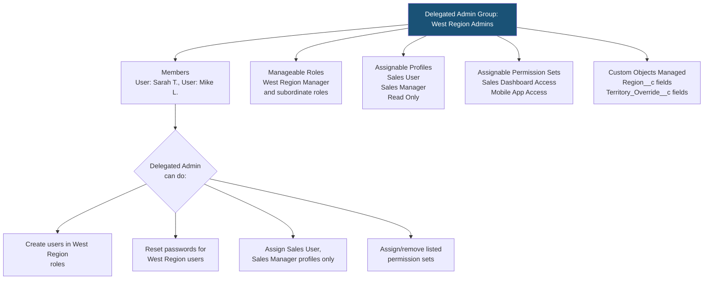
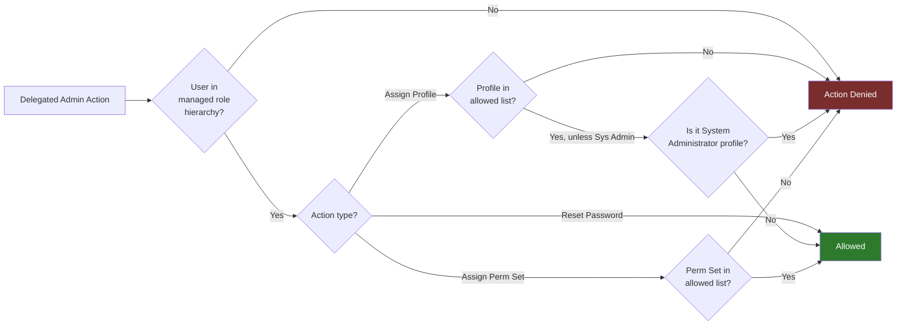

# Delegated Administration — Advanced

## Exam Domain
Security & Access — 20% of exam weight

## Core Concepts

### What Is Delegated Administration?

Delegated Administration allows non-System Administrator users to perform a limited, scoped set of administrative tasks — primarily user management — without granting them full System Admin privileges. This is essential in large orgs where IT can't manage every user lifecycle action.

**The Admin cert** covers the basics of delegated admin. The **Advanced Admin exam** goes deeper on what delegated admins *can and cannot* do, and the edge cases.

### Delegated Administrator Group Setup

Delegated Admin Groups are configured in Setup > Security > Delegated Administrators. Each group defines:

1. **Which users are delegated admins** (members of the group)
2. **Which users they can manage** (scoped by role and/or profile)
3. **Which profiles they can assign** to the users they manage
4. **Which permission sets they can assign/remove**
5. **Whether they can create users** (toggle)
6. **Which custom objects' fields/record types they can customize** (limited field visibility management)

### What Delegated Admins CAN Do

- Create and edit users within their designated roles/profiles
- Reset passwords for managed users
- Unlock user accounts
- Assign permitted profiles to managed users
- Assign/remove permitted permission sets to/from managed users
- Manage user license assignments (within their scope)
- Log in as a managed user (if enabled by the System Admin)
- Activate and deactivate managed users
- Manage custom object field-level security for specified custom objects

### What Delegated Admins CANNOT Do

- Modify system-level settings (OWD, sharing model, security settings)
- Access Setup pages outside the delegated scope
- Assign profiles not explicitly listed in their delegated group
- Manage other delegated admin groups
- Modify permission set groups unless specifically permitted
- See all users (they only see users within their delegated scope)
- Perform data management (import/export, mass update)
- Configure objects, flows, validation rules, etc.
- Assign System Administrator profile to any user

**Critical exam point:** A delegated admin CANNOT assign the System Administrator profile, regardless of what profiles are listed in the delegated group configuration. This is a hard-coded restriction.

### Nested Roles and Delegated Scope

When a delegated admin group is configured to manage users in a specific role, it includes:
- Users in that role
- Users in ALL roles **below** that role in the role hierarchy (subordinate roles)

This means scope expands with the role hierarchy depth. If a regional admin manages the "West Region Manager" role, they also manage all reps below that role.

**Exam trap:** The scope is based on the ROLE assigned to the delegated group, not the users in that role. If a user moves to a different role, they may leave or enter the delegated admin's scope.

### Permission Set Delegation

Delegated admins can assign/remove only the permission sets explicitly listed in their delegated admin group configuration. This is additive — they can grant what is listed; they cannot revoke permission sets that weren't granted through their group.

**Permission Set Groups:** Delegated admins can manage permission set groups if those groups are explicitly added to the delegated admin configuration. This is a newer capability (important for orgs moving to permission sets over profiles).

### Login As Managed User

If enabled, a delegated admin can log in as any user within their managed scope. This is equivalent to System Admin "Log in as User" but scoped.

Use case: Troubleshooting visibility issues without needing IT involvement.

**Security consideration:** Log in as Managed User actions are logged in the Login History and Audit Trail with the acting user's identity noted.

### Advanced Configuration: Custom Object Field Management

Delegated admins can be given permission to manage:
- Field-level security on custom objects/fields (but NOT standard objects)
- Record types on custom objects

They use the **Manage Users** permission implicitly granted by being in a delegated admin group. They access this through the delegated admin section, not the main Setup.

### Monitoring Delegated Admin Activity

All delegated admin actions are captured in:
- **Setup Audit Trail** — configuration changes made by delegated admin
- **Login History** — if they log in as another user
- **User detail change history** — tracked on user records

---

## PTA / SA Relevance

### When This Comes Up in Engagements

**Common ask:** "We want our regional HR managers to onboard/offboard salespeople without needing IT to open tickets." → Delegated Administration.

**Discovery questions:**
- "Who currently manages user provisioning?" If the answer is "only Salesforce admins," ask how many users they add per week — if >20, delegated admin is worth designing.
- "Do you have regional IT teams or super users?" These are natural delegated admin candidates.
- "Do different business units use different profiles?" Delegated admin scope can be aligned to BU + profile.

**The support burden calculation:** For a 5,000-user org with 20% annual turnover, that's ~1,000 user changes per year. With a single admin team, this becomes a queue. Delegated admin distributes this to team leads or regional HR.

### Common Partner Mistakes

1. **Granting delegated admins too broad a role scope** — If the role they're assigned manages too large a hierarchy, the delegated admin can see and modify users they shouldn't. Always validate the role hierarchy scope.

2. **Not restricting profile assignments tightly** — If profiles list "All profiles" in the delegated group, the delegated admin can effectively escalate any user's privileges. Always enumerate exactly which profiles are allowed.

3. **Ignoring the System Admin profile restriction** — Customers sometimes ask "can our HR admin assign the Admin profile?" — the answer is no, it's hard-coded. Don't promise this.

4. **Overlooking audit trail** — Delegated admin actions are audited but customers often don't know to look there. Set up regular audit trail monitoring or integrate with a SIEM in regulated industries.

5. **Confusing Delegated Admin with Permission Set Group delegation** — These are different features. Permission Set Group delegation is a newer mechanism; delegated admin is the legacy but still current approach.

### Enterprise Scale Considerations

- **Multi-org orgs:** In Salesforce orgs with hundreds of thousands of users (financial services, healthcare), delegated administration often isn't enough — full user provisioning integration (MuleSoft + SCIM or Identity Provider with SAML JIT provisioning) is needed. Know the threshold where manual delegated admin breaks down.
- **Centralized vs distributed admin model:** Large enterprises debate whether to distribute admin rights (operational speed) vs centralize (security and consistency). The right answer depends on regulatory requirements (SOX, HIPAA) and the maturity of the IT team.
- **Audit and compliance:** In regulated industries, every user provisioning action must be auditable. Delegated admin writes to Setup Audit Trail, but this has a 180-day retention limit. Export audit trail data regularly for compliance purposes.

---

## Architecture

### Delegated Admin Configuration Structure

### Permission Scope Resolution

**Limitations:**
- Cannot assign the System Administrator profile (hard-coded restriction)
- Cannot manage users outside their designated role hierarchy scope
- Cannot modify standard object field-level security (only custom objects)
- Cannot access main Setup beyond the delegated admin section
- Cannot modify sharing settings, OWD, or security policies
- Cannot manage other delegated admin groups
- Setup Audit Trail retention is 180 days — export for long-term compliance

---

## Key Facts to Memorize

1. Delegated admins CANNOT assign the System Administrator profile — hard-coded restriction
2. Role scope is hierarchical: managing "West Manager" role includes all subordinate roles automatically
3. Delegated admins can only assign profiles and permission sets explicitly listed in their delegated group
4. Actions by delegated admins are logged in Setup Audit Trail
5. Custom object field management is supported; standard object field management is NOT
6. Delegated admin scope is role-based, not user-based — user moves between roles, scope adjusts automatically
7. "Log in as" capability for delegated admins must be explicitly enabled by System Admin
8. Delegated admin groups are created in Setup > Security > Delegated Administrators
9. A single user can be a member of multiple delegated admin groups
10. Delegated admins can deactivate users but cannot permanently delete user records

---

## Exam Traps

- **Trap 1:** "Can a delegated admin assign any profile to users they manage?" — NO. Only profiles explicitly listed in the delegated admin group configuration.
- **Trap 2:** "A delegated admin needs to grant System Administrator access to a trusted team lead" — NOT POSSIBLE via delegated admin. Only a System Admin can assign the System Admin profile.
- **Trap 3:** "A delegated admin manages users in the 'West Manager' role. A new subordinate role 'West Rep' is added. Do they automatically manage West Rep users?" — YES. Subordinate roles are automatically included.
- **Trap 4:** "Can delegated admins manage field-level security on standard objects like Account?" — NO. Only custom objects/fields can be managed by delegated admins.
- **Trap 5:** "Where do delegated admins see users they can manage?" — In the Manage Users section in Setup, but **scoped** — they only see users within their designated role/profile scope, not all users.

---

## Practice Questions

**Q1.** A company wants regional HR managers to onboard new salespeople and assign them appropriate profiles. The HR managers should NOT be able to modify security settings or see IT/system users. Which feature should the admin configure?
- A. System Administrator profile with restricted access
- B. Delegated Administration
- C. Custom permissions with permission sets
- D. Chatter Free licenses with admin access

**Answer: B** — Delegated Administration is the correct and only viable approach for scoped user management.

---

**Q2.** A Delegated Administrator needs to assign the "Sales Executive" and "Sales Manager" profiles to new users. The Delegated Admin group is configured with only the "Sales User" and "Read Only" profiles listed. What happens when the delegated admin tries to assign "Sales Manager"?
- A. The assignment succeeds because delegated admins can assign any profile
- B. The assignment fails; they can only assign profiles listed in their delegated group
- C. The assignment requires System Admin approval
- D. The assignment succeeds but is flagged in the Audit Trail

**Answer: B** — Delegated admins are restricted to only the profiles explicitly listed in their group configuration.

---

**Q3.** Which actions CAN a delegated admin perform? (Select 2)
- A. Modify Org-Wide Default settings for an object
- B. Reset a managed user's password
- C. Assign the System Administrator profile
- D. Create new users within their role scope
- E. Create new custom objects

**Answer: B, D** — Password reset and user creation within scope are core delegated admin capabilities.

---

**Q4.** A delegated admin group is configured to manage users in the "Eastern Sales Director" role. An admin later adds three new subordinate roles under "Eastern Sales Director." Does the delegated admin automatically manage users in the new roles?
- A. No; the new roles must be explicitly added to the delegated admin group
- B. Yes; the delegated admin group scope includes all subordinate roles automatically
- C. Only if the users in the new roles are added as members of the delegated admin group
- D. Only for password resets, not for profile assignments

**Answer: B** — Delegated admin scope is hierarchical — all subordinate roles are automatically included.
