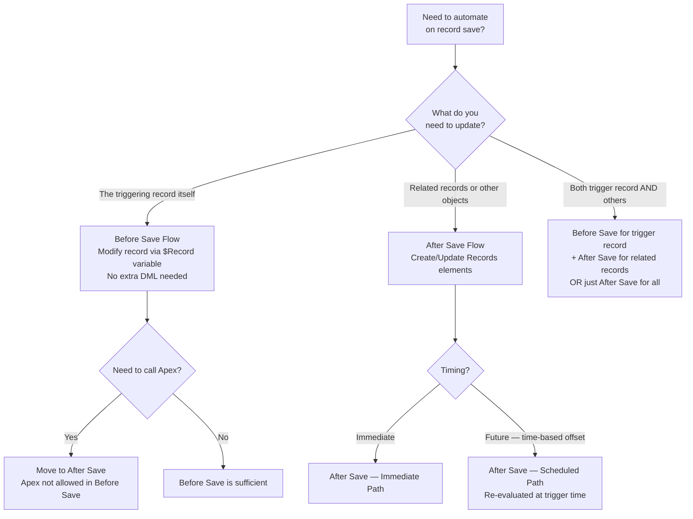
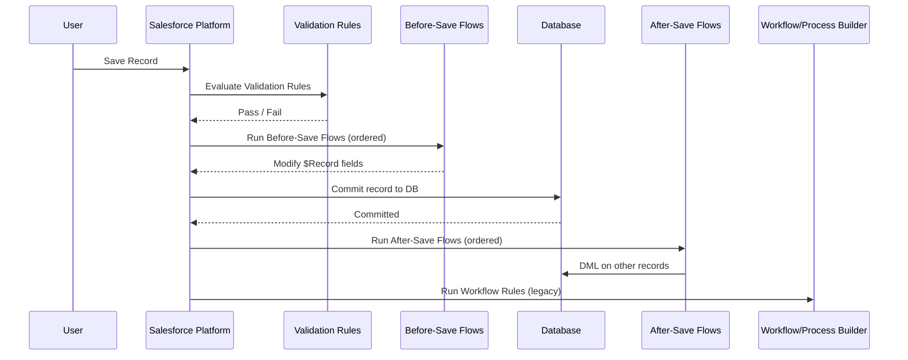

# Advanced Flows

## Exam Domain
Process Automation — 17% of exam weight

## Foundations

### What Is a Flow? (Starting from Basics)

A Flow is Salesforce's declarative automation engine. Think of it as a visual programming language: you connect elements (actions) with connectors (logic paths) to automate tasks without writing Apex code.

**Three things every Flow does:**
1. Gets triggered (by a user action, a record change, a schedule, or an external call)
2. Collects or modifies data (variables, queries, record operations)
3. Produces an outcome (creates/updates records, sends emails, calls an external service, shows a screen to a user)

**Flow types you knew from Admin cert:**
- Screen Flow — user interface with screens
- Record-Triggered Flow — fires when a record is created/updated/deleted
- Schedule-Triggered Flow — runs on a time schedule
- Platform Event-Triggered Flow — fires when a platform event message is received
- Auto-launched Flow — called programmatically (from another flow, Apex, or a button)

**What the Advanced Admin exam adds:** Deep understanding of record-triggered flow behavior (before vs after save), scheduled paths, subflows, fault tolerance, bulkification, and governor limits.

---

## How It Works

### Record-Triggered Flows: Before Save vs After Save

This is the most tested Advanced Admin topic in the Process Automation domain.

| Feature | Before Save | After Save |
|---|---|---|
| When it runs | Before record is committed to DB | After record is committed to DB |
| Can modify trigger record | YES — directly, without DML | NO — must use Update Records element (another DML) |
| DML operations | Limited — cannot do DML on OTHER records | Full DML allowed |
| Performance | Faster (no extra DML for trigger record) | Slower (additional DML if updating trigger record) |
| Can query related records | YES | YES |
| Can send emails | NO | YES |
| Can call subflows | YES (before-save subflows only) | YES |
| Can call Apex actions | NO | YES |
| Governor limits | Same transaction as trigger | Same transaction as trigger |

**Critical rule:** Use **Before Save** when you need to update the triggering record. Use **After Save** when you need to create/update OTHER records or call external services.

**Example:**
- Setting a `Last_Stage_Change_Date__c` on an Opportunity when Stage changes → Before Save (updates trigger record efficiently)
- Creating a follow-up Task when an Opportunity moves to Closed Won → After Save (creates a different record)

### Trigger Timing and Order

When a record is saved, multiple automations may run. The order is:

```
1. Validation Rules (before save)
2. Before-save Flows (record-triggered)
3. Record committed to database
4. After-save Flows (record-triggered)
5. Assignment Rules
6. Auto-response Rules
7. Workflow Rules (legacy)
8. Escalation Rules
9. Processes (Process Builder — legacy)
10. Platform Events (published by any of the above)
```

**Exam key:** Before-save Flows run BEFORE the record is committed. After-save Flows run AFTER commit. Both share the same transaction context.

### Scheduled Paths

Scheduled Paths (formerly called "Scheduled Actions" in Process Builder) allow a record-triggered flow to execute actions at a future time relative to the record.

How they work:
1. A record-triggered flow fires on record save
2. The flow evaluates entry conditions for a scheduled path
3. If conditions are met, the flow queues a scheduled job to run at the defined offset (e.g., "1 day after Close Date")
4. At the scheduled time, the flow re-evaluates conditions (re-entry check) and runs the path's actions

**Critical distinction from Workflow Time-Based Actions:**
- Workflow time-based actions: fire at offset time regardless of whether record still meets criteria
- Scheduled Paths: re-evaluate entry conditions at scheduled time — if record no longer qualifies, the path does NOT run

**Important limits:**
- Up to 10 scheduled paths per flow
- Scheduled path offsets: minutes, hours, days (before or after a date/datetime field)
- Maximum offset: 1 year from trigger record's field value

### Subflows

A Subflow is a flow called from within another flow. Used to:
- Modularize reusable logic (e.g., "send welcome email" subflow called from multiple parent flows)
- Break large flows into maintainable pieces
- Share common validation logic

**Key rules:**
- Subflows must be Auto-launched Flow type (they can be called from any flow type)
- Variables must be explicitly mapped between parent and subflow
- Subflows run in the same transaction as the calling flow
- Error in a subflow propagates to the parent flow (unless caught with a Fault Path)

### Fault Paths

Fault Paths handle errors in flow execution. Without a Fault Path, if an action fails (e.g., a callout fails, a DML operation violates a validation rule), the entire flow fails and the transaction is rolled back.

With a Fault Path:
- Connect the fault path from the element that might fail
- Handle the error gracefully (send notification, log to custom object, show user-friendly message)
- The transaction may or may not be rolled back depending on the error type

**Best practice:** Add fault paths on all DML elements, callout elements, and external service calls in production flows.

### Flow Variables and Collections

**Variable types:**
- **Text, Number, Currency, Date, DateTime, Boolean, Record** — scalar variables
- **Record Collection** — a collection of sObject records (like an Apex List)
- **Text Collection, Number Collection** — collections of primitives

**Loop element:** Iterate through a collection. Inside the loop, current item is accessible via the loop variable.

**Assignment element:** Used inside loops to build up collections or modify variables.

**Common pattern:** Query records → Loop → Filter/Transform → Create/Update collection → Perform bulk DML.

### Bulkification in Flows

Flows automatically bulkify DML and SOQL operations when multiple records trigger the same flow. The Flow engine groups triggered records and processes them in bulk.

**Key rule:** DML operations in a loop are NOT automatically bulkified. Place DML operations OUTSIDE loops when possible to avoid hitting limits.

**Anti-pattern:**
```
Loop through Accounts
  └── Create Record (Contact) ← DML inside loop = N DML statements
```

**Correct pattern:**
```
Loop through Accounts
  └── Assignment: Add new Contact to collection
Create Records (Contacts collection) ← Single bulk DML outside loop
```

---

## Advanced Configuration

### Flow Trigger Explorer

Flow Trigger Explorer (Setup > Flows > Flow Trigger Explorer) shows all record-triggered flows for a given object in a single view with their trigger order. This is the key tool for managing automation complexity.

**Order of execution across flows:** Multiple flows on the same object, same trigger timing, run in the order shown in Flow Trigger Explorer. You can reorder them.

### Pause Elements and Resume

Flows can be paused and resumed (for Screen Flows in certain contexts), but Record-Triggered flows cannot pause mid-execution. 

**Scheduled Paths** are not the same as "pause" — they schedule a future execution, not a pause of the current execution.

### Flow Versions and Activation

- Each flow can have multiple versions
- Only ONE version can be active at a time
- Activating a new version deactivates the old one
- Old version instances (running screen flows, scheduled paths queued) continue on the version they started on
- When deactivating a flow with pending scheduled interviews, you'll be warned

### Debug Mode

The Flow Builder has built-in debug capabilities:
- Run the flow in debug mode to step through execution
- See variable values at each step
- Identify which path was taken at each decision element
- View all DML operations

**For scheduled paths:** Debug mode does not run scheduled paths in real time. Use a test record with a near-future date to test.

---

## Real-World Scenarios

### Scenario 1: Opportunity Stage Change Automation
**Requirement:** When an Opportunity moves to Closed Won, update the Account's `Last_Won_Deal__c` date, create a "Kickoff Scheduling" task assigned to the owner, and send an internal Slack notification.

**Design:**
- Trigger: Record-triggered, After Save, on Update, when `IsClosed = true AND IsWon = true AND ISCHANGED(StageName)`
- Action 1: Update Related Record — set Account's `Last_Won_Deal__c` to Today (Before Save would be better for the opportunity record itself, but this touches the Account, so After Save is required)
- Action 2: Create Record — Task with Subject="Schedule Kickoff", OwnerId = Opportunity OwnerId
- Action 3: Apex Action or Flow HTTP callout to Slack webhook

### Scenario 2: SLA Breach Escalation via Scheduled Path
**Requirement:** If a Case is not resolved within 4 hours of creation, escalate to the manager and update Priority to High.

**Design:**
- Trigger: Record-triggered, After Save, on Create
- Scheduled Path: 4 hours after `CreatedDate`
- Re-entry condition: `Status != Closed`
- Actions: Update Case Priority = High, Send email to Case Owner's Manager

---

## PTA / SA Relevance

### When This Comes Up in Engagements

**The "Flow vs Apex" question** comes up in every enterprise implementation. The answer for the Advanced Admin exam is almost always Flow first. For a PTA:
- Flows are declarative and maintainable by admins without Apex developers
- Flow limits are documented and in most cases equivalent to Apex for business logic
- Use Apex only when: you need platform events at high volume, complex data structures, callout + DML in same transaction requirements that Flow can't handle, or re-entry patterns that Flow doesn't support

**Common customer scenario:** "We have 50 Process Builder processes and they're causing performance issues." → Migrate to record-triggered flows. This is a common engagement now. Advanced Admin knowledge of before/after save timing helps you design the migration correctly.

### Common Partner Mistakes

1. **Before Save for actions that create other records** — This is a governor limit violation waiting to happen. Before Save flows cannot create/update OTHER records. They can only modify the triggering record via assignment to `$Record` variables.

2. **DML inside loops** — This is the #1 flow performance issue in customer orgs. Always check for loops with DML inside them during architecture reviews.

3. **Not adding Fault Paths in production flows** — Without fault paths, a single validation rule failure on a callout causes the entire flow transaction to roll back silently (or with a cryptic error). Always handle faults.

4. **Multiple flows on the same object without checking Flow Trigger Explorer** — Two flows on the same trigger can conflict. Use Flow Trigger Explorer to understand order of execution.

5. **Ignoring re-entry conditions on Scheduled Paths** — If the record changes between trigger and scheduled path execution, the re-evaluation can cause unexpected behavior. Always be explicit about re-entry conditions.

### Enterprise Scale Considerations

- **Flow governor limits:** 2,000 elements per flow interview, 250 SOQL queries, 150 DML statements per transaction. At scale, bulk operations (batch updates of 1M records triggering flows) can hit these limits — design flows to be lean.
- **Flow interview limits:** Salesforce limits concurrent flow interviews. High-volume orgs with Record-Triggered Flows on frequently-updated objects can queue up thousands of flow interviews.
- **Flow Trigger Explorer is mandatory** in orgs with >10 record-triggered flows per object. Without visibility into execution order, debugging becomes extremely difficult.
- **Scheduled paths and queued jobs:** For orgs with millions of records, large numbers of queued scheduled flow interviews can pile up. Monitor async job queues.

---

## Architecture

### Record-Triggered Flow Decision Tree



### Flow Execution Order (Same Object, Same Timing)



### Subflow Architecture

```mermaid
flowchart LR
    A[Opportunity Closed Won Flow] --> B[Send Welcome Email Subflow\nInput: AccountId, OppName]
    C[Contract Signed Flow] --> B
    D[Renewal Flow] --> B
    B --> E[Get Account Record]
    B --> F[Get Contact Records]
    B --> G[Send Email Action]
    style B fill:#1a5276,color:#fff
    note right of B: Reusable subflow\ncalled from 3 parents
```

**Limitations:**
- Before Save flows cannot perform DML on records other than the triggering record
- Before Save flows cannot call Apex actions
- Maximum 2,000 elements per flow interview
- Maximum 250 SOQL queries per transaction (shared with Apex)
- Maximum 150 DML statements per transaction (shared with Apex)
- Maximum 10 scheduled paths per record-triggered flow
- Subflows must be Auto-launched type
- Only 1 active version per flow at any time

---

## Key Facts to Memorize

1. Before Save flows run BEFORE commit; After Save flows run AFTER commit
2. Before Save flows CAN modify the triggering record; CANNOT create/update other records
3. After Save flows CANNOT directly modify the triggering record without a DML statement (unlike Before Save)
4. Apex actions are NOT allowed in Before Save flows
5. Scheduled Paths RE-EVALUATE entry conditions at the scheduled time (unlike Workflow time-based actions which fire regardless)
6. DML inside a loop = anti-pattern; always build a collection and DML outside the loop
7. Only ONE flow version can be active at a time
8. Subflows share the same governor limit transaction as the calling flow
9. Flow Trigger Explorer controls order of execution when multiple flows share the same trigger
10. Fault Paths prevent silent transaction failures; use them on all DML and callout elements

---

## Exam Traps

- **Trap 1:** "A Before Save Flow needs to update the related Account when an Opportunity is saved" — This is NOT possible in a Before Save flow. It would need to be After Save.
- **Trap 2:** "Scheduled Paths run the actions even if the record was updated after the trigger" — FALSE. Scheduled Paths re-evaluate entry conditions. If the record no longer meets criteria, the path skips.
- **Trap 3:** "A Flow creates records inside a loop processing 200 records. Is this a problem?" — YES. 200 Create Record operations inside a loop = 200 DML statements. Limit is 150. This will fail.
- **Trap 4:** "Before Save flows cannot call Apex actions" — TRUE. This is a hard restriction. If you need Apex, use After Save.
- **Trap 5:** "Multiple active flows on the same object are automatically merged" — FALSE. They run independently in the order defined in Flow Trigger Explorer.

---

## Practice Questions

**Q1.** An admin needs a flow that automatically sets the `Last_Stage_Change__c` date on an Opportunity whenever the StageName field changes. Which flow configuration is most efficient?
- A. Record-Triggered Flow, After Save, Update Records element
- B. Record-Triggered Flow, Before Save, assignment to $Record.Last_Stage_Change__c
- C. Scheduled Flow running nightly to check stage changes
- D. Screen Flow triggered by a button on the Opportunity

**Answer: B** — Before Save is more efficient because modifying the triggering record via `$Record` variables requires no extra DML statement. After Save would work but requires an Update Records element (additional DML).

---

**Q2.** A record-triggered flow fires when a Case is created. A Scheduled Path is set to run 24 hours after creation if Status = "Open." The case is closed 6 hours after creation. What happens at the 24-hour mark?
- A. The scheduled path runs because it was triggered when the case was open
- B. The scheduled path skips because the case no longer meets the entry conditions
- C. The scheduled path runs but the actions fail due to validation rules
- D. The scheduled path is automatically cancelled when the case is closed

**Answer: B** — Scheduled Paths re-evaluate entry conditions at execution time. Since Status is no longer "Open," the path skips.

---

**Q3.** An admin builds a flow that queries 300 Account records, loops through them, and creates a Contact for each account inside the loop. What is the likely outcome when this flow runs?
- A. The flow runs successfully because Salesforce auto-bulkifies DML
- B. The flow fails after creating 150 contacts due to DML governor limits
- C. The flow runs successfully but slowly due to row locking
- D. The flow skips accounts after the first 200 due to SOQL limits

**Answer: B** — DML inside loops is not auto-bulkified. 300 Create Record operations = 300 DML statements, exceeding the 150 DML limit. The solution is to collect records in a collection inside the loop and perform a single bulk Create Records after the loop.

---

**Q4.** Which statement about Before Save record-triggered flows is TRUE?
- A. They can call Apex actions to perform complex calculations
- B. They can create related Contact records using the Create Records element
- C. They run before validation rules execute
- D. They can assign values to the triggering record's fields without additional DML

**Answer: D** — Before Save flows modify the triggering record via `$Record` variable assignment — no extra DML needed. A is false (no Apex in Before Save). B is false (cannot create other records in Before Save). C is false (validation rules run before Before Save flows).
