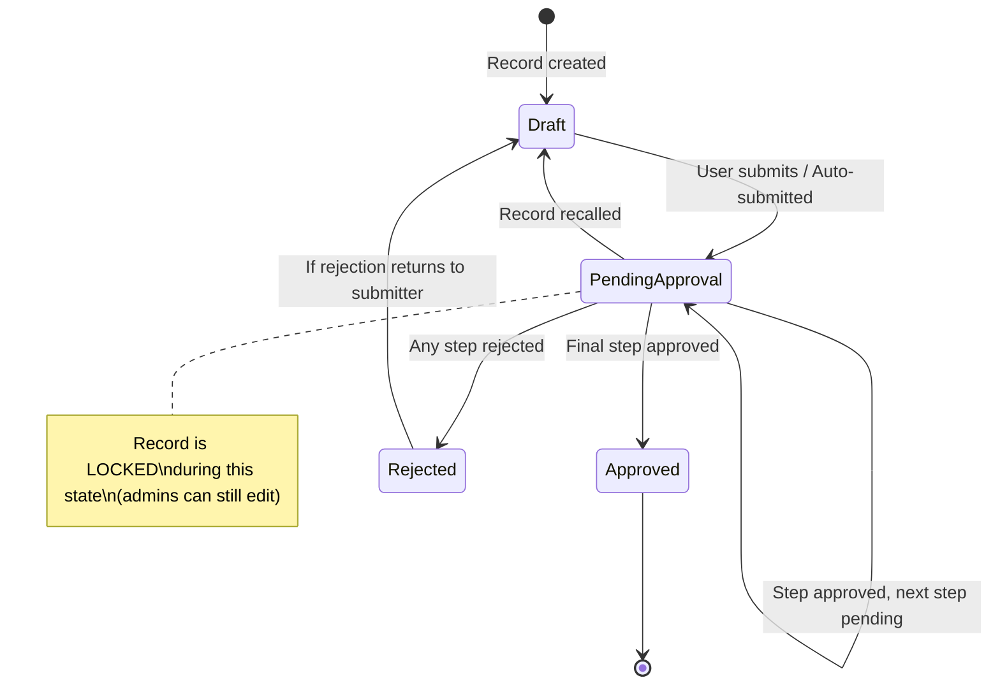
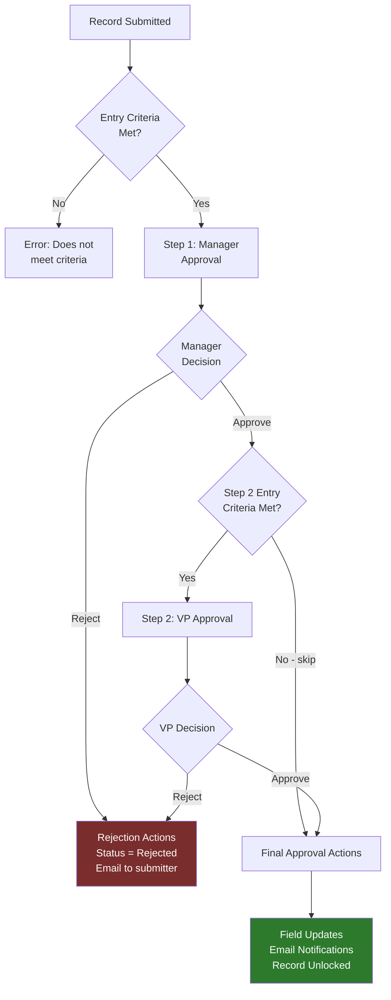

# Approval Processes — Advanced

## Exam Domain
Process Automation — 17% of exam weight

## Foundations

### What Is an Approval Process? (Starting from Basics)

An Approval Process automates multi-step human review and approval of Salesforce records. When triggered, it routes the record through one or more approval steps, locks the record from editing (optionally), and executes actions based on the outcome (approve, reject, recall).

**The key difference from Flows and Workflow Rules:** Approval Processes require *human action*. Flows and workflows are fully automated. Approval processes pause and wait for a human to click Approve or Reject.

**Core components:**
- **Entry Criteria** — When does the approval process activate? (e.g., "Opportunity Amount > $50,000")
- **Approval Steps** — Who must approve, in what order, with what criteria
- **Approver Assignment** — User, Queue, or dynamically resolved (field on record, manager hierarchy)
- **Actions** — What happens on entry, approval, rejection, or recall (field updates, emails, outbound messages, Flow execution)
- **Record Lock** — When submitted, the record is locked for editing (unless the approver unlocks it)

---

## How It Works

### Approval Process Trigger

An approval process can be triggered:
1. **Manually** — User clicks "Submit for Approval" button on the record
2. **Automatically** — An Apex trigger, Flow, or Process Builder calls `Approval.ProcessSubmitRequest` or the Submit for Approval action
3. **Auto-submitted via Flow** — Using the "Submit for Approval" action in a Flow

**Entry Criteria evaluation:**
- If the record does NOT meet entry criteria when submitted, the user gets an error message
- If there are multiple approval processes, only the FIRST one whose criteria match is triggered (they are evaluated in order; you can configure whether to evaluate the others if the first doesn't match)

### Approval Steps in Depth

Each approval step specifies:
- **Entry criteria for this step** — Can skip the step if conditions are met
- **Assigned approver** — User, queue, or relative (manager of submitter, owner, field lookup)
- **Approval routing** — If multiple approvers in a step: Unanimous (all must approve) OR First Response (any one approver is sufficient)
- **What happens if not approved** — Move to rejection or to a previous step

**Multi-step example:**
```
Step 1: Manager Approval (if Amount > $10K)
Step 2: VP Approval (if Amount > $50K)
Step 3: CFO Approval (if Amount > $100K)
```

Each step has its own approver assignment and can be skipped based on criteria.

### Approver Assignment Options

| Option | Description |
|---|---|
| Automatically assigned approver | Specific user or queue (hardcoded) |
| User field on record | A lookup field on the record (e.g., "Assigned Approver" field) |
| Manager of submitter | Resolved from the User.ManagerId field at time of submission |
| Record owner's manager | Owner's ManagerId field |
| Related user's manager | e.g., Account Owner's Manager |

**Allow approvers to manually select approver:** When enabled, the approver can choose who approves the *next* step. Used for ad-hoc escalation.

**Approval delegation:** Users can set up approval delegation in My Settings, redirecting approvals to another user when they're out of office.

### Actions

For each outcome (Initial Submission, Approval, Rejection, Recall), you can configure:
- **Field Update** — Change field values on the record or related records
- **Email Alert** — Send notification emails
- **Outbound Message** — SOAP web service callout to external system
- **Flow Launch** — Trigger a Flow (modern equivalent of many action types)
- **Task Creation** — Create a follow-up task

**Example:**
- On submission: Lock record, send email to approver
- On approval: Update `Status = Approved`, unlock record, notify submitter
- On rejection: Update `Status = Rejected`, unlock record, send rejection reason via email
- On recall: Reset to draft status, unlock record

### Record Locking

When a record enters an approval process, it is **locked** by default:
- Regular users (even the owner) cannot edit the locked record
- Admins can always edit locked records
- Approvers can be given permission to unlock and edit before approving
- The "Unlock" action can be added to approval/rejection outcomes to release the lock

**Exam key:** "Who can edit a record that is in an approval process?" — By default, ONLY system administrators. The approval process editor can configure approvers to have unlock privileges.

### Recall / Withdraw

Record owners (and admins) can recall a submitted approval request. This:
- Returns the record to the submitter
- Fires the "On Recall" actions
- Unlocks the record (if recall actions include an unlock)
- Removes the pending approval request

---

## Advanced Configuration

### Multiple Approval Processes on One Object

An object can have multiple approval processes. Evaluation order:
- Evaluated in the order shown in Setup
- When a record is submitted, Salesforce evaluates each approval process in order
- By default: once a matching process is found, evaluation stops ("Evaluate the next automated approval process" option unchecked)
- If "Evaluate the next automated approval process" is checked: multiple processes can trigger on the same submission

**Exam trap:** By default, only the FIRST matching approval process runs. This is different from sharing rules (where all matching rules apply).

### Jump to Step

In multi-step processes, an approver can be configured with permission to jump to any step in the process, bypassing the sequential flow. Used for emergency escalation paths.

### Automated Approval Routing with Queues

Using a Queue as the approver means any member of the queue can approve. Useful when:
- Multiple approvers are acceptable
- You have a group inbox model (e.g., Finance Approval queue)
- You need load distribution across approvers

The approval request appears in the queue's list view and any queue member can claim and approve it.

### Approval History Related List

All approval history is stored on the record in the "Approval History" related list. This shows:
- Who submitted, when
- Each step, who approved/rejected, when
- Current status
- Comments

This is also queryable via the `ProcessInstance` and `ProcessInstanceStep` objects in SOQL.

### Integrating with Flows

Modern best practice: Use a Flow's "Submit for Approval" action element to trigger approval processes declaratively. This replaces the older pattern of Apex triggers calling `Approval.process()`.

**Flow can also be triggered on approval/rejection outcomes** — the "Flow Launch" action type in approval process actions enables rich post-approval automation.

---

## Real-World Scenarios

### Scenario 1: Discount Approval with Tiered Levels
A company requires manager approval for discounts >10%, VP approval for >20%, and CFO approval for >30%.

**Design:**
- Step 1: Direct Manager (always required if discount > 10%)
- Step 2: VP of Sales (entry criteria: `Discount__c > 20%`)
- Step 3: CFO (entry criteria: `Discount__c > 30%`)
- Steps 2 and 3 are skipped automatically if the discount doesn't reach their threshold

### Scenario 2: Contract Approval with Multiple Parallel Approvers
A contract requires approval from both Legal and Finance before it can proceed (not just one or the other).

**Design:**
- Step 1: Legal Queue — Unanimous required (if queue has multiple members, all must approve — OR configure as First Response with Legal Queue)
- Step 2: Finance Manager
- Both steps must complete before contract is approved

Actually for parallel approval (both Legal AND Finance simultaneously), use a single step with multiple approvers and "Unanimous" routing.

---

## PTA / SA Relevance

### When This Comes Up in Engagements

**Discovery signals:**
- "We need sign-off from managers before reps can close deals above $X" → Approval processes
- "We need a paper trail of who approved what and when" → Approval History related list + ProcessInstance SOQL
- "We need to prevent editing contracts once they're under review" → Record Locking in approval process
- "Finance and Legal need to both sign off, not just one of them" → Unanimous approval routing

**The governance conversation:** In regulated industries (financial services, healthcare), approval processes provide a built-in, auditable approval chain. ProcessInstance and ProcessInstanceStep objects can be extracted for compliance reporting. This is a differentiator conversation with compliance-heavy customers.

### Common Partner Mistakes

1. **Using approval processes for every business decision** — If the "approval" is always auto-approved or always done by a specific person with no exception cases, a Flow is simpler. Reserve approval processes for genuine human decision points.

2. **Not configuring "On Recall" actions** — Record status fields can get stuck in "Pending Approval" state if recall actions don't reset them. Always configure recall actions.

3. **Not accounting for approval delegation during UAT** — When approvers are on leave and delegation isn't configured, approvals queue up. Test the delegation scenario during UAT.

4. **Hardcoding approvers in steps** — Hardcoded user IDs in approval steps cause maintenance headaches when org structures change. Always use field-based or manager-hierarchy-based approver assignment.

5. **Confusing "Unanimous" with "First Response"** — Unanimous = ALL approvers in the step must approve. First Response = any ONE approver is sufficient. Getting this wrong can lead to approvals going through without required sign-offs.

### Enterprise Scale Considerations

- **Queue-based approval at scale:** When thousands of records simultaneously enter approval with a queue as approver, queue list views need to be optimized. Consider using Flow + Notification to alert queue members rather than relying on them to check the queue.
- **ProcessInstance query performance:** Querying `ProcessInstance` and `ProcessInstanceStep` for compliance reports on orgs with millions of approval records requires careful SOQL indexing. Add selective WHERE clauses.
- **Automated submission via Flows:** For high-volume orgs, automating submission (rather than relying on users to click Submit) reduces process gaps. Design the trigger criteria carefully to avoid infinite loops.

---

## Architecture

### Approval Process State Machine



### Multi-Step Approval Flow



**Limitations:**
- Maximum 30 approval steps per approval process
- Maximum 25 approval processes per object
- Records can only be in ONE active approval process at a time
- Locked records cannot be edited by non-admins (or non-approvers if unlock isn't configured)
- Approval delegation must be set up by individual users (cannot be mass-configured by admin)
- ProcessInstance records are not deleted when the approval process is deleted — orphan records persist

---

## Key Facts to Memorize

1. Records in an approval process are locked — only sys admins (and configured approvers) can edit
2. "Unanimous" = ALL approvers must approve; "First Response" = any ONE approver is sufficient
3. Multiple approval processes: by default only the FIRST matching one runs; must explicitly enable cascade evaluation
4. Manager-hierarchy-based approver resolution uses `User.ManagerId` at time of submission
5. Recall fires "On Recall" actions — always configure these to avoid stuck records
6. Maximum 30 steps per approval process; maximum 25 approval processes per object
7. Approval delegation is configured by individual users in My Settings, not by the admin for them
8. Approval history is stored in `ProcessInstance` and `ProcessInstanceStep` objects
9. Flow "Submit for Approval" action is the modern way to auto-submit records
10. A record can only be in ONE active approval process at a time

---

## Exam Traps

- **Trap 1:** "Who can edit a record that is locked in an approval process?" — System Admin ALWAYS can. Regular users and record owners CANNOT (unless configured otherwise in the approval step).
- **Trap 2:** "Multiple approval processes on an object — which one runs?" — By DEFAULT, only the first matching one. Enable "Evaluate the next automated approval process" to cascade.
- **Trap 3:** "Both the Legal team and Finance team need to approve. How many steps is this?" — ONE step with multiple approvers and Unanimous routing (or two sequential steps). Both patterns are valid; the choice depends on whether they must approve simultaneously or sequentially.
- **Trap 4:** "An approval process step has 3 approvers with First Response. One approves, one rejects, one hasn't responded. What happens?" — First approval received wins. The step is approved.
- **Trap 5:** "Can a Flow be used as an action in an approval process?" — YES. Flow Launch is a valid action type in approval process outcomes.

---

## Practice Questions

**Q1.** A company needs both the Legal team and Finance team to approve a contract before it proceeds. Legal can approve independently; Finance can also approve independently; but BOTH must approve before the contract advances. Which approval step configuration achieves this?
- A. Two separate approval steps: Step 1 for Legal, Step 2 for Finance
- B. One step with Legal and Finance as approvers; routing set to "Unanimous"
- C. One step with Legal and Finance as approvers; routing set to "First Response"
- D. Two separate approval processes: one for Legal, one for Finance

**Answer: B** — One step with Unanimous routing requires all assigned approvers to approve before the step completes. Two separate sequential steps (A) would also work but processes them one at a time. The key word "both must approve" points to Unanimous.

---

**Q2.** A sales rep submits a $75,000 Opportunity for approval. The approval process has 3 steps: Step 1 (Manager) for >$10K, Step 2 (VP) for >$50K, Step 3 (CFO) for >$100K. Which steps execute?
- A. All three steps
- B. Steps 1 and 2 only
- C. Step 2 only (highest applicable threshold)
- D. Step 1 only

**Answer: B** — Steps have entry criteria evaluated when reached. Step 3 is skipped because $75K is not >$100K.

---

**Q3.** After a record is recalled from an approval process, the Status field still shows "Pending Approval." What is the most likely cause?
- A. The approval process is corrupt and needs to be redeployed
- B. The "On Recall" actions are not configured to reset the Status field
- C. Only system administrators can update the status after a recall
- D. The record is still locked and cannot be updated

**Answer: B** — The most common cause of stuck status values is missing "On Recall" actions. Configure a Field Update action on recall to reset Status back to the appropriate draft value.

---

**Q4.** An admin wants to automatically submit Opportunity records for approval when the Discount field exceeds 15%. Which approach is recommended using modern Salesforce best practices?
- A. Apex trigger calling `Approval.process()`
- B. Record-Triggered Flow with "Submit for Approval" action
- C. Workflow Rule with "Submit for Approval" outbound message
- D. Custom button configured to submit when Discount > 15%

**Answer: B** — Record-Triggered Flow with the "Submit for Approval" action element is the modern declarative approach. Apex (A) works but is overkill for this requirement. Workflow Rules (C) are legacy. Custom buttons (D) still require manual user action.
