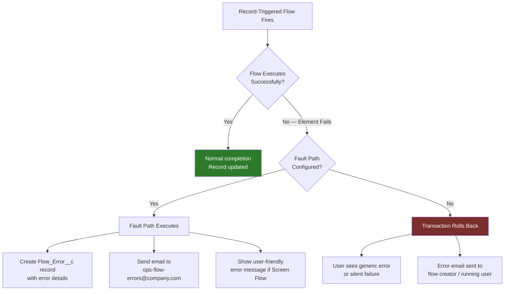
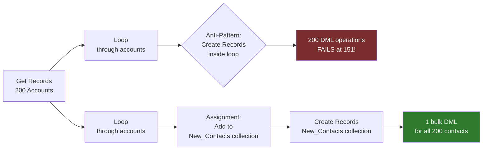

# Flow Testing & Debugging

## Exam Domain
Process Automation — 17% of exam weight

## Foundations

### Why Flow Testing and Debugging Matters

Flows are declarative — which means non-developers can build them. But this also means bugs can be introduced without the safety net of a unit test suite. The Advanced Admin exam tests your ability to diagnose flow failures, prevent them, and build testable, resilient flows from the start.

**Three categories of flow problems:**
1. **Design-time errors** — Flow Builder flags these before save (invalid references, missing required inputs)
2. **Activation errors** — Flow won't activate due to configuration issues
3. **Runtime errors** — Flow activates but fails during execution (governor limits, DML violations, null pointer exceptions, external service failures)

---

## How It Works

### Flow Builder Debug Mode

Flow Builder has an integrated debug panel. To use it:
1. Click "Debug" in Flow Builder (before activating)
2. Set input variable values
3. Run the flow step by step or all at once
4. Inspect the debug log: variable values, path taken, errors

**What debug mode shows:**
- Which path was taken at each Decision element
- Variable values before and after each element
- Errors and which element caused them
- How many records were queried/updated

**Limitations of debug mode:**
- Does not actually save DML changes in full debug mode (uses a pseudo-transaction that's rolled back)
- Cannot simulate scheduled paths in real time
- Cannot simulate fault paths being triggered (must use a record/condition that deliberately causes the error)
- External callouts may behave differently in debug vs production

### Flow Error Emails

When a record-triggered flow fails at runtime, Salesforce sends an email to:
- The user who triggered the flow (if run in user context)
- The flow admin/owner (if no user context, e.g., scheduled flows)

The email contains:
- The error message
- The element that failed
- The record ID that triggered the flow
- The interview ID (for log correlation)

**Admin action:** Set up a dedicated email alias (e.g., salesforce-flow-errors@company.com) and configure it as the flow admin address. This ensures errors aren't lost in an individual's inbox.

### Debug Logs for Flows

Flow execution is captured in Debug Logs (Setup > Debug Logs). Filter on `FLOW_BULK_ELEMENT_BEGIN`, `FLOW_BULK_ELEMENT_END`, `FLOW_CREATE_INTERVIEW_BEGIN`, `FLOW_ELEMENT_ERROR` categories.

**Reading a Flow debug log entry:**
- `FLOW_ELEMENT_ERROR` shows which element failed and the error message
- `FLOW_BULK_ELEMENT_BEGIN` shows bulk execution start (bulkified mode)
- Variable assignments appear as `FLOW_ASSIGNMENT`

### Flow Error Categories and Solutions

| Error Type | Example | Solution |
|---|---|---|
| Null pointer | Accessing a field on a null variable | Add null checks before accessing fields |
| DML exception | Validation rule failure | Add fault path, display specific error |
| Record not found | Get Records with no result, accessed without null check | Check `{!GetRecords.isNull}` or use fault path |
| Governor limit | Too many SOQL or DML | Bulkify; move DML out of loops |
| Invocable method error | Apex action throws exception | Apex action should throw AuraHandledException with clear message; add fault path |
| Cannot set value | Read-only field assignment in before-save | Remove the field assignment or switch to after-save |

### The Fault Path Pattern

A Fault Path is an alternative path that executes when an element fails. Best practice for every DML and callout element:

```
[Create/Update/Delete Records] --fault--> [Create Error Log Record]
                                  └-------> [Send Email to Admin]
                                  └-------> [Show Error to User (Screen Flow)]
```

**Key rule:** If a fault path is present, the transaction is NOT automatically rolled back for non-critical errors. The fault path is responsible for handling the state.

**Important:** Without a fault path on a DML element, any DML failure will roll back the ENTIRE transaction and show a generic error to the user.

### Flow Limits That Cause Runtime Errors

| Limit | Value | Common Trigger |
|---|---|---|
| Max SOQL queries per transaction | 100 (sync) / 200 (async) | Loop with Get Records inside |
| Max DML statements | 150 | Loop with Create/Update Records inside |
| Max records per DML operation | 10,000 | Bulk update collection with too many records |
| Max CPU time | 10 seconds (sync) | Complex loops with heavy processing |
| Max flow interview length | 2,000 elements | Very large flows |
| Max subflow depth | 10 | Deeply nested subflow calls |

### Testing Flows with Test Records

For record-triggered flows, the recommended testing approach (without a dedicated Flow Test tool):
1. Create a test record in a sandbox that meets the entry criteria
2. Verify the outcomes (check related records, field values, email logs)
3. Create edge case records: records that should NOT trigger the flow (verify no actions occurred)
4. Test bulk: use Data Loader to create/update 200 records simultaneously to verify bulk behavior

**Apex tests for Flows:** If flows call Apex actions (Invocable Methods), the Apex unit tests cover the Apex code. The flow logic itself is tested manually or via Apex test setup that inserts records.

### Flow Test Automation (Spring '24+)

Salesforce introduced **Flow Tests** — a declarative test framework in Flow Builder:
- Define test conditions (input variables or triggered record field values)
- Define expected outcomes (assertions on record fields, variable values)
- Run tests in Flow Builder or via the Test menu
- Tests can be included in CI/CD pipelines via `sf apex run test` (for flow-associated tests)

This is a newer feature — know it exists and its purpose for the exam.

---

## Advanced Configuration

### Governor Limit Monitoring in Flows

**Transaction Context Sharing:** Flows, Apex triggers, and other automation all share governor limits within the same transaction. A flow triggered by a mass update competes with any Apex that also fires on that trigger.

**Detecting limit proximity:** Use the Debug Log `LIMIT_USAGE_FOR_NS` category to see governor limit consumption mid-transaction.

### Handling Null References

The most common runtime error in flows is a null reference: trying to access a field on a record variable that wasn't populated (e.g., Get Records returned no records and the flow assumes a result).

**Pattern 1: Null check formula**
Add a Decision element after Get Records:
- Path: `{!Get_Account.Name} != null` → continue
- Path: else → handle no record found

**Pattern 2: Check collection size**
For collection-returning Get Records:
- `{!Get_Accounts} != null && {!Get_Accounts.size()} > 0`

### Flow Versioning and Rollback

When a flow has a bug in production:
1. Deactivate the active version
2. Activate the previous version (versions are preserved)
3. Fix the bug in a sandbox
4. Deploy and activate the fixed version

**Important:** Deactivating a flow with queued scheduled interviews (Scheduled Paths) shows a warning — those interviews will be abandoned.

### Interview GUID for Debugging

Every flow execution gets a unique Interview GUID. This appears in:
- Error emails
- Debug logs
- Paused/Waiting interviews in Setup > Flows

Use the GUID to correlate error emails with debug log entries.

---

## Real-World Scenarios

### Scenario 1: Diagnosing a Production Flow Failure
A customer reports that Opportunity records are not getting updated when Stage changes. The flow was working last week.

**Diagnostic steps:**
1. Check if the flow is still active (someone may have deactivated it)
2. Check Setup Audit Trail for recent flow changes
3. Enable Debug Log for a test user, reproduce the issue on a single record, check the flow log entries
4. Look for `FLOW_ELEMENT_ERROR` in the log — this shows the exact element and error message
5. Check if a validation rule was added recently that blocks the field update the flow is trying to make

### Scenario 2: Flow Hitting DML Limits During Nightly Batch
A scheduled flow runs at midnight and processes 5,000 records. It's been failing with "Too many DML statements: 151."

**Root cause:** DML operation inside a loop.

**Fix:**
1. Add a Record Collection variable
2. Inside the loop, use Assignment element to add records to the collection
3. Move the Create/Update Records element OUTSIDE the loop, using the collection
4. Single bulk DML instead of N DML statements

---

## PTA / SA Relevance

### When This Comes Up in Engagements

**The hidden complexity problem:** Many customers have dozens or hundreds of flows accumulated over years, with no fault paths and no error monitoring. When you arrive on an engagement and there are "mystery failures" in production, the diagnosis starts here.

**Proactive monitoring pattern:** Implement an error log custom object (e.g., `Flow_Error__c`) with fields for Error_Message, Flow_Name, Record_Id, Timestamp. Add fault paths on all production flows to write to this object. This gives you an operational dashboard of flow health.

**Before any data migration or mass update:** Check which record-triggered flows fire on the objects being updated. Calculate expected DML and SOQL consumption. This is standard pre-migration analysis.

### Common Partner Mistakes

1. **Deploying flows to production without fault paths** — This is the most common source of "silent" failures. Users don't see errors; records don't get updated; no one knows until a business impact is discovered.

2. **Not testing with bulk records** — A flow that works perfectly on one record can fail on a batch of 200 (the Apex governor limit batch size). Always test with bulk data in sandboxes.

3. **Not setting a dedicated error email address** — Flow error emails go to the flow creator's email by default. When that person leaves the company, errors become invisible.

4. **Ignoring Flow Trigger Explorer** — Multiple flows on the same object with no visibility into execution order leads to unpredictable interactions. Always review Flow Trigger Explorer during implementation.

5. **Not versioning flows properly** — Activating a new flow version automatically deactivates the old one. If the new version has a bug, you need the old version to be available. Keep at least 2 versions in sandbox before deploying to production.

### Enterprise Scale Considerations

- **Flow monitoring at scale:** Large orgs need a structured approach to flow monitoring. Build a Flow_Error__c logging mechanism and create a dashboard tracking error rates per flow per day.
- **Bulk API and flows:** When a mass update via Bulk API fires record-triggered flows, flows process records in batches of 200 (same as Apex). Design flows to handle this.
- **CI/CD integration for flows:** Flows are metadata (`.flow-meta.xml`). Include them in Salesforce DX deployments. Use scratch orgs to validate flow deployments. Salesforce CLI `force:source:deploy` validates flow syntax.
- **Deprecated features in flows:** Process Builder and Workflow Rules are legacy. Many orgs still have them. Be prepared to assess migration scope and prioritize flows that interact with legacy automation.

---

## Architecture

### Flow Debug and Monitoring Architecture



### DML Bulkification Pattern



**Limitations:**
- Flow debug mode does not commit DML (safe to test in production carefully, but always use sandbox)
- Scheduled paths cannot be tested in real-time via debug mode
- Flow Tests (declarative test framework) were introduced in Spring '24 — feature availability varies by org version
- Governor limits are SHARED across flows, Apex, and other automation in the same transaction
- Maximum subflow nesting depth: 10 levels
- Flow error emails have a 200/day limit per org — in high-error scenarios, you may miss later errors

---

## Key Facts to Memorize

1. Fault paths prevent full transaction rollback when a flow element fails
2. DML inside loops causes governor limit errors — always bulkify by building collections and doing DML outside the loop
3. Without fault paths, a DML failure in a flow rolls back the ENTIRE transaction
4. Flow error emails go to the flow's owner/creator by default — configure a team alias
5. Get Records that return no records — the record variable is null; always null-check before using it
6. Flow debug mode does NOT commit DML changes in the database
7. Flow governor limits are SHARED with Apex in the same transaction
8. Flow Interview GUID appears in error emails and debug logs — use it to correlate failures
9. Flow versions are preserved — you can roll back to a previous version by activating it
10. Flow Tests (declarative assertions) are available from Spring '24

---

## Exam Traps

- **Trap 1:** "A flow that worked for single records fails when 200 records are updated simultaneously" — This is a bulkification issue (DML or SOQL inside a loop). The single-record scenario doesn't hit limits; the bulk scenario does.
- **Trap 2:** "A flow has a fault path — does this prevent the transaction from rolling back?" — It depends on the error type. For DML exceptions (e.g., validation rule failure), the fault path catches the error but the transaction state depends on what was already committed. For unhandled Apex exceptions, rollback still occurs.
- **Trap 3:** "A flow is deactivated — what happens to pending scheduled path interviews?" — They are abandoned (cancelled). Deactivating a flow with pending interviews should be done carefully.
- **Trap 4:** "Flow debug mode commits DML changes to the database" — FALSE. Debug mode runs in a pseudo-context; DML is not committed.
- **Trap 5:** "Can you add a fault path to a Decision element?" — NO. Fault paths are only available on certain element types: Create Records, Update Records, Delete Records, Get Records, and callout elements.

---

## Practice Questions

**Q1.** A record-triggered flow is failing silently — records are not being updated and users are not seeing error messages. The admin cannot reproduce the issue. What is the BEST first diagnostic step?
- A. Deactivate and reactivate the flow
- B. Enable a debug log for the affected user and reproduce the trigger condition
- C. Delete and recreate the flow from scratch
- D. Check if the flow is listed in Setup > Apex Jobs

**Answer: B** — Enabling a debug log with FLOW categories and reproducing the issue shows exactly which element failed and why. This is the correct, systematic first step.

---

**Q2.** A scheduled flow processes 1,000 Account records nightly, updating a custom field inside a loop. The flow is failing with "Too many DML statements." What change fixes this?
- A. Split the flow into 7 separate scheduled flows processing 143 records each
- B. Move the Update Records element outside the loop; use a collection variable populated inside the loop
- C. Replace the scheduled flow with an Apex batch class
- D. Enable "Bulk Processing" in the flow's advanced settings

**Answer: B** — The correct fix is to build a collection inside the loop and perform a single bulk DML after the loop. Option A would work but is not scalable. Option C is not declarative (overkill for this scenario). Option D doesn't exist.

---

**Q3.** A production flow is sending error emails to an admin who left the company. Going forward, what should be configured to ensure flow error emails reach the active operations team?
- A. Update the "From Email" address in Email Settings
- B. Configure a flow error email address in Flow Settings to a team alias
- C. Add all operations team members as co-owners of each flow
- D. Enable Chatter notifications for flow failures

**Answer: B** — Flow error notification settings allow configuring a dedicated email address (ideally a team alias/distribution list) for flow error notifications. This ensures the team receives errors regardless of individual user changes.

---

**Q4.** An admin adds a fault path to a "Create Records" element in a flow. The fault path sends an email notification. The "Create Records" element fails due to a validation rule violation. What happens to records already updated by earlier elements in the same flow execution?
- A. All previous changes in the transaction are rolled back automatically
- B. Previous changes remain committed; only the failing element's action is skipped
- C. The fault path handles the error; whether previous changes are rolled back depends on the transaction state and error type
- D. The flow retries the Create Records element 3 times before invoking the fault path

**Answer: C** — This is nuanced. If the DML failure triggers a database-level exception that rolls back the transaction, all changes in the transaction are rolled back regardless of the fault path. The fault path handles the error gracefully for the user experience but doesn't necessarily preserve partial state. For most validation rule failures, the entire DML batch is rolled back.
