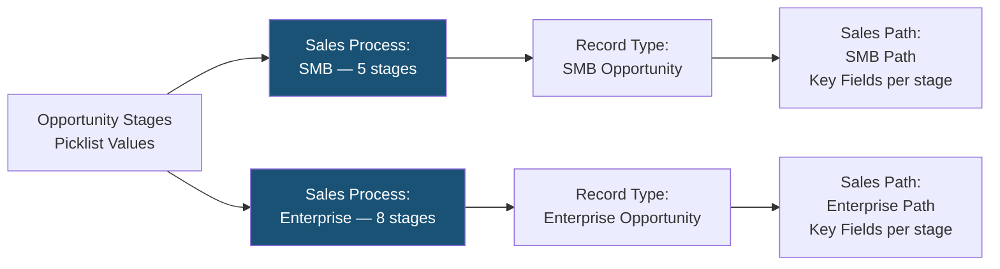
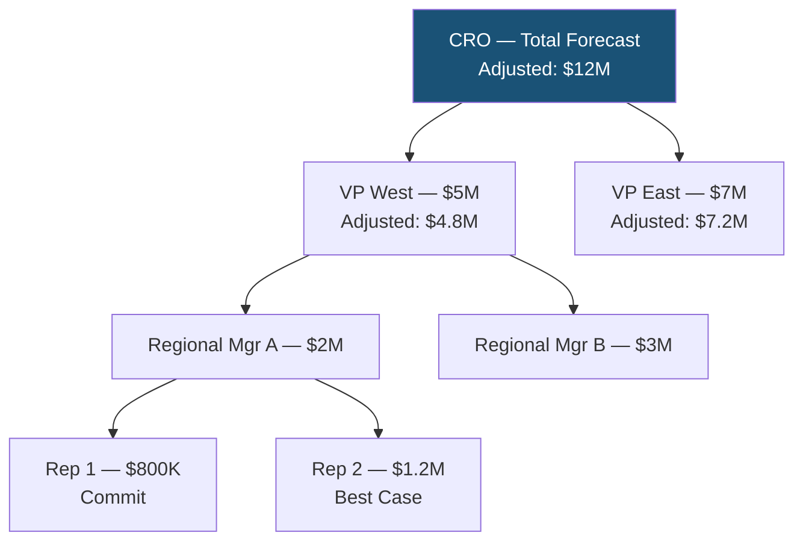

# Advanced Sales Cloud

## Exam Domain
Sales Cloud — 10% of exam weight

## Foundations

### What Sales Cloud Advanced Topics Cover

At the Admin cert level, you learned the basic Sales Cloud objects: Leads, Contacts, Accounts, Opportunities, Products, Price Books. The Advanced Admin exam pushes into the configuration mechanics that govern how sales processes work at enterprise scale:

- **Opportunity management:** Stage-based sales processes, forecasting, opportunity splits
- **Lead management:** Lead assignment rules, web-to-lead, lead scoring (Einstein), routing
- **Price Books and Products:** Multiple price books, product schedules, discounting workflows
- **Forecasting:** Collaborative forecasting, forecast types, quota management
- **Sales Path and Guidance:** Key fields per stage, contextual guidance
- **Einstein Activity Capture and Inbox:** Advanced configuration considerations

---

## How It Works

### Opportunity Sales Processes

A Sales Process defines the set of Stages available for opportunities of a given Record Type. Multiple Record Types can use different Sales Processes.

**Configuration flow:**
1. Create Opportunity Stages (picklist values for StageName, with Probability, Forecast Category)
2. Create Sales Process (select which stages are included)
3. Create Record Type and assign it a Sales Process

**Forecast Categories:** Each Stage maps to a Forecast Category:
- **Pipeline** — Early stage, low probability
- **Best Case** — Likely to close, moderate confidence
- **Commit** — High confidence
- **Closed Won** — Closed and won
- **Omitted** — Not included in forecasting
- **Most Likely** (if enabled) — Between Best Case and Commit

**Exam key:** Forecast Category is a property of the Stage, not directly editable on the Opportunity (unless you add the field to the layout). The Forecast Category shown on the Opportunity record comes from the Stage's mapping.

### Collaborative Forecasting

Collaborative Forecasting is the modern forecasting tool. Key features:
- Hierarchical rollups (sales rep → manager → VP → CRO)
- Multiple forecast types (Opportunity Revenue, Opportunity Quantity, Overlay Splits, etc.)
- Manager adjustments (override subordinate forecasts without changing their view)
- Quota tracking

**Forecast Types:**
- Opportunity Revenue — standard revenue-based forecast
- Opportunity Quantity — unit-based
- Product Family — forecasts by product line
- Territory — requires Territory Management 2.0
- Overlay — for overlay reps sharing credit

**Key enablement:** Enable Collaborative Forecasting in Setup; configure at least one Forecast Type. Users must have a Role (not just a profile) to appear in the forecast hierarchy.

**Manager Adjustments:** When a manager adjusts a subordinate's forecast:
- The subordinate's forecast view is unchanged
- The manager sees their original forecast AND the manager-adjusted forecast
- Adjustment is stored separately and doesn't modify opportunity records

### Opportunity Splits

Opportunity Splits allow credit for an opportunity to be distributed across multiple users (e.g., overlay rep + field rep sharing credit).

**Split types:**
- **Revenue Splits** — percentages must total 100% (who owns revenue credit)
- **Overlay Splits** — percentages can exceed 100% (overlay/specialist credit)

**Enabling:** Setup > Opportunity Splits. Requires Collaborative Forecasting to be enabled.

**Exam trap:** Revenue splits MUST total exactly 100%. If they don't add up to 100%, Salesforce will show an error on save. Overlay splits can total more or less than 100%.

### Lead Assignment Rules

Lead Assignment Rules determine which user or queue receives ownership of a new lead. Rules are evaluated in order; first matching rule wins.

**Configuration:**
1. Create a Lead Assignment Rule (only ONE can be active)
2. Add rule entries with criteria (field values) and an assigned user or queue
3. Set a default assignment (catches leads that don't match any entry)

**Web-to-Lead:** When a lead is created via Web-to-Lead form, the assignment rule runs automatically. The "Assign using active assignment rules" checkbox must be checked (it is by default for web leads).

**Important:** Only ONE Lead Assignment Rule can be active at a time. You can have many rules defined, but only one is active.

### Product Catalog: Price Books, Products, and Schedules

**Price Books:**
- Standard Price Book: default price for all products
- Custom Price Books: segment-specific pricing (partner, government, enterprise)
- An opportunity can only use ONE price book at a time

**Product Schedules:**
- Allow a single product's revenue to be spread over time
- Two types: **Quantity Schedule** (deliveries over time) and **Revenue Schedule** (payments over time)
- Must be enabled per product

**Exam key:** If you change a product's price in the price book, existing opportunity line items are NOT updated automatically. The price is locked at the time of adding the product to the opportunity.

### Campaign Influence

Campaign Influence tracks which campaigns influenced an opportunity (beyond the single "Primary Campaign Source" on the Opportunity).

**Models:**
- **First Touch** — 100% credit to the first campaign
- **Last Touch** — 100% credit to the most recent campaign
- **Even Distribution** — equal credit to all campaigns
- **Custom Model** — admin-defined influence distribution

**Enabling:** Setup > Campaign Influence. Enable the model you want. A campaign must be related to a Contact on the opportunity for influence to be tracked.

### Sales Path and Guidance for Success

Sales Path provides visual stage progression and "Guidance for Success" text at each stage.

**Configuration:**
1. Setup > User Interface > Sales Path Settings
2. Enable Sales Path
3. Create a Path for the Opportunity (or other objects)
4. For each stage: define Key Fields (fields highlighted for input) and Guidance for Success (text, links, tips)

**Who sees it:** Users with the record type aligned to the path. Paths are record-type-specific.

---

## Advanced Configuration

### Custom Lead Fields and Lead Conversion Mapping

When a lead is converted:
- Standard field mappings are predefined (Company → Account Name, Email → Contact Email, etc.)
- Custom lead fields must be mapped to custom Contact, Account, or Opportunity fields
- Unmapped custom fields are LOST at conversion if not mapped

**Exam key:** You must manually map custom lead fields. Unmapped custom fields are not copied to converted records.

### Product Families and Forecasting

Products belong to a Product Family (picklist on Product). If Product Family forecasting is enabled, managers can see forecasts broken down by product line — e.g., "Hardware: $2M, Software: $1.5M, Services: $800K."

---

## Real-World Scenarios

### Scenario 1: Multi-Region Sales with Different Stages
A global company has different selling motions for SMB (5-stage process) and Enterprise (8-stage process). They need separate stage sets and separate Forecast Categories.

**Design:**
- Create two Sales Processes: "SMB Sales Process" (5 stages) and "Enterprise Sales Process" (8 stages)
- Create two Opportunity Record Types: "SMB Opportunity" and "Enterprise Opportunity"
- Each Record Type maps to its respective Sales Process
- Stage-to-Forecast Category mapping can be shared or differentiated

### Scenario 2: Territory + Opportunity Split Overlay
An enterprise software company has geographic reps (own revenue credit) and solution engineers (overlay, no direct revenue credit but tracked for capacity planning).

**Design:**
- Enable Opportunity Splits with both Revenue and Overlay types
- Geographic reps: 100% Revenue Split
- Solution engineers: 50% Overlay Split (can add to multiple deals without affecting revenue totals)
- Territory Management 2.0 for territory-based forecasting

---

## PTA / SA Relevance

### When This Comes Up in Engagements

**The forecasting redesign conversation:** Many customers outgrow their initial forecasting setup. When you see multiple active forecast types, misaligned quota data, and managers manually adjusting things in spreadsheets, that's a signal to redesign the forecasting model. Start by mapping Forecast Categories to their stage strategy.

**Custom lead field mapping audit:** During implementation, teams often create custom lead fields without mapping them to conversion targets. Run a pre-go-live audit: query `LeadFieldMapping` metadata to verify all custom lead fields have a mapping.

**Price book governance:** Multi-region orgs often create price books without governance — 50+ price books, out-of-date pricing, no owner. Recommend a price book governance model (1-2 active price books per segment, quarterly review cycle).

### Common Partner Mistakes

1. **Not testing lead conversion with custom fields** — Unmapped fields silently drop at conversion. This is discovered post-go-live when customers notice data is missing on converted records.

2. **Enabling Collaborative Forecasting without user Roles configured** — Users without Roles don't appear in forecast hierarchy. Always verify that all sales users have Roles before activating forecasting.

3. **Revenue splits not totaling 100%** — If split owners are added and removed during the opportunity lifecycle, splits can end up at 80% or 120%. Build a validation rule to enforce 100% for revenue splits.

4. **One active Lead Assignment Rule limit** — Customers sometimes create multiple rules for different segments and wonder why only one fires. Remind them: only the ACTIVE rule runs.

### Enterprise Scale Considerations

- **Forecast hierarchy depth:** Deep role hierarchies (8+ levels) make forecast rollup slow. Flatten where possible and use Territory-based forecasting for large orgs.
- **Lead volume + assignment rules:** High-velocity lead orgs (10k+ leads/day) need efficient assignment rules. Complex criteria with many OR conditions on unindexed fields slow down the assignment rule evaluation. Index key fields used in lead assignment criteria.
- **Price book at enterprise scale:** Currency conversion for multi-currency orgs with Advanced Currency Management means opportunity line item prices need dated exchange rates. This adds complexity to price book management.

---

## Architecture

### Sales Process to Record Type Mapping

### Collaborative Forecasting Hierarchy

**Limitations:**
- Only ONE Lead Assignment Rule can be active at a time
- Revenue Splits must total exactly 100%
- Price Book changes do not auto-update existing Opportunity Line Items
- Custom Lead fields must be manually mapped for conversion or data is lost
- Users without Roles do not appear in the Collaborative Forecasting hierarchy
- Maximum 5 forecast types per org
- Product/Quantity schedules must be enabled per product

---

## Key Facts to Memorize

1. Only ONE Lead Assignment Rule can be active — having many rules doesn't help if only one is active
2. Custom lead fields must be mapped to conversion target fields — unmapped fields are lost
3. Forecast Category is a property of the Stage, not directly editable on the Opportunity
4. Revenue Splits must total exactly 100%; Overlay Splits can exceed 100%
5. Price Book changes do NOT auto-update existing Opportunity Line Items
6. Users without Roles don't appear in the Collaborative Forecasting hierarchy
7. Sales Process defines which stages a Record Type can use — multiple Record Types can share a Sales Process
8. Manager adjustments in Collaborative Forecasting don't change opportunity records — they're stored separately
9. Campaign Influence requires a contact to be linked to both the campaign and the opportunity
10. Maximum 5 Forecast Types per org

---

## Exam Traps

- **Trap 1:** "A sales rep creates an opportunity but it doesn't appear in anyone's forecast" — Check if the rep has a Role assigned. Users without Roles don't appear in Collaborative Forecasting.
- **Trap 2:** "Revenue splits show 120% total and the record can't be saved" — Revenue splits must total 100%. Overlay splits can exceed 100%.
- **Trap 3:** "A company changes the price of a product in the price book. What happens to open opportunity line items?" — Nothing. Prices are locked at the time the product is added to the opportunity.
- **Trap 4:** "A converted lead is missing a custom field value on the resulting Contact" — The custom Lead field was not mapped to a Contact field in Lead field mapping.
- **Trap 5:** "Multiple Lead Assignment Rules are active. In what order are they evaluated?" — Only ONE rule can be active. The question is a trap — verify which rule is marked as the active one.

---

## Practice Questions

**Q1.** A sales rep's opportunities are not appearing in their manager's Collaborative Forecast. The rep has a profile with full opportunity access. What is the most likely cause?
- A. The rep's profile doesn't include the ForecastUser permission
- B. The rep is not assigned a Role in the role hierarchy
- C. Collaborative Forecasting is not enabled for that Record Type
- D. The opportunity's Forecast Category is set to Omitted

**Answer: B** — Users must have a Role to appear in the forecasting hierarchy. No role = not in the forecast tree regardless of profile permissions.

---

**Q2.** A company has two sales organizations: SMB and Enterprise. They need SMB reps to see 5 opportunity stages and Enterprise reps to see 8 stages. How should this be configured?
- A. Create two separate Salesforce orgs
- B. Use one sales process with 13 stages; filter stages by profile
- C. Create two Sales Processes; assign each to a different Opportunity Record Type
- D. Create two sets of picklist values for StageName on separate custom objects

**Answer: C** — Sales Processes define stage subsets; Record Types assign Sales Processes to specific opportunity types. This is the canonical configuration for multi-motion sales organizations.

---

**Q3.** A solution engineer (overlay rep) should receive 50% credit on 10 opportunities simultaneously. The total overlay splits across all deals could exceed 100%. Which split type should be used?
- A. Revenue Split — 50% per deal
- B. Overlay Split — 50% per deal
- C. Custom Split with cap of 100%
- D. Territory Split via Territory Management 2.0

**Answer: B** — Overlay Splits are designed for this use case. Revenue Splits must total 100% per deal and cannot accommodate overlay scenarios. Overlay Splits can exceed 100%.

---

**Q4.** An admin converts 1,000 leads to contacts. After conversion, a custom field `Lead_Source_Detail__c` on Lead is missing on the resulting Contact records. What should have been done?
- A. Enabled "Copy Custom Fields on Convert" in Lead Settings
- B. Added a validation rule to prevent conversion without the field
- C. Mapped the custom Lead field to a custom Contact field in Lead Field Mapping
- D. Added the field to the Lead Conversion page layout

**Answer: C** — Custom lead fields must be explicitly mapped to Contact/Account/Opportunity fields. Unmapped fields are dropped at conversion. There is no "copy custom fields" toggle.
