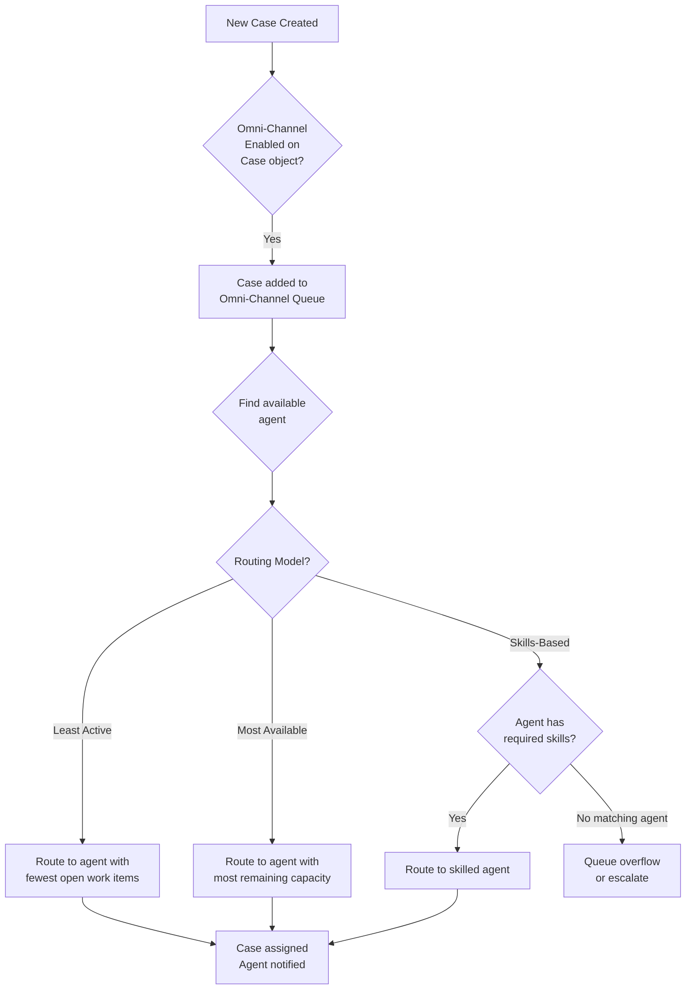
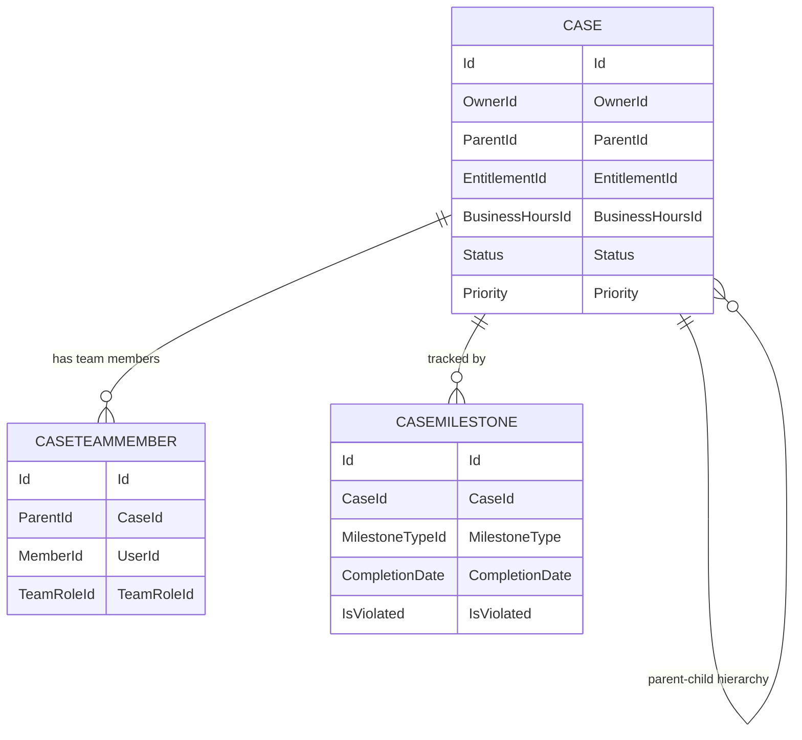

# Advanced Service Cloud

## Exam Domain
Service Cloud — 10% of exam weight

## Foundations

### What Advanced Service Cloud Covers

At Admin cert level you learned Cases, Case Assignment Rules, Queues, Escalation Rules, and basic Email-to-Case. The Advanced Admin exam goes into the enterprise service patterns that large support organizations use:

- **Case management at scale:** Case hierarchies, case teams, case merge
- **Omni-Channel routing:** Skills-based routing, capacity models, routing configurations
- **Entitlements and Milestones:** SLA enforcement — covered in detail in Lecture 09
- **Knowledge:** Article management, search tuning — covered in Lecture 10
- **Service Console:** Multi-tab layouts, macros, quick text, keyboard shortcuts
- **Escalation rules, auto-response rules, assignment rules** — at depth

---

## How It Works

### Case Assignment Rules

Case Assignment Rules automatically assign case ownership to a user or queue based on rule criteria.

**Key rules:**
- Only ONE case assignment rule can be active at a time
- Rule entries evaluated in order; first match wins
- Default assignment: cases not matching any entry go to the default case owner (configured in Support Settings)
- "Assign using active assignment rules" checkbox on Case must be checked for rules to run; it's auto-checked for Web-to-Case and Email-to-Case

**Case reassignment:** Assignment rules only run on case creation (by default) and when a user manually checks the "Assign using active assignment rules" checkbox. Flows or Apex are needed to reassign cases automatically based on field changes mid-case-lifecycle.

### Case Escalation Rules

Escalation Rules automatically escalate cases that haven't been resolved or updated within a defined time frame.

**Configuration:**
- Escalation Rule Entry: criteria (e.g., `Priority = High`) + time trigger
- Time trigger: based on when the case was created OR a custom date/time field
- Actions: reassign to user/queue, send email notification, both

**Business hours:** Escalation time calculations can respect Business Hours. If Business Hours are enabled on the escalation entry, time counts only during defined business hours.

**Exam key:** Escalation rules DO NOT have an "evaluate on update" option — they evaluate based on a time threshold, not a field change. For field-change-based escalation, use Flows.

### Web-to-Case and Email-to-Case

**Web-to-Case:**
- HTML form that creates cases from your website
- Configure fields, assign to a queue or user, enable assignment rules
- Generate the HTML code from Setup > Service > Web-to-Case
- Limit: 5,000 new cases per day via web

**Email-to-Case:**
- Creates cases from inbound emails
- Two modes: Email-to-Case (standard) and On-Demand Email-to-Case (via email service address)
- On-Demand: email is routed to a Salesforce email service address; no firewall changes needed
- Standard: requires the Salesforce Email-to-Case agent installed behind your email server

**Auto-Response Rules:** Send an automated reply to the case contact when a case is created or updated. Only ONE auto-response rule can be active.

### Omni-Channel Routing

Omni-Channel routes work items (cases, chats, leads, custom objects) to agents based on agent availability, capacity, and optionally skills.

**Routing Models:**
- **Least Active** — routes to agent with fewest open work items
- **Most Available** — routes to agent with most remaining capacity
- **External Routing** — integrates with a third-party ACD (contact center software)

**Key objects:**
- **Service Channel** — maps an object (e.g., Case) to Omni-Channel
- **Routing Configuration** — defines routing model, work item size, overflow behavior
- **Queue** — each Omni-Channel queue uses a routing configuration
- **Presence Status** — controls whether agents are available to receive work

**Skills-based routing:** Route work items to agents with specific skills (e.g., language, product knowledge, tier). Skills are assigned to agents; routing rules match work items to required skills.

**Omni-Channel Supervisor:** Real-time view of agent availability, queue depths, and active work items. Used by supervisors to monitor service operations.

### Case Teams

Case Teams allow multiple users to collaborate on a single case. Unlike queues (which represent group ownership), Case Teams allow a case to have an owner AND a set of contributors.

**Configuration:**
- Create Case Team Roles (e.g., Technical Lead, Customer Success Manager)
- Each role has a Case Access level: Read Only or Read/Write
- Predefined Case Teams: templates that auto-add users to cases matching certain criteria (via workflow/flow)

**Use case:** A case is owned by Tier 1 Support but needs input from Engineering and Customer Success. Engineering and CS are added to the Case Team without changing case ownership.

### Case Merge

Users can merge duplicate cases. The merge:
- Selects a master case (retains its fields)
- Merges up to 3 cases at once
- Related records (emails, activities, chatter) are merged to the master
- The non-master cases are closed automatically

**Admin consideration:** Not available for cases in Approval Processes (locked records cannot be merged).

### Case Hierarchies

Cases can have parent-child relationships via the `ParentId` field. This creates a hierarchical case tree.

**Use case:** A parent "known issue" case tracks an outage; child cases are individual customer reports linked to the parent. When the parent is resolved, children can be auto-resolved via Flow.

**Rollup:** There is no native rollup summary on Cases (Cases are related to other Cases via Lookup, not Master-Detail, so no native rollup). Flows or Apex are needed for case hierarchy rollups.

---

## Advanced Configuration

### Service Console Layout

The Service Console (Lightning Console App) enables:
- **Split View** — list view on left, records on right
- **Multiple tabs** — agents can have multiple records open simultaneously
- **Subtabs** — related records open as subtabs within a workspace tab
- **Keyboard shortcuts** — navigation without mouse

**Macros:** A sequence of predefined instructions that auto-fill fields, send emails, or update records — triggered by a single click. Used to standardize agent responses.

**Quick Text:** Pre-approved response snippets agents can insert into emails and chat messages. Searchable by keyword.

### Business Hours and Support

Business Hours define when support is available. Used by:
- Escalation rules (count only business hours toward SLA)
- Entitlement Milestones (SLA time counts during business hours only)
- Case comments/activities timestamps for SLA reporting

**Multiple Business Hours records:** Create different Business Hours for different regions/time zones. Assign the appropriate Business Hours to cases via assignment rules or flows.

### Service Level Agreements — Overview

SLA enforcement uses **Entitlements** and **Milestones** — covered in depth in Lecture 09. At the overview level:

- Entitlement = contract defining support level (e.g., "24/7 Premium Support")
- Milestone = specific response/resolution targets within an entitlement (e.g., "First Response within 4 hours")
- Milestone Actions = what happens at 50%, 75%, and 100% of milestone time (warnings, escalations)

---

## Real-World Scenarios

### Scenario 1: Multi-Tier Support with Omni-Channel
A customer has Tier 1 (email cases, basic), Tier 2 (chat, technical), and Tier 3 (engineering escalation). Route based on skills (product knowledge) and case priority.

**Design:**
- Service Channels: Case, Chat
- Routing Configurations: Least Active for Tier 1, Most Available for Tier 2
- Skills: ProductA, ProductB, Language-Spanish — assigned to agents
- Skill-based routing rules: Priority=High cases require Tier 2 skill profile

### Scenario 2: Known Issue Case Hierarchy
Customer support receives 50 cases about a network outage. One master case tracks the engineering fix; 50 customer cases link as children.

**Design:**
- Create parent Case for engineering tracking
- Flow: When a new case matches certain criteria (e.g., Subject contains "network outage"), automatically set ParentId to the master case
- When parent case is resolved, a second Flow auto-closes all child cases and sends resolution email to all affected contacts

---

## PTA / SA Relevance

### When This Comes Up in Engagements

**The Omni-Channel maturity conversation:** Many customers have Salesforce Cases but route them via email forwarding and manual queue management. Omni-Channel is the upgrade path to real-time intelligent routing. Be ready to present the business case: reduced handle time, balanced agent workload, skills matching.

**SLA visibility gap:** Customers often have SLA commitments in contracts but no systematic way to measure breach rate. Entitlements + Milestones + a reporting dashboard closes this gap. Positioning this is a high-value conversation.

**Service console adoption:** The biggest Service Cloud ROI often comes from agent productivity improvements (macros, quick text, keyboard shortcuts). During implementations, invest time in the console layout and macro library — agents who use macros close cases 30-40% faster.

### Common Partner Mistakes

1. **Implementing Omni-Channel without agent presence training** — Omni-Channel requires agents to manage their Presence Status. If agents don't understand how to set themselves "Available," work items queue up and don't get routed. This is an adoption gap, not a technical failure.

2. **Not configuring default case owner in Support Settings** — When no assignment rule matches, cases go to the default owner. In many implementations, this is left as the admin user. This creates a blind spot for unrouted cases.

3. **Building escalation rules for field-change escalation** — Escalation rules are time-based only. If a customer needs "escalate when case priority changes to Critical," that requires a Flow, not an escalation rule.

4. **Case Team Roles with incorrect access levels** — If a team role has Read Only access, those users can't update the case. Verify access levels match the role's actual need.

### Enterprise Scale Considerations

- **Queue depth monitoring at scale:** Omni-Channel with high case volume needs real-time monitoring. Use the Omni-Channel Supervisor component in the Service Console and build a queue depth report/dashboard.
- **Email-to-Case at 5,000+ emails/day:** On-Demand Email-to-Case can handle high volumes but email classification and routing becomes critical. Consider Einstein Classification for automatic field population.
- **Case hierarchy rollups:** For large hierarchies (parent with 1,000+ children), avoid real-time rollup calculations. Use scheduled flows or batch Apex for nightly aggregates.
- **Business Hours in multi-region orgs:** Orgs supporting customers across all time zones need multiple Business Hours records and logic to assign the right one per case based on customer location.

---

## Architecture

### Omni-Channel Routing Flow

### Case Management Object Model

**Limitations:**
- Only ONE Case Assignment Rule can be active at a time
- Only ONE Auto-Response Rule can be active at a time
- Web-to-Case: 5,000 cases/day limit
- Case Merge: maximum 3 cases at once; not available for locked (approval process) cases
- No native rollup summary on Case hierarchy (Lookup relationship, not Master-Detail)
- Escalation rules are time-based only — cannot trigger on field changes
- Omni-Channel External Routing requires a third-party integration

---

## Key Facts to Memorize

1. Only ONE Case Assignment Rule can be active at a time (same as Lead)
2. Escalation rules are TIME-BASED only — not triggered by field changes (use Flows for that)
3. Case Teams allow collaboration without changing case ownership — roles have Read Only or Read/Write access
4. Case hierarchy uses a Lookup relationship (not Master-Detail) — no native rollup summaries
5. Web-to-Case limit: 5,000 cases per day
6. Omni-Channel routing models: Least Active, Most Available, External (and Skills-based routing)
7. Auto-Response Rules: only ONE can be active; sends automated reply to case contact
8. Business Hours can be assigned to cases and affect escalation time calculation
9. Case Merge: maximum 3 cases; non-master cases are closed automatically
10. On-Demand Email-to-Case uses a Salesforce email service address — no firewall changes needed

---

## Exam Traps

- **Trap 1:** "Configure escalation rule to fire when case Priority changes to Critical" — Escalation rules are time-based. Use a Flow for field-change-based escalation.
- **Trap 2:** "A case with a Case Team member cannot be edited" — FALSE. Case Team members with Read/Write access CAN edit the case. Only approval process locks prevent editing.
- **Trap 3:** "Web-to-Case volume exceeds 5,000 per day" — The 5,000 limit is real. High-volume self-service portals need Email-to-Case or API-based case creation instead.
- **Trap 4:** "Multiple Case Assignment Rules" — Only ONE can be active. Multiple rules are defined but only the active one runs.
- **Trap 5:** "Case Hierarchy parent-child rollup" — No native rollup possible (Lookup relationship). Answer for any rollup requirement is Flow or Apex.

---

## Practice Questions

**Q1.** A support manager wants cases to automatically escalate to a Tier 2 queue if Priority changes to "Critical." Which feature accomplishes this requirement?
- A. Escalation Rules with Priority = Critical criteria
- B. Case Assignment Rule with Priority = Critical criteria
- C. Record-Triggered Flow with After Save trigger on Priority change
- D. Auto-Response Rule with Priority = Critical criteria

**Answer: C** — Escalation Rules are time-based and cannot trigger on field changes. A Flow that fires when Priority changes to Critical and reassigns the case to Tier 2 queue is the correct solution.

---

**Q2.** A company has a "Silver Support" entitlement with a 4-hour first response SLA. The company supports customers in US, UK, and Australia with different business hours. How should Business Hours be configured?
- A. Create one Business Hours record with a 24-hour window to cover all time zones
- B. Create separate Business Hours records for each region and assign to cases based on customer location
- C. Configure Business Hours at the profile level for each agent
- D. Use a formula field on Case to calculate SLA based on time zone

**Answer: B** — Multiple Business Hours records allow region-specific SLA time calculations. Cases are assigned the appropriate Business Hours record (via assignment rule or Flow) based on the customer's location.

---

**Q3.** A case is merged with two duplicate cases. What happens to the email threads on the non-master cases?
- A. Email threads are deleted since the non-master cases are closed
- B. Email threads are merged to the master case's related list
- C. Email threads remain on the closed non-master cases only
- D. Email threads are sent to the case contact as a summary

**Answer: B** — During case merge, related records (emails, activities, attachments) from the non-master cases are merged to the master case. This is one of the key benefits of case merging.

---

**Q4.** An agent is set to "Available" in Omni-Channel but is not receiving new cases despite cases sitting in the queue. What is the most likely cause?
- A. The agent's profile lacks the Omni-Channel permission
- B. The agent has exceeded their work item capacity in the Routing Configuration
- C. The case assignment rule is overriding Omni-Channel routing
- D. Omni-Channel requires manager approval before routing to new agents

**Answer: B** — Each agent has a capacity limit defined in the Routing Configuration (or Omni-Channel configuration). If the agent has reached their capacity, no new items are routed to them even if they are marked Available.
