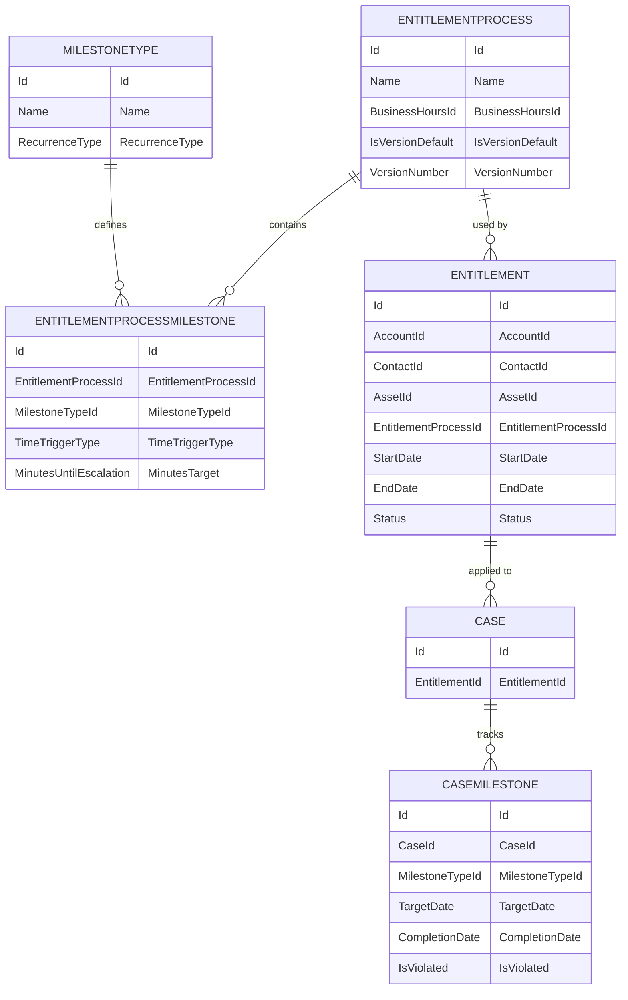

# Entitlements & Milestones

## Exam Domain
Service Cloud — 10% of exam weight

## Foundations

### What Are Entitlements? (Starting from Basics)

An **Entitlement** is a Salesforce record that defines the level of support a customer is entitled to receive — essentially, a support contract object. It answers: "What did this customer pay for, and what are we obligated to deliver?"

**Think of it this way:**
- A customer buys "Platinum Support" with 24/7 phone support and 1-hour response SLA
- In Salesforce, this is represented as an Entitlement record linked to the Account (and optionally the Contact or Asset)
- When a case is created for that account, the entitlement is applied to the case
- Salesforce then tracks whether the response and resolution targets are being met

**Core objects:**
- **Entitlement Process** — the SLA "template" (which milestones, in what order, with what targets)
- **Entitlement** — the customer-specific record linking an Account to an Entitlement Process
- **Milestone** — a checkpoint within the entitlement process (e.g., "First Response within 4 hours")
- **Case Milestone** — the instance of a Milestone on a specific Case (tracks actual vs. target times)

---

## How It Works

### Entitlement Process Structure

An Entitlement Process is the SLA template. Multiple customers can use the same template.

**Entitlement Process → Milestones structure:**
```
Entitlement Process: "Platinum Support SLA"
  ├── Milestone 1: First Response (target: 1 hour)
  │     ├── Actions at 30 min (50%): Send warning email to agent
  │     ├── Actions at 45 min (75%): Send escalation email to manager
  │     └── Actions at 60 min (100% — breach): Reassign to senior agent, update priority
  ├── Milestone 2: Resolution (target: 8 hours)
  │     ├── Actions at 4 hours (50%): Send reminder to agent
  │     ├── Actions at 6 hours (75%): Notify manager
  │     └── Actions at 8 hours (100% — breach): Escalate to VP, notify customer
  └── Milestone 3: Customer Satisfaction Survey (24 hours after resolution)
```

### Milestone Types and Timing

Each Milestone has:
- **Name** — e.g., "First Response," "Resolution"
- **Time Trigger** — when timing starts (case created, previous milestone completed, custom date field)
- **Business Hours** — whether SLA time counts only during business hours
- **Recurrence Type** — No Recurrence, Independent, Sequential
- **Actions at %** — triggers at 50%, 75%, 100% thresholds (send email, create task, update field, send outbound message, launch Flow)

**Recurrence Types:**
- **No Recurrence** — milestone appears once per case
- **Independent** — milestone can recur regardless of other milestones (each completion starts a new timer)
- **Sequential** — milestone must complete before the next one starts

### Applying Entitlements to Cases

Three ways to associate an entitlement with a case:
1. **Manual selection** — agent selects from the Entitlement related list on the Account/Contact
2. **Lookup on Case** — user selects the entitlement on the case record
3. **Auto-lookup via Entitlement Settings** — Configure which entitlement to use based on Account, Contact, or Asset hierarchy automatically when a case is created

**Auto-application:** In Setup > Entitlement Settings, enable "Enable Entitlement Lookup on Cases." When a case is created:
- Salesforce checks for active entitlements on the Account
- If exactly ONE active entitlement exists, it's auto-applied
- If multiple active entitlements exist, the user must select one

### Case Milestone Tracking

When an entitlement is applied to a case, `CaseMilestone` records are automatically created — one per milestone in the entitlement process.

**CaseMilestone fields:**
- `CompletionDate` — when the milestone was completed (null if not yet completed)
- `IsViolated` — `true` if the milestone was breached
- `MilestoneType` — the milestone name
- `TargetDate` — calculated deadline based on entitlement start time + milestone target

**Completing a milestone:** When an agent responds to a case (first response), the "First Response" milestone is marked complete automatically (if configured to watch for first response). Other milestones require explicit completion actions configured in the process.

### Milestone Completion Actions vs Violation Actions

| Type | When Triggered | Purpose |
|---|---|---|
| Milestone Actions at X% | As time elapses (50%, 75%) | Warning notifications, preparatory escalations |
| Milestone Actions at 100% (Violation) | When time limit is reached without completion | Breach escalation, SLA violation notification |
| Completion Actions | When milestone is completed | Congratulatory/confirmation notification, start next milestone |

### Business Hours in Milestones

If "Use Business Hours" is checked on a milestone, the SLA timer pauses outside defined business hours.

**Example:**
- Business Hours: Mon–Fri, 9am–5pm EST
- Milestone target: 4 hours
- Case created Friday at 4pm EST
- 1 hour counts Friday (4–5pm)
- Clock pauses over the weekend
- Remaining 3 hours count starting Monday 9am
- Deadline: Monday 12pm EST

**No Business Hours (24/7):** SLA runs continuously. A 4-hour milestone created Friday at 4pm is due Friday at 8pm.

---

## Advanced Configuration

### Entitlement Contacts and Assets

Entitlements can be scoped to:
- **Account** — any case from that account can use the entitlement
- **Contact** — only cases where the Contact matches get the entitlement
- **Asset** — only cases related to a specific product/asset are covered

This allows per-product support tiers: "Asset A is under premium support; Asset B is under standard support."

### Versioning Entitlement Processes

When an Entitlement Process changes, existing active cases retain their original process version. New cases use the updated process. This prevents mid-SLA changes from affecting active tracking.

**To update:** Edit the Entitlement Process (creates a new version). Cases already in-flight keep the old version. New cases get the new version.

### Entitlement Status

Entitlement records have an `Active` status. When the entitlement expires or is deactivated:
- No new cases are automatically linked to it
- Existing open cases retain the entitlement (milestone tracking continues)
- Reporting can use `Status = Active/Inactive/Expired` for SLA contract reporting

### SLA Reporting with Entitlements

Standard reports available:
- Cases with milestone violations
- Average milestone completion time
- SLA compliance rate by account/product/agent

For custom SLA dashboards, query `CaseMilestone` SOQL:
```sql
SELECT CaseId, MilestoneType.Name, TargetDate, CompletionDate, IsViolated
FROM CaseMilestone
WHERE IsViolated = true
AND CreatedDate = LAST_N_DAYS:30
```

---

## Real-World Scenarios

### Scenario 1: Tiered SLA for Different Account Types
A company has three support tiers: Standard (8-hour response), Professional (4-hour response), Enterprise (1-hour response).

**Design:**
- Three Entitlement Processes: Standard SLA, Professional SLA, Enterprise SLA
- Each has milestones with appropriate time targets
- Three Entitlement record types align to tiers
- When accounts sign a new support contract, an Entitlement is created on their Account linked to the appropriate Entitlement Process
- Cases auto-apply the entitlement

### Scenario 2: Asset-Level SLA for Hardware Support
A hardware company provides different SLAs for different product tiers: Basic hardware = 48-hour replacement, Premium hardware = 4-hour on-site.

**Design:**
- Assets linked to Accounts with an Entitlement per Asset
- Entitlement Process differs based on asset type
- Cases created for the Asset automatically inherit the appropriate Entitlement

---

## PTA / SA Relevance

### When This Comes Up in Engagements

**The SLA compliance conversation:** Customers with signed SLA commitments (contractual obligations to customers) need systematic tracking — not spreadsheets. Entitlements are the Salesforce answer.

**Questions to ask in discovery:**
- "Do you have different support tiers by contract type?" → Multiple Entitlement Processes
- "Do SLAs pause on weekends?" → Business Hours on Milestones
- "Do you track SLA compliance for reporting?" → CaseMilestone reporting
- "Is SLA coverage per asset or per account?" → Asset-level vs Account-level entitlements

**The ROI pitch:** When breach alerts trigger automatic escalations, SLA compliance rates improve. This translates directly to customer satisfaction scores (CSAT) and NPS.

### Common Partner Mistakes

1. **Not configuring milestone completion criteria** — Many implementations set up entitlements and milestones but don't define what "completes" a milestone. Without a completion trigger, milestones never complete and violation rates are 100%.

2. **Ignoring business hours when the customer operates 24/7** — For customers with 24/7 SLAs, business hours should NOT be set on milestones. This seems obvious but is often misconfigured.

3. **Not versioning entitlement processes** — Editing an active Entitlement Process mid-quarter can change SLA targets for active cases. Always create a new version for policy changes.

4. **Relying on auto-entitlement lookup with multiple active entitlements** — If an account has multiple active entitlements (e.g., covered under both an account-level and an asset-level entitlement), auto-lookup requires the user to select. Brief agents on how to select the right one.

5. **Forgetting to report on CaseMilestone** — Customers want to know their SLA compliance rate. CaseMilestone is the object to query. Build this into the standard reporting package.

### Enterprise Scale Considerations

- **High case volume + milestones:** Every milestone generates `CaseMilestone` records. In high-volume support orgs (100k+ cases/month), milestone records accumulate quickly. Index `TargetDate` and `IsViolated` for query performance.
- **Milestone action governor limits:** Milestone violation actions (emails, field updates) fire in batches during violation processing. At very high case volumes, these can queue up. Monitor the background job queue for `CaseMilestoneTargetCheckBatch`.
- **Multi-region business hours:** Orgs supporting global customers need a Business Hours record per region and logic to assign the correct one at case creation. This is often more complex than initially scoped.
- **Entitlement data archiving:** Old, expired entitlement records and historical `CaseMilestone` data accumulate. Plan for archiving strategy as org data ages.

---

## Architecture

### Entitlement Process Data Model



### Milestone Action Timeline

```mermaid
gantt
    title SLA Milestone Timeline — 4-Hour First Response
    dateFormat HH:mm
    axisFormat %H:%M

    section SLA Timer
    Active SLA Window : 09:00, 4h

    section Actions
    50% Warning — 2hr email to agent : milestone, 11:00, 0
    75% Warning — 3hr email to manager : milestone, 12:00, 0
    100% Violation — escalate : milestone, 13:00, 0
```



**Limitations:**
- Milestone time targets are in minutes (not hours directly — convert: 4 hours = 240 minutes)
- Milestone actions can only run workflow-type actions (email, field update, outbound message, Flow) — not all Flow types
- Auto-entitlement lookup applies only one entitlement; if multiple match, user must select
- Entitlement Process versioning: existing cases retain old version, new cases use new version
- Maximum 10 milestones per Entitlement Process
- Business Hours must be configured separately and assigned to both the Entitlement and/or Case for consistent SLA calculation

---

## Key Facts to Memorize

1. Entitlement Process = the SLA template; Entitlement = customer-specific record
2. CaseMilestone records track individual milestones for each case
3. Milestone targets are in MINUTES (not hours directly)
4. Business Hours on milestones causes the SLA timer to pause outside business hours
5. Milestone actions fire at 50%, 75%, and 100% (violation) of the target time
6. Maximum 10 milestones per Entitlement Process
7. Auto-entitlement lookup: if exactly ONE active entitlement on account, auto-applies; if multiple, user must select
8. Updating an Entitlement Process creates a new version — existing cases keep old version
9. Assets can be linked to Entitlements for asset-level SLA coverage
10. `IsViolated = true` on CaseMilestone means the SLA was breached

---

## Exam Traps

- **Trap 1:** "Milestone targets are set in hours" — FALSE. They are set in MINUTES. If you need 4 hours, enter 240 minutes.
- **Trap 2:** "Changing an Entitlement Process immediately affects all active cases" — FALSE. Existing cases retain the version they were created with. Only new cases use the updated process.
- **Trap 3:** "Auto-entitlement lookup always applies an entitlement" — FALSE. If multiple active entitlements exist for an account, the user must manually select one.
- **Trap 4:** "A milestone can trigger Apex code directly" — FALSE. Milestone actions support: email alerts, field updates, outbound messages, and Flow launches — not direct Apex callouts.
- **Trap 5:** "Business Hours on a milestone means SLA time counts only 8 hours per day" — Depends on how Business Hours are configured. Business Hours are defined by the admin and can be any schedule, not necessarily 8 hours.

---

## Practice Questions

**Q1.** A company offers 24/7 support with a 4-hour response SLA for all cases. Business Hours are configured in Salesforce as Mon–Fri 9am–5pm. A case is created on Saturday at 2pm. When does the milestone target fire?
- A. Saturday at 6pm (4 hours after creation)
- B. Monday at 1pm (4 hours of business time starting Monday 9am)
- C. Sunday at 2pm (24 hours after creation)
- D. Monday at 9am (start of next business day)

**Answer: A** — The company offers 24/7 support, so Business Hours should NOT be enabled on the milestone. Even though Business Hours are configured in Salesforce, if the milestone doesn't use them, the SLA runs 24/7 continuously. The milestone fires 4 hours after creation: Saturday at 6pm.

---

**Q2.** A support manager wants to receive an email notification when a case is approaching its resolution milestone at 75% of the target time. How should this be configured?
- A. Create an escalation rule with a 75% time trigger
- B. Add a milestone action at 75% on the Resolution milestone in the Entitlement Process
- C. Create a workflow rule with a time-based action at 75% of resolution time
- D. Build a scheduled flow that checks milestone status every hour

**Answer: B** — Milestone actions within the Entitlement Process support percentage-based triggers (50%, 75%, 100%). This is the declarative solution.

---

**Q3.** A customer's Entitlement Process is updated to extend the First Response milestone from 4 hours to 6 hours. A case that was opened yesterday already has the old Entitlement Process applied. What is the First Response target for that case?
- A. 6 hours from case creation (uses the new process immediately)
- B. 4 hours from case creation (retains the version applied at case creation)
- C. 4 hours from case creation or 6 hours if the milestone hasn't fired yet
- D. The milestone is reset and re-calculated based on the new process

**Answer: B** — Entitlement Process versioning ensures cases retain the version applied when the entitlement was associated. Existing cases are not retroactively updated.

---

**Q4.** An account has two active entitlements: "Standard Support" and "Premium Hardware Support." A case is created for this account. What happens when "Enable Entitlement Lookup on Cases" is enabled?
- A. Both entitlements are automatically applied to the case
- B. The most recently created entitlement is automatically applied
- C. The user must manually select which entitlement to apply to the case
- D. The entitlement with the shorter SLA is automatically selected to ensure compliance

**Answer: C** — When multiple active entitlements exist for an account, auto-lookup requires the agent to manually select the appropriate entitlement.
