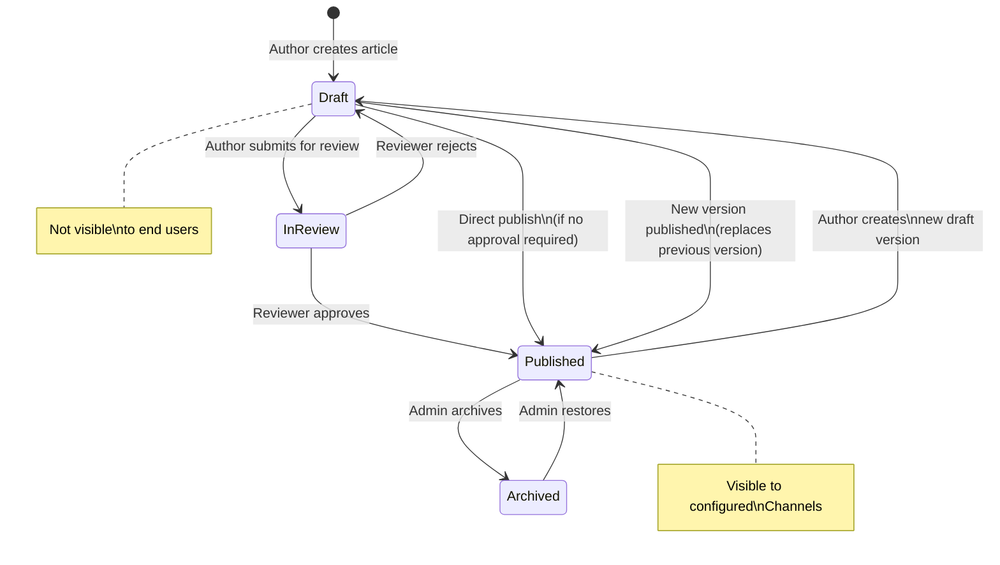
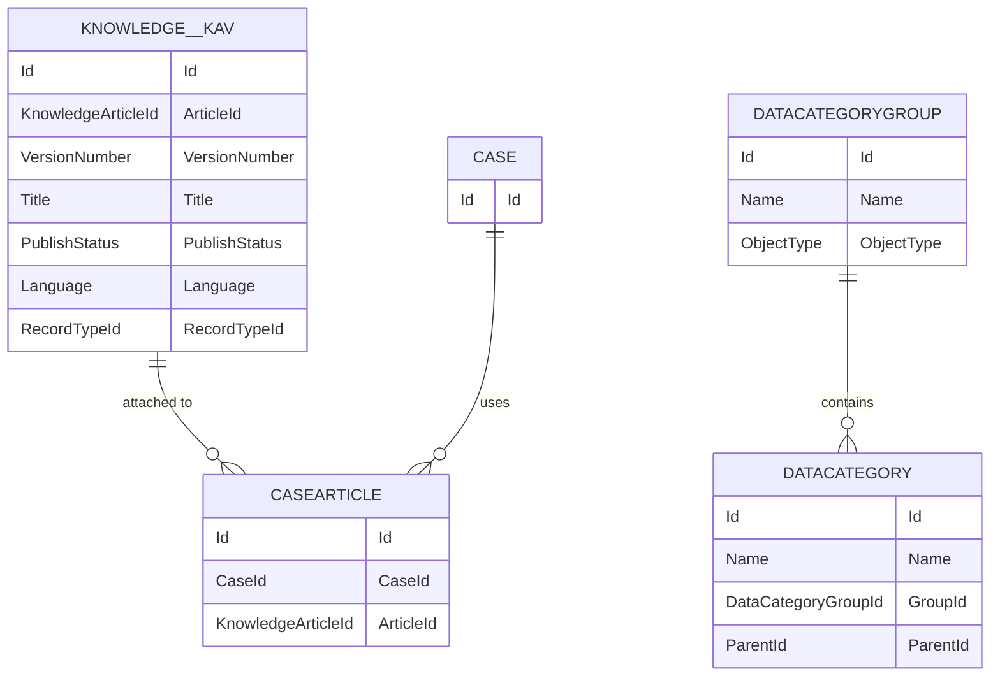

# Knowledge — Advanced

## Exam Domain
Content Management — 5% of exam weight

## Foundations

### What Is Salesforce Knowledge? (Starting from Basics)

Salesforce Knowledge is a knowledge base built into Salesforce. It stores **Articles** — structured documents that answer common questions, document procedures, or provide troubleshooting guides.

**Why it exists:** Support agents waste time answering the same questions repeatedly. Knowledge centralizes these answers. Agents find and attach articles to cases. Customers can search the knowledge base through Experience Cloud portals. Quality improves as the best answers are surfaced consistently.

**The Admin cert** taught you that Knowledge exists and has article types. The **Advanced Admin exam** tests how Lightning Knowledge works at depth: data categories, visibility, versioning, approval workflows, and the content lifecycle.

---

## How It Works

### Lightning Knowledge vs Classic Knowledge

The exam focuses on **Lightning Knowledge** (the modern version). Classic Knowledge is legacy and being retired.

**Key difference:** In Lightning Knowledge, there is ONE Knowledge object (`Knowledge__kav`) with record types for article types (instead of separate API objects per article type as in Classic). This simplification changes the configuration and data model significantly.

### Article Record Types

Record Types on the Knowledge object define **article types** — the categories/templates of articles.

**Examples:**
- FAQ articles (simple Q&A)
- How-To articles (step-by-step procedures)
- Product documentation
- Internal policy documents

Each Record Type can have its own:
- Page layout (fields shown to authors)
- Approval process for publishing
- Channels (where it's visible)

### Data Categories

Data Categories are the taxonomy system for Knowledge. They allow:
- Hierarchical classification of articles (e.g., Product → Hardware → Printers)
- Visibility control (which users/communities see which articles)
- Search filtering (users can filter by category)

**Data Category Setup:**
1. Create a Data Category Group (e.g., "Products", "Geography")
2. Add Data Categories within the group (hierarchical)
3. Enable the group for Knowledge
4. Assign Data Categories to article Record Types

**Data Category Visibility:**
- By default, users with Knowledge access see ALL categories
- Use Data Category Visibility settings on Profiles or Permission Sets to restrict visibility
- Role hierarchy also applies: users see categories visible to their role and above

### Article Lifecycle and Versioning

**Article status values:**
- **Draft** — being authored, not visible to end users
- **In Review** — submitted for review/approval (if approval process enabled)
- **Published** — live and visible to configured channels
- **Archived** — removed from visibility but retained for history

**Versioning:**
- When you edit a published article, you can create a **new draft version** without taking the published version offline
- The published version remains visible while the new version is being edited
- When the new version is published, it replaces the old version
- Archived versions are preserved for history and can be restored

**Version numbering:** Each published version gets an incrementing version number. `VersionNumber` field on `Knowledge__kav`.

### Knowledge Channels

Articles can be published to different audiences (channels):
- **Internal App** — visible to internal Salesforce users only
- **Customer** — visible in Customer Community / Experience Cloud portals
- **Partner** — visible in Partner Community / Experience Cloud portals
- **Public Knowledge Base** — visible on publicly accessible Visualforce/LWC pages

**Channel assignment:** When publishing, select which channels the article should appear in. An article can be published to multiple channels simultaneously.

### Article Voting and Useful/Not Useful

Community and portal users can vote on articles as "Useful" or "Not Useful." This data is used for:
- Knowledge search ranking (more useful articles ranked higher)
- Reporting on article effectiveness
- Identifying articles that need improvement

### Article Attachment to Cases

When an agent closes a case using an article's information, they can attach the article to the case and optionally create a new article from the case's resolution notes.

**Case-to-Knowledge flow:**
1. Agent opens case
2. Searches for relevant articles in the Knowledge component
3. Attaches the article (linked to the case for reporting)
4. Solves the case using the article
5. If no article existed, agent writes resolution notes → "Submit for Publishing" creates a new Draft article

**Reporting benefit:** Track which articles are being used to resolve cases (`CaseArticle` junction object).

---

## Advanced Configuration

### Knowledge Search Optimization

Salesforce Knowledge uses full-text search (via Salesforce's search infrastructure). To optimize:
- Use relevant, specific titles (the title is heavily weighted in search ranking)
- Use synonyms: Setup > Knowledge > Knowledge Synonym Groups — define terms that mean the same thing so searching "printer" also finds articles with "laser jet"
- Use Data Categories for filtering — agents can narrow results by category
- Promoted Search Terms: force specific articles to appear at the top for given search terms (Setup > Knowledge > Promoted Search Terms)

### Approval Processes for Articles

Articles can have an approval process before publishing. This is critical for regulated industries where content must be reviewed before going live.

**Configuration:**
- Create an Approval Process on the `Knowledge__kav` object
- Submit articles for review in the Draft or In Review state
- On approval: article transitions to Published status
- On rejection: article returns to Draft

### Article Translation

Knowledge supports multilingual articles. For each article, translations can be created in different languages.
- Configure Languages in Setup > Knowledge > Languages
- Assign translation owners per language
- Original article and its translations are linked — updating the original can flag translations as outdated

### Knowledge One (Search from Console)

The Knowledge component in Service Console allows agents to:
- Search the knowledge base from the case record
- See suggested articles based on case subject/description (Einstein Article Recommendations)
- Attach articles to the case
- Share articles with customers via email directly from the case

### Einstein Article Recommendations

Einstein analyzes case text and automatically suggests relevant articles. Requires:
- Knowledge enabled
- Einstein enabled in org
- At least 1,000 closed cases with attached articles for training

---

## Real-World Scenarios

### Scenario 1: Internal + Customer Knowledge Base
A company wants agents to see all articles (internal + customer-facing) but customers should only see "Customer" channel articles.

**Design:**
- Internal articles: published to "Internal App" channel only
- Customer articles: published to "Internal App" AND "Customer" channels
- Experience Cloud portal uses Knowledge component with channel filter = "Customer"
- Agents see all channels in Service Console

### Scenario 2: Regulated Industry Content Approval
A financial services company requires compliance review before any article is published.

**Design:**
- Approval Process on Knowledge__kav
- Authors submit draft for approval
- Compliance reviewer approves/rejects
- On approval: status changes to Published
- On rejection: comments returned to author with revision notes

---

## PTA / SA Relevance

### When This Comes Up in Engagements

**The self-service deflection conversation:** Knowledge + Experience Cloud is the primary lever for reducing case volume. For every 1% of cases deflected via self-service, support costs drop. The data category design and search optimization are critical to deflection effectiveness.

**Questions in discovery:**
- "Do you have an existing knowledge base?" → Migration planning (import via CSV or Knowledge API)
- "Who creates and maintains articles?" → Governance model (approval processes, author roles)
- "Do customers see the same articles as agents?" → Channel design
- "Do you support multiple languages?" → Translation configuration

**The article quality conversation:** A knowledge base only delivers ROI if articles are accurate and findable. Promoted Search Terms and Synonym Groups are the two levers admins control. Combine with article usage reporting (CaseArticle queries) to identify high-traffic articles needing quality investment.

### Common Partner Mistakes

1. **Not designing Data Category hierarchy before enabling** — Retroactively reorganizing data categories breaks existing category assignments on articles. Design the taxonomy before go-live.

2. **Ignoring article channels** — Publishing everything to all channels exposes internal operational articles to customers. Always be intentional about channel assignment.

3. **Not configuring article approval for regulated industries** — Publishing articles without review in healthcare, financial services, or legal industries creates compliance risk. Always ask about review requirements in discovery.

4. **Not importing legacy knowledge** — Customers with existing knowledge bases (Confluence, SharePoint, legacy KB system) expect migration. Knowledge import via CSV is limited. For large migrations, use the Knowledge REST API.

5. **Underestimating translation maintenance overhead** — Article translations become outdated quickly. Build a governance process: when the original article is updated, a task notifies the translation owner.

### Enterprise Scale Considerations

- **Large article libraries (10k+ articles):** Search relevance tuning becomes critical. Use promoted search terms for the top 100 most common support queries. Regularly review zero-result search terms.
- **Data category performance:** Very deep category hierarchies (5+ levels, 100+ categories) can slow search filtering. Balance taxonomy depth against search performance.
- **Article versioning at scale:** Each published version creates a `Knowledge__kav` record. Frequent article updates across large libraries generate significant data volume. Implement an archiving strategy for old versions.
- **Einstein Article Recommendations cold start:** The recommendation model requires 1,000+ closed cases with article attachments. Plan a "warm-up" period where agents manually attach articles before enabling auto-suggestions.

---

## Architecture

### Knowledge Article Lifecycle

### Knowledge Data Model

**Limitations:**
- One Knowledge object (`Knowledge__kav`) per org — article types are Record Types, not separate objects (Lightning Knowledge)
- Data Category hierarchy reorganization can break existing assignments — plan taxonomy before go-live
- Article translation requires Language Support enabled; each language requires a translation record
- Einstein Article Recommendations requires 1,000+ closed cases with article attachments for training
- Promoted Search Terms: maximum 2 per article; 2,000 total per org
- Maximum 8 Data Category Group assignments per article

---

## Key Facts to Memorize

1. Lightning Knowledge has ONE Knowledge object (`Knowledge__kav`) — article types = Record Types
2. Article channels: Internal App, Customer, Partner, Public Knowledge Base
3. Data Categories control both taxonomy (search filtering) and visibility (who sees which articles)
4. Article versioning: a new draft can coexist with the published version — published version stays live during editing
5. Promoted Search Terms force articles to top of results for specific search queries
6. Synonym Groups make searching for one term return results with related terms
7. CaseArticle junction object tracks which articles were used to resolve which cases
8. Article approval processes use the `Knowledge__kav` object — standard approval process setup
9. Einstein Article Recommendations requires 1,000+ training cases with attached articles
10. Archived articles are retained in the system but not visible to users

---

## Exam Traps

- **Trap 1:** "How are article types defined in Lightning Knowledge?" — As Record Types on the Knowledge object, NOT as separate API objects (that was Classic Knowledge).
- **Trap 2:** "An agent can search all Knowledge articles regardless of channel" — TRUE for internal users. Channel visibility limits apply to Community/portal users.
- **Trap 3:** "Changing a published article's content takes it offline" — FALSE. You create a new Draft version. The published version stays live until the new version is published.
- **Trap 4:** "Data Category Visibility restricts which categories users see, but not which articles" — FALSE. Visibility restricts access to articles in those categories. Users with restricted category visibility cannot see articles categorized in restricted categories.
- **Trap 5:** "Promoted Search Terms can be set for any number of articles" — FALSE. Maximum 2 promoted search terms per article, 2,000 per org.

---

## Practice Questions

**Q1.** A Knowledge article needs to be updated with new information. The article is currently published and visible to customers. The admin wants customers to continue seeing the current article while the new version is being written. What should the admin do?
- A. Archive the article, create a new draft, and re-publish when ready
- B. Edit the published article directly — changes go live immediately
- C. Create a new draft version of the article — the published version remains visible
- D. Duplicate the article, edit the duplicate, then delete the original

**Answer: C** — Lightning Knowledge supports concurrent draft versions. The published version remains live and visible while the new draft is being worked on.

---

**Q2.** A company wants customers searching for "printer" to find articles that use the term "laser jet." How should this be configured?
- A. Add "printer" as a tag on all laser jet articles
- B. Create a Knowledge Synonym Group linking "printer" and "laser jet"
- C. Add a Promoted Search Term "printer" to each laser jet article
- D. Duplicate all laser jet articles and title them with "printer"

**Answer: B** — Synonym Groups in Knowledge Configuration cause searches for one term to also return results containing synonymous terms. Promoted Search Terms force specific articles to the top for a query but don't expand what articles are found.

---

**Q3.** An admin wants to track which articles agents use most often to resolve cases. Which object should be queried?
- A. Knowledge__kav
- B. CaseComment
- C. CaseArticle
- D. ArticleUsage__c (custom object)

**Answer: C** — CaseArticle is the junction object that links Case records to Knowledge Article records. Querying CaseArticle by article ID shows how frequently each article was used to resolve cases.

---

**Q4.** Data Category visibility is restricted for a Community user profile — users with this profile cannot see the "Internal Operations" category. A customer searches for "password reset" in the Community. Which articles appear?
- A. All articles matching "password reset" regardless of category
- B. Only articles matching "password reset" that are NOT in the "Internal Operations" category
- C. No articles — Data Category restrictions prevent all Knowledge searches
- D. Articles in all categories, but with "Internal Operations" articles blurred out

**Answer: B** — Data Category visibility restricts access to articles in restricted categories. The customer sees only articles matching their search that belong to visible categories.
