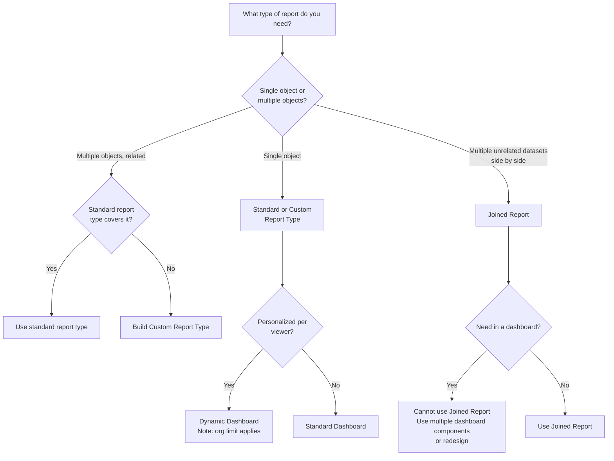
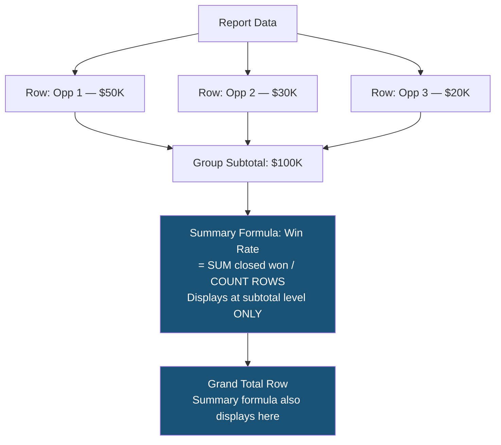

# Reports & Dashboards — Advanced

## Exam Domain
Reports, Dashboards & Analytics — 7% of exam weight

## Foundations

### What Advanced Reports & Dashboards Covers

At Admin cert level: tabular, summary, matrix reports; basic dashboards; filters; report types. The Advanced Admin exam tests the power features that make Salesforce reporting enterprise-grade:

- **Joined Reports** — multiple datasets in one report
- **Summary Formulas** — calculated columns at summary level (not row level)
- **Cross-Object Formulas in Reports** — parent record fields in child report types
- **Dynamic Dashboards** — personalized dashboards per viewer
- **Dashboard Filters** — runtime filtering on dashboards
- **Historical Trending Reports** — see how field values changed over time
- **Report subscriptions** — automated delivery
- **Report Types (custom)** — building report sources for non-standard relationships

---

## How It Works

### Joined Reports

A Joined Report combines data from multiple report blocks — each block is a separate report source (report type) — side by side in a single report.

**Key features:**
- Up to 5 report blocks per joined report
- Each block can have its own columns, filters, and groupings
- Common grouping: blocks can share a grouping field (e.g., all blocks grouped by Account Name)
- Summary formulas can span multiple blocks (cross-block formulas)

**Use case:** "Show me Accounts with their open Opportunities, open Cases, and total revenue — all in one row per account."

**Configuration:**
1. Create a Joined Report
2. Add Block 1: Opportunities report type (group by Account Name)
3. Add Block 2: Cases report type (group by Account Name)
4. Add Block 3: Contracts report type (group by Account Name)
5. Common grouping = Account Name → each account appears once with data from all 3 blocks

**Exam trap:** Joined Reports cannot be used as dashboard source (see limitations). This is a heavily tested fact.

### Summary Formulas

Summary Formulas are calculated at the grouping/summary level — NOT at the individual row level.

**Difference from row-level formulas:**
- Row-level formula: `Amount * Discount_Rate__c` — calculated per opportunity row
- Summary formula: `SUM(Amount) / COUNT(ROWS)` — calculated at group subtotal or grand total level

**Common summary formula patterns:**
- **Average:** `SUM(Field) / COUNT(ROWS)` — or use `AVG(Field)` directly
- **Win rate:** `DIVNULL(SUM(Closed_Won_Count__c), COUNT(ROWS), 0)` — handles divide by zero
- **Percentage:** `SUM(Closed_Won__c) / SUM(Total__c) * 100`

**DIVNULL function:** Critical for summary formulas involving division — prevents divide-by-zero errors. `DIVNULL(numerator, denominator, value_if_zero)`.

**Where summary formulas display:** Only at group subtotal rows and grand total — not on individual data rows.

### Cross-Object Report Formulas

In a report type that spans parent-child relationships, you can reference parent object fields using dot notation: `Account.Industry`, `Owner.Name`, `Contact.Account.BillingState`.

**Level depth:** Up to 3 levels of relationships can be traversed in report formulas (e.g., `Opportunity.Account.Owner.Name`).

**Use case in reports:** A Cases by Account report might include `Account.NumberOfEmployees` for segmentation, even though that field isn't on the Case object.

### Dynamic Dashboards

A standard dashboard always runs as a single "running user" — all viewers see the same data based on that user's access.

A **Dynamic Dashboard** runs as the logged-in user — each person sees data based on their own record access.

**Key difference:**
| Feature | Standard Dashboard | Dynamic Dashboard |
|---|---|---|
| Running user | Fixed (e.g., always as "CEO") | Each viewer = their own access |
| Data visibility | Same for all viewers | Personalized per viewer |
| Use case | Executive overview | Sales rep sees own pipeline |
| Setup limit | Unlimited | Max 5 dynamic dashboards per org (Unlimited), 3 (Enterprise) |

**Exam key:** Dynamic Dashboards have a PER ORG LIMIT. This is tested. Enterprise = up to 5 per org. Unlimited = up to 10 per org. (Verify current limits in exam prep — Salesforce occasionally adjusts.)

**Restriction:** Dynamic dashboards cannot be scheduled for email delivery (because the data is personalized — Salesforce can't pre-generate everyone's version). They can only be viewed by the logged-in user.

### Dashboard Filters

Dashboard filters allow the viewer to filter the entire dashboard at runtime without editing it.

**Configuration:**
- Up to 3 filters per dashboard
- Each filter maps to a field in the underlying reports
- Filter options: picklist values, date ranges, user selections
- Filter values applied at viewing time

**Use case:** A sales dashboard with a filter for "Region" — the viewer selects their region and all charts update.

### Historical Trending Reports

Historical Trending captures and reports on how field values changed over time for certain objects.

**Enabled objects:** Opportunities, Forecasting Items, Cases, and up to 3 custom objects.

**Reporting:** Creates a special report type "Opportunities with Historical Trending" that shows field values at past points in time.

**Use case:** "Show me the pipeline that existed on the first of each month for the last 6 months." This is impossible with standard reports (which show current values only).

**Configuration:**
- Enable Historical Trending in Setup
- Select up to 8 fields to track per object
- Data is retained for up to 3 months (90 days of historical snapshots)

**Exam trap:** Historical Trending retains only 90 days of data. For longer historical analysis, use reporting snapshots (custom object with scheduled data captures).

### Reporting Snapshots

Reporting Snapshots capture report data on a schedule and store it in a custom object. Unlike Historical Trending (which stores field change deltas), snapshots store complete report output at a point in time.

**Use case:** Weekly pipeline snapshot, monthly active user count — data that needs to be trended over longer than 90 days.

**Configuration:**
1. Create a custom object to store snapshot data
2. Create a source report (tabular or summary)
3. Create a Reporting Snapshot: map report columns to custom object fields
4. Schedule the snapshot to run (daily, weekly, monthly)

### Custom Report Types

Custom Report Types define the data source for a report — which objects and which relationship paths are included.

**When to use:** When you need to report on relationships that don't have a standard report type:
- Object A with or without related Object B records
- A 3-level relationship chain not covered by standard types
- A custom object with a non-standard lookup

**"With" vs "Without" relationship options:**
- "A with B" — only A records that have at least one related B record
- "A with or without B" — all A records, whether or not they have B records (left join)

---

## Advanced Configuration

### Row-Level vs Summary-Level Formulas

**Row-level formula fields:** Standard formula fields on the report type's objects. They calculate per row using that row's field values.

**Summary formulas in reports:** Added within the report builder. They calculate at grouping/subtotal/grand total levels. They're not stored as field values — they're ephemeral calculations within the report.

**Key distinction:** If you need the calculation for automation or in another report, use a formula field on the object. If you only need it for display in this specific report, use a summary formula.

### Report Subscription and Scheduling

**Report Subscriptions:** Users can subscribe to a report to receive an email when the report results meet a threshold (e.g., "send me this report when Opportunities Closing This Month exceeds $1M").

**Scheduled Reports:** Admins can schedule reports to run automatically and email results to users (up to 5 recipients per subscription). Run daily, weekly, or monthly at a specified time.

**Dashboard Scheduling:** Standard dashboards (not dynamic) can be scheduled to auto-refresh and email a snapshot to recipients.

---

## Real-World Scenarios

### Scenario 1: Sales Manager Dashboard with Rep-Level Detail
Sales managers want to see their team's pipeline without seeing other teams' data. Individual reps want to see only their own data.

**Design:**
- Dynamic Dashboard: each user sees their own data
- But wait — Dynamic Dashboard shows ONLY the viewer's data; managers can't see their team's data in a dynamic dashboard
- Correct design: Use standard dashboard running as the manager's user (manager sees their role hierarchy's data) OR use dashboard filters to scope by owner/team

### Scenario 2: Pipeline Trend Over 12 Months
A VP wants to see how the pipeline has grown each month over the past year.

**Design:**
- Historical Trending: only 90 days — not enough for 12 months
- Reporting Snapshots: monthly snapshot into a custom object `Pipeline_Snapshot__c` with Amount, Stage, Month fields
- Report on `Pipeline_Snapshot__c` to trend pipeline over 12+ months
- Dashboard chart: line graph of pipeline total by month

---

## PTA / SA Relevance

### When This Comes Up in Engagements

**The "we need executive dashboards" ask:** Every Salesforce implementation has this. The questions to ask: "Who's the audience?" (Dynamic vs Standard), "Do they need historical trends?" (Historical Trending vs Snapshots), "Do they need to filter?" (Dashboard Filters).

**The joined report conversation:** When a customer says "I need to see Account health — open cases, open opps, and contract value all on one row" — that's a Joined Report. But warn them about the dashboard limitation (joined reports can't be dashboard sources).

**Reporting Snapshots for longitudinal analysis:** This is underutilized. Customers with quarterly business reviews (QBRs) benefit from snapshot-based trending. Introduce early in the project so data accumulates before the first QBR.

### Common Partner Mistakes

1. **Building a Joined Report and then trying to add it to a dashboard** — Joined Reports cannot be used as dashboard component sources. If the customer needs joined data in a dashboard, use multiple components or a single custom report type.

2. **Recommending Dynamic Dashboards without noting the org limits** — Enterprise orgs get 5 dynamic dashboards, Unlimited get 10. In orgs with many sales managers all wanting personalized views, this limit forces creative solutions (role-based standard dashboards instead).

3. **Not using DIVNULL in summary formulas** — Divide-by-zero errors cause a summary formula to show an error instead of 0%. Always use DIVNULL for any division.

4. **Expecting Historical Trending for long-term data** — 90 days is the limit. For longer history, customers need Reporting Snapshots set up proactively. This is often discovered after the need arises — "wait, we only have 3 months of data?"

5. **Confusing Reporting Snapshots with Historical Trending** — Snapshots: full periodic captures to a custom object, unlimited retention. Historical Trending: incremental change tracking, 90-day retention. Different tools for different needs.

### Enterprise Scale Considerations

- **Report execution time at scale:** Reports on objects with millions of records time out if they're not properly filtered and indexed. Add selective filters (date ranges, index fields) to all production reports.
- **Dashboard refresh frequency:** Dashboards don't auto-refresh unless scheduled. Set appropriate refresh schedules. At enterprise scale, real-time dashboards require Connected Analytics (CRM Analytics).
- **Reporting Snapshot performance:** Snapshots that run large reports nightly can slow down during peak hours. Schedule snapshots during off-peak windows.
- **Custom Report Type design:** Poor custom report type design (too many levels, too many fields) creates slow reports. Keep report types focused on specific use cases.

---

## Architecture

### Report Type Decision Tree

### Summary Formula Architecture

**Limitations:**
- Joined Reports CANNOT be used as dashboard source components
- Dynamic Dashboards: 5 per org (Enterprise), 10 per org (Unlimited Edition)
- Dynamic Dashboards CANNOT be scheduled for email delivery
- Historical Trending: max 90 days data retention, max 3 custom objects, max 8 tracked fields per object
- Summary formulas display only at group subtotal and grand total rows — not on individual data rows
- Dashboard filters: maximum 3 per dashboard
- Report Subscriptions: up to 5 recipients per scheduled report delivery
- Cross-object formulas in reports: max 3 levels deep in relationship traversal

---

## Key Facts to Memorize

1. Joined Reports CANNOT be dashboard source — this is the #1 tested fact in this topic
2. Dynamic Dashboards: each viewer sees their own data; Enterprise limit = 5, Unlimited = 10
3. Dynamic Dashboards CANNOT be scheduled for email delivery
4. Summary Formulas display at grouping/subtotal/grand total levels — NOT per-row
5. DIVNULL prevents divide-by-zero in summary formulas: `DIVNULL(numerator, denominator, fallback)`
6. Historical Trending: 90 days max retention; 8 tracked fields per object; 3 custom objects max
7. Reporting Snapshots: unlimited retention; runs on schedule; stores output in custom object
8. Dashboard Filters: max 3 per dashboard; applied at runtime by viewer
9. Custom Report Types: "A with B" (inner join) vs "A with or without B" (left join)
10. Cross-object report formulas can traverse up to 3 relationship levels

---

## Exam Traps

- **Trap 1:** "Add a Joined Report to an executive dashboard" — NOT POSSIBLE. Joined Reports cannot be dashboard sources.
- **Trap 2:** "Dynamic Dashboard can be scheduled to email a personalized view to each rep daily" — FALSE. Dynamic Dashboards cannot be scheduled.
- **Trap 3:** "Summary Formula shows a value in every row" — FALSE. Summary Formulas only show at grouping subtotals and grand total.
- **Trap 4:** "Historical Trending shows pipeline from 6 months ago" — POSSIBLY. Only if the data was captured within the last 90 days. For older data, Reporting Snapshots are needed.
- **Trap 5:** "Any field can be tracked with Historical Trending" — FALSE. Maximum 8 fields per object, and only specific object types support Historical Trending.

---

## Practice Questions

**Q1.** A sales executive wants a dashboard that shows each sales rep's personal pipeline when they log in. The manager also wants to see their entire team's pipeline. Which configuration supports both requirements?
- A. Dynamic Dashboard for all users
- B. Two separate dashboards: Dynamic Dashboard for reps, Standard Dashboard (running as manager) for managers
- C. One Standard Dashboard running as the VP of Sales
- D. Dynamic Dashboard with a "Show All Team Data" toggle

**Answer: B** — Dynamic Dashboards show only the viewer's own accessible data, not their team's. Managers need a standard dashboard running under their user (which includes their role hierarchy's data). Reps use a dynamic dashboard to see only their own data.

---

**Q2.** A sales analyst needs to calculate the conversion rate (Closed Won count / Total Opportunities count) in a summary report grouped by Sales Rep. Where should this calculation be placed?
- A. As a formula field on the Opportunity object
- B. As a row-level formula in the report
- C. As a Summary Formula in the report, displayed at group subtotal level
- D. As a custom report type formula

**Answer: C** — Win rate is a ratio calculated across multiple rows in a group — that's exactly what Summary Formulas do. A row-level formula (B) would calculate per-opportunity, which doesn't make sense for a ratio. A formula field on the object (A) would also be row-level.

---

**Q3.** A VP needs to track how total pipeline value has changed month-over-month for the past 18 months. Which Salesforce feature meets this requirement?
- A. Historical Trending (enables 90-day pipeline snapshots)
- B. Report Subscriptions with monthly delivery
- C. Reporting Snapshots scheduled monthly, storing data in a custom object
- D. Collaborative Forecasting historical view

**Answer: C** — Historical Trending only retains 90 days of data — not enough for 18 months. Reporting Snapshots store data indefinitely in a custom object and can be trended in reports. Option B just emails the report — it doesn't store historical data for trending.

---

**Q4.** Which statement about Joined Reports is TRUE?
- A. Joined Reports can be added to dashboards as chart components
- B. Joined Reports can have up to 5 blocks, each with its own report type
- C. Joined Reports can only be viewed by System Administrators
- D. Joined Reports require all blocks to use the same report type

**Answer: B** — Joined Reports support up to 5 blocks, each with its own report type (and columns/filters). A is false (cannot be dashboard sources). C is false (any user with report access can view). D is false (each block is independent with its own report type).
