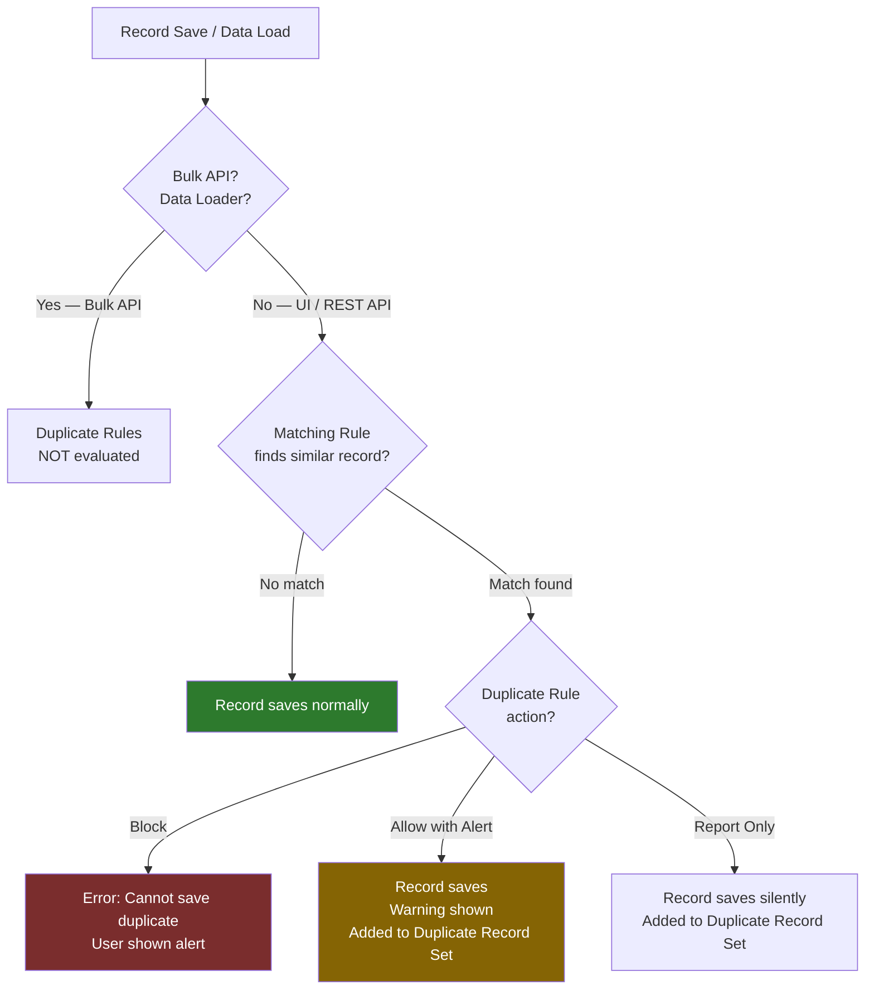
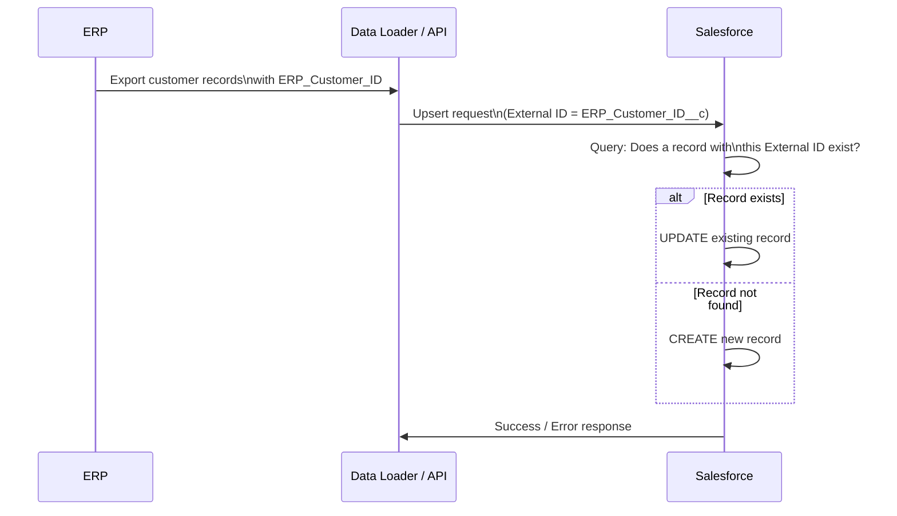

# Data Management — Advanced

## Exam Domain
Data Management — 10% of exam weight; Auditing & Monitoring — 6% of exam weight

## Foundations

### What Advanced Data Management Covers

At Admin cert level: Data Loader, Import Wizard, Data Export, duplicate rules basics. The Advanced Admin exam goes deeper into:

- **Duplicate Management** — matching rules, duplicate rules, merge vs block
- **External IDs** — for integration and upserts
- **Data Archiving** — strategies for managing org data volume
- **Audit Trail and Monitoring** — what changed, when, by whom
- **Field History Tracking** — per-field change history
- **Big Objects** — for archiving at scale
- **Data Backup and Recovery** strategies

---

## How It Works

### Duplicate Management: Matching Rules

A **Matching Rule** defines how Salesforce identifies whether two records are potential duplicates. It compares field values using matching algorithms.

**Matching methods:**
| Method | Description | Use Case |
|---|---|---|
| Exact | Fields must match exactly | ID fields, exact string matching |
| Fuzzy | Phonetic or approximate matching | Names (Smith vs Smyth), addresses |
| First N Characters | Match first N chars of a field | Company name (first 5 chars) |
| Acronym | Matches acronym versions | IBM = International Business Machines |
| Contains | One value contains the other | Email domain matching |
| Email Domain | Matches email domain only | sales@company.com = cfo@company.com |

**Matching Rule criteria:** Boolean AND/OR logic across multiple field comparisons.

**Standard Matching Rules:** Salesforce provides standard matching rules for Contacts (Standard Contact Matching) and Leads (Standard Lead Matching). These use a combination of name, email, phone, and address fields.

### Duplicate Management: Duplicate Rules

A **Duplicate Rule** determines what happens when a matching rule finds a potential duplicate.

**Actions when a duplicate is detected:**
- **Block** — prevent saving the duplicate record, show error
- **Allow with Alert** — allow saving but show a warning to the user
- **Report** — allow saving, but record in the Duplicate Record Set for later review

**Duplicate Record Sets:** When duplicates are allowed or reported, they're grouped in a Duplicate Record Set that admins can review and merge.

**Alert text:** Custom message shown to users when a duplicate is detected.

**Bypass permissions:** Specific profiles/permission sets can be exempt from duplicate rules (e.g., admin users can always save potential duplicates).

**Important:** Matching Rules and Duplicate Rules are separate:
- Matching Rule → identifies similarity
- Duplicate Rule → takes action based on that similarity

**Standard Duplicate Rules:** Three pre-built rules for Accounts, Contacts, and Leads. They must be ACTIVATED before they work (disabled by default in new orgs).

### External IDs

An External ID is a custom field marked as "External ID" in Salesforce. It stores a unique identifier from an external system (e.g., ERP customer ID, legacy system record ID).

**Two key uses:**

1. **Upserts via Data Loader:** The Upsert operation uses an External ID to match: if a record with the same External ID exists, update it; if not, create it. This is the standard pattern for ongoing data synchronization.

2. **Cross-object relationships without internal IDs:** When loading related records, you can use External IDs to reference parent records by their External ID rather than needing to know the Salesforce internal ID.

**External ID field settings:**
- Unique (optional but recommended)
- Case-insensitive (optional)
- Indexed automatically (External IDs are always indexed)

**Limit:** Maximum 7 custom External ID fields per object.

**Exam key:** External IDs are automatically indexed — this is important for query performance in integrations.

### Data Archiving Strategies

Salesforce orgs have data storage limits. When approaching limits, you have several options:

**Option 1: Delete old records**
- Export old records first, then delete
- Recoverable from Recycle Bin for 15 days

**Option 2: Archive to Big Objects**
- Big Objects are a special Salesforce storage type for large volumes of immutable data
- Useful for compliance retention (keep data accessible but out of the main storage count)
- Query via SOQL with `__b` suffix on the object name

**Option 3: Archive to External Storage**
- Export to external system (AWS S3, data warehouse) for long-term retention
- Records deleted from Salesforce to free up storage

**Option 4: Salesforce Backup**
- Salesforce Backup service (paid add-on) for full org backup and recovery
- Separate from manual data export

**Option 5: Heroku Connect / Integration archive**
- Replicate data to external DB via Heroku Connect or MuleSoft for analytics/archiving
- Query external DB instead of Salesforce for historical data

### Setup Audit Trail

The Setup Audit Trail records configuration changes made to the org. It tracks:
- Who made the change (user name)
- What was changed (object, field, setting)
- When (timestamp)
- Old and new values (for some change types)

**Access:** Setup > Security > View Setup Audit Trail

**Retention:** 180 days (6 months) of audit trail history accessible in UI. You can download the full 6-month history as CSV.

**Key audit trail events tracked:**
- Profile changes
- Field/object creation and modification
- Sharing setting changes
- User creation/modification
- Apex class deployment
- Flow activation/deactivation
- Custom setting changes
- Login policy changes

**Exam trap:** 180-day retention is the limit. For longer audit retention (compliance requirement), export regularly and store externally.

### Field History Tracking

Field History Tracking captures changes to specific field values on records.

**Configuration:** Enable History Tracking on an object → select up to 20 fields to track (standard objects) or fewer (varies by object).

**Where it shows:** Related list "Field History" on the record (or "Account History," "Opportunity History," etc.).

**What's tracked:** Old value, new value, who changed it, when.

**Retention:** Field History data is retained for 18 months in the standard product. With the Field Audit Trail add-on (paid), retention can be extended to 10 years.

**Limitations:**
- Long Text fields cannot be tracked
- Formula fields cannot be tracked (they recalculate, not change)
- Maximum 20 fields per object (standard; custom object limit may differ)

### Event Monitoring (Advanced — for Exam Awareness)

Event Monitoring captures user behavior events: login events, report runs, API calls, page views, etc.

- Available with Event Monitoring add-on license
- Events stored as Big Object records
- Useful for security analysis, compliance, and user behavior analytics

---

## Advanced Configuration

### Data Loader vs Import Wizard — When to Use Each

| Feature | Data Loader | Import Wizard |
|---|---|---|
| Max Records | 5 million per batch | 50,000 |
| Objects Supported | All objects | Limited (Leads, Contacts, Accounts, Cases, Custom) |
| Upsert | YES (with External ID) | NO |
| Delete | YES | NO |
| Automation | CLI / scheduled | Manual GUI only |
| Field Mapping | Manual mapping | Mapping suggested |

**Exam key:** For **Upsert** operations (create or update based on External ID), Data Loader is required. Import Wizard does NOT support Upsert.

### Duplicate Management in Bulk Operations

By default, Duplicate Rules do NOT fire for bulk API operations (Data Loader inserts/updates). This is by design for performance — you'd get thousands of duplicate alerts during a load.

To check for duplicates in a bulk load:
- Run a De-Duplicate report on Duplicate Record Sets after the load
- Use Data Loader's "Export" to pull records and compare in an external tool before load

**Exam key:** Duplicate Rules are NOT evaluated during Bulk API / Data Loader operations.

### Mass Transfer Records

Admins can mass transfer records between users for:
- Accounts (and their child records)
- Leads
- Open Cases
- Open Activities

Setup > Data Management > Mass Transfer Records. Transfer includes related records (cases, contacts on accounts) depending on settings.

---

## Real-World Scenarios

### Scenario 1: Integration Sync via External ID
An ERP system creates Customer IDs (ERP_Customer_ID__c). Every night, MuleSoft syncs account data from ERP to Salesforce.

**Design:**
- Custom field on Account: `ERP_Customer_ID__c` (External ID, Unique)
- MuleSoft uses Upsert API with `ERP_Customer_ID__c` as the External ID field
- Records not yet in Salesforce are created; existing records are updated
- No internal Salesforce IDs needed in the ERP system

### Scenario 2: Duplicate Lead Management for Marketing
Marketing imports 50,000 new leads from a conference. Many may already exist in Salesforce.

**Design:**
- Standard Lead Matching Rule (already in Salesforce)
- Duplicate Rule on Leads: Allow with Alert (don't block marketing — let them review)
- Post-import: Review Duplicate Record Sets, merge confirmed duplicates
- Alternatively: Export existing leads, compare in Excel/external tool, only import truly new leads

---

## PTA / SA Relevance

### When This Comes Up in Engagements

**The data quality conversation:** Almost every implementation surfaces data quality issues. Duplicate management, External IDs for integration, and Field History Tracking are the three tools to discuss in every discovery.

**The storage limit conversation:** Enterprise customers with 5–10 years of Salesforce data often approach storage limits. This triggers the archiving strategy discussion. Know the options well: Big Objects, external archiving, Salesforce Backup.

**Compliance and audit:** Regulated industries (financial services, healthcare, government) need to answer "who changed this record and when?" for years back. Field Audit Trail (paid) vs standard 18-month field history vs Setup Audit Trail — know the differences.

**Integration pattern:** External IDs are a foundational integration pattern. If you're advising on an integration architecture, External IDs should be in every design.

### Common Partner Mistakes

1. **Enabling duplicate rules without a resolution process** — Turning on "Block" for duplicate rules stops users from creating records, which can be infuriating if there are false positives. Start with "Allow with Alert + Report" to understand the pattern before blocking.

2. **Not setting External ID fields as Unique** — If External IDs are not unique, Upsert operations fail when multiple records have the same External ID. Always mark External ID fields as Unique.

3. **Assuming Duplicate Rules fire during Data Loader imports** — They don't for Bulk API. Customers who run a big import and then wonder "why didn't the duplicate rules stop this?" — now you know.

4. **Missing the 180-day Audit Trail retention limit** — Compliance teams assume audit trail is permanent. It's not. Set up regular export jobs (monthly) and store externally for long-term compliance.

5. **Forgetting that Long Text fields can't be tracked in Field History** — If a customer wants to track changes to a Description field (long text), they'll need a workaround (formula to show recent text, or Apex audit custom object).

### Enterprise Scale Considerations

- **Storage strategy at 10M+ records:** At enterprise scale, Salesforce storage costs become significant. Develop a tiered data strategy: active records in Salesforce, aging records in Big Objects or external archive, analytical data in a data warehouse.
- **Duplicate management at high lead volume:** For high-velocity marketing teams ingesting thousands of leads daily, duplicate rule performance matters. Fuzzy matching is computationally expensive. Consider "Exact" matching on email as the primary criteria (indexed).
- **Field History Tracking query performance:** Querying `AccountHistory` or `OpportunityFieldHistory` for compliance audits on large orgs is slow without selective filters (date range, field name). Always filter by `Field` and `CreatedDate` in audit queries.

---

## Architecture

### Duplicate Management Stack

### External ID Upsert Flow

**Limitations:**
- Maximum 7 External ID fields per object
- External IDs should be marked as Unique to prevent Upsert conflicts
- Duplicate Rules are NOT evaluated during Bulk API / Data Loader operations
- Field History Tracking: max 20 fields per object; long text fields CANNOT be tracked
- Setup Audit Trail: 180-day retention in UI; export for longer retention
- Standard Field History: 18-month retention; Field Audit Trail add-on extends to 10 years
- Big Objects: append-only (cannot update individual records); query via SOQL with selective indexed fields
- Import Wizard: max 50,000 records; no Upsert, no Delete

---

## Key Facts to Memorize

1. Matching Rules identify duplicates; Duplicate Rules determine what happens when a duplicate is found
2. Standard Duplicate Rules are disabled by default — must be activated
3. Duplicate Rules are NOT evaluated during Bulk API / Data Loader operations
4. External ID fields are automatically indexed
5. External ID Upsert: if External ID match found → Update; if not found → Create
6. Maximum 7 External ID fields per object
7. Setup Audit Trail: 180-day retention in UI
8. Field History Tracking: 18-month standard retention; max 20 fields; Long Text fields cannot be tracked
9. Import Wizard max: 50,000 records, no Upsert, no Delete
10. Big Objects are append-only — you cannot update individual Big Object records

---

## Exam Traps

- **Trap 1:** "Duplicate Rules will catch duplicates imported via Data Loader" — FALSE. Bulk API bypasses duplicate rules.
- **Trap 2:** "External ID fields are manually indexed" — FALSE. External ID fields are automatically indexed when created.
- **Trap 3:** "Long Text fields can be tracked with Field History Tracking" — FALSE. Long Text is not supported.
- **Trap 4:** "Setup Audit Trail shows all configuration changes for the life of the org" — FALSE. 180-day retention limit.
- **Trap 5:** "An object can have unlimited External ID fields" — FALSE. Maximum 7 per object.

---

## Practice Questions

**Q1.** A company integrates its ERP system with Salesforce. Every night, the ERP sends a full extract of customer records. Some customers already exist in Salesforce; some are new. Which Data Loader operation should be used, and what field configuration is required?
- A. Insert operation; no special field configuration needed
- B. Upsert operation; a custom External ID field on Account marked as Unique
- C. Update operation; records must be matched by Salesforce record ID
- D. Import Wizard with "Match Accounts by" set to External ID

**Answer: B** — Upsert with a custom External ID field is the standard integration pattern. Import Wizard doesn't support Upsert.

---

**Q2.** A company enables a Duplicate Rule on Leads with the "Block" action. A marketing team member imports 5,000 leads via Data Loader and notices duplicates are present. Why didn't the Duplicate Rule prevent the duplicates?
- A. The Duplicate Rule is only active on the Lead object, not for imports
- B. Duplicate Rules are not evaluated during Bulk API / Data Loader operations
- C. The marketing user's profile bypasses duplicate rules
- D. The Duplicate Rule requires manual activation after Data Loader imports

**Answer: B** — Duplicate Rules are not evaluated during Bulk API operations (including Data Loader). They only run during UI saves and single-record API inserts/updates.

---

**Q3.** A compliance officer requires a log of all field-level changes to the Account object for the past 3 years. Field History Tracking is enabled with 18-month standard retention. How should the requirement be met?
- A. Query the AccountHistory object — it retains 3 years of data by default
- B. Enable Field Audit Trail (paid add-on) which supports up to 10-year retention
- C. Enable Historical Trending on the Account object for 3-year trends
- D. Use a Reporting Snapshot to capture Account field values monthly

**Answer: B** — Standard Field History retains 18 months. For 3-year compliance retention, Field Audit Trail (paid add-on) is required. Historical Trending (C) retains only 90 days and tracks a limited set of fields.

---

**Q4.** Which field types CANNOT be tracked using Field History Tracking? (Select 2)
- A. Currency fields
- B. Long Text Area fields
- C. Formula fields
- D. Picklist fields
- E. Date fields

**Answer: B, C** — Long Text Area fields and Formula fields cannot be tracked. Formula fields are recalculated, not changed in the traditional sense. Long Text exceeds the size limit for history tracking storage.
