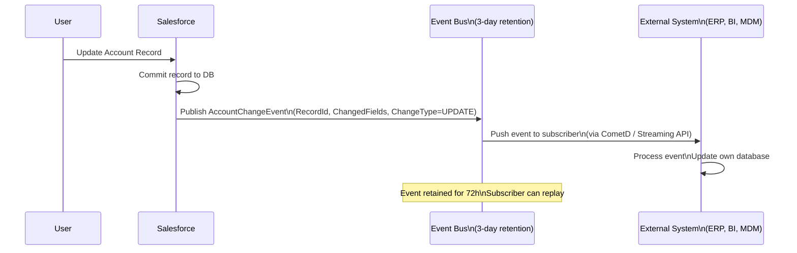
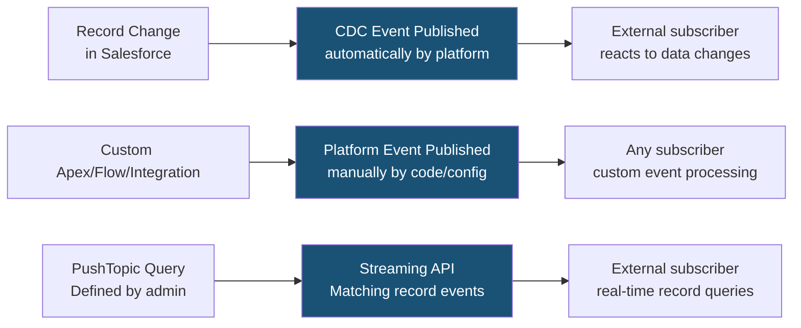

# Change Data Capture

## Exam Domain
Data Management — 10% of exam weight; Auditing & Monitoring — 6% of exam weight

## Foundations

### What Is Change Data Capture? (Starting from Basics)

**Change Data Capture (CDC)** is a Salesforce platform feature that publishes near-real-time notifications when records are created, updated, deleted, or undeleted. External systems subscribe to these events and react to changes in Salesforce data.

**The problem CDC solves:** Before CDC, external systems had to periodically poll Salesforce ("give me all records changed in the last 5 minutes"). This is inefficient, can miss changes, and adds API call overhead.

**With CDC:** Salesforce automatically publishes a change event every time a record changes. External systems subscribe once and receive events as they happen. No polling needed.

**Think of it as:** A change log feed that external systems can subscribe to in real time.

**Where CDC fits vs other event-driven features:**

| Feature | Direction | Use Case |
|---|---|---|
| Change Data Capture | Salesforce → External | Notify external systems of Salesforce data changes |
| Platform Events | Salesforce → External / External → Salesforce | Custom event messages (not tied to record changes) |
| Outbound Messages | Salesforce → External | SOAP-based workflow action (legacy) |
| Streaming API | Salesforce → External | Push records matching a PushTopic query |

---

## How It Works

### CDC Event Structure

When a record changes, Salesforce publishes a CDC event to a channel. The event contains:
- **RecordId** — Salesforce ID of the changed record
- **ChangeType** — CREATE, UPDATE, DELETE, UNDELETE
- **ChangedFields** — list of fields that changed (for UPDATE events only)
- **ChangeOrigin** — what triggered the change (UI, API, Apex, etc.)
- **TransactionKey** — groups related changes in the same transaction
- **CommitTimestamp** — when the change was committed
- **Header** — metadata about the event

**For UPDATE events only: Partial payload.** CDC events for updates include ONLY the fields that changed — not all fields on the record. This is efficient but means subscribers must query Salesforce if they need the full record state.

**For CREATE events:** All field values are included in the event payload.

### Enabling CDC

1. Setup > Integrations > Change Data Capture
2. Select which objects to enable CDC for
3. Salesforce standard objects and custom objects are both supported

**Enabled by default:** None. CDC must be explicitly enabled per object.

**Limits:** 
- Can enable CDC for up to 5 standard objects without additional cost
- Up to 5 custom objects as well without additional cost
- More objects require the Add-On license

### Subscribing to CDC Events

External systems subscribe via:
- **Streaming API (CometD)** — long polling over HTTP for web applications
- **Apex Triggers** — `after insert` on the change event object (`AccountChangeEvent`)
- **Flows** — Platform Event-Triggered Flow that uses CDC events as the trigger
- **MuleSoft Salesforce Connector** — handles CDC subscription natively
- **Salesforce Functions** — serverless functions triggered by CDC events

**Channel format:** `/data/[ObjectName]ChangeEvent`
- Accounts: `/data/AccountChangeEvent`
- Custom object: `/data/My_Object__ChangeEvent`

### CDC Retention and Replay

CDC events are retained in the **event bus** for 3 days (72 hours). Subscribers can replay events from any point within the retention window.

**ReplayId:** Each event has a ReplayId. Subscribers specify a ReplayId to start receiving events from that point forward. Use `-1` for all retained events, `-2` for new events only.

**Use case for replay:** An external system goes offline for 12 hours. When it comes back online, it replays the last 12 hours of CDC events to catch up — without needing to query Salesforce for all changes.

### CDC vs Field History Tracking

| Feature | CDC | Field History Tracking |
|---|---|---|
| Purpose | Notify external systems of changes | Track changes within Salesforce for audit |
| Storage | Event bus (3-day retention) | Salesforce objects (18-month retention) |
| Access | Via API / Apex / Flow subscriptions | Via related list / SOQL on HistoryObject |
| Field coverage | All fields (UPDATE shows only changed fields) | Up to 20 specific fields configured |
| Delete tracking | Yes (DELETE event) | No (field history stops when record deleted) |
| Cost | Up to 5 objects free; more = add-on | Included; Field Audit Trail = add-on |

---

## Advanced Configuration

### Apex CDC Triggers

Apex can subscribe to CDC events using `after insert` triggers on the change event objects.

**Example — React to Account changes in Apex:**
```apex
trigger AccountCDCTrigger on AccountChangeEvent (after insert) {
    List<AccountChangeEvent> events = Trigger.new;
    for (AccountChangeEvent event : events) {
        EventBus.ChangeEventHeader header = event.ChangeEventHeader;
        
        if (header.changeType == 'UPDATE') {
            // Get list of changed fields
            List<String> changedFields = header.changedFields;
            // Get affected record IDs
            List<String> recordIds = header.recordIds;
            
            // React accordingly
            if (changedFields.contains('AnnualRevenue')) {
                // Process revenue change
            }
        }
    }
}
```

**Key point for exam:** The Apex trigger fires asynchronously after the record save completes — CDC is NOT synchronous with the record DML. The trigger fires as a separate async operation.

### CDC and Deleted Records

CDC events are published for deleted records too. When a record is deleted:
- DELETE event is published with the RecordId
- If the record is undeleted (from Recycle Bin), an UNDELETE event is published

**Gap analysis limitation:** If a record is created, updated, and deleted within the 3-day retention window, the CDC subscriber sees all three events. If the subscriber was offline for more than 3 days, it misses all events for that record lifecycle.

### CDC Gap Analysis

When a subscriber reconnects after more than 3 days offline:
- Events older than 3 days are gone from the event bus
- The subscriber must perform a full "catch-up" query on Salesforce to reconcile missed changes
- This is the "fan-out problem" — the subscriber must query all changed records since their last event

---

## Real-World Scenarios

### Scenario 1: ERP Real-Time Account Sync
An ERP system needs to keep its customer database synchronized with Salesforce Account records.

**Design:**
- Enable CDC on Account object
- ERP subscribes via MuleSoft to `/data/AccountChangeEvent`
- On CREATE event: Insert new customer in ERP
- On UPDATE event: Check `ChangedFields`; if BillingAddress or Phone changed, update ERP record
- On DELETE event: Mark ERP customer as inactive (don't delete — ERP has billing history)
- Replay: If ERP goes offline, replay events from last known ReplayId on reconnection

### Scenario 2: Real-Time Dashboard in External BI Tool
A customer uses a Tableau dashboard to display live Salesforce opportunity pipeline.

**Design:**
- Enable CDC on Opportunity object
- Custom integration listens on `/data/OpportunityChangeEvent`
- On opportunity change events, push updated data to Tableau Hyper extract
- Dashboard refreshes in near-real-time as opportunities are updated in Salesforce
- Alternative: Use Salesforce CRM Analytics (Tableau CRM) instead — native and no custom integration needed

---

## PTA / SA Relevance

### When This Comes Up in Engagements

**The real-time integration conversation:** When a customer says "we need our ERP/MDM/external system to know about Salesforce changes in near real time," CDC is the answer. This replaces scheduled batch sync jobs with event-driven architecture.

**Questions to determine if CDC is the right tool:**
- "Do you need to react to record changes in another system within minutes?" → CDC
- "Do you need to track changes for auditing within Salesforce?" → Field History Tracking (not CDC)
- "Does your external system need to know about record deletes?" → CDC (Field History doesn't cover deletes)
- "Do you need bi-directional sync?" → CDC for Salesforce→External; Platform Events or REST API for External→Salesforce

**The MuleSoft angle:** MuleSoft has native CDC connector support. In MuleSoft-Salesforce integration designs, CDC is the preferred real-time pattern over polling APIs. This is a standard recommendation when advising customers with MuleSoft.

### Common Partner Mistakes

1. **Confusing CDC with Field History Tracking** — CDC is for external system notification. Field History is for internal Salesforce audit. Different tools, different purposes.

2. **Not handling the 3-day replay window** — Designs that don't account for subscriber downtime will miss events if the subscriber is offline for more than 3 days. Always design a catch-up query mechanism.

3. **Expecting full record in UPDATE events** — CDC UPDATE events include only changed fields. A subscriber that needs the full record state must query Salesforce after receiving the event. This is a common integration bug.

4. **Not enabling CDC per object** — CDC is not on by default. Many integrations fail silently because CDC wasn't enabled on the object. Always verify CDC is enabled in the target org during integration go-live.

5. **Recommending CDC for audit trail requirements inside Salesforce** — CDC events are external notifications, not Salesforce audit records. For audit within Salesforce, use Field History Tracking or Setup Audit Trail.

### Enterprise Scale Considerations

- **Event volume at scale:** High-volume objects (e.g., Cases in a large support org, Orders in an e-commerce org) can generate thousands of CDC events per minute. Subscribers must be designed to handle event bursts. Use async processing, queuing, and idempotency.
- **CDC object limits:** 5 standard + 5 custom objects free. Enterprise integrations often need CDC on more objects. Budget for the add-on license during integration architecture planning.
- **Fan-out to multiple subscribers:** A single CDC channel can have multiple subscribers. But each subscriber maintains independent cursor position. If 10 systems subscribe to AccountChangeEvent, all 10 receive every event independently.
- **ReplayId management:** Subscribers must persist their last processed ReplayId. If this state is lost, subscribers either re-replay all retained events (expensive) or start fresh (risk missing events). Store ReplayId in a durable external system.

---

## Architecture

### CDC Event Flow



### CDC vs Platform Events vs Streaming API



**Limitations:**
- CDC event retention: 3 days (72 hours) — events older than 3 days cannot be replayed
- UPDATE events include ONLY changed fields — not the full record state
- CDC enabled on up to 5 standard + 5 custom objects without additional cost
- Subscribers offline for >3 days must perform catch-up query
- CDC is asynchronous — does NOT run synchronously with the record DML
- CDC events don't include Merge or Convert operations (Lead conversion doesn't fire CDC)
- CDC is not available for all standard objects (check documentation for supported list)

---

## Key Facts to Memorize

1. CDC publishes events for CREATE, UPDATE, DELETE, and UNDELETE operations
2. UPDATE events include ONLY changed fields — not the full record
3. Events are retained in the event bus for 3 DAYS (72 hours)
4. Subscribers can replay events using ReplayId; `-1` = all retained events; `-2` = new events only
5. CDC must be explicitly enabled per object — it's not on by default
6. CDC is asynchronous — not synchronous with record DML
7. Apex CDC triggers use `after insert` on the `[Object]ChangeEvent` type
8. 5 standard + 5 custom objects included free; more requires add-on
9. DELETE events are published — external systems can track deletes
10. Lead conversion does NOT trigger CDC events — Merge operations may not trigger standard CDC

---

## Exam Traps

- **Trap 1:** "CDC events include all field values when a record is updated" — FALSE. UPDATE events include ONLY changed fields.
- **Trap 2:** "A subscriber can replay CDC events from any point in the last year" — FALSE. 3-day retention only.
- **Trap 3:** "CDC fires synchronously during the record DML transaction" — FALSE. CDC is asynchronous.
- **Trap 4:** "CDC is enabled by default for all standard objects" — FALSE. Must be explicitly enabled per object.
- **Trap 5:** "CDC can replace Field History Tracking for Salesforce audit requirements" — FALSE. CDC events go to an external event bus. Field History Tracking stores changes within Salesforce for internal audit.

---

## Practice Questions

**Q1.** An external ERP system subscribes to AccountChangeEvent. An Account record's Billing Address is updated in Salesforce. What does the CDC event contain?
- A. The complete Account record with all field values in the new state
- B. Only the changed fields (BillingStreet, BillingCity, etc.) plus the RecordId and change metadata
- C. Only the RecordId — the subscriber must query Salesforce for the updated field values
- D. The old field values only — to show what was removed

**Answer: B** — CDC UPDATE events include only the changed fields (plus header metadata). The subscriber receives just what changed, plus the RecordId to identify the affected record.

---

**Q2.** An external data warehouse subscribes to OpportunityChangeEvent. The system goes offline for 4 days due to maintenance. When it comes back online and requests a replay of all missed events, what can it retrieve?
- A. All 4 days of events — CDC retains events indefinitely
- B. Only the last 3 days (72 hours) of events; events older than 3 days are gone
- C. No events — the subscription must be re-registered after downtime
- D. Events from the last 7 days — CDC retention is 7 days

**Answer: B** — CDC event retention is 72 hours (3 days). Events from Day 4 (the first day of downtime) are gone. The subscriber must perform a catch-up SOQL query for changes older than 3 days.

---

**Q3.** A developer wants to write Apex code that fires whenever a Contact record is created or updated in Salesforce, to sync the data to an external system. Which Apex mechanism should be used?
- A. `trigger ContactTrigger on Contact (after insert, after update)`
- B. `trigger ContactCDCTrigger on ContactChangeEvent (after insert)`
- C. `@InvocableMethod` called from a Flow triggered on Contact changes
- D. A Scheduled Apex class that polls for Contact changes every 5 minutes

**Answer: B** — An Apex trigger on `ContactChangeEvent` (after insert) is how Apex subscribes to CDC events for the Contact object. Note: CDC must be enabled on the Contact object first.

---

**Q4.** Which scenario is BEST suited for Change Data Capture?
- A. Tracking which users modified an Opportunity's Stage field for internal compliance audit
- B. Notifying an external MDM system in near-real-time when Account records are created or changed in Salesforce
- C. Sending an email to a case owner when a case is updated
- D. Generating a weekly report of all Account changes

**Answer: B** — CDC is designed for notifying external systems of Salesforce data changes in near-real-time. A is Field History Tracking (internal audit). C is a Flow or Workflow. D is a report.
