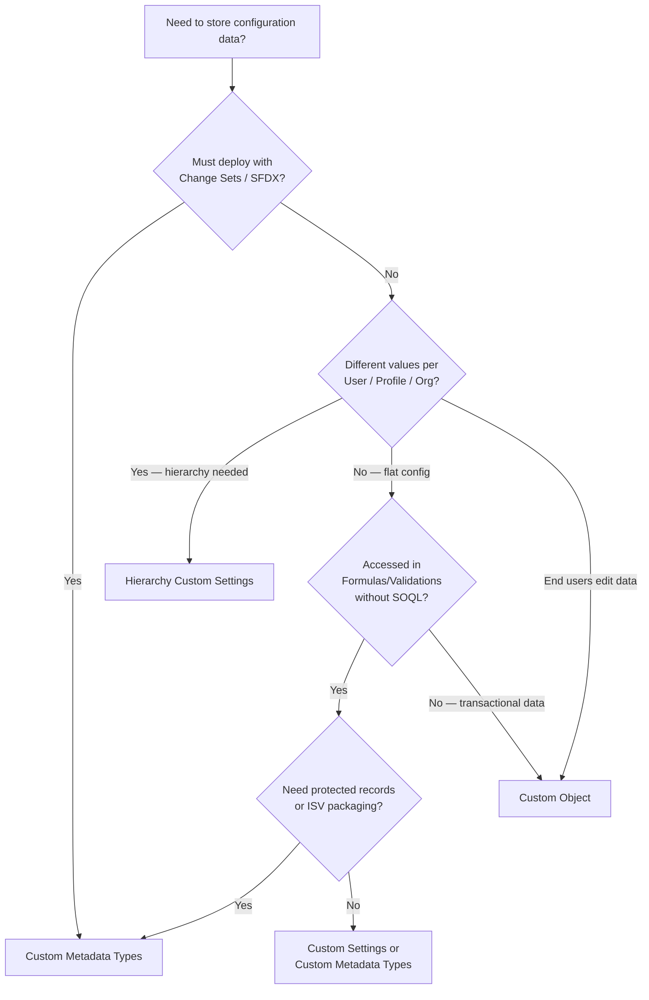
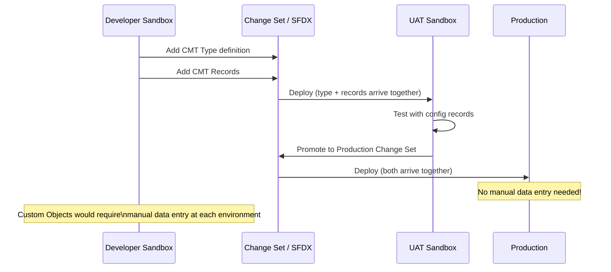

# Custom Metadata Types

## Exam Domain
Extending Custom Objects & Applications — 8% of exam weight

## Foundations

### What Are Custom Metadata Types? (Starting from Basics)

**Custom Metadata Types (CMT)** are a way to store configuration data in Salesforce that behaves like application metadata — meaning it deploys with your code, is accessible in formula fields without governor limits, and can be used to build configurable applications.

**The key insight:** Custom Metadata Types store configuration, not transactional data. Think of them as configuration tables that move with your deployments.

**The analogy:** You're building a Flow that applies different discount rates based on a customer's country. You need to store "Country → Discount Rate" mapping somewhere. Options:
1. Hardcode in the Flow — breaks when rates change, requires developer to update
2. Custom Object — works, but records don't deploy with Change Sets, and SOQL queries count against governor limits
3. Custom Settings — works for some cases but has its own limitations
4. **Custom Metadata Types** — records deploy with Change Sets/Salesforce DX, no SOQL limit in Formulas, queryable in Apex

---

## How It Works

### Custom Metadata Type vs Custom Settings vs Custom Objects

This is the most tested distinction in this domain. Know it cold.

| Feature | Custom Object | Custom Settings (Hierarchy) | Custom Metadata Types |
|---|---|---|---|
| **Purpose** | Transactional records | Configuration per user/profile/org | App configuration/metadata |
| **Deployable** | NO (data not in Change Sets) | NO (data not in Change Sets) | YES — records deploy with Change Sets |
| **Formula field access** | Via lookup (with limits) | YES (no SOQL) | YES (no SOQL) |
| **Accessible in Validation Rules** | Via lookup | YES | YES |
| **Accessible without SOQL** | NO | YES | YES |
| **Accessible in Flows** | Via Get Records (SOQL) | Via global variable ($Setup) | Via Get Records (no SOQL cost) |
| **Editable in Production** | YES | YES | YES (if configured) |
| **Protected (ISV)** | NO | YES | YES |
| **Namespace support** | NO | Partial | YES |
| **Record limit** | Storage limit | 300 records (hierarchy type) | 1 MB per type (practical limit) |
| **Read from Apex** | SOQL query | `CustomSettings__c.getInstance()` | `CustomMetadataType__mdt.getInstance()` |

**The exam always asks:** "Which feature allows configuration data to deploy automatically with a Change Set?" → **Custom Metadata Types**.

### Creating Custom Metadata Types

1. Setup > Custom Metadata Types > New Custom Metadata Type
2. Define Label, Plural Label, API Name (ends in `__mdt`)
3. Add custom fields (same field types as Custom Objects, except: no Relationships to non-CMT objects in formulas, no currency, no geolocation)
4. Create records (custom metadata records) via Setup or Apex

**API name format:** `[TypeName]__mdt`
**Record API name format:** `[TypeName]__mdt.[RecordDeveloperName]`

### Accessing CMT in Formulas and Validation Rules

Custom Metadata Types can be referenced directly in formulas without a SOQL query:

```
$CustomMetadata.Country_Config__mdt.US.Discount_Rate__c
```

This returns the `Discount_Rate__c` field from the `US` record of the `Country_Config__mdt` type — without consuming a SOQL query.

**Use case:** Validation rule that uses a CMT-stored threshold:
```
Amount > $CustomMetadata.Approval_Config__mdt.DiscountApproval.Amount_Threshold__c
```

### Accessing CMT in Apex

```apex
// Get a specific record by developer name
Country_Config__mdt config = Country_Config__mdt.getInstance('US');

// Query all records
List<Country_Config__mdt> allConfigs = [
    SELECT DeveloperName, Label, Discount_Rate__c 
    FROM Country_Config__mdt
];

// Using SOQL — counts against governor limits (same as regular SOQL)
// Using getInstance() — does NOT count against governor limits
```

**`getInstance()`** method: retrieves a single CMT record by DeveloperName. Does not consume a SOQL query. Preferred over SOQL for single-record lookups in performance-sensitive code.

### Custom Metadata Types in Flows

Flows can query CMT records using Get Records. CMT record queries in Flows consume SOQL — but the data is configuration data, so it's typically queried once per flow run and cached.

**Best practice:** Query the CMT records at the start of the flow and store in variables; don't query inside loops.

### Protected Custom Metadata

CMT records can be marked as Protected. Protected records:
- Cannot be edited in subscriber orgs (only ISV package author can modify)
- Useful for ISV packages that need locked-down configuration

---

## Advanced Configuration

### Custom Metadata Types and Change Sets

CMT records are metadata — they travel with Change Sets:
1. Add Custom Metadata Types (the type definition) to the Change Set — also adds its fields
2. Add Custom Metadata Records to the Change Set separately
3. Deploy — both the type structure and the records move together

**Contrast with Custom Objects:** Custom object data records NEVER move with Change Sets. Only the object definition (schema) does.

### Protecting Configurations with CMT

Use Case: You have an application with complex business rules. Storing those rules as CMT means:
- Rules deploy automatically (no manual data entry in each environment)
- Rules are version-controlled alongside code
- Rules are accessible in formulas without governor limits
- Changes to rules go through the same release process as code changes

### CMT Relationships (Cross-Metadata Type Lookups)

CMT records can have Metadata Relationship fields that look up to other CMT records (or to EntityDefinition/FieldDefinition for object/field references).

**Use case:** A `Routing_Rule__mdt` record references a `Routing_Queue__mdt` record for a multi-table configuration setup.

---

## Real-World Scenarios

### Scenario 1: Configurable Discount Tiers by Account Type

A company wants different maximum discount rates for SMB, Mid-Market, and Enterprise accounts.

**Design:**
- CMT: `Discount_Policy__mdt`
- Fields: Account_Type__c (text), Max_Discount__c (number)
- Records: SMB → 10%, Mid_Market → 20%, Enterprise → 30%
- Validation Rule on Opportunity:
  ```
  Discount__c > $CustomMetadata.Discount_Policy__mdt.[AccountType].Max_Discount__c
  ```
- When tiers change, update CMT records and deploy the change — no code change needed

### Scenario 2: Multi-Environment Feature Flags
A team wants to enable/disable features by environment (sandbox vs production).

**Design:**
- CMT: `Feature_Flag__mdt`
- Fields: Feature_Name__c, Is_Enabled__c
- Different record values in sandbox vs production CMT records
- Apex/Flow checks: `Feature_Flag__mdt.getInstance('New_UI').Is_Enabled__c`

---

## PTA / SA Relevance

### When This Comes Up in Engagements

**The "where do we store configuration?" conversation:** In every implementation, configuration values (thresholds, rates, rules) need to live somewhere. The answer is almost always CMT unless the data needs to be edited by end-users without a deployment.

**Decision matrix for customers:**
- End users edit the data? → Consider Custom Object or Custom Settings (Hierarchy type for user-level)
- Data must deploy with code/config? → Custom Metadata Types
- Data referenced in formula fields? → Custom Settings or Custom Metadata Types
- ISV building a package? → Custom Metadata Types (protected records for locked config)

**Typical architecture review finding:** "You've stored these business rule thresholds in a Custom Object. You'll need to manually enter data in production after each deployment. Switch to Custom Metadata Types."

### Common Partner Mistakes

1. **Using Custom Objects for configuration data** — Then discovering the data doesn't deploy with Change Sets and having to manually enter values in production after each release.

2. **Forgetting that CMT queries in SOQL still count against governor limits** — Only `getInstance()` and formula field references bypass SOQL limits. Querying CMT with SOQL in a loop has the same risks as any other SOQL in a loop.

3. **Confusing CMT with Custom Settings** — Hierarchy Custom Settings provide org/profile/user level overrides. CMT does not have hierarchy levels. For user-level configuration, Hierarchy Custom Settings is often better.

4. **Not using `getInstance()` in Apex** — New developers query CMT with SOQL when `getInstance()` would be more efficient and not consume SOQL governor limits.

5. **Not deploying CMT records with Change Sets** — Creating the CMT type in a sandbox but forgetting to add the records to the Change Set. The type arrives in production empty.

### Enterprise Scale Considerations

- **CMT vs Custom Settings performance:** Both are accessible without SOQL in formulas. CMT is preferred for application configuration that's version-controlled; Hierarchy Custom Settings is preferred for per-user/profile configuration.
- **Large CMT datasets:** CMT is not designed for large datasets (thousands of records). For larger configuration datasets, Custom Objects or a combination approach is better. CMT has a 1MB per-type practical limit.
- **ISV/managed packages:** CMT with Protected records is the standard for ISV configuration in managed packages. This prevents subscriber orgs from accidentally modifying critical configuration.

---

## Architecture

### CMT vs Custom Settings vs Custom Objects Decision Tree



### CMT Deployment Flow



**Limitations:**
- CMT records cannot be created/updated via standard API DML (use Metadata API or CMT Deployment via Setup)
- CMT is not suitable for large datasets (1MB per type practical limit — roughly 1,000–10,000 records depending on field count)
- No currency or geolocation fields on CMT
- Hierarchy levels (org/profile/user) are not supported — that's Custom Settings
- CMT records queried via SOQL (not `getInstance()`) still count against governor limits
- CMT Relationship fields can only reference other CMT types, EntityDefinition, or FieldDefinition — not regular custom objects

---

## Key Facts to Memorize

1. Custom Metadata Type records DEPLOY with Change Sets — this is the #1 differentiator
2. Custom Object records do NOT deploy with Change Sets
3. CMT accessible in formulas without SOQL: `$CustomMetadata.TypeName__mdt.RecordName.FieldName__c`
4. `getInstance('DeveloperName')` in Apex does NOT consume a SOQL query
5. CMT API name ends in `__mdt`
6. CMT does NOT support hierarchy levels (org/profile/user) — use Custom Settings for that
7. CMT cannot be created/updated via standard DML — use Metadata API or Setup UI
8. CMT SOQL queries in code DO count against governor limits (only formulas and `getInstance()` bypass limits)
9. Protected CMT records cannot be edited in subscriber orgs (ISV use)
10. CMT supports cross-CMT relationships (Metadata Relationship fields) but not lookups to regular custom objects

---

## Exam Traps

- **Trap 1:** "Custom Settings and Custom Metadata Types both deploy with Change Sets" — FALSE. Custom Settings data does NOT deploy. Only CMT records deploy.
- **Trap 2:** "Accessing CMT in a formula field requires a SOQL query" — FALSE. CMT in formulas uses direct metadata access, no SOQL.
- **Trap 3:** "CMT supports user-level hierarchy (different values per user)" — FALSE. Hierarchy is a Custom Settings feature. CMT is flat.
- **Trap 4:** "CMT records can be created with Apex DML (`insert`, `update`)" — FALSE. CMT records require Metadata API deployment or Setup UI. Standard DML does not work.
- **Trap 5:** "An admin changes a CMT record value in production without a deployment" — TRUE, this IS possible (admins can edit CMT records via Setup), but it bypasses the normal change management process.

---

## Practice Questions

**Q1.** A developer wants to store business rules that should be deployed automatically with each Change Set and referenced in Apex without consuming SOQL governor limits. Which feature should be used?
- A. Custom Object with an External ID field
- B. Hierarchy Custom Settings
- C. Custom Metadata Types
- D. Platform Cache

**Answer: C** — Custom Metadata Types deploy with Change Sets and can be accessed via `getInstance()` without consuming SOQL queries.

---

**Q2.** An admin needs configuration that provides different values per user, profile, and org level — so junior reps see one behavior while senior managers see another. Which feature meets this requirement?
- A. Custom Metadata Types with a User lookup field
- B. Hierarchy Custom Settings
- C. Custom Object with a Profile lookup field
- D. Permission Set with custom field overrides

**Answer: B** — Hierarchy Custom Settings natively support org/profile/user level configuration with automatic hierarchy resolution. CMT (A) doesn't have hierarchy behavior.

---

**Q3.** A formula field on Opportunity needs to reference a Custom Metadata Type record to determine the appropriate discount rate. How is this referenced in the formula?
- A. `VLOOKUP($CustomMetadata, 'Discount__mdt', 'Rate__c', AccountType__c)`
- B. `$CustomMetadata.Discount__mdt.Standard.Rate__c`
- C. `[SELECT Rate__c FROM Discount__mdt WHERE Name = 'Standard']`
- D. `CustomSetting.getInstance().Rate__c`

**Answer: B** — The formula syntax for CMT is `$CustomMetadata.[TypeAPIName__mdt].[RecordDeveloperName].[FieldAPIName__c]`. No SOQL needed.

---

**Q4.** Which actions CAN be performed with Custom Metadata Type records? (Select 2)
- A. Insert via Apex DML: `insert new Country_Config__mdt()`
- B. Edit in Production via Setup > Custom Metadata Types
- C. Deploy with a Change Set alongside Apex code
- D. Create records that reference related Accounts via lookup
- E. Configure hierarchy-level overrides per profile

**Answer: B, C** — CMT records can be edited in Setup and deploy via Change Sets. They cannot be inserted via standard Apex DML (A is false). They cannot have standard object lookups (D is false). They have no hierarchy (E is false).
