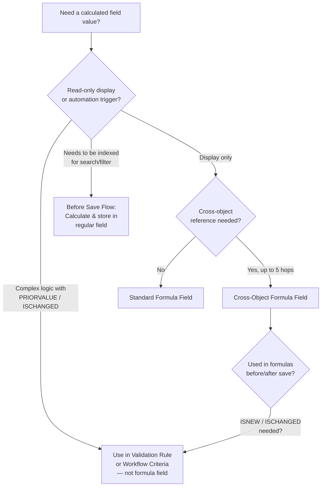
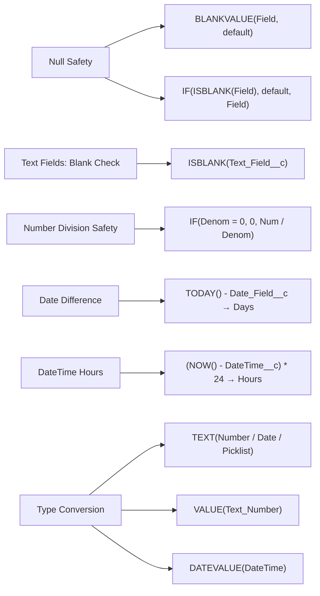

# Advanced Formula Fields

## Exam Domain
Extending Custom Objects & Applications — 8% of exam weight

## Foundations

### Formula Fields — What the Exam Tests

You know formulas from Admin cert. The Advanced Admin exam tests formulas in situations where the obvious answer doesn't work — cross-object references, text manipulation, date arithmetic, error handling, and gotchas around null values, data types, and formula context.

**Key topics:**
- Cross-object formula references (and depth limits)
- `ISBLANK` vs `ISNULL` — not the same
- `BLANKVALUE` and `NULLVALUE`
- `ISCHANGED`, `PRIORVALUE`, `ISNEW` — only in rules and processes, not always in formula fields
- `CASE` and `IF` nesting for complex logic
- `TEXT`, `VALUE`, `DATEVALUE`, `DATETIMEVALUE` conversions
- `TODAY()` vs `NOW()` and date arithmetic
- `HYPERLINK` formula fields
- The difference between formula field evaluation and Apex

---

## How It Works

### Cross-Object Formula Fields

Formula fields can reference fields on related objects using dot notation:

```
Account.BillingState        (from a Contact formula)
Opportunity.Account.Name    (from an Opportunity Line Item formula)
Owner.Manager.Name          (from any object with an Owner lookup)
```

**Maximum cross-object hops:** 10 references per formula; each "." counts as one hop. The formula can traverse up to 5 unique object relationships in a single formula.

**Where cross-object formulas work:**
- Custom formula fields
- Validation rules
- Default field values
- Auto-number fields do NOT support formulas

**Cross-object formulas are READ-ONLY** on the resulting field — they display the parent field's value but do not change when child record is saved (they recalculate only when the child record is saved or when the parent's referenced field changes for some formula contexts).

**Important exam note:** Cross-object formula updates are NOT triggered by parent record changes — the formula field on the child shows the current parent value at the time the CHILD record was last saved. If you update the parent, child formula fields DO recalculate dynamically in the UI but for stored values and reports, the field is recalculated when the child record is next saved.

### ISBLANK vs ISNULL

This is one of the most tested formula nuances:

| Function | Tests for | Works on text fields? | Works on number/date fields? |
|---|---|---|---|
| `ISNULL(field)` | True only if value is null | Does NOT detect empty string "" | YES for null numbers/dates |
| `ISBLANK(field)` | True if null OR empty string | YES — detects both null and "" | YES for null numbers/dates |

**Best practice:** Use `ISBLANK()` for text fields because text fields can be empty string `""` (not null). `ISNULL()` on a text field returns `false` when the field is `""` — which is often the bug.

**Example:**
- Text field value: `""` (empty string)
- `ISNULL(Text_Field__c)` → `FALSE` (not null, just empty)
- `ISBLANK(Text_Field__c)` → `TRUE` (correctly identifies empty)

### BLANKVALUE and NULLVALUE

- `BLANKVALUE(expression, substitute)` — returns `substitute` if `expression` is blank/null; otherwise returns `expression`
- `NULLVALUE(expression, substitute)` — same but only handles null (not empty string)

**Example:**
```
BLANKVALUE(Account.Industry, "Unknown")
// Returns Account.Industry value if populated, "Unknown" if blank/null
```

### ISCHANGED, PRIORVALUE, ISNEW

These functions reference the PREVIOUS state of a field — only available in certain contexts:

| Function | Availability | Description |
|---|---|---|
| `ISNEW()` | Validation rules, record-triggered flows | Returns TRUE when record is being created (not updated) |
| `ISCHANGED(field)` | Validation rules, workflow, record-triggered flows | TRUE when field value changes from last save |
| `PRIORVALUE(field)` | Validation rules, workflow, record-triggered flows | Returns the field's value before the current save |

**NOT available in:** Regular formula fields on the object. These only work in the context of a record being saved (cross-fire with save operation). You CAN use them in validation rules and workflow criteria.

**Exam trap:** A question asks for a formula field that shows "Previous Stage" — `PRIORVALUE` cannot be used in a formula field. You'd need a Before Save Flow or separate field + workflow to capture the previous value.

### Date and DateTime Arithmetic

**`TODAY()`** — returns current Date (no time component)
**`NOW()`** — returns current DateTime (with time)

**Date arithmetic:**
- `TODAY() - 30` → 30 days ago (Date)
- `TODAY() + 7` → 7 days from now (Date)
- `Date2 - Date1` → number of days between two dates (Number)
- Cannot subtract DateTime from Date directly — must convert

**DateTime arithmetic:**
- `NOW() - DateTime_Field__c` → decimal days difference
- To get hours: `(NOW() - DateTime_Field__c) * 24`
- To get minutes: `(NOW() - DateTime_Field__c) * 24 * 60`

**Converting Date to DateTime:**
```
DATETIMEVALUE(DATE(Year, Month, Day))
```

**Converting DateTime to Date:**
```
DATEVALUE(DateTime_Field__c)
```

### Text Manipulation Functions

```
LEFT(text, num_chars)              // First N characters
RIGHT(text, num_chars)             // Last N characters
MID(text, start, num_chars)        // Substring
LEN(text)                          // String length
TRIM(text)                         // Remove leading/trailing spaces
UPPER(text)                        // Uppercase
LOWER(text)                        // Lowercase
SUBSTITUTE(text, old, new)         // Replace occurrences
FIND(search, text)                 // Position of substring
CONTAINS(text, compare)            // Boolean: does text contain compare?
```

**Concatenation:** Use `&` operator or `TEXT()` for non-text fields:
```
FirstName__c & " " & LastName__c
Account.Name & " - " & TEXT(AnnualRevenue)
```

### CASE Function vs Nested IF

**Nested IF** — works but becomes unreadable at 4+ levels:
```
IF(Status__c = "New", "🟢 New",
  IF(Status__c = "In Progress", "🟡 In Progress",
    IF(Status__c = "Done", "🔵 Done", "⚠️ Unknown")))
```

**CASE function** — cleaner for picklist/discrete value comparisons:
```
CASE(Status__c,
  "New", "🟢 New",
  "In Progress", "🟡 In Progress",
  "Done", "🔵 Done",
  "⚠️ Unknown")  // default value
```

**When to use each:**
- CASE: single field with multiple possible values (like a picklist)
- Nested IF: complex conditions involving multiple fields, ranges, or boolean logic

### HYPERLINK Formula Field

Creates a clickable link in the UI:
```
HYPERLINK(
  "https://maps.google.com/?q=" & BillingStreet & " " & BillingCity,
  "View on Map",
  "_blank"
)
```

**Parameters:** `HYPERLINK(url, display_text, target)`
- `target`: `"_blank"` (new tab), `"_self"` (same tab), `"_top"` (top frame)

**Important:** HYPERLINK formula fields are TEXT formula type but they render as links. They cannot be used in certain contexts where text formulas are expected.

### IMAGE Formula Field

Displays an inline image (typically for status indicators):
```
IMAGE(
  CASE(Priority,
    "High", "/img/icon/t4v35/standard/high_priority_60.png",
    "Low", "/img/icon/t4v35/standard/low_priority_60.png",
    "/img/icon/t4v35/standard/default_60.png"),
  "Priority Icon",
  20, 20
)
```

---

## Advanced Configuration

### Formula Field Performance Considerations

Complex formulas with many cross-object references or deeply nested logic can slow down page load and report execution. Best practices:
- Keep cross-object hops to 2 or fewer when possible
- Avoid extremely complex nested formulas — consider Before Save Flows to store the calculated value in a regular field (which can then be indexed)
- Formula fields cannot be indexed — if you need to filter/sort on a calculated value, store it in a regular field via automation

### Formula Field Gotchas

1. **Division by zero:** Always use `NULLVALUE` or `IF` to guard divisions:
   ```
   IF(Total__c = 0, 0, Part__c / Total__c)
   ```

2. **Mixing data types:** You cannot concatenate Text with Number directly. Use `TEXT()`:
   ```
   "Revenue: $" & TEXT(AnnualRevenue)
   ```

3. **Date to text:** Use `TEXT(date_field)` — returns ISO format (YYYY-MM-DD). For formatted dates, use:
   ```
   TEXT(MONTH(CloseDate)) & "/" & TEXT(DAY(CloseDate)) & "/" & TEXT(YEAR(CloseDate))
   ```

4. **Checkbox formulas:** Checkboxes return `TRUE`/`FALSE` not `"True"`/`"False"`. In formulas: `AND(Is_Priority__c, Amount > 10000)`.

5. **Blank values in math:** `null + 5` = `null` (not 5). Use `BLANKVALUE(field, 0)` to treat blank as zero.

### Formula Limits

| Limit | Value |
|---|---|
| Formula size (compiled) | 5,000 bytes |
| Formula characters (uncompiled) | 3,900 |
| Cross-object references | 10 per formula |
| Unique relationships in formula | 5 |
| Nesting depth (IF) | 10 levels |

---

## Real-World Scenarios

### Scenario 1: SLA Breach Warning Indicator
Show a visual indicator when an open case is approaching its SLA breach time.

**Formula (formula field on Case, Checkbox or Text type):**
```
AND(
  Status != "Closed",
  DATEVALUE(CreatedDate) + 2 < TODAY()  // More than 2 days old
)
```

Or for a visual with IMAGE function to show red/yellow/green based on age.

### Scenario 2: Days Since Last Activity (with Null Protection)
```
IF(
  ISBLANK(LastActivityDate),
  "No Activity",
  TEXT(TODAY() - LastActivityDate) & " days ago"
)
```

---

## PTA / SA Relevance

### When This Comes Up in Engagements

**Formula fields in architecture reviews:** The question often isn't "can we make a formula?" but "should this be a formula field or stored via automation?" The answer depends on:
- Does it need to be indexed for search/filtering? → Store via automation (formula fields can't be indexed)
- Is it purely for display? → Formula field is fine
- Does it reference frequently-changing parent fields? → Formula fields cross-object updates aren't real-time — consider a Flow that copies the value

**The performance conversation:** Customers with 10+ cross-object formula fields on high-volume objects (Cases, Opportunities) see slower page loads. Recommend an annual "formula audit" to identify fields that can be simplified or converted to stored fields.

### Common Partner Mistakes

1. **Using ISNULL on text fields** — Returns false for empty strings. Always use ISBLANK for text.

2. **Building formulas that should be flows** — "Record was created today" (`ISNEW()`) is available in validation rules but not formula fields. Getting these contexts confused leads to requirements that can't be met the way designed.

3. **Not guarding division operations** — Production formulas that divide by fields that can be zero will show errors in reports and list views. Always guard: `IF(Denominator__c = 0, 0, Numerator__c / Denominator__c)`.

4. **Ignoring compiled size limit** — Complex formulas fail to save if they exceed 5,000 compiled bytes. For complex logic, break into multiple formula fields or use a Before Save Flow to store intermediate values.

5. **Cross-object formula not updating** — "The parent's name changed but the formula on the child still shows the old name." Formula fields refresh on child record load (UI) but stored/indexed values update only on child save. This surprises customers.

### Enterprise Scale Considerations

- **Report performance:** Reports filtering on formula fields are slower than indexed standard fields. For high-volume reports, move frequently-filtered calculated values into regular fields maintained by automation.
- **Formula field on junction objects:** Cross-object formulas on junction objects in M-D relationships can only traverse the M-D parent (not lookup relationships on the junction object). This is a design constraint.
- **Rollup Summary alternatives:** Rollup Summary fields are only available on Master-Detail relationships. For Lookup relationships or cross-object rollups, use formula fields referencing SOQL-like computations — but these have their own limits. Often Before Save Flows are better.

---

## Architecture

### Formula Field Context Decision Tree



### Common Formula Patterns Reference



**Limitations:**
- Formula fields cannot be indexed — cannot be used as selective filters in reports at scale
- `ISCHANGED`, `PRIORVALUE`, `ISNEW` NOT available in formula fields — only validation rules and workflow
- Cross-object formulas update on child record save, not on parent record change (stored value)
- Maximum 5,000 compiled bytes per formula
- Maximum 10 cross-object references per formula
- Formula fields cannot be used as criteria in Criteria-Based Sharing Rules
- Maximum 10 levels of IF nesting

---

## Key Facts to Memorize

1. `ISBLANK` works on text AND number/date fields; `ISNULL` on text fields ONLY checks for null (not empty string)
2. `ISCHANGED`, `PRIORVALUE`, `ISNEW` are NOT available in formula fields — only in validation rules, workflow, and flow criteria
3. Formula fields CANNOT be indexed — store calculated values in regular fields if filtering/searching is needed
4. Cross-object formula references don't update in real time from parent changes — they update on child record save
5. Division by zero in a formula returns an error/null — always guard with IF or NULLVALUE
6. Concatenate non-text values using `TEXT()` function: `TEXT(AnnualRevenue)`
7. `TODAY()` returns Date type; `NOW()` returns DateTime type
8. Date arithmetic: `Date2 - Date1` = number of days (Number type)
9. DateTime arithmetic: `(NOW() - DateTime_Field__c) * 24` = hours elapsed
10. Maximum formula size: 5,000 compiled bytes (3,900 characters uncompiled)

---

## Exam Traps

- **Trap 1:** "A formula field shows PRIORVALUE of Stage to track stage changes" — NOT POSSIBLE. PRIORVALUE only works in validation rules and workflow criteria, not formula fields.
- **Trap 2:** "Using ISNULL on a text field to check if it's empty" — Unreliable. Text fields can be empty string; ISNULL returns false. Use ISBLANK.
- **Trap 3:** "A formula field referencing Account.Name updates automatically when Account Name changes" — Not for stored/indexed value. Updates on child record save. UI display refreshes, but the stored value doesn't change until the child is saved.
- **Trap 4:** "Formula fields can be indexed for report filtering" — FALSE. Formula fields cannot be indexed.
- **Trap 5:** "TEXT(TODAY()) returns a formatted date like 'August 28, 2026'" — FALSE. Returns ISO format: "2026-08-28".

---

## Practice Questions

**Q1.** An admin wants to create a formula field on the Contact object that shows whether the Contact's Account has an Annual Revenue greater than $1,000,000. Which formula correctly implements this with proper null handling?
- A. `Account.AnnualRevenue > 1000000`
- B. `IF(ISBLANK(Account.AnnualRevenue), FALSE, Account.AnnualRevenue > 1000000)`
- C. `ISNULL(Account.AnnualRevenue, FALSE, Account.AnnualRevenue > 1000000)`
- D. `Account.AnnualRevenue != null && Account.AnnualRevenue > 1000000`

**Answer: B** — `IF(ISBLANK(Account.AnnualRevenue), FALSE, ...)` handles the case where AnnualRevenue is null/blank. Option A would error or return null if AnnualRevenue is blank. Option C has invalid syntax (ISNULL is not a conditional function). Option D uses JavaScript-style syntax that doesn't work in Salesforce formulas.

---

**Q2.** A validation rule needs to prevent a user from changing the Stage field back to a previous stage. Which function is required in this validation rule?
- A. `PRIORVALUE(StageName)` — to get the previous Stage value
- B. `ISCHANGED(StageName)` — to detect that Stage was changed
- C. `ISNEW()` — to check if this is a new record
- D. Both A and B are needed

**Answer: D** — The validation rule needs `ISCHANGED(StageName)` to detect a stage change AND `PRIORVALUE(StageName)` to compare old vs new values. Example: `AND(ISCHANGED(StageName), PRIORVALUE(StageName) = "Closed Won", StageName != "Closed Won")`.

---

**Q3.** An Opportunity formula field calculates: `WinRate = Closed_Won_Count__c / Total_Opps__c`. In some cases, Total_Opps__c is 0, causing report errors. What is the correct fix?
- A. `DIVNULL(Closed_Won_Count__c, Total_Opps__c, 0)`
- B. `IF(Total_Opps__c = 0, 0, Closed_Won_Count__c / Total_Opps__c)`
- C. `NULLVALUE(Closed_Won_Count__c / Total_Opps__c, 0)`
- D. Both A and B are valid; B is preferred for clarity

**Answer: D** — Both are valid. `IF(denominator = 0, 0, numerator/denominator)` is the most readable. `DIVNULL` also works. `NULLVALUE` (C) wraps the result but doesn't prevent the division by zero calculation from occurring.

---

**Q4.** A formula field on Case should display "Overdue" if the case is not closed and was created more than 3 business days ago. Which approach is BEST?
- A. `AND(Status != "Closed", TODAY() - DATEVALUE(CreatedDate) > 3)`
- B. `AND(Status != "Closed", ISCHANGED(CreatedDate))`
- C. `IF(IsClosed = false, "Overdue", "On Time")`
- D. `AND(NOT(IsClosed), TODAY() - DATEVALUE(CreatedDate) > 3)`

**Answer: D** — Using `NOT(IsClosed)` is cleaner than `Status != "Closed"` (A), and correctly uses `DATEVALUE(CreatedDate)` to compare a Date to `TODAY()` (both Date type). Option A also works but `IsClosed` is a standard field that's more reliable than Status string comparison. Option B uses ISCHANGED (not available in formula fields). Option C doesn't include the date condition.
