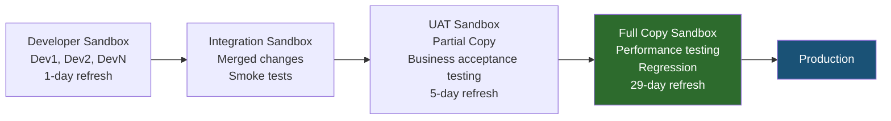
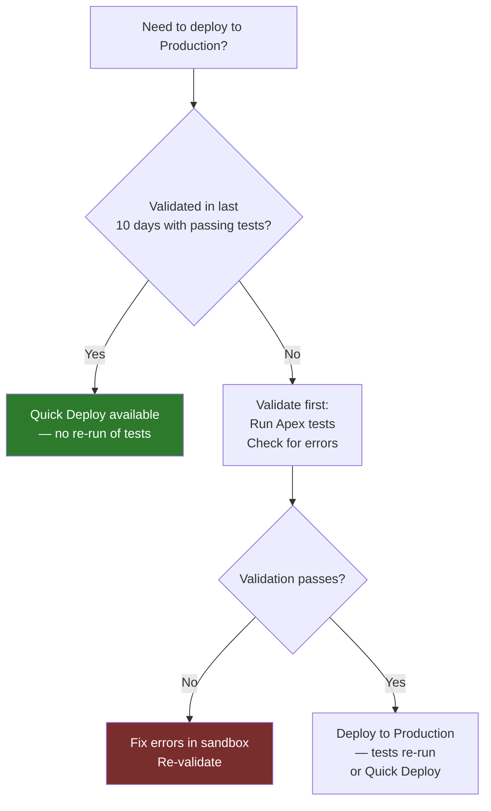

# Sandboxes & Deployment

## Exam Domain
Change Management & Analytics — 7% of exam weight

## Foundations

### What the Exam Tests

At Admin cert level: you know there are sandbox types and Change Sets exist. The Advanced Admin exam tests:
- The nuanced differences between sandbox types (refresh rates, data inclusion, storage)
- When to use each sandbox type in a real development lifecycle
- Change Set content: what DOES and DOES NOT move
- Change Set dependencies and the order of deployment
- Deployment validation vs. deployment
- The relationship between sandboxes, Salesforce DX, and modern CI/CD concepts

---

## How It Works

### Sandbox Types — Deep Comparison

| Feature | Developer | Developer Pro | Partial Copy | Full Copy |
|---|---|---|---|---|
| **Org storage** | 200 MB | 1 GB | 5 GB | Same as production |
| **Data storage** | 10 MB | 10 MB | 5 GB | Same as production |
| **Record data included** | None | None | Sample subset (configurable) | Full production data copy |
| **Refresh cadence** | 1 day | 1 day | 5 days | 29 days |
| **Number per org** | Unlimited | Unlimited | 5 | 1 (or more with license) |
| **License cost** | Included | Included | Included | Add-on (or Enterprise+) |
| **Template required** | No | No | Yes (sampling rules) | No |
| **Suitable for** | Dev/unit test | Larger dev | UAT with real data subset | Full UAT/perf testing |

**Critical exam facts:**
- Full Copy: 29-day minimum refresh cycle, same data as production (as of last refresh)
- Partial Copy: 5-day minimum refresh cycle, requires a sandbox template to define which objects/records to sample
- Developer and Developer Pro: refresh daily if needed; no production data

### Sandbox Refresh

Refreshing a sandbox replaces its content with a fresh copy from production. The metadata is refreshed. For Partial/Full Copy, the data is also refreshed (as of the refresh date).

**What happens to sandbox users after refresh:**
- Sandbox org is overwritten
- Custom code, custom config, and any sandbox-specific changes are lost
- Sandbox user credentials are reset to production credentials
- Email addresses are modified by Salesforce to prevent accidental production emails from sandbox

**Before refreshing a sandbox:**
1. Export any undeployed changes (backup)
2. Note all sandbox-specific configurations
3. Communicate the refresh to all users of that sandbox
4. Schedule during off-hours for the team

### Change Sets

A Change Set is a Salesforce tool for deploying metadata from one org to another (sandbox to sandbox, or sandbox to production).

**Two types:**
- **Outbound Change Set** — created in the source org (what you're sending)
- **Inbound Change Set** — received in the destination org (what arrives)

### What Change Sets CAN Move

Metadata only — no records (except Custom Metadata Type records):

- Apex Classes and Triggers
- Visualforce Pages and Components
- Lightning Components (Aura, LWC)
- Flows and Process Builder flows
- Profiles (field-level security, object permissions, etc.)
- Permission Sets
- Custom Fields and Objects
- Validation Rules
- Page Layouts
- Compact Layouts
- Record Types
- Custom Labels
- Email Templates
- Custom Apps and Tabs
- Reports, Report Types, and Dashboards
- Approval Processes
- Assignment Rules
- Auto-Response Rules
- Escalation Rules
- Workflow Rules (legacy)
- Custom Metadata Types AND their records
- Custom Settings metadata (structure only, NOT the data values)

### What Change Sets CANNOT Move

This is heavily tested:

- **Custom Object data (records)** — use Data Loader for data
- **Custom Setting values** — structure deploys, but org/profile/user values do NOT
- **Users and User settings**
- **Queues** — must be manually created in each org
- **Public Groups and Roles** — must be manually created
- **Documents and Libraries (Content)** — must be manually migrated
- **Org-Wide Email Addresses** — must be manually configured
- **Territory Management configuration** — must be manually rebuilt
- **External Services** configurations
- **Connected App credentials** (OAuth keys) — must be re-configured
- **Data from non-CMT Custom Objects** — must use Data Loader

### Change Set Dependencies

Change Sets require all dependencies to be in the destination org before deploying.

**Example:** You're deploying a Validation Rule that references a custom field. If the custom field doesn't exist in the destination:
- The deployment will fail
- You need to deploy the field first (in a separate Change Set) or include it in the same Change Set

**The dependency order pattern:**
1. Deploy Custom Objects and Fields first
2. Then Apex Classes (they may reference custom fields)
3. Then Flows, Validation Rules, Page Layouts
4. Then Profiles (they reference everything above)
5. Then Integration configurations

**Change Set validation:** Before deploying a Change Set to production, always click **"Validate"** first:
- Validates the deployment without committing changes
- Runs all Apex tests
- Reports errors without making changes to the target org
- Validation result can be used to skip test re-run during actual deployment (Quick Deploy — available when validation was successful in the last 10 days)

### Quick Deploy

After a successful validation (where Apex tests pass), you can use **Quick Deploy** to deploy without re-running tests. This significantly reduces deployment time for large orgs with extensive test suites.

**Requirements:**
- Validation must have been successful
- Validation must be within the last 10 days
- For production deployments: tests must have passed with ≥75% code coverage during validation

### Deployment Best Practices

1. **Always validate before deploying to production**
2. **Deploy during off-peak hours** — some deployments lock certain metadata during deployment
3. **Deploy in dependency order** — fields before validations, objects before Apex
4. **Test in a Full Sandbox before production** — especially for performance-impacting changes
5. **Document what's in each Change Set** — Change Set descriptions are critical for rollback analysis

---

## Advanced Configuration

### Connection Types: Deployment Connections

Before you can send a Change Set from Org A to Org B, a deployment connection must exist.

**Setup > Deploy > Deployment Settings:**
- Configure which sandboxes can send Change Sets to which orgs
- Production can receive from any sandbox connected to it
- Sandbox-to-sandbox requires explicit connection configuration

**Who configures this?** System Admin in the target org must enable inbound connections.

### Sandbox Templates (Partial Copy)

A Sandbox Template defines which objects are included in a Partial Copy sandbox refresh — and how many records per object.

**Configuration:**
1. Setup > Sandboxes > Sandbox Templates > New
2. Select objects to include
3. Set maximum record count per object
4. Apply template when creating/refreshing a Partial Copy sandbox

**Use case:** For UAT sandboxes that need realistic data. Include Accounts (1,000), Contacts (5,000), Opportunities (2,000), Cases (500) — enough to test behavior without the full production dataset.

### Scratch Orgs and Salesforce DX (Exam Awareness)

Salesforce DX (Developer Experience) is the modern development toolchain:
- **Scratch Orgs** — disposable, short-lived developer environments (7–30 days)
- **SFDX Metadata Format** — source-driven format (XML per component in file system)
- **VS Code + Salesforce Extension Pack** — standard developer IDE
- **`sf` CLI** — command-line tool for org operations, deployments, test runs

**The exam tests awareness** of Salesforce DX concepts, not deep CLI knowledge. Know:
- Scratch orgs are temporary; they expire
- Source-driven development stores metadata in version control (Git)
- This is the modern alternative to Change Sets for teams with CI/CD pipelines

---

## Real-World Scenarios

### Scenario 1: Release Management for a Multi-Team Org
Three teams work on the same Salesforce org: Sales Operations, Service Operations, and IT. They need to release independently without blocking each other.

**Design:**
- Each team has their own Developer sandbox for development
- Integration sandbox: all teams deploy to integration first for conflict detection
- UAT Partial Copy sandbox: business stakeholders test
- Full Copy sandbox: performance and regression testing before production
- Production: final target

### Scenario 2: Emergency Hotfix in Production
A critical validation rule is preventing all opportunities from being saved. A fix is needed immediately.

**Options (in order of speed):**
1. Disable the validation rule directly in production (fastest — no deployment needed)
2. Create a Change Set in production's source sandbox, validate, Quick Deploy if available
3. Direct metadata deployment via Salesforce CLI if CI/CD pipeline is in place

---

## PTA / SA Relevance

### When This Comes Up in Engagements

**The ALM (Application Lifecycle Management) conversation:** Most enterprise customers have either no formal release process ("everyone deploys directly to production") or an overly complex one that creates bottlenecks. The standard recommendation is a 4-environment pipeline: Dev → Integration → UAT → Production.

**The "queues don't deploy" surprise:** Common mid-project discovery — customers assume all configuration deploys. When they realize queues, public groups, and roles must be manually created in each environment, they need additional scope for environment configuration management.

**Sandbox refresh planning:** For customers with scheduled releases, sandbox refresh dates matter. A Full Copy sandbox refreshed right before UAT gives the most realistic data for testing. Build the refresh schedule into the project timeline.

**Custom Metadata vs Custom Settings for deployments:** The #1 deployment architecture question. Customers who store config in Custom Settings are manually entering values in every environment. CMT eliminates this.

### Common Partner Mistakes

1. **Including Profiles in Change Sets without including all dependencies** — Profiles include FLS for every field. If you deploy a profile without all the fields it references, the deployment fails or the profile silently strips fields not present in the destination.

2. **Not validating before deploying to production** — The validate step catches errors before they affect production. This is non-negotiable for production deployments.

3. **Forgetting Queues and Groups don't deploy** — Every project loses at least one day to this discovery during go-live prep. Always include environment setup checklist items for queues, groups, and roles.

4. **Not considering connected app credentials** — OAuth client IDs/secrets don't deploy. Every environment needs its own connected app registration. This affects integrations and must be planned during environment setup.

5. **Deploying flows to production when scheduled path interviews are pending** — Active flows with pending scheduled interviews in production — deploying a new version deactivates the old one and cancels pending interviews. Schedule flow deployments when scheduled interviews are minimal.

### Enterprise Scale Considerations

- **Large Change Sets slow down deployments** — Massive Change Sets (500+ components) with full Apex test runs can take 2–4 hours to deploy. Break into smaller, focused Change Sets. Use Quick Deploy post-validation.
- **Production data in Full Copy sandboxes** — Full Copy sandboxes contain real customer data. Implement data masking before giving developers access to Full Copy sandboxes. This is a compliance requirement in GDPR, HIPAA, and CCPA environments.
- **Salesforce DX at enterprise scale** — For teams with >10 developers, Change Sets become a bottleneck. Salesforce DX with a Git-based CI/CD pipeline (GitHub Actions, GitLab CI, Jenkins) is the enterprise standard. You'll need to speak to this in architecture discussions.

---

## Architecture

### Release Pipeline — Standard 4-Environment Model

### Change Set Deployment Decision Tree

**Limitations:**
- Change Sets cannot move records, queues, public groups, roles, users, or org-level settings
- Change Sets cannot be edited after they're sent to the destination org
- Full Copy sandbox: 29-day minimum refresh cycle; 1 copy per org by default
- Partial Copy sandbox: 5-day minimum refresh cycle; requires sandbox template; 5 max per org
- Quick Deploy requires validation within last 10 days with 75%+ Apex test coverage
- Deployment connections must be configured before Change Sets can be sent
- Scratch Orgs expire after 7–30 days (configurable at creation)

---

## Key Facts to Memorize

1. Full Copy sandbox: 29-day refresh cycle, same data as production, 1 per org
2. Partial Copy sandbox: 5-day refresh cycle, requires sandbox template, 5 per org
3. Developer sandbox: 1-day refresh cycle, no production data, unlimited per org
4. Change Sets CANNOT move: records, queues, public groups, roles, custom setting values
5. Change Sets CAN move: Custom Metadata Type records (unlike Custom Object records)
6. Always VALIDATE before deploying to production — runs tests without committing changes
7. Quick Deploy: available after successful validation within last 10 days; skips re-running tests
8. Deployment dependencies: fields must exist before validation rules; objects before Apex; everything before profiles
9. Refreshing a sandbox overwrites all changes since the last refresh
10. Partial Copy sandbox requires a Sandbox Template to define which objects/records to sample

---

## Exam Traps

- **Trap 1:** "Queues can be deployed from sandbox to production via Change Set" — FALSE. Queues must be manually recreated in each org.
- **Trap 2:** "Custom Settings data (values) deploy with Change Sets" — FALSE. Only the Custom Settings structure (object definition) deploys. Values must be manually configured in each org (unlike Custom Metadata Type records).
- **Trap 3:** "Quick Deploy can be used anytime" — FALSE. Requires successful validation within the last 10 days with passing Apex tests.
- **Trap 4:** "Full Copy sandbox can be refreshed every 7 days" — FALSE. Minimum 29-day refresh cycle.
- **Trap 5:** "Deploying a new Flow version to production cancels all pending scheduled path interviews" — TRUE. This is a genuine risk that must be managed during production deployments.

---

## Practice Questions

**Q1.** A team needs to create a UAT environment that contains a representative sample of production data (about 10% of accounts and contacts) for business user testing. The environment must be refreshable every 5 days. Which sandbox type should be used?
- A. Developer Sandbox — daily refresh, though no production data
- B. Developer Pro Sandbox — daily refresh with some data
- C. Partial Copy Sandbox — 5-day refresh with a configurable data sample
- D. Full Copy Sandbox — monthly refresh with full production data

**Answer: C** — Partial Copy Sandbox supports 5-day refresh and configurable data sampling via sandbox templates. Perfect for UAT with representative but not full production data.

---

**Q2.** An admin deploys a Change Set from a sandbox to production. The Change Set includes a new validation rule that references a custom field. The deployment fails. What is the most likely cause?
- A. Validation rules cannot be deployed via Change Set
- B. The custom field the validation rule references doesn't exist in production
- C. Change Sets cannot include both custom fields and validation rules simultaneously
- D. The production org is in maintenance mode

**Answer: B** — Change Set deployments fail if dependencies (in this case, the custom field the validation rule references) don't exist in the destination org. The custom field must be deployed first, or included in the same Change Set.

---

**Q3.** An admin wants to deploy a large Change Set to production. To avoid re-running all Apex tests during the deployment (which takes 2 hours), what must have been done first?
- A. Disable all Apex tests in the Change Set before deploying
- B. Successfully validate the Change Set in production within the last 10 days
- C. Get approval from Salesforce Support for Fast Track deployment
- D. Run Apex tests directly in production via Developer Console

**Answer: B** — Quick Deploy is available after a successful validation (with passing Apex tests) within the last 10 days. The deployment then skips re-running tests.

---

**Q4.** Which of the following items CANNOT be deployed via a Change Set? (Select 3)
- A. Apex Classes
- B. Queues
- C. Custom Metadata Type records
- D. Public Groups
- E. Page Layouts
- F. Custom Setting values (data)

**Answer: B, D, F** — Queues, Public Groups, and Custom Setting data values cannot be deployed via Change Sets. All three must be manually configured in each org. Apex Classes (A), Custom Metadata Type records (C), and Page Layouts (E) can all be deployed via Change Sets.
