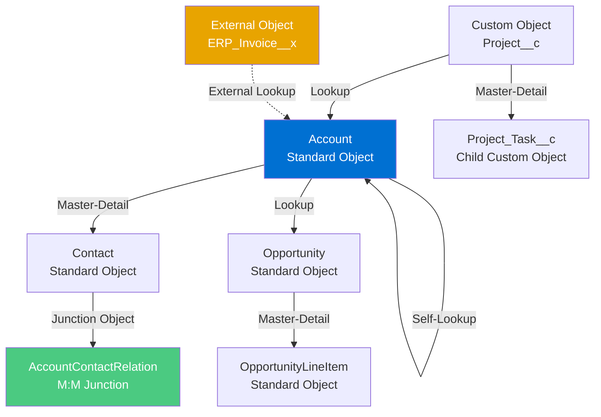

# Data Modeling Fundamentals

## Exam Domain
Master Data Management — 25% of exam weight

## Core Concepts

### The Salesforce Object Model

Salesforce's data layer is built on a **multi-tenant relational database** abstracted through the metadata-driven object model. Understanding what sits below the UI is essential for architecture decisions.

**Standard Objects** are pre-built by Salesforce (Account, Contact, Opportunity, Case, etc.). They have pre-defined indexes, skinny table eligibility, and integration with features like duplicate management, reports, and Einstein.

**Custom Objects** are defined by the org. They get standard indexes on Id, Name, CreatedDate, SystemModstamp, OwnerId, and any field marked as a custom index or unique field.

**External Objects** map to data outside Salesforce via Salesforce Connect. They look like objects but query live external systems.

**Big Objects** are for massive historical data sets (billions of rows). They use a custom index key (compound) and have limited query capabilities.

### Field Types and Their Architecture Implications

| Field Type | Index Support | Notes |
|---|---|---|
| Text (255) | Standard custom index | Default for free-text |
| Text Area (Long/Rich) | Not indexable | Cannot be used in WHERE clauses selectively |
| Number, Currency, Percent | Standard custom index | Good for range queries |
| Date, DateTime | Standard custom index | Range queries work well |
| Checkbox | Low cardinality — poor selectivity | Avoid as a filter unless combined |
| Lookup (relationship) | Automatically indexed | Foreign key, standard index |
| Master-Detail | Automatically indexed | Roll-up summary enabled |
| Email, Phone, URL | Can be indexed | Limited query effectiveness |
| Formula | Not stored in DB (calculated) | Cannot be indexed or used in selective WHERE |
| Roll-Up Summary | Not stored individually | Calculated field on parent |

**Critical rule**: Long text areas and rich text fields are stored in a separate table and cannot be used in SOQL WHERE clauses in a way that leverages indexes. Queries filtering on these fields always do full table scans.

### Relationship Types in Depth

**Lookup Relationship**
- Optional foreign key — child can exist without parent
- Deleting parent does not delete child (configurable: clear, restrict, or cascade on delete for some)
- Up to 40 lookups per object (against limit ceiling)
- Cross-object formula fields work one level up
- Roll-up summaries NOT supported

**Master-Detail Relationship**
- Required foreign key — child cannot exist without parent
- Deleting parent cascades to delete all children
- Roll-up summary fields ARE supported (COUNT, SUM, MIN, MAX)
- Maximum 2 master-detail relationships per child object
- Child inherits OWD sharing from parent — child has no independent OWD

**Junction Object (M:M)**
- Custom object with two master-detail relationships
- Enables many-to-many modeling
- Inherits most restrictive OWD from either parent
- Roll-up summaries can aggregate from junction up to both parents

**Hierarchical Relationship**
- Only on User object
- Self-referential lookup (User to User)
- Used for management hierarchy, territory hierarchy

**Self-Lookup (Self-Join)**
- Object references itself (e.g., Account.ParentId)
- Useful for hierarchical data (Accounts, Cases)
- No roll-up summary support
- Maximum hierarchy depth varies by feature

### Data Types: When to Choose What

**External ID fields**: Text fields marked as External ID. Used as upsert keys during data loads. Maximum 3 External ID fields per object (unique External ID fields count against the index limit). Salesforce creates an index on External ID fields automatically.

**Autonumber fields**: System-assigned sequential numbers. Formatted as text (e.g., ACC-0001). Cannot be changed once assigned. Useful as human-readable record identifiers but should not be used as integration keys (use External ID for that).

**Formula fields vs. stored fields**: Formula fields are recalculated on read. They add no storage cost but add CPU cost on queries and reports. They cannot be indexed. For frequently-filtered calculated values, consider a stored field populated by automation instead.

---

## PTA / SA Relevance

### When This Comes Up in Engagements

**Discovery sessions**: When a customer describes their data model, you need to immediately assess: Is the parent-child relationship a master-detail or lookup? That one decision determines sharing, roll-ups, and deletion behavior.

**Architecture reviews**: Field type choices made during initial build become permanent constraints at scale. A formula field on Account that everyone filters reports on cannot be indexed — and at 2M accounts, that kills report performance.

**Pre-sales scoping**: A customer with 20 custom objects, extensive cross-object formulas, and 400+ fields per object is a different delivery risk than a greenfield implementation.

### Common Implementation Failures

1. **Using Long Text Areas as filter criteria**: Developers build reports or integrations that filter on description fields. At scale, every query becomes a full table scan. Mitigation: if a long text field is ever a filter target, store a parsed/categorized value in a separate indexed field.

2. **Over-relying on formula fields for reporting filters**: A formula field that categorizes accounts into tiers looks fine in dev. At 3M records, the report that filters on that formula field runs for 10+ minutes.

3. **Wrong relationship type selection**: Using lookup where master-detail was needed (no roll-ups, sharing problems) or master-detail where lookup was needed (child records unexpectedly deleted when parent deleted). Get this right in design — relationship types cannot be changed after records exist.

4. **Flat object model**: Customers normalize everything into custom fields on Account instead of using related objects. This creates objects with 300+ fields, makes the page layout unusable, and hurts query performance.

5. **Missing External ID fields**: Migration teams discover mid-migration that they have no upsert key. They resort to SOQL lookups during load, which is slow and error-prone. Design External ID fields at object creation time.

### Enterprise Architecture Patterns

**Hub-and-Spoke Object Model**: Account is the hub. Contact, Opportunity, Case, and custom objects spoke off it. This is the standard Salesforce enterprise pattern. Problems arise when customers create parallel hierarchies (e.g., a custom "Client" object separate from Account).

**Universal Data Model (UDM)**: Salesforce's recommendation for large enterprises — standardizing on the full Account + Contact + Opportunity + Case model with proper relationships before customizing. Customers who deviate from UDM early pay migration costs later.

**Object Tiering by Volatility**: Hot objects (frequently updated) should be lean — fewer fields, no expensive formulas, minimal automation on save. Cold objects (reference data) can be richer. Design field count and automation density based on expected write frequency.

---

## Architecture

**Limitations & Tradeoffs:**

- Master-detail relationships: 2 per child object. If you need a third parent, use lookup (but lose roll-up capability and cascade delete).
- External objects via Salesforce Connect count against object and field limits differently. OData protocol overhead means they are not suitable for high-frequency transactional queries.
- Junction objects inherit the most restrictive OWD. If either parent is Private, the junction record is visible only to the owner. This surprises most developers.
- Self-lookup hierarchies (Account ParentId) are traversable in SOQL only up to 5 levels deep.

---

## Key Facts to Memorize

- Maximum **3 External ID fields** per object (each creates an index)
- Formula fields are **not stored** — they cannot be indexed
- Long text area / rich text fields cannot be used in **selective WHERE clauses**
- Master-detail: max **2 per child object**, cascade delete, OWD inherited from parent
- Roll-up summary fields only work on **master-detail** relationships, not lookups
- Lookup relationship: up to **40 per object** (counts against object limit)
- External ID fields are automatically indexed by Salesforce
- Cross-object formulas traverse **up to 5 levels** of lookup relationships
- Big Objects use a **compound index key** (index fields defined at creation, cannot be changed)
- Autonumber fields are formatted text — do not use as integration keys

---

## Exam Traps

1. **"Which field type can be used as a selective filter in SOQL?"** — Long text area and formula fields are the wrong answers.
2. **"A roll-up summary field is needed on a junction object"** — Roll-up summaries on junction objects: the junction has M-D to two parents. Each parent CAN have a roll-up to the junction. The junction itself can have roll-ups to its M-D parents only.
3. **"Lookup vs. master-detail"** — If the question mentions "child records should not exist without the parent" → master-detail. If "child should survive parent deletion" → lookup.
4. **"External ID field count"** — The limit is 3 External ID fields. Unique fields also consume index slots (up to 3 unique fields separate from External IDs, though combined limit matters — know that External ID + Unique share an index budget of around 3-5 per object).

---

## Practice Questions

**Q1.** A company has a custom object Order__c with a lookup to Account. They want to display the total order value on the Account record. What is the most efficient solution?

A) Create a formula field on Account that queries related Orders  
B) Convert the lookup to master-detail and create a roll-up summary  
C) Use a scheduled Flow to update a currency field on Account nightly  
D) Create a trigger on Order__c to update Account

**Answer: B** — Roll-up summaries require master-detail. Converting is the correct architectural answer. Flows and triggers are workarounds that introduce maintenance debt.

---

**Q2.** A developer wants to filter Accounts by a Rich Text Area field that contains specific keywords. What will happen at 1 million Account records?

A) Salesforce will use the standard text index to execute the query efficiently  
B) The query will perform a full table scan and likely time out  
C) The query will use a custom index if one is created on the Rich Text Area field  
D) Salesforce will route the query to a skinny table automatically

**Answer: B** — Rich Text Area fields are stored separately and cannot be indexed. Queries filtering on them always do full table scans.

---

**Q3.** A junction object has master-detail relationships to both Object A and Object B. Object A's OWD is Public Read/Write. Object B's OWD is Private. What is the effective OWD for the junction object?

A) Public Read/Write, inherited from Object A  
B) Private, inherited from Object B  
C) Controlled by Sharing Rules on the junction object  
D) Public Read Only, a middle ground between the two parents

**Answer: B** — Junction objects inherit the most restrictive OWD from either parent.
