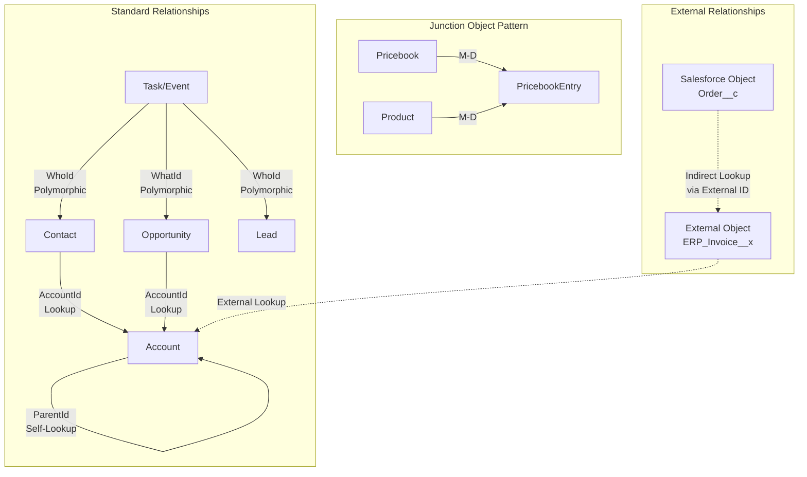

# Object Relationships Design

## Exam Domain
Master Data Management — 25% of exam weight

## Core Concepts

### Polymorphic Relationships

Salesforce supports **polymorphic lookups** — a single lookup field that can reference multiple object types. The two built-in polymorphic relationships are:

**WhoId (Who field)**: Links Activities (Task, Event) to either Contact or Lead. The platform determines which object the record points to at runtime.

**WhatId (What field)**: Links Activities to any of: Account, Opportunity, Case, Contract, Campaign, or any custom object enabled for Activities. The query `WHERE What.Type = 'Opportunity'` filters polymorphic fields.

**Custom polymorphic fields** are not natively supported in Salesforce declarative tools. The standard workaround is using a single lookup field per object type or a junction object pattern.

### SOQL Traversal Rules for Relationships

**Child-to-Parent (forward traversal)**: Use dot notation in SELECT clause.
```sql
SELECT Name, Account.Name, Account.Industry FROM Contact
```
Can traverse up to **5 levels** of lookup relationships in a single query.

**Parent-to-Child (backward traversal / sub-query)**: Use the child relationship name in a sub-select.
```sql
SELECT Name, (SELECT LastName FROM Contacts) FROM Account
```
Sub-queries (inner queries) count toward the query limits: max **1 sub-query level** (no nesting sub-queries inside sub-queries).

**Semi-joins and anti-joins**: `WHERE Id IN (SELECT AccountId FROM Contact)` — these are selective when the inner query returns a small result set.

### Relationship Design Decision Framework

**Use Master-Detail when:**
- Child record has no meaning without parent
- You need roll-up summaries (SUM, COUNT, MIN, MAX)
- Cascade delete is acceptable business logic
- Sharing should be inherited (no independent security on child)

**Use Lookup when:**
- Child record can exist independently of parent
- Parent deletion should not cascade
- Child needs independent OWD/sharing
- You need more than 2 parent objects

**Use External Lookup when:**
- Parent is an External Object (via Salesforce Connect)
- Data lives in external system but you need a relationship in Salesforce schema

**Use Indirect Lookup when:**
- Linking an External Object to a Salesforce standard/custom object using an External ID field as the join key (instead of Salesforce record ID)

### Hierarchical Data Patterns

**Account Hierarchy (self-lookup)**
The Account object has a standard `ParentId` field (self-lookup). This enables 5-level deep traversal in SOQL. The `AccountHierarchyAccountId` field provides the ultimate parent.

Design implication: Enterprise customers often have complex Account hierarchies (Global Ultimate > National Ultimate > Domestic Parent > Child). Report performance on hierarchy queries degrades significantly at scale. SOQL cannot traverse infinite depth — queries must bound the depth.

**Person Accounts**
A hybrid Account-Contact record for B2C use cases. A Person Account has both Account and Contact underlying records. Design tradeoffs:
- Simplifies B2C modeling (no separate Contact needed)
- Breaks integrations that assume Account ≠ person
- Activities, cases, and relationships work differently
- Cannot be disabled once enabled in an org

**Many-to-Many Patterns**

Standard junction object pattern:
```
Object A ←[M-D]— Junction Object —[M-D]→ Object B
```

For more than 2 parents or when child needs independent sharing:
```
Object A ←[Lookup]— Bridge Object —[Lookup]→ Object B
```
The lookup version loses roll-up summaries but gains independent sharing and flexibility.

### Relationship Limits That Bite at Scale

| Constraint | Limit | Impact |
|---|---|---|
| Master-detail per child | 2 | Third parent must be a lookup |
| Lookup per object | 40 | Rich objects hit this limit |
| Roll-up summary fields per master | 25 | Forces Apex for complex aggregations |
| Child records before cascade delete allowed | Object-dependent | Deleting a parent with millions of children queues cascade — can hit async limits |
| Self-lookup hierarchy traversal | 5 levels in SOQL | Deep hierarchies need workarounds |

---

## PTA / SA Relevance

### When This Comes Up in Engagements

**Data model reviews**: The most common architectural debt is incorrect relationship type choices made during MVP. A lookup that should have been master-detail (missing roll-ups, incorrect sharing). Reversing this requires data migration.

**B2B vs B2C modeling discussions**: Person Accounts come up in every retail, financial services, or consumer goods engagement. The decision to enable Person Accounts is irreversible — make sure the customer understands the implications before enabling.

**Enterprise Account hierarchies**: Global enterprises with parent/child account structures (e.g., a manufacturing company with global, regional, and local subsidiaries) need careful thought about how hierarchy affects territory assignment, opportunity roll-up, and reporting. This is a common architecture discussion point with FSI and manufacturing customers.

**Integration schema design**: External lookups and indirect lookups are the bridge between Salesforce and external systems. Integrators who don't understand these relationship types build brittle custom code instead of using the platform properly.

### Common Implementation Failures

1. **Person Account activation mid-project**: A customer enables Person Accounts after building their data model. All integrations that create Contacts now break, reports change, and duplicate management rules need reconfiguration. This is a one-way door — architect before enabling.

2. **Junction object sharing misconfiguration**: A junction object between two private objects where users expect to see all junction records. Since junction inherits the most restrictive OWD, users only see junctions where they own at least one parent side. Customers are repeatedly surprised by this.

3. **Roll-up summary cascades**: A roll-up summary on Account that aggregates from Opportunity which itself has a roll-up from OpportunityLineItem. A single line item save triggers three record updates (line item → opp → account). At high transaction volume, this creates lock contention on Account records.

4. **Over-normalized schemas**: Customers from a strong RDBMS background create deeply normalized schemas (8+ levels of relationships). Salesforce is not a relational database — it is an object platform with relationship constraints. SOQL traversal limits and sub-query restrictions mean deep schemas require multiple queries where one join would suffice in SQL.

5. **Polymorphic relationship queries in integrations**: Integration developers who do not know about WhoId/WhatId polymorphism write separate queries for each object type, creating N+1 query patterns that hit API limits.

### Enterprise Architecture Patterns

**Canonical Account Model**: Define Account as the enterprise master record — every person, company, or location in the system maps to an Account. Then use Account Type, Record Types, and Account hierarchy to differentiate. This avoids parallel object models (e.g., separate Partner object, Vendor object) that fragment the data model.

**Thin Junction Objects**: Keep junction objects lean — 5-10 fields maximum. Their purpose is to define the relationship and carry relationship metadata (date range, role, status). Heavy business logic on junction objects creates locking and performance issues.

**Relationship Governance at the Schema Level**: For large orgs, define a data model governance policy: new relationship types require architecture review. This prevents the accumulation of 400-field objects and 40-lookup object models that appear in unmanaged Salesforce implementations.

---

## Architecture



**Limitations & Tradeoffs:**

- `WhatId` polymorphic lookups: You cannot filter `WHERE WhatId = [specific type]` directly — use `WHERE What.Type = 'Opportunity'` in SOQL. Not all query tools support this syntax correctly.
- Cascade delete at scale: Deleting a parent with >50,000 child records queues the cascade as an async operation. The parent is deleted immediately but children deletion may lag. This affects migration and cleanup scripts.
- Cross-object formulas on lookups: A formula on Contact that references `Account.Industry` will be blank if the AccountId lookup is empty. Null-safe formula design is required: `IF(ISBLANK(AccountId), "Unknown", Account.Industry)`.
- Indirect lookup performance: Joining via External ID field instead of Salesforce ID adds query complexity. For high-volume external objects, direct Salesforce Connect with proper OData indexing on the external side is critical.

---

## Key Facts to Memorize

- **WhoId**: polymorphic to Contact OR Lead (Activities)
- **WhatId**: polymorphic to Account, Opportunity, Case, Contract, Campaign, or Activity-enabled custom objects
- SOQL parent-to-child traversal: max **1 level of sub-query** (no nested sub-selects)
- SOQL child-to-parent dot notation: max **5 levels**
- Person Accounts: **irreversible** once enabled; breaks Contact-centric integrations
- Junction object OWD: inherits **most restrictive** parent OWD
- Roll-up summary per master object: max **25 fields**
- Cascade delete with >50,000 children: processed **asynchronously**
- External Lookup: links External Object to External Object
- Indirect Lookup: links External Object to Salesforce Object via External ID field

---

## Exam Traps

1. **"Which relationship type supports roll-up summaries?"** — Only master-detail. Lookups do not.
2. **"Person Accounts enabled — what breaks?"** — Activities (WhoId points to Contact record underlying Person Account, not Account itself), integrations that create standalone Contacts, duplicate management rules.
3. **"A junction object's sharing"** — The question will give you two parent OWDs and ask the junction's effective OWD. Always pick the most restrictive.
4. **"Sub-query limit"** — You cannot nest sub-selects inside sub-selects in SOQL. Single level only.
5. **"WhatId field on Activity"** — Not all standard objects can be a WhatId target. Lead is NOT a valid WhatId target (it's a WhoId target). Knowing the difference prevents wrong answers.

---

## Practice Questions

**Q1.** A company needs to track which Contacts are members of which Accounts (many-to-many, since consultants work for multiple firms). They also need the Account to show a count of associated Contacts. What is the correct design?

A) Create a lookup from Contact to Account and use a formula field to count  
B) Create a junction object with master-detail to Account and master-detail to Contact, then add a roll-up summary on Account  
C) Use the standard AccountContactRelation object with lookup relationships  
D) Add multiple Account lookup fields to Contact

**Answer: B** — For roll-up summaries, junction object must have M-D to Account. AccountContactRelation (C) uses lookups, not M-D, so no roll-up. (D) is a poor design.

---

**Q2.** A developer writes: `SELECT Id, (SELECT Id, (SELECT Id FROM Tasks) FROM Contacts) FROM Account`. What happens?

A) Query executes successfully  
B) Query fails — sub-queries cannot be nested inside sub-queries in SOQL  
C) Query executes but returns only top-level Account records  
D) Query fails due to exceeding the 5-relationship traversal limit

**Answer: B** — SOQL does not support nested sub-queries. Sub-queries may appear only at the top SELECT level of a parent query.

---

**Q3.** An org has Person Accounts enabled. An integration creates new Contact records for individuals. What will happen?

A) Contact records are created normally alongside Person Account records  
B) The integration will fail — Contact creation is disabled when Person Accounts are enabled  
C) Contact records are created but are not associated with Person Accounts  
D) Salesforce automatically converts Contact records to Person Accounts

**Answer: C** — When Person Accounts are enabled, standalone Contact records can still be created, but they must have a valid AccountId pointing to a business account (not a Person Account). The integration may produce orphaned or misconfigured Contacts. Answer B is wrong — Contact creation is not disabled.
