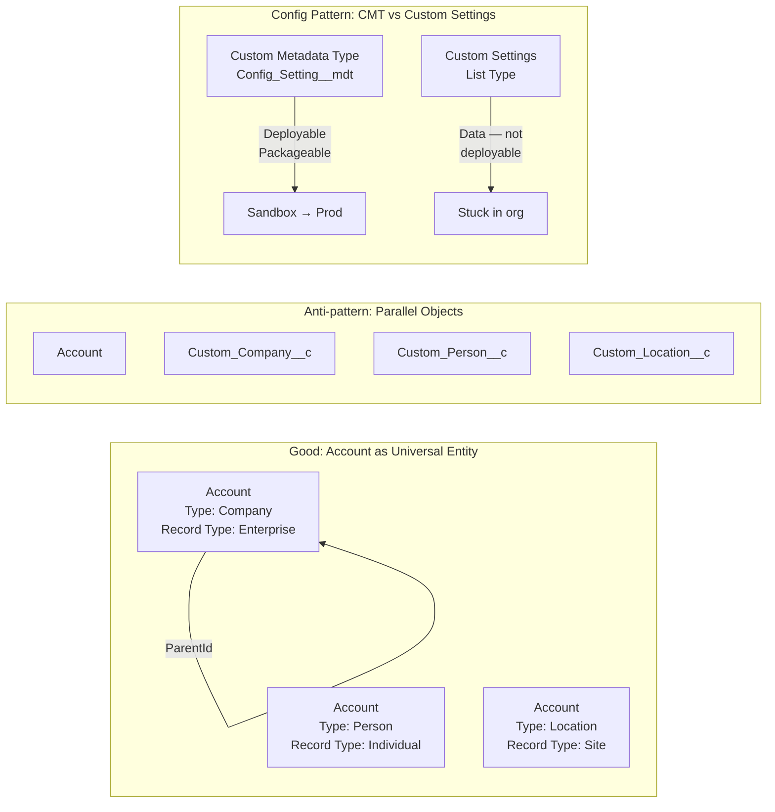

# Schema Design Patterns

## Exam Domain
Master Data Management — 25% of exam weight

## Core Concepts

### Schema Design Principles for Salesforce

Salesforce is not a relational database. Effective schema design requires understanding how the Salesforce object model diverges from traditional RDBMS design:

| RDBMS Principle | Salesforce Reality |
|---|---|
| Normalize to 3NF | Denormalization is often better for query performance |
| Foreign keys are cheap | Every lookup is an index — plan index budget |
| Joins are optimized by query planner | SOQL has no query planner — you must structure queries correctly |
| Infinite depth joins possible | Max 5-level traversal, 1 sub-query level |
| Unlimited columns | 800 custom fields per object limit |
| Schema change is difficult | Schema changes are live — but cannot always be reversed |

### Standard vs. Custom Objects: When to Use Each

**Standard Objects** should be preferred because:
- Pre-built indexes and skinny tables from Salesforce
- Native feature integrations (duplicate rules, duplicate jobs, reports, NPSP, etc.)
- AppExchange packages assume standard objects
- Field History Tracking supported out of the box
- Pre-built relationships (Account → Contact → Opportunity)

**Custom Objects** are appropriate when:
- No standard object maps to the concept
- Data structure is truly unique to the business domain
- Mixing with standard objects would create confusion (e.g., a Work Order concept in a non-FS org)

**Anti-pattern**: Creating custom Account, Contact, or Opportunity equivalents because the standard names don't match the business vocabulary. Rename the labels, not the objects. The technical schema should use standard objects — customers see the custom labels.

### Schema Design Patterns

**1. Account as Universal Entity**

The dominant Salesforce pattern: every identifiable business entity (company, person, location, store, asset) is modeled as an Account with a Record Type differentiating entity type. This maximizes use of Account's pre-built capabilities (hierarchy, duplicate management, address management, standard reports).

Tradeoff: Large Account volumes with multiple Record Types require careful UI/UX design to prevent users from seeing unrelated Account types.

**2. Record Type Segmentation**

Record Types control:
- Page layouts
- Picklist values
- Business processes (lead/opportunity/case/solution)

Design rule: Use Record Types when entities share the same fields but have different processes or picklist values. Do NOT create a new object just because two processes are different — evaluate Record Types first.

**3. Canonical Data Model**

Define a canonical schema that maps all business concepts to Salesforce objects before implementation begins. The canonical model becomes the contract for:
- Integration payload schemas
- Report design
- Automation design

Without a canonical model, teams make ad-hoc schema decisions that diverge over time.

**4. Field Naming Conventions**

Consistent field naming prevents schema pollution:
- Use prefixes for functional domains: `Mktg_Campaign_Source__c`, `Svc_Case_Origin__c`
- Avoid generic names: `Field1__c`, `Custom_Text__c`
- Date vs. DateTime: choose deliberately based on whether time of day matters
- Boolean field names should be questions: `Is_Active__c`, `Has_Accepted_Terms__c`

**5. Controlled Vocabulary (Picklist Architecture)**

**Global Picklists** (Global Value Sets): Define once, reuse across multiple fields. Enforce consistency. Changes propagate to all fields using the value set.

**Standard Picklists**: Object-specific, managed independently.

Design rule: Any picklist representing a domain concept used across multiple objects (Industry, Region, Status) should be a Global Picklist. Object-specific status fields that differ by object should be standard picklists.

**6. Custom Settings vs. Custom Metadata**

| Feature | Custom Settings (List) | Custom Metadata Types |
|---|---|---|
| Deployable via change set | No (data, not metadata) | Yes (records are metadata) |
| Accessible in flows | Yes (via Apex) | Yes (natively) |
| Package distributable | No | Yes |
| Org-specific vs. universal | Org-specific | Universal (can be overridden) |
| Use case | Org-specific config values | Application configuration |

**Critical architect rule**: Custom Metadata Types should be used for any configuration that needs to move across sandboxes or be packaged. Custom Settings (list type) trap configuration data in orgs.

**7. Soft Delete vs. Archive Flag Pattern**

Salesforce record deletion moves records to the Recycle Bin for 15 days. After that, records are permanently deleted. For compliance and audit, consider:
- **IsActive__c flag** (soft delete): Record stays in Salesforce with IsActive = false. Query performance degrades as "deleted" records accumulate. Requires all queries to filter on IsActive.
- **Archival to Big Objects**: Move inactive records to Big Objects. Removes them from standard queries. Loses full SOQL capability on archived data.
- **External archival**: Export to external data store (Data Lake, S3). Full deletion from Salesforce.

Design rule: For regulated industries (HIPAA, FINRA), understand retention requirements before designing deletion strategy. Deletion ≠ erasure.

### Field Count and Object Complexity

Salesforce limits:
- **800 custom fields per object** (long text area fields count differently)
- **25 roll-up summary fields** per master object
- **10 formula fields** that reference cross-object formulas (each chain link costs something)

Performance implications:
- Objects with 400+ fields have degraded query performance even when only a few fields are selected
- Wide objects cause Apex heap size issues when lists of SObjects are processed
- Consider **vertical partitioning**: split a wide object into a primary object + a detail object with a master-detail relationship (similar to a database row-splitting pattern)

---

## PTA / SA Relevance

### When This Comes Up in Engagements

**Schema review conversations**: A customer says "we have too many fields, queries are slow, users are confused." The first step is a schema audit — field count per object, formula field complexity, picklist consistency, naming conventions.

**ISV architecture reviews**: If a partner's managed package is reviewed, the schema design patterns it uses determine whether it will scale in enterprise orgs. Good package design uses Custom Metadata instead of Custom Settings, global picklists for shared vocabularies, and minimal cross-object formulas.

**Salesforce Health Check**: Many customers hire Salesforce partners for a Health Check engagement. Schema quality is always part of this assessment. Knowing what good looks like (and what technical debt looks like) is essential for advisory credibility.

### Common Implementation Failures

1. **300-field Account objects**: Over years of customization without governance, Account objects accumulate fields from every project team. This degrades page load time, query performance, and user adoption. Mitigation requires a field audit, deprecation campaign, and data model refactor.

2. **Picklist sprawl**: Multiple fields representing the same concept (Country, Country_Code, Country_Name, Billing_Country) with inconsistent values. This makes reporting and integration mapping a nightmare. Solution: Global Picklist standardization + data cleanse.

3. **Custom Settings used for package config**: Partners who use Custom Settings for configuration in managed packages force customers to manually recreate configuration in each sandbox. Always use Custom Metadata Types.

4. **Hard-coded IDs in code/config**: Record Type IDs, User IDs, Group IDs hard-coded in Flows, Apex, and configuration. These break when deploying from sandbox to production (IDs differ). Use Custom Metadata Types or Custom Labels instead.

5. **Schema changes in production first**: Teams make field or object changes directly in production "because it's quick." These changes are not tracked, cannot be rolled back, and break the org's metadata consistency with sandboxes. All changes must go through a sandbox first.

### Enterprise Architecture Patterns

**Data Model Governance Board**: Large enterprises establish a governance board that reviews all schema changes — new objects, new fields, relationship changes. The board enforces naming conventions, picklist standards, and prevents schema bloat.

**Metadata Dictionary**: A maintained catalog of all objects and fields with business definitions, data owners, integration mappings, and retention policies. Often built in Salesforce itself (custom objects) or maintained in Confluence/SharePoint. This is the foundation of any data governance program.

**Environment Strategy for Schema**: Dev → QA → UAT → Production with metadata CI/CD (Salesforce DX, GitHub Actions, Copado). Schema changes are tracked as source code. This prevents the "what changed and when" problem that causes production incidents.

---

## Architecture

**Limitations & Tradeoffs:**

- Record Type segmentation: Maximum 200 Record Types per object. At this limit, there are almost certainly better design choices upstream.
- Global Picklist changes propagate immediately to all fields — a value rename in a Global Picklist can break integrations that use the old value. Version-controlled changes are essential.
- Vertical partitioning (splitting a wide object): Adds a master-detail relationship which adds overhead. Use only when the object exceeds 400+ fields AND query/page-load performance is measurably degraded.
- Custom Metadata deployment: CMT records deploy as metadata but large volumes (1000+ rows) can slow deployments. For truly large reference data, consider a custom object with a naming convention to distinguish it from transactional data.

---

## Key Facts to Memorize

- Standard objects preferred over custom objects — rename labels, not schemas
- Custom Metadata Types are deployable metadata; Custom Settings (list type) are data
- Global Picklists: define once, reuse across multiple fields, changes propagate
- Maximum **800 custom fields** per object
- Maximum **25 roll-up summary fields** per master object
- Field History Tracking: max **20 fields per object**, retains 18 months of history
- Record Types per object: max **200**
- Soft delete with IsActive flag degrades query performance over time
- Hard-coded record IDs break between environments — use CMT or Custom Labels
- Vertical partitioning: split wide objects using a master-detail to a companion object

---

## Exam Traps

1. **"Which is deployable across sandboxes — Custom Settings or Custom Metadata?"** — Custom Metadata Types are metadata (deployable). Custom Settings hold data (not deployable via change set).
2. **"A company needs to rename a standard object"** — You rename the label, not the API name. API names of standard objects cannot be changed. This is a UI configuration, not a schema change.
3. **"When should you create a custom object vs. use a Record Type?"** — Use Record Type when the concept shares the same fields and data architecture. Use a custom object when the data structure is fundamentally different.
4. **"Field History Tracking retention"** — 18 months maximum natively. For longer retention, use an archival strategy or Data Export + external storage.

---

## Practice Questions

**Q1.** A company wants the configuration that controls discount approval thresholds to be deployable from sandbox to production as part of their release process. What should the architect recommend?

A) Custom Settings (Hierarchy type)  
B) Custom Settings (List type)  
C) Custom Metadata Types  
D) Custom Labels

**Answer: C** — Custom Metadata Type records are metadata and deploy with change sets and DX. Custom Settings hold data which is not deployable. Custom Labels are for string values, not structured configuration.

---

**Q2.** An Account object has 450 custom fields accumulated over 7 years. Users report slow page loads and reports timing out. What is the first architectural recommendation?

A) Increase Salesforce storage limits  
B) Conduct a field usage audit and deprecate unused fields; evaluate vertical partitioning for remaining fields  
C) Enable skinny tables on the Account object  
D) Migrate to a custom object to reset field limits

**Answer: B** — The root cause is excessive field count. Skinny tables (C) help query performance but don't address page load. Migrating to a custom object (D) is impractical and loses all standard Account integrations. Field audit + deprecation + potential partitioning is the correct architectural response.

---

**Q3.** A company uses a picklist field "Region__c" on both Account and Opportunity to track geographic region. Users are entering inconsistent values. What is the best long-term solution?

A) Create validation rules on both objects to enforce a fixed list  
B) Convert both fields to a Global Picklist (Global Value Set) and restrict to allowed values  
C) Use a custom object to store region values and use lookup fields  
D) Standardize values using Data Loader and train users

**Answer: B** — Global Picklists enforce a single, consistent vocabulary across all fields using the value set. Validation rules (A) are a workaround that doesn't prevent picklist API manipulation. A lookup to a custom object (C) adds complexity unnecessarily for a simple categorical value.
