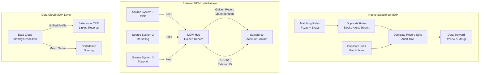

# Master Data Management

## Exam Domain
Master Data Management — 25% of exam weight

## Foundations

**What is Master Data?** Master data is the core business entities that are shared across multiple systems: Customers, Products, Locations, Suppliers, Employees. Unlike transactional data (an invoice, a support ticket), master data is relatively stable and is referenced by transactions.

**The MDM problem**: When the same customer exists in CRM as "Acme Corp", in ERP as "ACME Corporation", and in the marketing platform as "Acme Inc." — which is the authoritative record? Which phone number, address, and segment should be used? Master Data Management is the discipline of answering this question systematically.

**In Salesforce terms**: MDM means ensuring that Account, Contact, and other key object records are:
1. Not duplicated within Salesforce
2. Reconciled with records from external systems
3. Maintained to a defined quality standard
4. Governed by clear ownership and stewardship

**Why architects care**: Poor MDM produces bad reports, failed integrations, wasted marketing spend (targeting the same contact twice), and incorrect AI model training data. It is the foundational quality problem in every enterprise Salesforce deployment.

---

## Core Concepts

### Duplicate Management: The Salesforce Native Stack

Salesforce provides three layers of native duplicate management:

**Matching Rules**: Define HOW to determine if two records are duplicates. Two types of matching:
- **Exact matching**: Field values must be identical (case-insensitive for most fields)
- **Fuzzy matching**: Uses algorithms to match similar but not identical values

Standard fuzzy matching algorithms available in Salesforce:
- **First Name**: Handles nicknames (Bob = Robert), spelling variations
- **Last Name**: Handles hyphenated names, common transpositions
- **Email**: Exact (emails should be exact, not fuzzy)
- **Address**: Handles abbreviations (St = Street, Ave = Avenue)
- **Phone**: Normalizes phone number formats before comparison
- **Company Name**: Handles common abbreviations, Inc/LLC/Corp suffixes

Custom matching rules can combine multiple fields with different match methods and scoring weights. The matching algorithm produces a **match score** — the threshold above which records are considered duplicates.

**Duplicate Rules**: Define WHAT to do when duplicates are detected. Actions:
- **Block**: Prevent the record from being saved
- **Allow with Alert**: Save but warn the user
- **Report Only**: Log to Duplicate Record Sets for review (does not interrupt save)

Duplicate Rules can be set separately for:
- Create operations
- Edit operations
- By profile (some users bypass duplicate checking)

**Duplicate Jobs**: Batch processes that scan existing data for duplicates and compile **Duplicate Record Sets**. Run manually or on schedule. Important: Duplicate Jobs are separate from Duplicate Rules — rules prevent new duplicates, jobs find existing ones.

### Matching Rule Limits

| Constraint | Limit |
|---|---|
| Active Matching Rules per org | 5 |
| Active Duplicate Rules per object | 5 |
| Fields in a single Matching Rule | 10 |

These limits are critical. At 5 active matching rules across the entire org, you must prioritize which objects have active duplicate prevention.

### Duplicate Record Sets

When a Duplicate Rule is set to "Allow with Alert" or when a Duplicate Job runs, Salesforce creates **Duplicate Record Set** records that group the duplicate records together. This is the audit trail for your duplicate management program. A data steward reviews Duplicate Record Sets and merges or flags records.

**Merging duplicates**:
- Account merge: up to 3 records at a time. Child records from non-master Accounts are reparented to the master Account.
- Contact merge: up to 3 records. Activities, cases, and related records reparented.
- Lead merge: up to 3 records.
- Custom objects: no native merge UI — requires Apex or third-party tooling.

### When Native MDM Is Not Enough

Native Salesforce MDM works well for:
- Moderate data volumes (< 5M records per object)
- Standard objects (Account, Contact, Lead)
- Relatively clean source data
- Simple matching criteria (email, phone, name combinations)

Native MDM fails when:
- Matching across 10+ million records with complex fuzzy logic
- Cross-object deduplication (same entity appears as both Account and Contact)
- Survivorship logic is complex (which field value "wins" from which source system)
- Multiple external systems need to reconcile to a single golden record
- Regulatory requirements for full provenance tracking

### External MDM Hub Patterns

When native MDM is insufficient, the architecture involves an external MDM platform:

**Registry Model (Reference MDM)**: The MDM hub maintains a cross-reference index. Each system keeps its own records, and the hub provides a **global identifier (GID)** that links the same entity across systems. Salesforce stores the GID as an External ID. When you need the golden record, you query the hub.

**Consolidation Model**: Source systems feed records to the MDM hub. The hub deduplicates, applies survivorship rules, and creates the golden record. Salesforce receives the golden record from the hub.

**Centralized (Hub-and-Spoke) Model**: All record creation goes through the MDM hub. Salesforce is one of several downstream systems that receives the master record. Used when Salesforce is not the system of record for customer data.

**Coexistence Model**: The MDM hub and Salesforce co-manage. Salesforce creates records that flow to the hub; hub creates/updates records that flow back to Salesforce. Requires careful conflict resolution design.

### Golden Record Strategy

A **golden record** is the single authoritative version of a master record, composed of the best attribute values from multiple source systems. Designing golden records requires:

1. **Source system ranking**: Which system is most trusted for each attribute (e.g., ERP is authoritative for billing address; CRM is authoritative for relationship owner)
2. **Survivorship rules**: When two systems have different values for the same field, which wins? Options: most recent, highest-ranked source, non-null preference, longest value
3. **Confidence scoring**: Some MDM platforms score record quality. Low-confidence attributes may be flagged for human review
4. **Synchronization frequency**: Real-time (event-driven), near-real-time (micro-batch), or batch (nightly)

---

## PTA / SA Relevance

### When This Comes Up in Engagements

**Every enterprise deal**: MDM strategy comes up in every large enterprise engagement because every large enterprise has multiple systems with customer data. The question is always "Is Salesforce the system of record for customer data, or is it one of several consumers of a golden record?"

**Data cloud discussions**: Salesforce Data Cloud is, in part, an MDM platform. When customers ask about Data Cloud's "Identity Resolution" feature, you are discussing probabilistic MDM at scale. The concepts from this lecture directly apply.

**Financial services, healthcare, retail**: Highly regulated industries have strict data quality requirements. A financial services customer with duplicate client records in their CRM has a compliance problem, not just a data quality annoyance.

**Migration projects**: Every migration project is also an MDM project. You are migrating data from a source system that has its own record structure into Salesforce. Deduplication and master record establishment happen at migration time.

### Common Implementation Failures

1. **Post-import deduplication**: Teams import all source data first, then try to deduplicate using Duplicate Rules afterward. At 5M+ records, this is extremely slow and creates a poor user experience (users see duplicates). Deduplicate in the ETL pipeline before records enter Salesforce.

2. **Matching rule threshold misconfiguration**: Fuzzy matching set too low creates false positives (records that are not duplicates get blocked). Set too high misses real duplicates. Threshold calibration requires test data analysis, not guessing. Most implementations skip this step.

3. **No duplicate governance process**: Duplicate Rules create Duplicate Record Sets, but no one reviews them. Within 6 months, thousands of unreviewed duplicate sets accumulate. Duplicate management requires a data stewardship process, not just technical configuration.

4. **Native MDM for 10M+ record volumes**: At 10M+ Accounts or Contacts, Duplicate Jobs take hours or days to run and matching rule evaluation at record save slows transactions. At this scale, pre-import deduplication via external ETL is essential.

5. **Merge sequence errors**: When merging duplicate Accounts, if a Contact has a lookup to Account A (which will be deleted in the merge), the lookup becomes null if the merge is not done correctly. Always verify child record reparenting after bulk merges.

### Enterprise Architecture Patterns

**MDM Tier Decision Framework**:
- < 1M records, single Salesforce org, standard objects → Native Salesforce duplicate management
- 1M–10M records, some external systems → Native Salesforce + ETL-side deduplication at migration
- 10M+ records, multiple external systems, complex survivorship → External MDM hub (Informatica MDM, Semarchy, Talend, IBM MDM) + Salesforce as a subscriber
- Data Cloud engagement → Salesforce Data Cloud Identity Resolution as the MDM layer

**Stewardship Operating Model**: MDM without a stewardship process fails. Every enterprise MDM deployment requires: a named data steward per domain (Customer, Product, Location), a SLA for reviewing duplicate record sets (e.g., reviewed within 48 hours), a data quality scorecard (% records with required fields, % with duplicate flags), and executive sponsorship for data quality as a business initiative.

---

## Architecture

**Limitations & Tradeoffs:**

- Native Matching Rules: 5 active rules total across the org is a significant constraint in multi-object environments.
- Fuzzy matching performance: Every record save that triggers a matching rule adds latency. At high transaction volume objects, fuzzy matching can add 500ms–2s per save. Design matching rules selectively.
- Merge limits: 3 records per merge operation. For bulk merge of thousands of duplicates, Apex bulk merge is required (Account.merge() method).
- External MDM hub cost: Enterprise MDM platforms (Informatica, IBM) are expensive and require dedicated MDM expertise. Recommend only when native tooling is genuinely insufficient.
- Data Cloud Identity Resolution: Probabilistic matching — it will make mistakes. Always provide a way to override automated identity decisions.

---

## Key Facts to Memorize

- Active Matching Rules per org: **5**
- Active Duplicate Rules per object: **5**
- Fields per Matching Rule: max **10**
- Merge at one time: max **3 records** (Account, Contact, Lead)
- Custom objects have **no native merge UI** — requires Apex
- Duplicate Jobs scan existing data; Duplicate Rules prevent new duplicates (different features)
- Fuzzy matching algorithms: First Name, Last Name, Email (exact), Address, Phone, Company Name
- Duplicate Record Sets = the audit trail of identified duplicates
- Golden record survivorship: source ranking, most-recent, non-null, longest value
- External MDM needed at: 10M+ records, multi-system, complex survivorship logic

---

## Exam Traps

1. **"Prevent ALL duplicates across the org"** — 5 active matching rule limit means you cannot have active duplicate prevention on every object simultaneously. Prioritize by business impact.
2. **"Duplicate Job vs Duplicate Rule"** — Duplicate Rules prevent new duplicates at save time. Duplicate Jobs find existing duplicates in bulk. Both create Duplicate Record Sets.
3. **"Which merge is NOT supported natively?"** — Custom objects have no native merge UI. The question will list Account, Contact, Lead (all supported) and a custom object (not supported natively).
4. **"Fastest way to deduplicate 10M records"** — Not Duplicate Jobs (too slow), not Duplicate Rules (adds latency to every save). The answer is ETL-side deduplication before import.

---

## Practice Questions

**Q1.** A company has 8 million Contact records and wants to identify and remove duplicates. They enable a Duplicate Job. What concern should the architect raise?

A) Duplicate Jobs do not work on Contact objects  
B) At 8 million records, the Duplicate Job may take many hours and impact org performance  
C) Duplicate Jobs require custom Apex to run  
D) Duplicate Jobs only work with exact matching, not fuzzy

**Answer: B** — Duplicate Jobs process all records and at 8M Contacts, runtime is very long. The architect should plan the job for off-peak hours and consider ETL-side deduplication as the primary approach.

---

**Q2.** A financial services firm needs matching logic that considers: account name (fuzzy), EIN tax number (exact), and primary address (fuzzy). The matching must be consistent across Account, Contact, and Lead. How many Matching Rules are required at minimum?

A) 1 — a single rule can be applied to multiple objects  
B) 3 — one per object  
C) 2 — Account/Contact share rules; Lead needs its own  
D) 6 — two per object (one exact, one fuzzy)

**Answer: B** — Matching Rules are object-specific. Each object (Account, Contact, Lead) requires its own Matching Rule. A single rule cannot span objects. However, all three rules can reference similar field combinations.

---

**Q3.** A company is designing an integration between Salesforce and an external ERP system. The same customer exists in both systems. The ERP is the system of record for billing data; Salesforce owns relationship and activity data. What MDM pattern is most appropriate?

A) Consolidation Model — ERP feeds records to Salesforce hub  
B) Registry Model — maintain cross-reference GIDs; each system owns its data  
C) Centralized Model — all creates go through a separate MDM platform  
D) Native Salesforce Duplicate Rules — merge ERP records into Salesforce Contacts

**Answer: B** — The Registry Model is correct when each system owns part of the data and neither is fully authoritative. A GID (stored as External ID in Salesforce) links the two records. The Consolidation Model (A) implies one system becomes the hub, which doesn't fit a split-ownership scenario.
