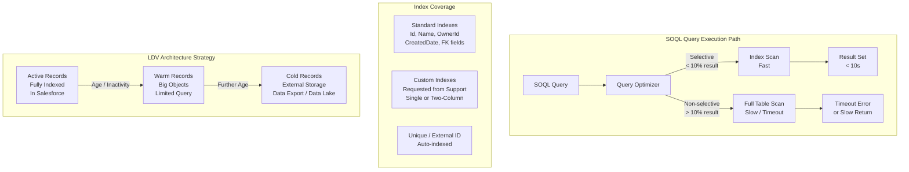

# Large Data Volumes Architecture

## Exam Domain
Large Data Volumes — 25% of exam weight

## Foundations

**What counts as "large" in Salesforce?** Salesforce begins to exhibit LDV behaviors at different thresholds depending on the object and query pattern. General guidelines:
- **100,000+ records** on a single object: monitor query performance and index usage
- **1,000,000+ records**: design queries carefully; standard reports may time out
- **10,000,000+ records**: requires architectural intervention (skinny tables, archiving, index strategy)
- **100,000,000+ records**: consider Big Objects or external archiving

But volume alone is not the problem. **Query pattern + index coverage** determines whether LDV causes issues. An unindexed field query on 500k records can time out. An indexed field query on 50M records can return in seconds.

**Why Salesforce architecture differs from traditional databases**: In a standard RDBMS, a DBA can add any index, partition tables, or tune the query planner. In Salesforce's multi-tenant architecture:
- Customers share underlying database resources
- Query execution is bounded by **governor limits** (10 seconds per synchronous query)
- Custom indexes must be **requested from Salesforce Support** (they are not self-service)
- The query optimizer is Salesforce-internal — you cannot run EXPLAIN PLAN
- Table partitioning is abstracted — you access it indirectly via skinny tables and index design

This means architects must design FOR the Salesforce query model, not try to impose traditional database tuning approaches onto it.

---

## Core Concepts

### The LDV Problem: Full Table Scans

A SOQL query becomes problematic when it triggers a **full table scan** — the database must read every record in the object to evaluate the WHERE clause. At 10M+ records, a full table scan almost always hits the 10-second query timeout.

A full table scan occurs when:
1. The WHERE clause fields are not indexed
2. The query is **non-selective** (filters out fewer than expected)
3. The query has no WHERE clause
4. The WHERE clause uses a non-filterable field (formula, long text area)

A query is **selective** when its filters narrow the result set to a small percentage of total records. Salesforce's internal threshold is approximately:
- If the result is < 10% of total records (or < 1M records for orgs with >1M records) → selective → uses index
- If the result is > 10% of total records → non-selective → likely full table scan

### Selectivity Thresholds

| Total Records | Selective Threshold |
|---|---|
| Up to 100,000 | < 10,000 records returned |
| 100,001 – 1,000,000 | < 10% of total |
| > 1,000,000 | < 10% or < 333,333 records, whichever is lower |

These thresholds are approximate — Salesforce's actual optimizer logic is more nuanced — but these numbers are what the exam tests.

### Index Types in Salesforce

**Standard Indexes** (automatic, no action required):
- Id (primary key)
- Name
- OwnerId
- CreatedDate
- SystemModstamp
- RecordTypeId
- Master-Detail and Lookup relationship fields (foreign keys)

**Custom Indexes** (must request from Salesforce Support):
- Created on any standard or custom field
- NOT available on: long text area, multi-select picklist, formula, encrypted fields
- Indexes have a **selectivity threshold** — if the query would return a non-selective result set (>10% of records), Salesforce may ignore the index even if it exists

**Unique Indexes**: Automatically created on fields marked as Unique or External ID. Duplicate detection at database level.

**Two-Column Indexes**: Salesforce Support can create compound indexes on two fields. Useful for queries that always filter on two fields together (e.g., Account + Status).

### The Selectivity Problem with Low-Cardinality Fields

A **low-cardinality field** has few distinct values (e.g., a Status field with 5 values, a Checkbox, a boolean). If 40% of records have `Status = 'Active'`, a query filtering on `Status = 'Active'` is non-selective — even with an index, Salesforce may skip it.

This is a critical LDV trap: you can have a custom index on a field, but if the query result set is too large, the index is bypassed.

Design implication: Compound queries (AND conditions on multiple fields) are more selective than single-field queries. Engineering queries to use multiple indexed fields AND-ed together improves selectivity.

### SOQL Governor Limits Relevant to LDV

| Limit | Synchronous | Asynchronous (Batch/Future) |
|---|---|---|
| Query rows returned | 50,000 | 50,000,000 |
| Query timeout | 10 seconds | 10 seconds per chunk |
| Total SOQL queries per transaction | 100 | 200 |
| CPU time | 10,000ms | 60,000ms |

**Batch Apex** is the standard pattern for processing LDV — it breaks the work into chunks of up to 200 records (default) or up to 2,000 (configurable), processing each chunk in a separate transaction.

### Large Data Sets and Reporting

Standard Salesforce reports:
- Time out at 10 minutes
- Return a maximum of 2,000 rows (with drill-down) or 2,000 rows in tabular report export
- Full report exports via Report Export API: 500,000 rows maximum

For LDV reporting:
- **Report Builder with filter optimization**: Ensure all report filters use indexed fields
- **CRM Analytics (Tableau CRM / Einstein Analytics)**: Extracts data to a separate analytical store, runs queries outside Salesforce's transactional limits
- **External BI Tools**: Salesforce Connect Sync, Data Export + external warehouse (Snowflake, Databricks)

### Search Architecture

Salesforce SOSL (Salesforce Object Search Language) uses a **search index** separate from the database. Search is eventually consistent — newly created or updated records may not appear in search results for up to 15 minutes. At LDV scale:
- Search index maintenance lags
- Search on large text fields is available via SOSL but not SOQL
- For highly specific lookups, SOQL with indexed fields outperforms SOSL

---

## PTA / SA Relevance

### When This Comes Up in Engagements

**Performance remediation**: The most common engagement where LDV comes up is when a customer complains about "Salesforce is slow." The root cause is almost always: non-selective queries, missing indexes, or full table scans on a high-volume object.

**Architecture design sessions**: For any customer with > 1M records on a core object, LDV planning must be part of the initial architecture. What is the expected 5-year record growth rate? Which queries will need to remain fast at that volume?

**Health check conversations**: Standard output of a Salesforce Health Check includes query performance analysis. Knowing how to interpret LDV-related query patterns adds significant value.

**AI quality discussions**: Einstein AI features (Next Best Action, predictions) run SOQL under the hood. Poorly indexed objects produce bad AI features — either timing out or returning biased training data. LDV architecture directly affects AI quality.

### Common Implementation Failures

1. **Reports built without filter analysis**: Business analysts create reports with no WHERE clause or with non-indexed filters. At 2M records, these reports time out. Mitigation: require all reports on high-volume objects to filter on an indexed field (Date range on CreatedDate is the easiest default).

2. **SOQL in loops**: The classic Apex anti-pattern: a loop that executes a SOQL query on each iteration. At 200 records in a batch, that's 200 SOQL queries — hits the 100-query limit. Every LDV Apex implementation must query outside loops and use Maps for lookups.

3. **DateTime vs. Date field on high-volume objects**: Queries on Date fields are more efficient than DateTime for date-range queries because DateTime requires timezone normalization. On LDV objects where date-range queries are frequent, prefer Date over DateTime fields.

4. **Missed ORDER BY index**: ORDER BY on a non-indexed field forces a sort of the full result set. At high volume, this is slow. Ensure ORDER BY fields on LDV queries are indexed.

5. **Under-estimating 5-year record growth**: An object with 100k records today will have 2M records in 3 years if the company grows at 50% annually. Design index and archiving strategy for projected volume, not current volume.

### Enterprise Architecture Patterns

**LDV Assessment Framework**: For any object with > 500k records, assess:
1. What is the selectivity profile of the top 10 queries run against this object?
2. Are all filter fields indexed? (Request custom index from Salesforce Support if not)
3. What is the projected 5-year record count?
4. What is the archiving strategy when records age beyond active use?
5. What is the reporting strategy? (Standard reports vs. CRM Analytics vs. external BI)

**Query Review Protocol**: Establish a query review process for development teams. Every new SOQL query on a high-volume object must be reviewed for: WHERE clause selectivity, index coverage, ORDER BY field indexing, and batch vs. synchronous context appropriateness.

---

## Architecture

**Limitations & Tradeoffs:**

- Custom index requests go to Salesforce Support (not self-service). Time to create: 24–72 hours. Plan ahead.
- A custom index on a low-cardinality field is often ignored by the query optimizer if the result set is non-selective. Index existence does not guarantee index use.
- Batch Apex is the standard LDV processing pattern but introduces asynchronous complexity — error handling, retry logic, monitoring are required.
- ORDER BY clauses on non-indexed fields in LDV contexts are very expensive — avoid unless the result set is already small.
- Salesforce's 50,000 record SOQL limit (synchronous) is a hard ceiling — you cannot get more records in a single synchronous query. Pagination and cursor-based iteration are required for full-object traversals.

---

## Key Facts to Memorize

- Selectivity threshold: approximately **< 10%** of total records (or <1M for large orgs)
- Standard indexes: Id, Name, OwnerId, CreatedDate, SystemModstamp, RecordTypeId, FK fields
- Custom indexes: **must request from Salesforce Support** (not self-service)
- Fields that CANNOT be indexed: formula, long text area, multi-select picklist, encrypted fields
- Synchronous SOQL limit: **50,000 rows** returned; **10 second** timeout
- Batch Apex: process up to **200 records** per chunk (configurable to 2,000)
- Async SOQL row limit: **50,000,000** rows
- Reports: max **2,000 rows** displayed; **500,000 rows** via export API
- Custom Index on two fields = **two-column index** (compound)
- LDV reporting recommendation: **CRM Analytics** for large-volume reporting

---

## Exam Traps

1. **"Which field can NOT have a custom index?"** — Formula fields, long text areas, multi-select picklists, encrypted fields. The exam tests this repeatedly.
2. **"A custom index exists but queries are still slow"** — The answer is selectivity — if the query returns > 10% of records, the index may be bypassed. Index existence ≠ index use.
3. **"How to get more than 50,000 records in Apex"** — Use Batch Apex (async) or SOQL for loops (which also have limits). You cannot bypass the 50k synchronous query row limit with a single query.
4. **"Standard reports on 5M records"** — They will time out. Recommend CRM Analytics or filtered reports on indexed fields.

---

## Practice Questions

**Q1.** An org has 15 million Account records. A report filtering on `Industry = 'Technology'` is timing out. Industry is a standard picklist on Account. What is the most likely root cause?

A) The report exceeds the 2,000 row display limit  
B) The Industry field is not indexed, and 25% of Accounts are Technology — the query is non-selective  
C) Reports cannot run on standard objects with more than 5 million records  
D) The report needs to be run in CRM Analytics instead

**Answer: B** — Industry is a low-cardinality field. If 25% of 15M records match the filter, the result is non-selective (>10%), so the query optimizer skips the index (if one exists) and does a full table scan. The root cause is non-selectivity, not the 2,000 row limit.

---

**Q2.** A developer needs to process all 5 million Opportunity records for a batch recalculation. They write a Batch Apex job with `Database.QueryLocator`. What is the maximum number of records that can be returned by the QueryLocator?

A) 50,000  
B) 2,000,000  
C) 50,000,000  
D) 500,000,000

**Answer: C** — `Database.QueryLocator` in Batch Apex can return up to 50 million records (the async SOQL limit). This is why Batch Apex + QueryLocator is the standard pattern for LDV processing.

---

**Q3.** A company requests a custom index on the `Status__c` field of a custom object that has 10 million records. After the index is created, query performance on `WHERE Status__c = 'Active'` does not improve. What is the most likely explanation?

A) Custom indexes are not supported on custom objects  
B) The index was not created correctly by Salesforce Support  
C) 60% of records have Status__c = 'Active' — the query is non-selective and the optimizer bypasses the index  
D) The Status__c field requires a two-column index to be effective

**Answer: C** — A query that returns 60% of 10M records (6M records) is highly non-selective. The query optimizer determines it is more efficient to do a full table scan than to use the index, so the index is bypassed. The fix is to add additional filter criteria to make the query more selective.
