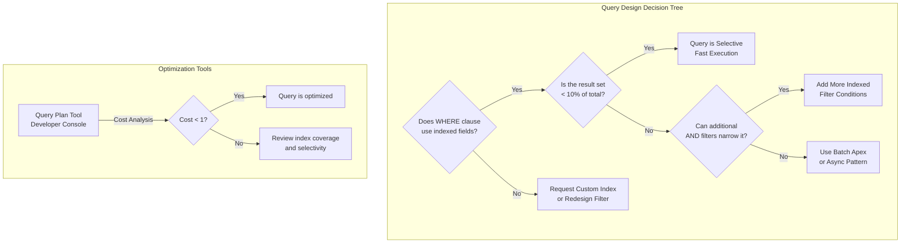

# SOQL Query Optimization

## Exam Domain
Large Data Volumes — 25% of exam weight

## Foundations

**What is SOQL?** Salesforce Object Query Language is the SQL-like language used to retrieve records from Salesforce. Unlike SQL, SOQL:
- Has no JOIN keyword (relationships are traversed via dot notation or sub-queries)
- Cannot do cross-object aggregations freely (sub-query result set limits apply)
- Does not have an exposed query planner (you cannot run EXPLAIN)
- Is subject to governor limits per transaction
- Can query at most one primary object per query (plus its relationships)

**Why query optimization matters architecturally**: Slow queries in Salesforce are not just a developer problem — they cascade into business problems. An Apex trigger that runs a slow SOQL query affects every user who creates or updates that record. An unoptimized report query blocks the reporting infrastructure. Integration callouts that query Salesforce with inefficient SOQL consume API limits and degrade response times.

An architect's job is to design systems where queries are fast by construction — choosing the right indexes, structuring WHERE clauses correctly, and using asynchronous patterns where synchronous queries will fail at volume.

---

## Core Concepts

### SOQL Query Structure Best Practices

**Selective WHERE clauses**: Always filter on indexed fields. The most reliable indexed field is always `Id`. Secondary: indexed custom fields, standard FK fields (OwnerId, AccountId), `CreatedDate`.

```sql
-- BAD: No WHERE clause — full table scan on any large object
SELECT Id, Name FROM Account

-- BAD: Non-indexed long text area field
SELECT Id FROM Case WHERE Description LIKE '%billing issue%'

-- GOOD: Indexed field with selective filter
SELECT Id, Name FROM Account WHERE CreatedDate >= LAST_N_DAYS:30

-- GOOD: Compound selective filter using multiple indexed fields
SELECT Id FROM Opportunity WHERE AccountId = :acctId AND StageName = 'Closed Won'
```

**NULL comparisons**: Queries using `WHERE Field__c = null` or `WHERE Field__c != null` are often non-selective and can trigger full table scans. Null checks work better when combined with other indexed field filters.

**NOT / != operators**: These are generally non-selective. `WHERE Status__c != 'Closed'` returns almost everything — non-selective. Prefer positive filters when possible.

**OR conditions**: OR conditions can reduce selectivity. If either side of an OR matches most records, the combined result is non-selective. Use AND to narrow results.

**LIKE operator**: SOQL `LIKE 'prefix%'` (leading wildcard anchor) can use an index. `LIKE '%suffix'` or `LIKE '%middle%'` (leading wildcard) cannot use indexes — always a full scan.

### Query Optimization Patterns

**Pattern 1: Date Filtering**
Always use date literals or specific date ranges on `CreatedDate` or `LastModifiedDate` as a primary filter on high-volume objects:
```sql
SELECT Id FROM Case WHERE CreatedDate = THIS_MONTH AND Status = 'Open'
```
`CreatedDate` is a standard indexed field. This query is selective.

**Pattern 2: ID-Based Iteration**
For processing large sets, iterate by ID range:
```sql
SELECT Id FROM Account WHERE Id > :lastProcessedId ORDER BY Id LIMIT 200
```
Using `ORDER BY Id` ensures consistent ordering. `Id` is always indexed.

**Pattern 3: Indexed Lookup First**
When you need records related to a parent, query the parent first, then use the parent ID as a filter:
```sql
-- Get Account IDs first (assuming selective filter on Account)
List<Account> accounts = [SELECT Id FROM Account WHERE Industry = 'Technology' AND CreatedDate = THIS_YEAR];

-- Then query related Opportunities using those IDs
List<Opportunity> opps = [SELECT Id FROM Opportunity WHERE AccountId IN :accountIds];
```

**Pattern 4: Avoid SOQL in Loops**
The single most common Apex LDV anti-pattern:
```apex
// WRONG: SOQL inside loop = N queries
for (Contact c : contacts) {
    Account a = [SELECT Id, Name FROM Account WHERE Id = :c.AccountId]; // N queries!
}

// CORRECT: One query, Map lookup
Map<Id, Account> accountMap = new Map<Id, Account>(
    [SELECT Id, Name FROM Account WHERE Id IN :accountIds]
);
for (Contact c : contacts) {
    Account a = accountMap.get(c.AccountId); // Map lookup, no query
}
```

**Pattern 5: Query Only Needed Fields**
SELECT * does not exist in SOQL — but selecting all fields via Apex using `getSObjectType().getDescribe()` patterns effectively fetches all fields. Every unnecessary field:
- Increases heap consumption (contributing to heap limit errors)
- Increases network transfer time
- May traverse relationships unnecessarily

Always query only the fields your code uses.

### SOQL Aggregate Functions and LDV

Aggregate SOQL (`COUNT()`, `SUM()`, `MAX()`, `MIN()`, `AVG()`, `GROUP BY`) has different performance characteristics:
- Aggregates run on the database tier — they are generally efficient
- But: `GROUP BY` on non-indexed fields with large result sets is slow
- `COUNT()` without a WHERE clause on a large object is slow
- `COUNT()` with a selective WHERE clause is fast

**Aggregate query limits**:
- Max 2,000 rows returned from an aggregate query
- `GROUP BY ROLLUP` and `GROUP BY CUBE` are available for multi-dimensional aggregation

### Semi-joins and Anti-joins

```sql
-- Semi-join: Accounts that have Opportunities (subquery = Accounts WITH related Opps)
SELECT Id FROM Account WHERE Id IN (SELECT AccountId FROM Opportunity WHERE StageName = 'Closed Won')

-- Anti-join: Accounts with NO Opportunities
SELECT Id FROM Account WHERE Id NOT IN (SELECT AccountId FROM Opportunity)
```

**Selectivity of semi-joins**: The inner query result must be selective (< 2,000 records typically) for the semi-join to be efficient. An inner query returning 500,000 IDs is a performance problem.

**NOT IN anti-join risk**: `NOT IN` with a large inner query result set is very expensive. Avoid on LDV objects.

### Query Plan Tool

Available in the Developer Console, the **Query Plan** tool shows how Salesforce will execute a SOQL query before you run it:
- **Leading Operation Type**: `Index` (good) vs `TableScan` (bad)
- **Relative Cost**: Lower is better. Cost < 1 is generally acceptable. Cost > 1 suggests a full table scan risk.
- **Notes**: Explains why an index was or was not used.

Using Query Plan should be part of every LDV query design review.

### SOSL vs SOQL: When to Use Which

| Criterion | SOQL | SOSL |
|---|---|---|
| Known field to filter on | Yes | No |
| Full-text / keyword search | No | Yes |
| Single object | Yes | Can span multiple objects |
| Indexed field queries | Yes (fast) | N/A |
| Eventually consistent | No | Yes (up to 15 min lag) |
| LDV performance | Depends on index | Separate search index |

Use SOSL for: search bars, text matching across multiple objects, keyword-based lookups.
Use SOQL for: all data retrieval with known filter criteria.

---

## PTA / SA Relevance

### When This Comes Up in Engagements

**Performance triage**: When a customer reports "Salesforce is slow," the first diagnostic is: identify the offending queries. Tools: Setup → Apex Jobs (for async limits), Developer Console Query Plan, and Salesforce's Query Analyzer in Optimizer.

**Code review**: Part of any architecture review of custom Apex code should be a SOQL review — are queries in loops? Are WHERE clauses selective? Are only necessary fields selected?

**Integration design**: Integration developers often write broad SOQL queries to pull large data sets. "Give me all Accounts" at 2M records is a performance and API limit problem. Integration query patterns must be reviewed with the same rigor as transactional queries.

### Common Implementation Failures

1. **Scheduled Apex with full-object queries**: A nightly job queries all Accounts without a date filter. After 3 years, the org has 2M Accounts and the scheduled job times out every night. Fix: add `WHERE LastModifiedDate >= YESTERDAY` or similar incremental filter.

2. **Report filter on formula field**: A business analyst creates a report filtering on a formula field that calculates Account health. At 5M records, this report never completes. Fix: store the calculated value in a stored field (updated by automation) and filter on that.

3. **Integration polling with timestamp drift**: An integration polls Salesforce every 5 minutes using `WHERE SystemModstamp >= :lastPollTime`. If the poll time drifts or the integration is delayed, a gap or overlap occurs. Design: use Change Data Capture instead of polling for event-driven integration.

4. **Aggregate queries on unindexed GROUP BY fields**: A custom analytics report groups by a custom text field (not indexed). At 3M records, GROUP BY takes 8+ seconds. Fix: either add a custom index on the GROUP BY field or pre-aggregate with a roll-up summary field.

### Enterprise Architecture Patterns

**Query Registry**: In large implementations, maintain a documented registry of all production SOQL queries (from Apex triggers, classes, and integrations) with their selectivity analysis and index coverage. Review the registry quarterly against object volume growth.

**Index Request Pipeline**: Create a formal process for requesting custom indexes from Salesforce Support. Include: query justification, selectivity analysis, expected performance improvement. Salesforce Support requires business justification for custom index requests.

**Async-by-Default LDV Processing**: For any processing on objects with > 500k records, the default pattern should be async (Batch Apex or Queueable Apex). Synchronous Apex should be the exception, not the rule.

---

## Architecture



**Limitations & Tradeoffs:**

- Query Plan Tool is available in Developer Console but not in production (read-only orgs). For production query analysis, use Salesforce Optimizer or engage Salesforce Support.
- LIKE with leading wildcard (`LIKE '%keyword%'`) will never use an index — this is by design. Full-text search belongs in SOSL, not SOQL.
- Aggregate queries return a maximum of 2,000 rows. For large GROUP BY result sets, pre-aggregation with roll-up summaries or external BI is required.
- Query Plan costs are relative, not absolute — a cost of 0.5 on a 1M record object may still return in 5+ seconds depending on network and org load.

---

## Key Facts to Memorize

- LIKE with **leading wildcard** (`%keyword`) = always full table scan
- LIKE with **trailing wildcard** (`keyword%`) = can use index
- `NOT IN` anti-join with large inner query = expensive
- Query Plan cost **< 1** = selective, **> 1** = full table scan risk
- Aggregate queries: max **2,000 rows** returned
- SOSL: eventually consistent, up to **15 minutes** lag for new/updated records
- `Database.QueryLocator` in Batch Apex: up to **50 million** records
- Semi-join inner query: effective when result set is **< 2,000 records**
- SOQL in loops: **always a bug** in LDV contexts — use Maps and bulk query patterns
- `ORDER BY` on non-indexed fields at LDV scale: very slow — ensure ORDER BY fields are indexed

---

## Exam Traps

1. **"LIKE '%keyword%'"** — This cannot use an index. If the question asks about optimizing a LIKE query with leading wildcards, the answer involves SOSL or redesigning the filter, not adding an index.
2. **"SELECT all fields from a 5M record object in a trigger"** — Even if the query itself has a selective WHERE clause, selecting all fields causes heap size governor limit errors. Always select only needed fields.
3. **"Query Plan cost"** — Cost < 1 is good. The exam may present scenarios where a custom index exists but cost is still > 1 (because the query returns > 10% of records). Know that index existence ≠ index use.
4. **"SOSL vs. SOQL for keyword search"** — SOSL is for text/keyword search. SOQL is for field-value queries. Never use SOQL LIKE with leading wildcards when SOSL is the correct answer.

---

## Practice Questions

**Q1.** A developer has the following SOQL query in a trigger on the Contact object:
`SELECT Id, AccountId FROM Account WHERE Industry LIKE '%tech%'`
An architect reviews this query. What are the TWO problems?

A) LIKE with a leading wildcard cannot use an index — always a full table scan  
B) The query is in a trigger but does not filter on a relevant field to the trigger context  
C) Industry is a required field so LIKE will always return results  
D) LIKE is not valid syntax in SOQL

A and B — Leading wildcard LIKE is always a full table scan. Also, querying ALL Accounts with Industry containing 'tech' from a Contact trigger is unrelated to the trigger context and likely non-selective.

---

**Q2.** A nightly Batch Apex job processes all Opportunity records without a WHERE clause filter. The org has 3 million Opportunities. The job is failing with query timeout errors. What is the recommended fix?

A) Increase the Batch Apex chunk size to 2,000  
B) Add a `WHERE CreatedDate >= LAST_N_YEARS:3` filter to make the query selective  
C) Migrate the Batch Apex to a scheduled Flow  
D) Request a custom index on the Opportunity object from Salesforce Support

**Answer: B** — Adding a date filter on the indexed `CreatedDate` field makes the query selective and dramatically reduces the records processed. Increasing chunk size (A) processes more records per chunk but doesn't help with the initial query timeout. Flows (C) have lower limits than Batch Apex.

---

**Q3.** A report filters Accounts by `Tier__c = 'Enterprise'` where `Tier__c` is a custom formula field that calculates tier based on Annual Revenue. The report times out at 2M records. What is the correct architectural fix?

A) Request a custom index on the formula field  
B) Create a stored custom field `Tier_Stored__c`, populate it via a Flow trigger on Account save, and filter the report on the stored field  
C) Use SOSL instead of SOQL for the report  
D) Increase the report row limit

**Answer: B** — Formula fields cannot be indexed. The architectural fix is to materialize the formula's result into a stored, indexable field. Flows (or a trigger) keep the stored field in sync. Reports then filter on the indexed stored field. Answer A is wrong — formula fields cannot have custom indexes.
