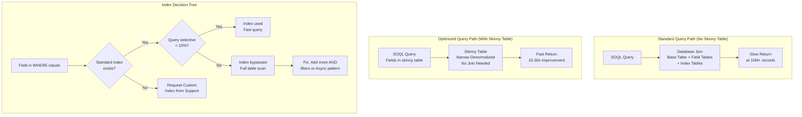

# Skinny Tables and Indexes

## Exam Domain
Large Data Volumes — 25% of exam weight

## Foundations

**What is a skinny table?** In Salesforce's underlying database architecture, an object's data is stored across multiple database tables — the base table for the object's data, plus additional tables for long text fields, formula caching, etc. When you query a Salesforce object, the database must join these tables together to return results. At tens of millions of records, these joins are expensive.

A **skinny table** is a Salesforce-internal optimization where a subset of frequently-queried fields from an object are copied into a narrow, denormalized table. Queries that filter on fields present in the skinny table read from this narrow table instead of joining the full object tables. This can dramatically improve query performance — often by 10–30x for the right queries.

**Critical fact for the exam**: Skinny tables are **created and managed by Salesforce, not by customers or administrators**. You cannot configure a skinny table yourself. You must request one through Salesforce Support, and Salesforce determines whether one is appropriate.

---

## Core Concepts

### Skinny Table Architecture

A skinny table contains:
- A subset of the object's fields (typically the fields used most frequently in WHERE clauses and SELECT lists)
- The skinny table is kept in sync with the base object automatically
- When data is written to the base object, the skinny table is updated synchronously

Because the skinny table is a narrow, denormalized table, queries against it:
- Avoid expensive joins to other internal tables
- Use less I/O
- Return results faster

**What goes into a skinny table**: Typically 10–30 fields that are most frequently queried. The field selection is determined by Salesforce Support based on the customer's query patterns.

**What cannot go into a skinny table**: Long text area fields, binary fields (Blob), formula fields, relationship fields (but the foreign key ID can be included).

### When to Request a Skinny Table

Criteria that justify a skinny table request:
1. Object has > 10 million records
2. Queries consistently time out even with proper indexing
3. The same small set of fields is used in most queries against this object
4. The object is heavily queried in transactional contexts (not just reports)

**Skinny table limitations**:
- They are not available in **sandbox orgs** by default (available in production; sandbox must be requested separately)
- They do not persist during sandbox refresh — you must re-request after each full sandbox refresh
- Skinny tables are a last resort after proper index strategy has been implemented
- Not all objects qualify — Salesforce evaluates the business case

### Index Deep Dive

**Standard Indexes**: Every Salesforce object has these indexes created automatically:

| Field | Index Type | Notes |
|---|---|---|
| Id | Primary key (unique) | Fastest possible query |
| Name | Standard index | Can be indexed for text prefix queries |
| OwnerId | Standard index | Ownership-based queries |
| CreatedDate | Standard index | Date range queries |
| SystemModstamp | Standard index | Replication, change queries |
| RecordTypeId | Standard index | Record Type filtering |
| Master-Detail FK | Standard index | Automatic on MD relationships |
| Lookup FK | Standard index | Automatic on Lookup relationships |

**Custom Indexes**: Requested through Salesforce Support. Key constraints:
- **Cannot index**: Formula fields, long text area, multi-select picklist, encrypted fields, some system fields
- **Maximum custom indexes per object**: There is no hard published limit, but practical limits exist — too many indexes slow write operations (every write must update all indexes)
- **Two-column (compound) indexes**: Available — most useful when queries always filter on the same two fields together
- **Index selectivity is evaluated at query time** — an index may exist but be bypassed if the query optimizer determines the result set is non-selective (>10% of records)

### Write Amplification Problem

Every index adds overhead to write operations. For every insert, update, or delete:
- The base table is updated
- Every index on that object is updated

This means objects with many indexes have slower write performance. On high-write-volume objects:
- Request only indexes that are genuinely used in queries
- Evaluate whether indexes on low-cardinality fields are providing any benefit
- Work with Salesforce Support to remove unused custom indexes

### Compound Index Use Cases

**Single field index**: `WHERE Status__c = 'Active'`
If Status is low cardinality (few values), the index may be bypassed when most records have `Status = 'Active'`.

**Compound index on (Status__c, Account_Region__c)**:
`WHERE Status__c = 'Active' AND Account_Region__c = 'West'`
The combination of two fields may be far more selective than either alone. A compound index serves this query efficiently.

**Compound index on (AccountId, Status__c)**:
`WHERE AccountId = :id AND Status__c = 'Active'`
This is a very common query pattern — get the active cases for an Account. AccountId is already indexed (FK), but adding Status as the second column of a compound index greatly improves queries that always filter both.

### Division Indexes

For orgs using Salesforce Divisions (a multi-business-unit feature), records can be filtered by Division. Salesforce creates Division indexes automatically. If Divisions are used, queries should include Division in the WHERE clause to improve selectivity.

### Index Architecture for Common Object Patterns

**High-volume transactional object** (e.g., Log__c, Event__c with 50M+ records):
- Index: CreatedDate (standard), Status__c (custom), ProcessedDate__c (custom)
- Design queries to always filter on CreatedDate range PLUS one other indexed field
- Consider skinny table if queries span many fields

**Account/Contact (MDM objects with 5M+ records)**:
- Index: ExternalId__c (automatic — External ID field), Industry (if heavily filtered), Rating (if heavily filtered)
- Two-column index: (AccountId, Status__c) for Contact queries that filter by parent Account and status

**Opportunity (pipeline tracking)**:
- Index: CloseDate (standard), StageName (custom if heavily filtered), Amount range queries
- Two-column: (AccountId, StageName) for account-level pipeline queries

---

## PTA / SA Relevance

### When This Comes Up in Engagements

**Performance escalations**: A customer calls in with "Salesforce is unresponsive, queries timing out." After verifying index coverage and query selectivity, if a skinny table is warranted, the process is to engage Salesforce Support with a formal request including the object, volume, and specific query patterns.

**Large account pre-sales**: For enterprise customers with stated data volumes > 10M records on key objects, proactively discussing the skinny table and custom index strategy sets architect-level expectations before the project starts.

**ISV partner reviews**: ISV applications that query large data sets need custom index recommendations documented in their installation guide. Good ISV partners proactively request relevant custom indexes during Customer Success Manager onboarding.

### Common Implementation Failures

1. **Requesting skinny tables before fixing selectivity**: Teams request a skinny table when the real problem is non-selective queries. Salesforce Support will often identify this and recommend query redesign instead. Fix selectivity first, then evaluate whether a skinny table is still needed.

2. **Skinny table not requested for sandbox**: After a full sandbox refresh, the skinny table is gone. Performance testing in sandbox is inaccurate without it. Teams discover this difference between sandbox and production performance at go-live.

3. **Over-indexing write-heavy objects**: An integration object that receives millions of updates per day has 8 custom indexes. Every write must update 8 indexes. Throughput degrades significantly. Audit and remove unused indexes on high-write objects.

4. **Assuming standard index on all standard fields**: Not all standard fields are indexed. Only the fields listed in the standard index table (Id, Name, OwnerId, CreatedDate, SystemModstamp, RecordTypeId, FK fields) have standard indexes. `Phone`, `Email`, `Description`, `BillingCity` — these are NOT indexed by default.

### Enterprise Architecture Patterns

**Index Strategy Document**: For any LDV object, maintain a document that lists: current indexes (standard + custom), the top 10 SOQL queries that use this object, selectivity analysis of each query, and a skinny table status (requested? active? fields included?). This becomes the reference document for Salesforce Support conversations and ongoing performance monitoring.

**Performance SLA Monitoring**: Set alerting on query performance metrics (available via Salesforce Optimizer and Event Monitoring). When query response times creep above thresholds, investigate before users complain.

---

## Architecture

**Limitations & Tradeoffs:**

- Skinny tables only help queries that retrieve fields included in the skinny table. A query that selects fields NOT in the skinny table still hits the full base table.
- Skinny table maintenance (keeping it in sync with the base table) adds minimal write latency — generally acceptable.
- Custom indexes on high-write-volume objects add measurable write overhead. Balance read performance gains against write performance cost.
- Sandbox skinny tables require a separate request and must be re-requested after sandbox refresh. This creates a gap between sandbox and production performance characteristics.
- Index selectivity threshold is evaluated dynamically — statistics about field value distribution affect whether the optimizer uses an index. After major data loads that change value distribution, previously selective queries may become non-selective.

---

## Key Facts to Memorize

- Skinny tables: **created by Salesforce Support** — not self-service
- Skinny tables: **not available in sandbox** by default; must be separately requested
- Skinny tables: reset on **full sandbox refresh**
- Custom index: requested via **Salesforce Support** case
- Fields that **cannot be indexed**: formula, long text area, multi-select picklist, encrypted fields
- Two-column compound index: useful for queries that **always filter on both fields together**
- More indexes = **slower writes** (each write updates all indexes)
- Standard indexed fields: Id, Name, OwnerId, CreatedDate, SystemModstamp, RecordTypeId, FK fields
- Phone, Email, BillingCity are **NOT** indexed by default
- Skinny table contents: **subset of fields**, max ~30 fields, no long text, no formulas

---

## Exam Traps

1. **"How do you create a skinny table?"** — You cannot. Skinny tables are created by Salesforce Support upon request. The customer/admin cannot configure them.
2. **"Custom indexes are self-service"** — False. They require a Salesforce Support request.
3. **"BillingCity is indexed on Account"** — It is NOT a standard indexed field. Only the standard fields listed above are automatically indexed.
4. **"Skinny table available in sandbox"** — Not by default. This requires a separate request and is reset on sandbox refresh.
5. **"Adding more indexes always improves performance"** — False for write-heavy objects. More indexes slow write operations. Index strategy requires balancing read and write performance needs.

---

## Practice Questions

**Q1.** A company has 20 million Account records. Queries filtering on `BillingState` are consistently timing out. What is the recommended architectural approach?

A) Request a skinny table from Salesforce Support immediately  
B) Request a custom index on BillingState from Salesforce Support and verify query selectivity  
C) BillingState is a standard indexed field — query optimization is not needed  
D) Migrate Account records to a Big Object which supports better indexing

**Answer: B** — BillingState is NOT a standard indexed field. Requesting a custom index is the first step. Before requesting a skinny table, verify that the custom index provides sufficient improvement. A is premature. C is incorrect — BillingState is not in the standard index list. D is wrong — Big Objects are not a replacement for standard objects.

---

**Q2.** After a full sandbox refresh, an application team reports that queries which performed well in the previous sandbox refresh are now slow. What is the most likely cause?

A) The sandbox does not have production data  
B) Skinny tables and custom indexes may have been reset during the sandbox refresh  
C) Sandbox orgs have lower query limits than production  
D) The data volume in sandbox exceeds the 10,000 record sandbox limit

**Answer: B** — Custom indexes and skinny tables do not automatically persist through a full sandbox refresh. They must be re-requested from Salesforce Support for the new sandbox. A is possible but is not the cause of previously-fast queries becoming slow.

---

**Q3.** An architect is reviewing a custom object with 15 million records that has 12 custom indexes. The integration team reports that bulk upsert operations are taking 3x longer than expected. What should the architect investigate first?

A) Whether the API version used is outdated  
B) Whether any of the 12 custom indexes are unused and can be removed to reduce write overhead  
C) Whether the upsert External ID field has a standard index  
D) Whether the custom object should be migrated to a standard object

**Answer: B** — Each index adds overhead to every write operation. At 12 custom indexes plus standard indexes, write amplification is significant. Reviewing and removing unused indexes is the first step. External ID fields (C) are automatically indexed — that is already handled.
