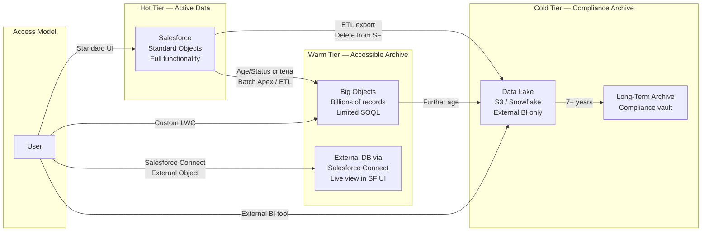

# Archiving Strategies

## Exam Domain
Large Data Volumes — 25% of exam weight

## Foundations

**Why archive?** Salesforce storage costs money. More importantly, records that accumulate indefinitely degrade query and report performance, slow page loads, and make MDM harder. Archiving is the process of moving data out of the "active" tier of Salesforce storage into a lower-cost, lower-access tier.

**The data temperature model** — a fundamental framework for storage architecture:
- **Hot data**: Actively used, frequently queried, needs full Salesforce functionality (workflows, reports, page layouts). Stored in standard Salesforce objects.
- **Warm data**: Infrequently accessed but may need to be retrieved occasionally. May need limited query capability. Stored in Big Objects or external systems with a Salesforce Connect link.
- **Cold data**: Compliance/audit retention only. Rarely or never accessed through Salesforce UI. Stored in external data stores (data lake, long-term archive).

The architect's job is to define the criteria for each tier (when does a record move from hot to warm to cold?) and the access model for each tier.

---

## Core Concepts

### Big Objects

**Big Objects** are a Salesforce storage tier designed for billions of records. They differ fundamentally from standard and custom objects:

| Feature | Standard/Custom Object | Big Object |
|---|---|---|
| Record volume | Millions (practical limit) | Billions |
| Storage cost | Standard Salesforce storage | Separate archive storage |
| SOQL support | Full WHERE clause | Only indexed fields in WHERE |
| Report support | Native report builder | No (external BI required) |
| Trigger support | Yes | No |
| Page layout | Yes | No (API only) |
| Workflow/Flow | Yes | No |
| Insert method | DML | `insertImmediate` (Apex) |
| Update support | No | Records are immutable once written |
| Delete support | No | Cannot delete individual records |

**Big Object Index**: Instead of traditional indexes, Big Objects use a **compound index** defined at object creation time. The compound index specifies which fields and in what order they define the sort key. Queries on a Big Object MUST use the index fields in the defined order (left-most prefix rule).

Example: If the compound index is `(Account__c, EventDate__c, EventType__c)`, valid queries:
- `WHERE Account__c = :id` ✓
- `WHERE Account__c = :id AND EventDate__c >= :date` ✓
- `WHERE Account__c = :id AND EventDate__c >= :date AND EventType__c = 'Login'` ✓
- `WHERE EventDate__c >= :date` ✗ (skips the left-most index field)
- `WHERE EventType__c = 'Login'` ✗ (skips two left-most fields)

**Big Object limitations**:
- Index definition is permanent — cannot add or remove index fields after records exist
- Cannot query with `ORDER BY` on non-index fields
- Cannot join Big Objects to standard/custom objects in a single SOQL query
- No native UI for displaying Big Object records — requires custom Visualforce or LWC
- No aggregate SOQL on Big Objects

### Salesforce Native Archiving

Salesforce provides a native **Data Archive** feature (available as an add-on, based on Big Objects). This provides:
- Archival rules that automatically move records from standard objects to Big Objects based on defined criteria (age, status, etc.)
- A searchable archive interface
- Configurable retention policies

Limitation: Native Data Archive is a paid add-on and is object-specific. Not all objects support it equally.

### External Archiving Patterns

For cold data, external archiving moves data out of Salesforce entirely:

**Pattern 1: Data Export + External Data Lake**
1. Salesforce Data Export (scheduled weekly/monthly) exports data to CSV
2. CSV is loaded to S3, Azure Blob Storage, or a data lake (Snowflake, Databricks)
3. Records are deleted from Salesforce after confirmation of external storage
4. External BI tools (Tableau, Power BI) query the data lake for historical reporting

**Pattern 2: ETL-Based Archival**
1. An ETL tool (MuleSoft, Informatica, Talend) reads records from Salesforce based on archival criteria
2. Records are written to the external data store
3. ETL deletes records from Salesforce
4. Salesforce Connect External Object provides a read-only view of archived data if occasional lookback is needed

**Pattern 3: Salesforce Connect for Warm Archive**
1. Active records in Salesforce
2. Archived records in an external database (RDS, Snowflake)
3. Salesforce Connect External Object provides a live view of archived records in the Salesforce UI
4. Users can see archived data without it consuming Salesforce storage

### Archival Sequence and Considerations

Before deleting records from Salesforce:
1. Verify all related child records are handled (cascade delete or re-parent)
2. Verify all integration dependencies (no active integrations that reference the to-be-deleted records)
3. Verify reporting completeness (all needed reports run before deletion)
4. Verify compliance with retention policies (do NOT delete records that must be retained for regulatory reasons)
5. Confirm backup exists in external store BEFORE deletion

**Recycle Bin**: Deleted records go to the Recycle Bin for 15 days. For hard delete, use the Bulk API with `hardDelete` option. Recycle Bin storage counts against storage limits.

### Field History Tracking and Archiving

Field History Tracking retains audit history for 18 months natively. Beyond 18 months:
- Data is purged by Salesforce automatically
- For longer retention, use the **Field History Tracking Archive** (requires purchase) or export history records via API before purge date

The `FieldHistoryArchive__b` Big Object stores archived field history when the Field History Archive feature is enabled.

### Data Retention Policy Design

A formal data retention policy must specify:
1. **Retention period per object**: How long records stay in active Salesforce (hot tier)
2. **Archive criteria**: What triggers archival (age, status, combination)
3. **Archive destination**: Big Object, external store, or delete
4. **Access model for archived data**: How do users or integrations access archived records?
5. **Legal hold exemptions**: Some records cannot be deleted regardless of policy (litigation hold)
6. **Purge confirmation process**: Who approves bulk deletion?

---

## PTA / SA Relevance

### When This Comes Up in Engagements

**Storage cost conversations**: Salesforce storage is one of the most common budget escalations in large orgs. When a customer's storage is at 80%+ capacity, an archiving strategy becomes a cost avoidance conversation.

**Compliance and legal discussions**: Highly regulated industries (financial services, healthcare, government) have retention requirements. FINRA requires trade records for 7 years. HIPAA requires medical records for 6 years minimum. The archiving strategy must align with these requirements before any data is deleted.

**Performance remediation**: High-volume objects with multi-year data accumulation are a primary cause of LDV performance issues. Archiving 3-year-old inactive records often resolves query timeout issues without any index changes.

**AI quality discussions**: AI models trained on all data (including stale, inactive records) produce lower-quality predictions than models trained on recent, relevant data. Archiving old records off the active tier improves AI feature quality. This is a compelling business case for archiving programs.

### Common Implementation Failures

1. **Archiving without child record strategy**: An Account is archived to an external system, but its related Contacts, Opportunities, and Cases remain in Salesforce with a null AccountId lookup. This creates orphaned records that break reporting and integration. Always design child record handling before archiving parent records.

2. **No access model for archived data**: After archiving, users ask "where did that record go?" If there is no way to look up archived records, the business loses access to important historical data. Always define a post-archive access model before executing the archival program.

3. **Deleting before verifying external copy**: A team deletes records from Salesforce before confirming the ETL job successfully loaded them to the external store. Data is lost permanently. Design rule: delete after write-verification, not before.

4. **Big Object index locked in wrong design**: A Big Object's compound index is designed for one query pattern. Later, users need to query by a different field combination. Because Big Object index is immutable, a new Big Object must be created and data re-migrated. Design the index based on ALL expected query patterns.

5. **Field History Tracking purge surprise**: A customer learns 18 months after go-live that their field history is being purged by Salesforce because no archiving was configured. The audit trail for the first 18 months is lost. Field History Archive must be configured before the first records are purged.

### Enterprise Architecture Patterns

**Hot/Warm/Cold Tiering Policy**:
- Hot (Salesforce Standard Objects): records active within past 2 years
- Warm (Big Objects / Salesforce Connect to near-line storage): 2–7 years; accessible via custom UI
- Cold (External Data Lake): 7+ years or per regulatory retention; accessible via external BI only

**Archival as a Quarterly Process**: Define a quarterly archival run that moves records meeting the criteria from hot to warm or warm to cold. This prevents storage accumulation and keeps active data volumes manageable.

**Legal Hold System**: Maintain a Legal Hold object in Salesforce that flags records exempt from archival. Integrate the archival process with the legal hold check — records on legal hold are never archived regardless of age.

---

## Architecture

**Limitations & Tradeoffs:**

- Big Objects: immutable index definition. The compound index cannot be modified after records are written. Getting the index design right the first time is critical.
- Big Objects have no triggers, no workflow, no flows — they are pure storage. Any processing logic must be in the consuming application.
- Salesforce Connect (External Objects) adds API overhead for every record view — the external database is queried live. Not suitable for high-frequency access patterns.
- Data Export (free Salesforce tool) exports to CSV only, weekly or monthly. Not suitable for real-time or daily archival needs — use ETL for that.
- Archiving parent records while leaving orphaned child records in Salesforce creates data integrity problems. Always archive or re-parent children before archiving parents.

---

## Key Facts to Memorize

- Big Objects: designed for **billions of records**
- Big Object records are **immutable** — cannot be updated or deleted individually
- Big Object inserts: use `insertImmediate()` Apex method, NOT standard DML
- Big Object compound index: defined at creation, **cannot be changed**
- Big Object query: must use **left-most prefix** of index fields in WHERE clause
- Recycle Bin: records remain **15 days** before permanent deletion
- Field History Tracking retention: **18 months** natively; requires add-on for longer
- Hard delete via API: Bulk API `hardDelete` option bypasses Recycle Bin
- Salesforce Connect: queries external system **live** — not a copy of data
- Archival sequence: archive children before parents to avoid orphaned child records

---

## Exam Traps

1. **"How to update a Big Object record"** — You cannot update individual Big Object records. To "update," you must insert a new record with the revised values. Immutability is by design.
2. **"Query Big Object WHERE EventType__c = 'Login'"** when the index is (Account__c, EventDate__c, EventType__c) — This is invalid because it skips the left-most index fields. The left-most prefix rule must be respected.
3. **"How long does Salesforce retain field history natively?"** — 18 months. Beyond that requires Field History Archive add-on or external export.
4. **"Salesforce Connect is used for archiving"** — Salesforce Connect is for **live access** to external data, not for archiving. Archiving moves data to external storage and (optionally) provides a Connect view for lookback access.

---

## Practice Questions

**Q1.** A Big Object has a compound index defined as `(Customer_Id__c, Transaction_Date__c, Transaction_Type__c)`. A developer writes the query: `SELECT Id FROM Transaction__b WHERE Transaction_Type__c = 'Purchase'`. What happens?

A) The query returns all Purchase records using the Transaction_Type__c index  
B) The query fails — it violates the left-most prefix rule of the Big Object compound index  
C) The query performs a full table scan and returns all Purchase records slowly  
D) Big Object queries do not support WHERE clauses

**Answer: B** — Big Object queries must use the compound index fields in left-to-right order. Skipping `Customer_Id__c` and `Transaction_Date__c` and querying only `Transaction_Type__c` violates the left-most prefix rule and the query will fail.

---

**Q2.** A company wants to archive all Opportunity records older than 5 years to reduce storage costs while maintaining the ability for sales managers to occasionally look up old deal details. Which approach is most appropriate?

A) Delete all Opportunities older than 5 years and use Recycle Bin for lookback  
B) Move Opportunities to a Big Object and provide a custom LWC for lookback queries  
C) Export Opportunities to an external database and use Salesforce Connect with an External Object for occasional lookback in the Salesforce UI  
D) Leave Opportunities in Salesforce and set Field History Tracking to archive them

**Answer: C** — Salesforce Connect with an External Object allows users to look up archived records through the Salesforce UI without the data consuming Salesforce storage. Big Objects (B) would also work but lack native UI — users need a custom LWC. Recycle Bin (A) only retains for 15 days. Field History Tracking (D) tracks field changes, not the records themselves.

---

**Q3.** A data architect needs to design a Big Object to store 2 billion historical transaction events. Users will always query by Customer ID and Date Range. An annual compliance audit queries by Date Range across all customers. Which compound index is most appropriate?

A) `(Transaction_Date__c, Customer_Id__c, Event_Type__c)`  
B) `(Customer_Id__c, Transaction_Date__c, Event_Type__c)`  
C) `(Event_Type__c, Customer_Id__c, Transaction_Date__c)`  
D) `(Customer_Id__c, Event_Type__c, Transaction_Date__c)`

**Answer: B** — The primary access pattern (by Customer ID then Date Range) should lead the index. `Customer_Id__c` first, `Transaction_Date__c` second satisfies both the primary use case (Customer + Date range) and allows date-only queries (A) would make date-range-across-all-customers efficient but ruins per-customer queries (the most common case). For the annual audit, an ETL export or external BI tool is more appropriate than trying to query all 2B records through Salesforce.
