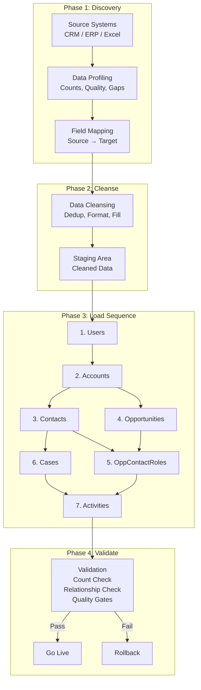

# Data Migration Planning

## Exam Domain
Data Migration — 20% of exam weight

## Foundations

**What is data migration?** Data migration is the process of moving data from one or more source systems into Salesforce. It sounds simple but is one of the highest-risk activities in any Salesforce implementation. Failed migrations are a leading cause of delayed go-lives and cost overruns.

**Why migrations fail**: Not because of the tools — because of inadequate planning. The most common failure modes are:
- No data profiling (the team didn't know what they were migrating until they tried)
- No rollback plan (no way to undo a bad migration)
- Wrong sequence (trying to load child records before parent records exist)
- Insufficient testing (loading into production without validating in sandbox first)
- No quality gates (no criteria for "the migration is good enough to go live")

**The architect's role in migration**: Not to execute the migration (that's an ETL engineer's job) but to design the migration architecture — sequence, tooling selection, quality gates, rollback strategy, and cutover plan. This is what the exam tests.

---

## Core Concepts

### Migration Planning Framework: The 6 Phases

**Phase 1: Data Discovery & Profiling**
Before any data moves, understand what you have:
- Inventory all source systems (CRM, ERP, spreadsheets, legacy databases)
- Profile each source: record count per entity, field completeness %, value distributions, data quality issues (nulls, duplicates, format inconsistencies)
- Map source fields to target Salesforce fields
- Identify data owners and governance contacts
- Identify records requiring transformation (format changes, lookups, calculations)

Tools for profiling: Informatica Data Quality, Talend Data Quality, custom SQL queries, Excel pivot analysis for small data sets.

**Phase 2: Data Cleansing**
Fix quality issues in the source before migration — not in Salesforce after:
- Deduplicate source records (merge or flag)
- Standardize formats (phone numbers, addresses, dates)
- Fill required fields (or define default values)
- Validate referential integrity (every child has a parent in the source)
- Apply business rules (is this record eligible for migration or should it be archived in the source?)

**Phase 3: Migration Design**
Produce the migration design document:
- Migration sequence (which objects load first)
- ETL tool selection and configuration
- External ID strategy (which field links source records to Salesforce records)
- Transformation rules (all data transformations documented)
- Error handling strategy (how are rejected records handled?)
- Volume and timing plan (how many records per batch, what time of day, how many passes)

**Phase 4: Test Migration**
Execute migration in a sandbox that matches production schema:
- Validate record counts match expectations
- Validate data quality rules passed
- Validate relationships resolved correctly
- Validate automations triggered correctly (or were disabled as planned)
- Performance test: how long did the migration take? Will that fit in the cutover window?

**Phase 5: Cutover Execution**
The actual production migration:
- Disable automations that should not fire during migration (workflows, process builders, Flow triggers, validation rules for migration-specific scenarios)
- Load data in correct sequence
- Monitor for errors in real time
- Apply quality gates before proceeding to each phase
- Post-load validation: spot checks, record count reconciliation, relationship integrity checks

**Phase 6: Post-Migration Validation & Stabilization**
- Run full validation scripts
- Re-enable automations
- Monitor for issues (unexpected triggers, duplicate creation, broken reports)
- Address rejected records from the migration error log
- Close the rollback window (once validation passes, declare migration complete)

### Migration Sequence: The Parent-Before-Child Rule

This is the most tested concept in data migration. Salesforce enforces referential integrity — you cannot create a Contact for an Account that doesn't exist yet.

Standard migration sequence for a typical Salesforce org:
```
1. Users (if migrating ownership data)
2. Accounts
3. Contacts (require Account lookup)
4. Leads (standalone)
5. Opportunities (require Account)
6. OpportunityContactRoles (require both Opportunity and Contact)
7. Cases (require Account and/or Contact)
8. Activities / Tasks / Events (require WhoId and WhatId targets to exist)
9. Custom Objects (after their parent lookups exist)
10. Notes and Attachments (require parent records)
11. Chatter posts (require parent records and User records)
```

**Why sequence matters for External IDs**: When loading Contacts, the load file must reference the Account's External ID so Salesforce can resolve the relationship. If Accounts haven't been loaded yet, the relationship lookup fails.

### External ID Strategy

**External ID fields** are the linchpin of a successful migration. For every object being migrated:
1. Add an External ID field (e.g., `Legacy_ID__c`) before migration begins
2. The source system's record ID (or a unique key) is loaded into this field
3. Subsequent loads that reference this object use the External ID to look up the Salesforce record

**Upsert operation**: Uses External ID to either insert (if not found) or update (if found). Critical for:
- Delta loads during parallel run periods
- Re-running a migration after fixes
- Ongoing sync after go-live

**External ID field limits**: Maximum 3 External ID fields per object. Plan which fields are used as External IDs — the choices impact how relationships are resolved during load.

### Rollback Strategy

A migration rollback plan is mandatory for enterprise migrations. Options:

**Option 1: Full Org Backup + Restore**
Take a full sandbox copy (or production backup) before migration. If migration fails, restore from backup. This is the most comprehensive rollback but the most time-consuming (sandbox refresh takes hours to days).

**Option 2: Hard Delete of Migrated Records**
Track all records created during the migration (by External ID or by CreatedDate within the migration window). If rollback is needed, delete all created records using the Bulk API hardDelete operation.
- Requires a complete list of all created record IDs
- Deletes must be in reverse sequence (children before parents)
- Complex relationships (Activities, OpportunityContactRoles) must be deleted before parent records

**Option 3: Parallel Run (No Cutover Risk)**
Run both the source system and Salesforce in parallel for a period. Users work in both systems; Salesforce data is refreshed nightly from the source. If Salesforce adoption fails, the source system is still operational.
- No hard cutover risk
- Higher operational cost during parallel run
- Introduces data drift between systems over time

### Automation Management During Migration

Automations that should generally be **disabled** during migration:
- Validation rules that enforce business rules not applicable to historical data
- Workflow rules/Process Builder rules that trigger on record creation (they will fire for every migrated record)
- Flows that create related records on insert
- Apex triggers that perform complex calculations or send emails

Automations that should generally **remain active**:
- Duplicate rules (to catch duplicate records at load time)
- Required field validation (catch data quality issues before they enter Salesforce)
- Simple lookup populating or default-setting formulas (harmless)

**Technique**: Use a custom checkbox field `Is_Migration__c` on User or on a Custom Setting. Automation checks this flag and short-circuits if it's a migration load. This is the "migration bypass" pattern.

---

## PTA / SA Relevance

### When This Comes Up in Engagements

**Project scoping**: Migration effort is consistently under-estimated in proposals. A migration of 5 million Account records from a legacy CRM with poor data quality can take 4–6 weeks of effort (profiling, cleansing, test loads, cutover). Knowing the real effort shapes project proposals.

**Risk conversations with customers**: The #1 risk question in any Salesforce project with migration is: "What if the migration fails? Can we go back?" Being able to articulate the rollback strategy gives customers confidence and avoids go-live panics.

**Post-go-live data issues**: Many post-go-live support escalations are migration hangovers — data that was loaded incorrectly, orphaned records, duplicate records from migration errors. Knowing how to diagnose and remediate these is essential for support engagements.

### Common Implementation Failures

1. **Direct-to-production migration**: Team skips sandbox testing and loads directly to production "to save time." First load has 30% error rate due to validation rules that weren't accounted for. Production is now half-loaded and inconsistent. There is no quick undo. This is the most catastrophic migration failure pattern.

2. **No data profiling step**: Team assumes source data is clean. They discover mid-migration that 40% of source Account records have no Name (which is a required field in Salesforce). Migration halts. Default value strategy must be designed on the fly. Profiling prevents this.

3. **Automation fires on migrated records**: The team forgot to disable a Flow that sends a "Welcome to our CRM!" email on Contact creation. Every migrated Contact gets an email. 500,000 contacts get welcome emails to an org that isn't even live yet. Customer relationship and reputation damage.

4. **Wrong External ID field used for relationships**: The team uses Account Name to resolve Contact-to-Account relationships instead of an External ID. Account names are not unique. Contacts get linked to the wrong Account or fail to link. Discovering this post-load requires a complete reload.

5. **No cutover window calculation**: The test migration took 48 hours. The business expects a weekend cutover (48 hours maximum). At production data volumes, the migration will take longer than the cutover window allows. Performance testing in the sandbox should use production-scale data volumes.

### Enterprise Architecture Patterns

**Migration Factory Model**: For large enterprises migrating multiple countries or business units sequentially, establish a "migration factory" — standardized tools, ETL scripts, validation scripts, and runbooks that are reused across each migration wave. The first wave takes the longest; subsequent waves are faster because the factory is established.

**Parallel Load Architecture**: Load in parallel streams for independent objects. Accounts, Leads, and Products can be loaded simultaneously. Contacts and Opportunities must wait for Accounts. Design the dependency graph and parallelize independent branches.

**Data Quality Gate Criteria**: Define quantitative pass/fail criteria for each migration phase. Example: "Proceed to production load only if: record count variance < 0.1%, 0 orphaned child records, 0 duplicate External ID conflicts." If gates are not met, the migration is halted and fixed.

---

## Architecture



**Limitations & Tradeoffs:**

- Parallel run strategy is the safest cutover pattern but doubles operational costs during the parallel period and risks data drift.
- Hard delete rollback requires tracking every created record ID — a gap in tracking means some records cannot be rolled back. Always write a migration log.
- Disabling automations during migration means business rules are not enforced on historical data. Some data quality issues that production automations would catch will be loaded silently. Define which automation disables are acceptable vs. which are risky.
- ETL transformation complexity: the more complex the transformations, the higher the risk of transformation errors. Prefer simple, auditable transformations over complex in-flight transformations.

---

## Key Facts to Memorize

- Migration sequence: **parent objects before child objects** (Accounts before Contacts)
- External ID fields: max **3 per object**; automatically indexed
- Upsert operation: insert if External ID not found, update if found
- Data profiling must happen **before** cleansing, before migration design
- Rollback options: full org restore, hard delete (reverse sequence), parallel run
- Hard delete via Bulk API: `hardDelete` operation bypasses Recycle Bin
- Automations to disable: email-sending workflows, creation-triggered Flows, validation rules for historical data
- Automation bypass pattern: `Is_Migration__c` checkbox on User or Custom Setting
- Delta load strategy: use `LastModifiedDate` or `External_ID__c` as incremental key
- Migration factory: standardized tooling and runbooks for multi-wave migrations

---

## Exam Traps

1. **"Fastest way to load 10M records"** — Parallel Bulk API loads with multiple concurrent batches. Data Loader is serial (one batch at a time). Direct REST API calls have per-call overhead. Bulk API is designed for high-volume loads.
2. **"Which object must be loaded before Contact?"** — Account. Contact has a lookup to Account — if Account doesn't exist, the Contact load fails.
3. **"Which automation should be disabled during migration?"** — The exam often lists "Duplicate Rules" as a distractor answer to disable. Duplicate Rules should typically REMAIN active during migration — they catch migration-created duplicates. Email-sending automations and creation-triggered business logic should be disabled.
4. **"Rollback plan for direct production load"** — There is no easy rollback for direct production loads. This is why test-in-sandbox-first is a fundamental principle.

---

## Practice Questions

**Q1.** A company is migrating 2 million Account records and 8 million Contact records from a legacy CRM into Salesforce. The team plans to load all Contacts first, then Accounts. What problem will they encounter?

A) Contacts have a higher record count than Accounts, so they must load first  
B) Contact records have a lookup field to Account — loading Contacts before Accounts means the Account lookup cannot be resolved, causing failures  
C) Salesforce enforces alphabetical object loading order  
D) Contacts can be loaded independently of Accounts

**Answer: B** — Contacts have an AccountId lookup field. During load, Salesforce must resolve this lookup to an existing Account record. If Account records don't exist yet, the lookup fails (null or error). Always load parent objects before child objects.

---

**Q2.** A data migration architect is designing the External ID strategy for migrating Accounts. The source system has a unique numeric Account ID in a field called `LEGACY_ACCT_ID`. What should be created in Salesforce?

A) A new Autonumber field to replace the legacy ID  
B) A custom Text field marked as External ID and Unique, populated with the legacy account ID  
C) Use the standard Salesforce Id field as the External ID  
D) Store the legacy ID in the Account Name field for lookups

**Answer: B** — A custom Text field with External ID checked creates an indexed, upsert-capable key. Marking it Unique prevents duplicate External IDs. The standard Salesforce Id (C) cannot be set during insert. Autonumber (A) generates new values, not importing the legacy ones. Account Name (D) is not unique and will cause relationship resolution errors.

---

**Q3.** During a test migration in a sandbox, the team discovers that a Flow triggering on Contact creation is sending welcome emails to all migrated Contacts. What is the recommended remediation approach?

A) Delete the Flow permanently  
B) Set the Flow to inactive during the migration window, then reactivate after migration  
C) Add an entry condition to the Flow that checks a migration bypass flag (e.g., a Custom Metadata setting `Is_Migration_Active__c`) and exits the Flow when active  
D) Migrate Contacts in batches small enough that the email sending is acceptable

**Answer: C** — The migration bypass flag pattern (C) is the architecturally clean solution — it allows the Flow to be deactivated for migration without permanently removing it or relying on manual activate/deactivate steps. Setting to inactive (B) is operationally acceptable but risks forgetting to reactivate. Deleting the Flow (A) destroys business functionality.
