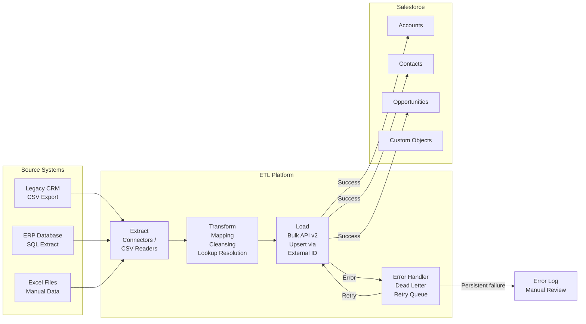

# ETL Tools and Patterns

## Exam Domain
Data Migration — 20% of exam weight

## Foundations

**What is ETL?** Extract, Transform, Load. The three-phase process of:
1. **Extract**: Read data from the source system
2. **Transform**: Convert, cleanse, enrich, and reshape data to meet target requirements
3. **Load**: Write transformed data into the target (Salesforce)

Some modern architectures use **ELT** (Extract, Load, Transform) — load raw data into a staging area first, then transform in place. ELT is more common in data warehouse contexts. For Salesforce migrations, ETL (transform before load) is predominant.

**The architect's role**: Not to write ETL scripts, but to select the right tool for the job, design the transformation patterns, define error handling requirements, and ensure the ETL architecture can handle the volume and complexity of the data.

---

## Core Concepts

### Salesforce Data Tools Comparison

| Tool | Use Case | Volume | API | Cost |
|---|---|---|---|---|
| Data Import Wizard | Simple, small loads | < 50,000 records | REST Bulk | Free (included) |
| Data Loader | Standard migrations | Up to 5M records per job | Bulk API v1 | Free (included) |
| Salesforce CLI (sf data) | Developer/CI use | Moderate | Bulk/REST | Free |
| Data Loader (CLI mode) | Automated migrations | High | Bulk API v1 | Free |
| MuleSoft | Integration + migration | Unlimited | REST/Bulk/Streaming | Paid |
| Informatica Cloud | Enterprise ETL | Unlimited | REST/Bulk | Paid |
| Talend | Open-source ETL | Unlimited | REST/Bulk | Free/Paid |
| Jitterbit | Mid-market ETL/Integration | High | REST/Bulk | Paid |
| Pentaho | Open-source ETL | High | REST/Bulk | Free/Paid |

### Data Loader: Deep Dive

**Data Loader** is the free Salesforce tool for bulk data operations. Key capabilities:
- Insert, Update, Upsert, Delete, Hard Delete, Export (SOQL)
- Bulk API v1 by default; REST API optional (for small loads)
- Processes records in batches (default 200, configurable up to 10,000)
- Error logging: separate error CSV for failed records
- Success logging: separate success CSV with Salesforce IDs

**Data Loader limitations**:
- No built-in data transformation capability (loads what's in the CSV as-is)
- No dependency management (you must manually manage load sequence)
- No scheduling in GUI mode (requires CLI mode + OS scheduler for automation)
- Single-threaded by default (one batch at a time)

**CLI mode**: Data Loader can be run from command line with a configuration file. This enables:
- Scheduled migrations via OS task scheduler or CI/CD pipeline
- Scripted sequences (load file 1, wait, load file 2)
- Integration with batch job monitoring

### Bulk API v1 vs Bulk API v2

| Feature | Bulk API v1 | Bulk API v2 |
|---|---|---|
| Batch management | Manual (create batch, check status) | Automatic (upload CSV, API manages batches) |
| File format | CSV or XML | CSV only |
| Max file size | 100MB per batch | 150MB per upload |
| Parallel processing | Up to 10 parallel batches per job | Automatic parallelism |
| Response format | Separate result files | Results in query |
| Complexity | Higher (more API calls) | Lower (simpler SDK) |
| Recommendation | Legacy integrations | New development |

Data Loader uses Bulk API v1. Modern ETL tools and Salesforce CLI use Bulk API v2 for new data loads.

### MuleSoft: Architecture for Data Migration

MuleSoft Anypoint Platform serves both as an integration platform (real-time) and an ETL platform (batch migrations). For migrations:

**Batch Processing module**: MuleSoft's `<batch:job>` construct processes large data sets in parallel chunks. Each chunk goes through a configurable processing sequence.

**Salesforce Connector**: Native connector that wraps the Bulk API. Handles retry logic, error handling, and response parsing automatically.

**Error handling patterns**:
- `<batch:on-complete>` step processes successes and failures
- Failed records can be written to a dead-letter queue (another system, S3, a database) for manual review
- Retry with exponential backoff for transient failures (API limit, lock contention)

**MuleSoft vs. Data Loader decision criteria**:
- Complex transformations needed → MuleSoft (native transformation library)
- Integration of multiple sources → MuleSoft (multi-source connectors)
- Post-migration real-time integration needed → MuleSoft (reuse the same flows)
- Simple CSV load, no transformations → Data Loader (simpler, free)
- Non-technical team executing migration → Data Loader GUI

### Informatica Cloud (IDMC): Enterprise ETL

Informatica Intelligent Data Management Cloud is the enterprise choice for:
- Very high-volume migrations (hundreds of millions of records)
- Complex multi-source orchestration
- Data quality rules (profiling, cleansing, standardization) integrated into the ETL pipeline
- Native Salesforce connector optimized for Bulk API
- Built-in duplicate detection (Informatica MDM integration)

**Informatica for Salesforce**: The Informatica Salesforce Connector handles:
- Bulk API job management
- Auto-chunking and parallelism
- Error retry logic
- External ID-based upserts

### Transformation Patterns

**Pattern 1: Lookup Resolution**
Converting a source system code to a Salesforce record ID (or External ID for upserts):
```
Source: AccountCode = "ACME-001"
Lookup: ACME-001 → Salesforce Account External ID = "ACME-001"
Result: AccountId resolved via upsert with External ID
```
Always use External IDs for lookups in upsert operations — never resolve to Salesforce internal IDs in the ETL (they differ between orgs).

**Pattern 2: Picklist Value Mapping**
Source systems have different value sets than Salesforce. The ETL must translate:
```
Source: Status = "ACTIVE"
Target: Status__c = "Active"

Source: Region = "US-WEST"
Target: Region__c = "West"
```
Maintain a mapping table in the ETL tool. Do not hard-code mappings in script logic.

**Pattern 3: Data Type Conversion**
Source: `hire_date` as "20230115" (integer)
Target: `Hire_Date__c` as "2023-01-15" (Salesforce Date format)
ETL transformation: integer → string → date parse → Salesforce date format

**Pattern 4: Record Splitting**
A single source record may need to become multiple Salesforce records:
Example: A source CRM "Company" record with embedded contact information needs to become an Account + a Contact in Salesforce.

**Pattern 5: Record Merging / Denormalization**
Multiple source records combine into one Salesforce record:
Example: Source has separate "BillingAddress" and "ShippingAddress" records per customer → merged into Account's BillingAddress and ShippingAddress fields.

### Error Handling Architecture

Every migration must handle three types of errors:

1. **Validation errors**: Record fails Salesforce validation rules or required field check. Action: log, fix source data, reload.

2. **Relationship resolution errors**: External ID lookup fails (parent record not found). Action: ensure parent records are loaded first; if data quality issue, flag for manual mapping.

3. **API errors**: Bulk API limit, timeout, service interruption. Action: retry with exponential backoff; resume from last successful batch.

**Error log design**: Every ETL job must produce:
- Success file: IDs of successfully loaded records
- Error file: original source data + error message for each failed record
- Summary: total records attempted, succeeded, failed, skipped

---

## PTA / SA Relevance

### When This Comes Up in Engagements

**Tool selection conversations**: Customers ask "what tool should we use for migration?" The answer depends on: volume, transformation complexity, team skills, and budget. Knowing the decision criteria lets you recommend confidently.

**MuleSoft positioning**: If a customer is already planning to use MuleSoft for integration, the migration ETL can often be designed using the same MuleSoft platform — reducing tool proliferation and leveraging existing MuleSoft investment.

**Informatica relationships**: Salesforce has a deep partnership with Informatica (Informatica powers Data Cloud's data ingestion in some configurations). Understanding Informatica's capabilities positions you well in enterprise conversations.

**Error rate scoping**: When a customer says "we have clean data," ask for profiling evidence. A 5% error rate on 10M records is 500,000 failed records that need manual remediation. Error handling cost is a real project cost.

### Common Implementation Failures

1. **Single-threaded Data Loader for 10M records**: Data Loader in GUI mode processes one batch at a time. At 10,000 records per batch and 10M records, that is 1,000 batches processed sequentially. A 10M record load can take 20+ hours in single-threaded mode. Use parallel Bulk API or an enterprise ETL tool.

2. **No transformation audit trail**: ETL runs transformations but no audit log is kept of what transformations were applied. Post-migration data quality issues are impossible to trace back to the source without the transformation log.

3. **Hard-coding Salesforce record IDs in ETL**: ETL scripts hard-code Salesforce RecordType IDs or User IDs. When deployed to a different org (sandbox vs production), the IDs are different and the ETL fails. Always use External IDs or names for lookups, never internal Salesforce IDs.

4. **Re-running an INSERT instead of UPSERT after failure**: A migration batch fails halfway. The team re-runs the job with INSERT operation. The first half of records that loaded successfully now get duplicated. Always use UPSERT with External IDs so re-runs are idempotent.

5. **No error monitoring during cutover**: During the production migration cutover, error logs are not monitored in real time. The team finds out after 4 hours that 20% of records have been failing since the start. Real-time error monitoring is mandatory during cutover.

### Enterprise Architecture Patterns

**Idempotent Migration Design**: Every migration job must be designed to be safely re-runnable. Using UPSERT with External IDs achieves this — running the same job twice produces the same result (no duplicates, no errors). This is the gold standard pattern.

**Migration Control Tower**: In multi-wave enterprise migrations, a central orchestration mechanism tracks wave status: which objects are loaded, which are in-flight, which failed. Often built as a simple Salesforce custom object or a shared tracking spreadsheet with JIRA integration. Without it, complex migrations become impossible to monitor.

**Parallel Load Optimization**: Identify independent object groups (objects with no dependency on each other) and load them in parallel. Example: Accounts, Leads, and Products have no cross-dependencies and can load simultaneously, reducing total migration time by 3x.

---

## Architecture



**Limitations & Tradeoffs:**

- Data Loader: free, simple, but no transformations, no scheduling in GUI mode, single-threaded unless using parallel CLI invocations.
- MuleSoft: powerful, supports complex transformations and multi-source, but expensive and requires MuleSoft expertise.
- Informatica: enterprise-grade, expensive, requires specialized licensing.
- Bulk API throughput: Salesforce limits Bulk API processing. Under load, batches may queue. Plan for API capacity in the cutover window, especially if the org has concurrent integration loads.
- ETL transformations on very large files: transforming 100M records requires significant compute and memory. Cloud-based ETL (MuleSoft CloudHub, Informatica IDMC) auto-scales; on-premise tools may hit resource limits.

---

## Key Facts to Memorize

- Data Loader: free, included with Salesforce, max batch size **10,000** records
- Bulk API v1: up to **100MB** per batch; manual batch management
- Bulk API v2: up to **150MB** per upload; automatic batching — preferred for new development
- UPSERT operation: requires an **External ID** field as the key
- Always use **UPSERT** (not INSERT) for re-runnable migrations
- MuleSoft: use when complex **transformations** or **multi-source** orchestration needed
- Data Loader GUI: **single-threaded** — not suitable for very high-volume parallel loads
- Hard-coded Salesforce IDs in ETL: always break when moving between orgs — use **External IDs or names**
- ETL error log must include: success file, **error file with source data + error message**, summary
- Idempotent design: same migration run twice = **same result** (no duplicates via UPSERT)

---

## Exam Traps

1. **"Best tool for a simple 10,000-record one-time load"** — Data Import Wizard (for standard objects with simple fields) or Data Loader. Not MuleSoft (overkill).
2. **"Transformation capability of Data Loader"** — Data Loader has NO native transformation capability. You must pre-transform the data in the CSV before loading.
3. **"Bulk API v1 vs v2"** — Bulk API v2 is the modern, recommended option for new development. v1 requires manual batch management; v2 automates it. The exam may ask which is "simpler for new development."
4. **"INSERT vs UPSERT for re-runnable migration"** — Always UPSERT. INSERT creates duplicates on re-run. UPSERT with External ID is idempotent.

---

## Practice Questions

**Q1.** A data migration team needs to load 50 million Account records from a legacy system. The transformation requirements include: phone number normalization, address standardization, and lookup resolution to 12 territory codes. Which tool is most appropriate?

A) Salesforce Data Loader with manual CSV pre-processing in Excel  
B) Data Import Wizard with field mapping  
C) Informatica Cloud with Salesforce Bulk API connector  
D) Salesforce CLI `sf data import` command

**Answer: C** — At 50M records with complex transformations, an enterprise ETL tool (Informatica Cloud) is appropriate. It handles transformation, parallel loading, error management, and retry at scale. Data Loader (A) has no transformation capability and would struggle at 50M records without significant parallel scripting. Data Import Wizard (B) has a 50,000 record limit.

---

**Q2.** A migration using Data Loader fails at batch 450 of 1,200 batches (37.5% complete). The team needs to resume from the point of failure without duplicating already-loaded records. What is the prerequisite design decision that enables safe resumption?

A) The migration used INSERT operation — simply re-run from batch 450  
B) The migration used UPSERT with an External ID field — re-running from the beginning is safe because UPSERT is idempotent  
C) The team must manually delete the 37.5% already-loaded records before re-running  
D) Bulk API automatically handles resumption at the last failed batch

**Answer: B** — If the migration used UPSERT with External IDs, re-running from the beginning will update already-loaded records (no change) and insert remaining records. This is idempotent and safe. If INSERT was used (A), re-running would create duplicates for the first 37.5%. Bulk API (D) does not automatically resume failed jobs.

---

**Q3.** A developer hard-codes the Salesforce RecordType ID for "Enterprise Account" in the Data Loader mapping configuration. After the sandbox migration succeeds, the same configuration is used in production. The migration fails with "Invalid RecordType ID" errors. What is the root cause?

A) RecordType IDs are not supported in Data Loader  
B) Record Type IDs differ between sandbox and production — the sandbox ID is not valid in production  
C) The RecordType feature must be enabled in production before migration  
D) Data Loader does not support RecordType field mapping

**Answer: B** — Salesforce generates different internal IDs for every record in each org — including Record Types, Users, and custom object records. Hard-coding a sandbox Record Type ID in an ETL configuration will cause failures when run in production. The correct approach is to reference Record Type by DeveloperName (API name) and have the ETL resolve to the correct ID per target org, or use a Custom Metadata mapping table.
